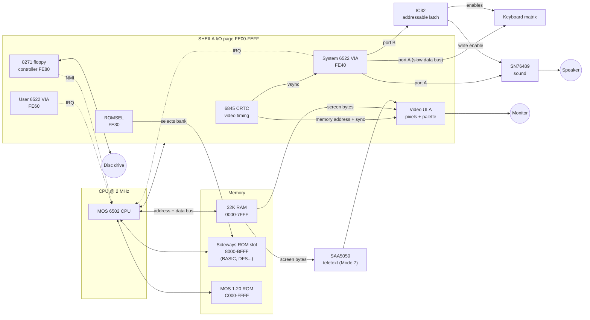
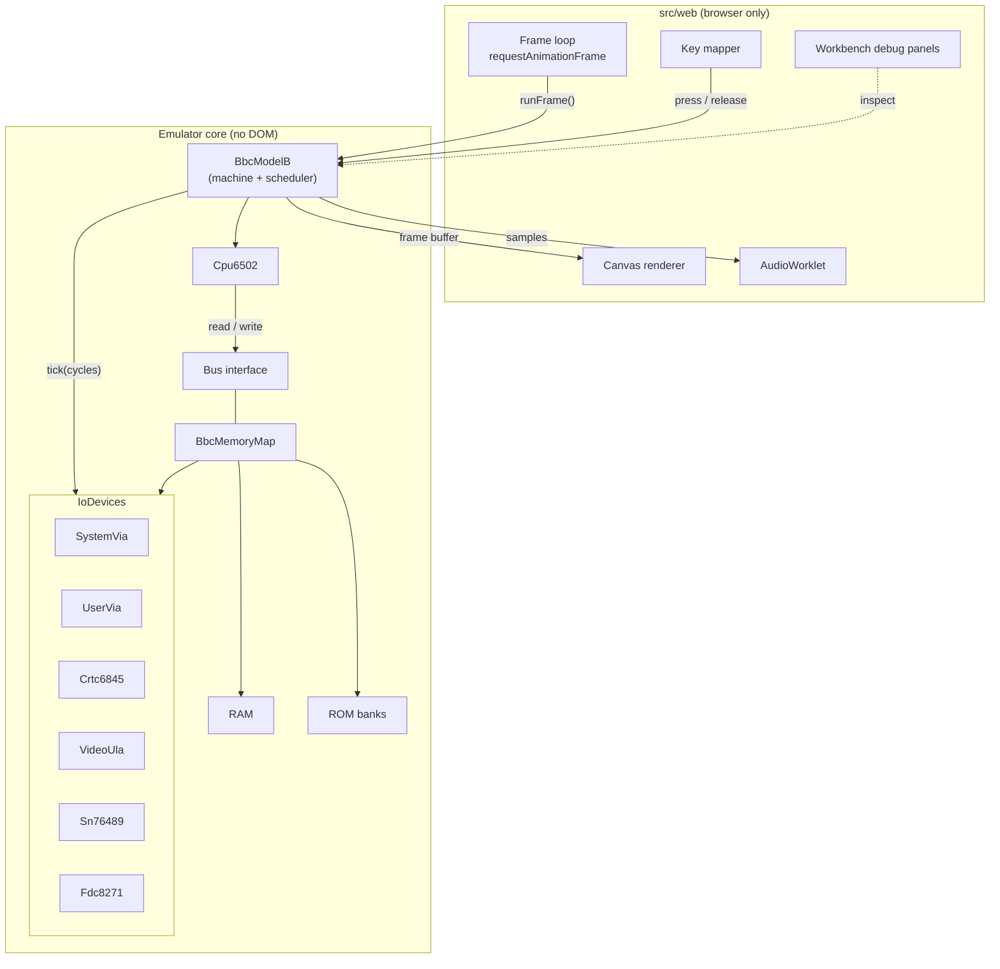
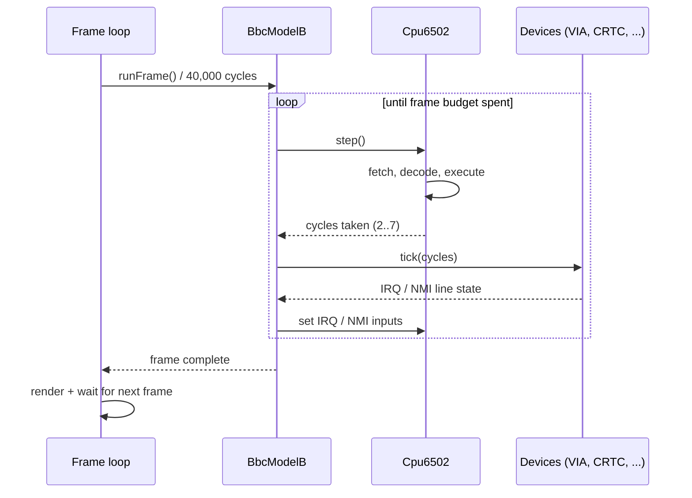
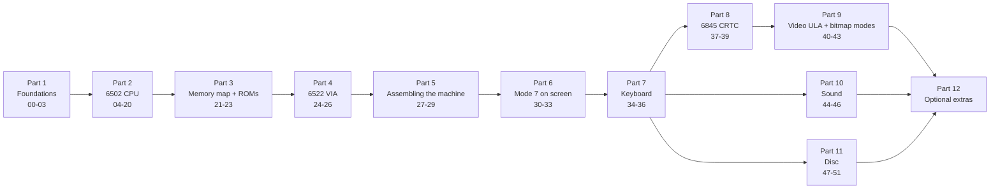

# BBC Micro Emulator: Build Plan

This plan builds a **BBC Micro Model B** emulator (MOS 1.20, BASIC II, Acorn DFS) in TypeScript, working as close to first principles as practical. It is a learning project. The work is split into **52 small stages**, and each one ends with **something new you can see or run**.

- Progress is tracked in [`PROGRESS.md`](./PROGRESS.md).
- Every stage produces a write-up in [`docs/stages/`](./stages/) that follows [`_TEMPLATE.md`](./stages/_TEMPLATE.md).
- Start or resume a stage with `/start-stage`. Close one with `/finish-stage`.

---

## 1. What is an emulator?

An emulator is a program that behaves like a piece of hardware closely enough that the original software can't tell the difference. The BBC Micro's software is machine code for the **MOS 6502** CPU, together with the **MOS** (Machine Operating System) and **BASIC** ROMs. All of it talks to the hardware by reading and writing memory addresses. The emulator therefore has to do three things:

1. **Execute 6502 instructions** exactly as the real chip does, including flags, cycle counts and quirks.
2. **Present the same memory map.** RAM, ROMs and memory-mapped I/O devices must sit at the addresses the software expects.
3. **Emulate each device** (timers, video, keyboard, sound, disc) well enough that the software's reads, writes and interrupt expectations all hold, *and at the right speed*.

### The real Model B



### The memory map at a glance

| Range | Name | Contents |
|---|---|---|
| `&0000–&00FF` | Zero page | Fast-access variables for the MOS, BASIC and user code |
| `&0100–&01FF` | Stack | The 6502 hardware stack |
| `&0200–&7FFF` | RAM | OS workspace, user programs, screen memory (`&3000–&7FFF` depending on MODE; Mode 7 lives at `&7C00`) |
| `&8000–&BFFF` | Sideways ROM | One of 16 banks, selected by writing to ROMSEL `&FE30` |
| `&C000–&FBFF` | MOS ROM | Operating system |
| `&FC00–&FCFF` | FRED | 1 MHz bus expansion |
| `&FD00–&FDFF` | JIM | 1 MHz bus paged memory |
| `&FE00–&FEFF` | SHEILA | On-board I/O devices |
| `&FF00–&FFFF` | MOS ROM | OS entry points and the CPU vectors (`&FFFA` NMI, `&FFFC` RESET, `&FFFE` IRQ/BRK) |

> **Notation:** BBC documentation writes hex with `&` (for example `&FE40`), and the docs in this project follow that. TypeScript code uses `0x`.

---

## 2. Target architecture

The emulator **core** is plain, DOM-free, deterministic TypeScript. It runs identically in Jest, in Node CLI demos and in the browser. The **web layer** is a thin shell around the core that turns frames into pixels, samples into audio, and key events into matrix presses.



Key interfaces (their final shape is settled in the stage that introduces each one):

```ts
interface Bus {
  read(address: number): number;               // returns 0..255
  write(address: number, value: number): void;
}

interface IoDevice {
  read(offset: number): number;
  write(offset: number, value: number): void;
  tick?(cycles: number): void;                 // advance device time
}
```

---

## 3. Timing model

The real 6502 runs at **2 MHz**. The screen refreshes at **50 Hz**, which works out to **40,000 CPU cycles per frame**.

We use an **instruction-stepped** model. The CPU executes one whole instruction and reports how many cycles it took, and the machine then advances every device by that many cycles. This is much simpler than a cycle-by-cycle emulation and is accurate enough to run almost all BBC software. Its limits are that a device can only see the CPU "between instructions", and that the exact cycle at which a read hits a timer is approximate. Cycle-exact refinements (including the Model B's 1 MHz bus "stretching" for slow devices) are an optional extra in Part 12.



---

## 4. How each stage stays observable

Every stage ends with something you can **see**. Three surfaces grow alongside the emulator:

| Surface | Where | Introduced | Used for |
|---|---|---|---|
| **CLI demos** | `scripts/demo-*.ts`, run with `npm run demo:<name>` (via `tsx`) | Stage 00 | Tables, traces, screen-memory dumps, WAV files |
| **Workbench** | `src/web/workbench/` | Stage 03 | Live debug panels: memory, registers, assembler, disassembly, stack, VIA, CRTC, palette, keyboard, sound, FDC |
| **Emulator screen** | `#screen` canvas | Stage 30 (text), 31+ (pixels) | The real thing |

Playwright (the MCP server for interactive checks, `e2e/` for durable ones) confirms the browser surfaces.

The workbench panels bind to a small `DebugTarget` interface. In Part 2 the target is a bare "CPU playground" (a 6502 on a flat 64K `TestBus`). From Part 5 onwards the target is the full `BbcModelB`.

---

## 5. Directory layout

```
src/
  util/       bits, hex formatting, small helpers
  memory/     Bus, Ram, TestBus, BbcMemoryMap, ROM loading
  cpu/        Cpu6502, opcode table, addressing modes, disassembler
  asm/        mini 6502 assembler
  devices/    Via6522, SystemVia, AddressableLatch, Keyboard, Crtc6845, VideoUla, Sn76489, Fdc8271
  machine/    BbcModelB, scheduler
  video/      teletext (SAA5050) and bitmap renderers (pure: memory -> pixels)
  sound/      sample generation, resampling
  disc/       disc image formats, DFS catalogue
  web/        browser shell: frame loop, canvas, audio, key mapping, workbench/
scripts/      CLI demos and fixture download scripts
e2e/          Playwright tests
docs/         this plan, PROGRESS.md, stages/NN-slug.md
roms/         (gitignored) os12.rom, basic2.rom, dfs.rom
discs/        (gitignored) your .ssd/.dsd images
test-fixtures/(gitignored) downloaded CPU test suites
```

Tests sit next to the code they test, as `*.test.ts`.

---

## 6. ROMs, discs and test fixtures

- **ROMs are copyrighted** (Acorn), so they are **not committed**. Put them in `roms/`:
  - `os12.rom` is MOS 1.20 (16K).
  - `basic2.rom` is BBC BASIC II (16K).
  - `dfs.rom` is Acorn DFS 0.90 or 1.20 (16K). It is needed from Stage 50.
- Any test that needs a ROM or fixture **skips with a clear message** when the file is missing. It does not fail.
- **CPU test suites** are downloaded by `scripts/fetch-test-fixtures.sh` (written in Stage 19) into `test-fixtures/`:
  - [SingleStepTests/65x02](https://github.com/SingleStepTests/65x02), Tom Harte's per-opcode tests, with 10,000 cases per opcode.
  - [Klaus Dormann's 6502 functional tests](https://github.com/Klaus2m5/6502_65C02_functional_tests).
- **Test discs** are generated by our own code from Stage 48 onwards, so the disc tests don't depend on third-party software.

---

## 7. Stage dependency graph



After Part 7 you have a usable BASIC machine. From there, Parts 8–9 (proper video), 10 (sound) and 11 (disc) can be done in any order, although 8 → 9 is recommended first.

---

## 8. The stages

Each stage lists:
- **Learn:** the concepts it teaches.
- **Build:** the code it produces.
- **Tests:** what Jest proves.
- **See it:** the observable outcome.
- **Needs:** its prerequisite stages.

The branch and doc slug appear in the heading.

### Part 1: Foundations

#### Stage 00: Tooling & conventions · `00-tooling`
- **Learn:** How the toolchain fits together: TypeScript, Vite, Jest, Playwright and ESLint. Why a strict type system helps when every value is a byte.
- **Build:**
  - ESLint flat config with `typescript-eslint`, with `no-explicit-any` and `no-non-null-assertion` as errors.
  - An `npm run lint` script.
  - `tsx` for CLI demos, plus `scripts/demo-hello.ts` and a `demo:hello` script.
  - A page heading in `index.html`.
  - `src/sanity.test.ts` kept as a smoke test until real tests exist.
- **Tests:** The existing sanity test, and a deliberate `any` confirmed to fail lint (not committed).
- **See it:** `npm run lint`, `typecheck`, `test` and `demo:hello` are all green, and the browser shows the page title.
- **Needs:** none.

#### Stage 01: Numbers the machine speaks · `01-numbers`
- **Learn:** Bits, bytes and words. Hex and `&` notation. Masking and wrap-around. Two's complement (signed bytes). BCD. Little-endian 16-bit values. Why JavaScript numbers need masking.
- **Build:** `src/util/bits.ts`, containing `hex8`, `hex16`, `toSigned8`, `lo`, `hi`, `word`, `bcdToBinary`, `binaryToBcd`, `bit` and `setBit`. Also `scripts/demo-numbers.ts`.
- **Tests:** Round-trips, the edge values `0x00`, `0x7f`, `0x80`, `0xff`, `0xffff` and wrap-around, and every valid BCD value.
- **See it:** `npm run demo:numbers -- 200` prints a table of decimal, hex, binary, signed and BCD values.
- **Needs:** 00

#### Stage 02: Memory & the bus · `02-memory-bus`
- **Learn:** The address bus and data bus, what "memory-mapped" means, and why the CPU only ever sees `read(addr)` and `write(addr, value)`.
- **Build:** `src/memory/bus.ts` (the `Bus` interface), `ram.ts`, `test-bus.ts` (a flat 64K bus), `src/util/hexdump.ts`, and `scripts/demo-hexdump.ts`.
- **Tests:** Reads and writes, masking of the address and value, and hexdump formatting.
- **See it:** `npm run demo:hexdump` prints a classic 16-bytes-per-row dump with an ASCII column.
- **Needs:** 01

#### Stage 03: Workbench shell · `03-workbench`
- **Learn:** Keeping UI separate from emulation logic, and the `DebugTarget` interface idea.
- **Build:** `src/web/workbench/`, with a panel framework (plain DOM, no framework) and a hex memory viewer bound to a `TestBus`. You can edit a byte by clicking it.
- **Tests:** Jest covers the pure view-model (which rows to show, formatting). Playwright covers the panel rendering.
- **See it:** Poke bytes in the browser and watch the dump update. Playwright MCP snapshot.
- **Needs:** 02

### Part 2: The 6502 CPU

#### Stage 04: CPU skeleton · `04-cpu-skeleton`
- **Learn:** The registers A, X, Y, S, PC and P. The meaning of each P flag (N V - B D I Z C). The fetch-decode-execute cycle. The reset vector at `&FFFC`. Designing an opcode table (256 entries).
- **Build:**
  - `src/cpu/cpu6502.ts`, `registers.ts`, `flags.ts` (pack/unpack P) and `opcodes.ts`: a dispatch table holding NOP (`&EA`) only, with a clear error on unimplemented opcodes.
  - `step()`, which returns cycles, and a total cycle counter.
- **Tests:** Reset loads PC from the vector, NOP advances PC by 1 and costs 2 cycles, and P packing round-trips.
- **See it:** A registers and flags panel. The **Step** button walks PC over a page of NOPs.
- **Needs:** 03

#### Stage 05: Addressing modes · `05-addressing-modes`
- **Learn:** All 13 modes: implied, accumulator, immediate, zero page, zp,X, zp,Y, absolute, abs,X, abs,Y, indirect, (zp,X), (zp),Y and relative. Zero-page wrap-around, page crossing, and why it costs an extra cycle.
- **Build:** `src/cpu/addressing.ts`, a set of effective-address functions that report page crossings.
- **Tests:** Every mode, including the wrap cases (e.g. `LDA &FF,X` with X=1 → `&0000`) and page-cross detection.
- **See it:** An **addressing-mode explorer** panel. Choose a mode, an operand and register values, and it shows each step of the address calculation.
- **Needs:** 04

#### Stage 06: Loads · `06-loads`
- **Learn:** How the N and Z flags are derived. Reading an opcode table (mode, bytes, cycles).
- **Build:** LDA, LDX and LDY in all their modes.
- **Tests:** Every opcode is checked for value, N/Z flags, PC advance and cycles (including the +1 for page crossing).
- **See it:** Load a hand-assembled byte program into the memory viewer, step it, and watch A/X/Y and the flags change.
- **Needs:** 05

#### Stage 07: Stores & transfers · `07-stores-transfers`
- **Learn:** Why stores never take the page-cross shortcut. The special case of TXS (it doesn't set flags).
- **Build:** STA/STX/STY, and TAX/TAY/TXA/TYA/TSX/TXS.
- **Tests:** Each opcode for its memory effect, flags and cycles.
- **See it:** The memory viewer **highlights bytes written** by the last step.
- **Needs:** 06

#### Stage 08: Mini assembler · `08-assembler`
- **Learn:** How assembly maps to bytes. Opcode encoding (mnemonic plus mode gives the opcode). Two-pass assembly with labels. Hand-assembling vs tooling.
- **Build:** `src/asm/assembler.ts`, supporting the full documented opcode encoding table (as data), labels, `*=`, `.byte`, `.word`, and `&`/`$`/`%` literals. It gives useful error messages with line numbers. The assembler encodes every documented instruction, even ones the CPU can't execute yet.
- **Tests:** Encoding of every mode, forward and backward labels, branch range errors.
- **See it:** A workbench **assembly editor**. Type code, press **Assemble & Run**, and step through it.
- **Needs:** 07

#### Stage 09: Increment & decrement · `09-inc-dec`
- **Learn:** Read-modify-write instructions and 8-bit wrap-around.
- **Build:** INC, DEC, INX, INY, DEX, DEY.
- **Tests:** Wrap-around from `&FF` to `&00` and back, flags and cycles.
- **See it:** An assembled demo with the flag "lights" toggling as values wrap.
- **Needs:** 08

#### Stage 10: Binary arithmetic · `10-binary-arithmetic`
- **Learn:** The carry flag in addition and subtraction (SBC is ADC of the inverted operand). **Overflow (V)** as signed overflow. Multi-byte arithmetic.
- **Build:** ADC and SBC in binary mode.
- **Tests:** An exhaustive A × operand × carry sweep checked against a reference formula. A truth table for V.
- **See it:** A 16-bit addition demo in the assembler. The doc includes an overflow truth table.
- **Needs:** 09

#### Stage 11: Decimal mode · `11-decimal-mode`
- **Learn:** BCD arithmetic, the D flag, and how the NMOS 6502 sets N, V and Z in decimal mode (the quirks).
- **Build:** Decimal ADC and SBC.
- **Tests:** An exhaustive sweep of valid BCD inputs, plus documented invalid-BCD behaviour.
- **See it:** A BCD score counter demo that counts `00 → 99` in decimal.
- **Needs:** 10

#### Stage 12: Logic & BIT · `12-logic-bit`
- **Learn:** Bit masking, setting and clearing bits, toggling, and BIT's unusual flag behaviour (N and V copied from memory).
- **Build:** AND, ORA, EOR and BIT.
- **Tests:** Each opcode and mode, flags and cycles.
- **See it:** A bit-masking demo with the binary view of A shown in the register panel.
- **Needs:** 11

#### Stage 13: Shifts & rotates · `13-shifts-rotates`
- **Learn:** Shifting as multiplication and division by 2. Rotating through carry. Accumulator vs memory forms.
- **Build:** ASL, LSR, ROL, ROR.
- **Tests:** Each form, carry in and out, flags and cycles.
- **See it:** A "multiply by 10 using shifts" demo (x·8 + x·2).
- **Needs:** 12

#### Stage 14: Compare, branch & flag ops · `14-compare-branch-flags`
- **Learn:** Compare as subtraction without storing the result. Relative branches (signed offsets). The branch cycle cost (+1 if taken, +1 more for a page cross). Loops.
- **Build:** CMP, CPX, CPY, BPL, BMI, BVC, BVS, BCC, BCS, BNE, BEQ, CLC, SEC, CLI, SEI, CLV, CLD and SED.
- **Tests:** Compare flags for less, equal and greater. Branch taken, not taken and page-crossing cycle counts. Backwards branches.
- **See it:** **First real loops.** A memory-fill demo, a **Run** button (run until BRK or a cycle limit) and a live cycle counter.
- **Needs:** 13

#### Stage 15: Jumps & the stack · `15-jumps-stack`
- **Learn:** The hardware stack in page 1, and why S points at the *next free* slot. `JMP (ind)` and the **page-boundary bug** (`JMP (&10FF)` reads its high byte from `&1000`).
- **Build:** JMP abs, JMP ind, PHA, PLA, PHP and PLP (including the B flag and bit 5 as pushed).
- **Tests:** Stack wrap, push/pull order, the JMP indirect bug, and PHP's pushed flag bits.
- **See it:** A **stack viewer** panel (page 1, with S highlighted).
- **Needs:** 14

#### Stage 16: Subroutines · `16-subroutines`
- **Learn:** JSR pushes PC−1 and RTS adds 1 back. Calling conventions.
- **Build:** JSR and RTS.
- **Tests:** Round trip, nested calls, the pushed return address.
- **See it:** A multiply-subroutine demo, with return addresses visibly on the stack.
- **Needs:** 15

#### Stage 17: Interrupts · `17-interrupts`
- **Learn:** IRQ vs NMI vs RESET vs BRK, and the vectors at `&FFFA`, `&FFFC` and `&FFFE`. The I flag. What gets pushed. The fact that **B is not a real flag** (it only exists in the pushed copy). Level-triggered (IRQ) vs edge-triggered (NMI) inputs. RTI.
- **Build:** BRK and RTI, plus the `irq`/`nmi` input lines and the interrupt sequences on the CPU. The documented instruction set is now complete (151 opcodes).
- **Tests:** Each sequence's stack contents, flags, vectors and cycles. IRQ masked by I. NMI edge detection.
- **See it:** **IRQ** and **NMI** buttons in the workbench trigger an assembled handler that increments a counter.
- **Needs:** 16

#### Stage 18: Disassembler & trace · `18-disassembler-trace`
- **Learn:** Decoding in reverse, and why a trace is the emulator author's most important debugging tool.
- **Build:** `src/cpu/disassembler.ts` (reusing the opcode table), a trace logger (PC, bytes, mnemonic, registers, flags, cycles) and `scripts/demo-trace.ts`.
- **Tests:** Disassembly of every opcode and mode, and assemble → disassemble round-trips.
- **See it:** A **disassembly panel** that follows PC. `npm run demo:trace` prints a trace of an assembled program.
- **Needs:** 17

#### Stage 19: Per-opcode validation · `19-singlestep-validation`
- **Learn:** How emulator authors validate CPUs against real-hardware captures, and how to read a failing test case.
- **Build:** `scripts/fetch-test-fixtures.sh`, a SingleStepTests runner (a sparse RAM bus that checks final registers, memory and cycle count) and `scripts/demo-singlestep.ts`.
- **Tests:** A Jest suite that runs the fixtures for all 151 documented opcodes. It skips if the fixtures are missing.
- **See it:** `npm run demo:singlestep` prints a pass/fail table for all 151 opcodes, and any failing case with a diff.
- **Needs:** 18

#### Stage 20: Whole-CPU validation & speed · `20-functional-validation`
- **Learn:** Integration testing a CPU with a self-checking program (the test "traps" in a tight loop on success or failure). Performance: what "fast enough for 2 MHz" means, and hot-path hygiene.
- **Build:** A Klaus Dormann functional-test runner and decimal-test runner, and a benchmark (effective MHz).
- **Tests:** Functional test reaches its success trap. The decimal test passes. Both skip if the fixtures are missing.
- **See it:** CLI prints "functional test PASSED in N cycles" and "running at X MHz (Y× real speed)".
- **Needs:** 19

### Part 3: BBC memory map & ROMs

#### Stage 21: Memory map & I/O dispatch · `21-memory-map`
- **Learn:** How the Model B decodes addresses: RAM, sideways ROM, MOS, FRED, JIM and SHEILA. The SHEILA device table. What happens when you read unmapped addresses.
- **Build:** `src/memory/bbc-memory-map.ts`, the `IoDevice` interface, a SHEILA dispatch table (with a named placeholder device for each slot), and an I/O access log.
- **Tests:** Region routing, writes to ROM being ignored, and SHEILA offsets reaching the right device.
- **See it:** A workbench **memory map panel** with coloured regions. Accesses to `&FExx` are logged with the device name (e.g. "System VIA reg 4").
- **Needs:** 20

#### Stage 22: ROMs & sideways paging · `22-roms-sideways`
- **Learn:** ROM images, the ROMSEL latch at `&FE30`, the 16 sideways slots, and the **sideways ROM header** format (type byte, copyright offset, title, version).
- **Build:** A ROM loader (Node `fs` for CLI and tests, `fetch` for the browser), ROMSEL, a header parser, `scripts/demo-roms.ts` and a helper that skips tests when ROMs are missing.
- **Tests:** Paging with fake ROMs, header parsing, and the MOS mapped to `&C000`.
- **See it:** `npm run demo:roms` prints each ROM's title, version, type and copyright string (e.g. "BASIC … (C)1982 Acorn").
- **Needs:** 21

#### Stage 23: First steps into the MOS · `23-mos-first-steps`
- **Learn:** What the MOS does from RESET, and how to read a trace of real firmware. Why the machine can't boot without its hardware.
- **Build:** A headless run of OS 1.20 from the reset vector, trace annotation with known MOS entry points and labels, and "stall detection" (PC stuck in a small range).
- **Tests:** Reset starts at the MOS reset vector. The first N instructions match the expected sequence.
- **See it:** `npm run demo:mos` prints an annotated trace ending at the point where the MOS **stalls** waiting for hardware. The doc includes a mermaid diagram of the reset path and an explanation of *why* it stalls.
- **Needs:** 22

### Part 4: The 6522 VIA

#### Stage 24: VIA ports & registers · `24-via-ports`
- **Learn:** The 6522's 16 registers. Data direction registers. How an output-register bit and a pin interact. Input latching (basic).
- **Build:** `src/devices/via6522.ts` covering ORA/ORB, DDRA/DDRB, IRA/IRB, the no-handshake register, and an external pin API for ports A and B.
- **Tests:** Read and write semantics for each DDR combination.
- **See it:** A **VIA panel** showing all registers and port pin states live.
- **Needs:** 23

#### Stage 25: VIA timers · `25-via-timers`
- **Learn:** Timer 1 in one-shot and free-running modes, latches vs counters, PB7 output, Timer 2, and the "N+1.5 cycles" reload subtleties.
- **Build:** T1 and T2 in the VIA (`tick(cycles)`), plus the ACR.
- **Tests:** Countdown, reload, underflow timing, and latch writes vs counter writes.
- **See it:** Timers **counting down live** in the VIA panel, driven by an assembled program.
- **Needs:** 24

#### Stage 26: VIA interrupts & control lines · `26-via-interrupts`
- **Learn:** IFR and IER (the set/clear bit-7 convention), the IRQ output, CA1/CA2/CB1/CB2 edge detection and the PCR, and which reads and writes clear which flags.
- **Build:** VIA interrupt logic and control lines. The VIA's IRQ output is wired to the CPU in the playground target.
- **Tests:** Each interrupt source sets and clears correctly. IER masking. IRQ line state.
- **See it:** An **IRQ-driven counter**. A T1 interrupt handler increments a byte 100 times a second, and you watch it tick in the memory viewer.
- **Needs:** 25

### Part 5: Assembling the machine

#### Stage 27: Machine & scheduler · `27-machine-scheduler`
- **Learn:** Composing CPU, memory and devices. Wire-OR interrupt lines (several devices can pull IRQ low). Frame budgets.
- **Build:** `src/machine/bbc-model-b.ts` with `step()`, `runCycles(n)`, `runFrame()` and `reset()`. The System VIA and User VIA are attached. The workbench target switches to the BBC.
- **Tests:** The IRQ line is the OR of the device outputs. The frame budget is honoured. Reset behaviour.
- **See it:** `npm run demo:boot` shows the MOS **getting further** than in Stage 23, with a new stall point explained.
- **Needs:** 26

#### Stage 28: Addressable latch & peripheral stubs · `28-latch-stubs`
- **Learn:** The IC32 addressable latch (System VIA port B bits 0–2 select a latch bit and bit 3 sets its value), which controls sound write enable, keyboard enable, screen size (C0/C1) and the caps/shift lock LEDs. The keyboard's DIP-switch links. The value of stubs.
- **Build:** `AddressableLatch`, register-storage stubs for the CRTC and Video ULA, a keyboard stub with no keys pressed and default links, and named hardware-write tracing.
- **Tests:** Latch bit decoding, and stub registers that retain values.
- **See it:** The boot trace now **names hardware writes**, e.g. `CRTC R0=&3F`, `ULA ctrl=&4B`, `latch: sound WE off`.
- **Needs:** 27

#### Stage 29: First boot · `29-first-boot`
- **Learn:** The vertical sync interrupt (CA1) and why the MOS relies on it. How to diagnose "what is the MOS waiting for?" from a trace.
- **Build:** A temporary 50 Hz vsync pulse on System VIA CA1 (replaced by the real CRTC in Stage 38), plus whatever else the traces show is missing. Also a Mode 7 screen-memory text dump.
- **Tests:** With ROMs present, after N frames the screen memory at `&7C00` contains "BBC Computer 32K", "BASIC" and ">".
- **See it:** 🎉 **Milestone.** `npm run demo:boot` prints the Mode 7 screen as text:
  ```
  BBC Computer 32K

  BASIC

  >
  ```
- **Needs:** 28

### Part 6: Mode 7 on screen

#### Stage 30: Browser run loop · `30-run-loop`
- **Learn:** Real-time emulation in the browser. requestAnimationFrame runs at about 60 Hz while the machine runs at 50 Hz, so we use time-based accumulation. Running the machine vs pausing it.
- **Build:** `src/web/frame-loop.ts`, loading ROMs via fetch, Pause/Step/Reset controls, and the screen RAM rendered as a `<pre>` text grid.
- **Tests:** The frame accumulator maths in Jest. `e2e/boot.spec.ts` waits for the "BASIC" text.
- **See it:** The **boot text appears live in the browser**. Playwright MCP screenshot.
- **Needs:** 29

#### Stage 31: Teletext font & canvas · `31-teletext-font`
- **Learn:** How the SAA5050 builds characters from a 5×9 dot matrix within a 6×10 cell, and the teletext character set (not quite ASCII: `#` is £, and so on).
- **Build:** `src/video/saa5050-font.ts` (glyph data transcribed from the datasheet's character table), a pure Mode 7 renderer (memory → pixel buffer), and canvas blitting.
- **Tests:** Glyph data sanity checks, and the pixel output for known characters.
- **See it:** A **real-looking boot screen** on the canvas. Playwright MCP screenshot.
- **Needs:** 30

#### Stage 32: Teletext colours & graphics · `32-teletext-colour-graphics`
- **Learn:** Control codes as "serial attributes" (they occupy a cell). Alphanumeric and graphics colours. New and black background. Mosaic graphics (sixels): contiguous vs separated, and "hold graphics".
- **Build:** An attribute state machine in the renderer.
- **Tests:** Attribute state transitions, and the pixel output for mosaic characters.
- **See it:** A teletext **colour and graphics test page**, poked into `&7C00`, renders correctly.
- **Needs:** 31

#### Stage 33: Double height, flash & conceal · `33-teletext-double-height-flash`
- **Learn:** Double height across row pairs, flash timing, conceal, and the SAA5050's character rounding (smoothing).
- **Build:** The remaining control codes, character rounding and the flash phase.
- **Tests:** Double-height row logic, flash on and off frames.
- **See it:** A test page with a **double-height, flashing title**.
- **Needs:** 32

### Part 7: Keyboard

#### Stage 34: Key matrix & PC mapping · `34-key-matrix`
- **Learn:** The BBC keyboard's 10 columns × 8 rows matrix, and why the BBC's symbol layout differs from a PC keyboard (for example, `"` is SHIFT+2).
- **Build:** `src/devices/keyboard.ts` (the matrix model) and `src/web/key-map.ts` (browser `KeyboardEvent.code` → BBC matrix position).
- **Tests:** The mapping table, and press/release state.
- **See it:** A workbench **keyboard panel** that lights up BBC keys as you press PC keys.
- **Needs:** 33

#### Stage 35: Scanning & keyboard interrupts · `35-keyboard-scanning`
- **Learn:** How the MOS scans the keyboard. The column/row select is written on port A and the key-pressed bit is read on PA7. Latch bit 3 enables **autoscan**, and a keypress raises **CA2**.
- **Build:** Keyboard wiring to the System VIA and the latch, the free-running column counter, CA2 interrupts, and a headless `typeText()` helper.
- **Tests:** Headless: type `PRINT 2+2` and RETURN, and screen memory shows `4`.
- **See it:** 🎉 **Type into BASIC in the browser!**
- **Needs:** 34

#### Stage 36: Modifiers, BREAK & LEDs · `36-modifiers-break-leds`
- **Learn:** SHIFT and CTRL as matrix keys. BREAK is not on the matrix (it drives the reset line). Soft vs hard reset (BREAK vs CTRL-BREAK). The caps lock and shift lock LEDs driven from the latch.
- **Build:** Modifier handling, BREAK wiring, and LED indicators in the UI.
- **Tests:** BREAK (soft reset) keeps a BASIC program recoverable with `OLD`. CTRL-BREAK performs a hard reset. Modifier keys combine correctly.
- **See it:** Playwright types a multi-line BASIC program, RUNs it and screenshots the output. LEDs toggle on screen.
- **Needs:** 35

### Part 8: The 6845 CRTC

#### Stage 37: CRTC registers & geometry · `37-crtc-registers`
- **Learn:** The 6845's address/data register pair, what R0–R17 mean (horizontal total, displayed, sync position, vertical total, adjust, scanlines per row, cursor, start address), and how a frame's geometry falls out of them.
- **Build:** `src/devices/crtc6845.ts` for register access (with read-only and write-only rules), plus a geometry calculator.
- **Tests:** Register access rules, and geometry for each MODE's standard register values.
- **See it:** A **CRTC panel** showing live values and derived geometry, e.g. "40×25 characters, 50.08 Hz, interlaced".
- **Needs:** 36

#### Stage 38: Counters & sync · `38-crtc-counters-sync`
- **Learn:** Horizontal character counter, scanline counter, row counter and vertical adjust. How hsync and vsync are generated, and display enable. Interlace.
- **Build:** The CRTC's `tick()` counters. **The real vsync replaces the fake Stage 29 pulse.**
- **Tests:** Counter sequences over a whole frame, and vsync timing for the standard modes.
- **See it:** The frame rate shown comes from the CRTC, and boot and typing still work.
- **Needs:** 37

#### Stage 39: Addressing, scrolling & cursor · `39-crtc-addressing-cursor`
- **Learn:** How the CRTC's memory address (MA) and row address (RA) become a screen address. The Mode 7 special case (MA13 → teletext addressing at `&7C00`). Hardware scrolling via the start address. The cursor.
- **Build:** Address generation. The Mode 7 renderer is now driven by CRTC addresses. Cursor rendering and blink.
- **Tests:** Address sequences, scroll wrap, and cursor position and blink.
- **See it:** `LIST` of a long program **scrolls smoothly**, and the **cursor flashes**.
- **Needs:** 38

### Part 9: Video ULA & bitmap modes

#### Stage 40: ULA control & palette · `40-ula-palette`
- **Learn:** The Video ULA control register (character clock rate, characters per line, teletext select, flash bit) and the palette register (16 logical → 8 physical colours, and flashing colours).
- **Build:** `src/devices/video-ula.ts` for the registers and palette table.
- **Tests:** Control register decoding, and the palette after the MOS writes for each MODE.
- **See it:** **Palette swatches** in the workbench update after `MODE 1` and `MODE 2`, even though the screen is still blank.
- **Needs:** 39

#### Stage 41: Pixel decoding · `41-pixel-decoding`
- **Learn:** How a screen byte becomes pixels: 8 pixels at 1 bpp, 4 at 2 bpp and 2 at 4 bpp, and why the bits are **interleaved** across the byte.
- **Build:** Pure decoder functions for each depth.
- **Tests:** Exhaustive over all 256 byte values for each depth.
- **See it:** A **byte explorer** panel. Enter a byte and see its pixels in MODE 0/1/2.
- **Needs:** 40

#### Stage 42: Rendering modes 0–6 · `42-bitmap-rendering`
- **Learn:** Character-cell screen layout (8 bytes per cell, cells left to right) and a scanline renderer driven by CRTC MA/RA.
- **Build:** A bitmap renderer integrated with the frame loop.
- **Tests:** Rendering of known memory patterns.
- **See it:** Text in **MODE 0, 1, 2, 4 and 5** (Playwright screenshots).
- **Needs:** 41

#### Stage 43: Wrap-around & graphics · `43-wraparound-graphics`
- **Learn:** Hardware screen wrap-around (latch C0/C1 selects the screen size, which the address generation adds back) and the blank gap lines in MODE 3 and 6.
- **Build:** Wrap-around in address generation, and the MODE 3/6 gaps.
- **Tests:** Address wrap for each screen size.
- **See it:** A `MOVE`/`DRAW`/`GCOL` graphics demo, and **scrolling text in bitmap modes** without corruption.
- **Needs:** 42

### Part 10: Sound

#### Stage 44: SN76489 register protocol · `44-sn76489-registers`
- **Learn:** The "slow data bus". The CPU puts a byte on System VIA port A and pulses the latch's sound write-enable bit. The chip's latch/data byte format for 3 tone channels and 1 noise channel.
- **Build:** `src/devices/sn76489.ts` for the register file and bus wiring.
- **Tests:** Register updates from latch and data byte sequences.
- **See it:** A **sound panel** showing each channel's frequency and volume after `SOUND 1,-15,53,20`.
- **Needs:** 36 (keyboard, for typing SOUND)

#### Stage 45: Tone & noise generation · `45-tone-noise`
- **Learn:** Divide-by-N square waves. The 15-bit LFSR for white and periodic noise. The logarithmic attenuation table (2 dB steps). Sample rates and resampling.
- **Build:** Sample generation (4 MHz ÷ 16 internal clock → output sample rate) and a WAV writer for the CLI.
- **Tests:** Tone period accuracy, the LFSR sequence, and attenuation levels.
- **See it:** `npm run demo:sound` writes a **WAV file you can play**.
- **Needs:** 44

#### Stage 46: Web Audio output · `46-web-audio`
- **Learn:** AudioWorklet, ring buffers, keeping emulation time and audio time in step, and browser autoplay rules.
- **Build:** `src/web/audio/`, a worklet with a ring buffer and a mute/unmute control.
- **Tests:** Ring buffer behaviour in Jest.
- **See it:** 🔊 **Hear the boot beep**, and `SOUND` and `ENVELOPE` commands.
- **Needs:** 45

### Part 11: Disc

#### Stage 47: Disc image geometry · `47-disc-geometry`
- **Learn:** Tracks, sectors and sides. The `.ssd` (single-sided) and `.dsd` (interleaved double-sided) formats. 40 vs 80 tracks, 10 sectors of 256 bytes.
- **Build:** `src/disc/disc-image.ts`, with sector addressing for both formats.
- **Tests:** Sector offsets for both formats, and size validation.
- **See it:** `npm run demo:disc -- sector <file> <track> <sector>` prints a sector hex dump.
- **Needs:** 36

#### Stage 48: DFS catalogue · `48-dfs-catalogue`
- **Learn:** The Acorn DFS catalogue (sectors 0 and 1 of track 0): file names, directories, load and exec addresses, lengths, start sectors, and the boot option.
- **Build:** Catalogue reader **and writer**, so we can build test discs from files, including programs from our own assembler. Also disc drag-and-drop in the UI.
- **Tests:** Round-trip write and read of a generated disc.
- **See it:** `npm run demo:disc -- cat <file>` prints `*CAT`-style output, and the UI shows the catalogue when you drop a disc.
- **Needs:** 47

#### Stage 49: 8271 registers & commands · `49-fdc-commands`
- **Learn:** The 8271 floppy controller: the command, parameter, result and status registers, the command/parameter handshake, and the commands (specify, seek, read status, special registers).
- **Build:** `src/devices/fdc8271.ts`, a command state machine without data transfer.
- **Tests:** Command sequences and status bits.
- **See it:** An **FDC panel** that logs each command the DFS issues.
- **Needs:** 48

#### Stage 50: 8271 data transfer & NMI · `50-fdc-data-nmi`
- **Learn:** Why disc data uses **NMI** (one per byte, and it can't be masked). The drive model: head position and rotation timing (simplified). The DFS ROM in a sideways slot.
- **Build:** Read data and read ID with NMI-driven transfers, the drive model, and the DFS ROM loaded into a slot.
- **Tests:** Headless `*CAT` of a generated disc produces the expected screen text.
- **See it:** `*CAT` **works in the browser**.
- **Needs:** 49

#### Stage 51: Running software · `51-running-software`
- **Learn:** How `*RUN`, `CHAIN` and `*EXEC` load files. SHIFT-BREAK and the `!BOOT` file. Optionally, write support (`SAVE`).
- **Build:** Whatever the software exercises, plus drive UI (insert and eject).
- **Tests:** Headless `CHAIN` of a BASIC program and `*RUN` of an assembled program from a generated disc.
- **See it:** 🎉 **Software boots from disc.** Playwright screenshot of a running program.
- **Needs:** 50

### Part 12: Optional extras (pick any, in any order)

- **Undocumented opcodes** (LAX, SAX, DCP and so on), validated with SingleStepTests.
- **Debugger:** breakpoints, watchpoints, run-to-cursor, and memory search.
- **Save states:** serialise and restore the whole machine.
- **Cycle accuracy:** 1 MHz bus stretching for SHEILA slow devices, and cycle-exact VIA reads.
- **User VIA printer port, ADC and joystick.**
- **Speed control:** turbo and slow motion.
- **Visual regression suite:** Playwright screenshot baselines for every MODE.
- **Performance profiling** of the hot path.

---

## 9. References

- *BBC Microcomputer Advanced User Guide* (Bray, Dickens and Holmes): the memory map, VIA usage, CRTC and ULA, and OS internals.
- *BBC Microcomputer Service Manual*: schematics and the address decoding.
- *BBC Microcomputer User Guide*: BASIC and the OS commands, for testing.
- Datasheets: MOS MCS6500 family programming manual, Rockwell R6522, Hitachi HD6845, Mullard/Philips SAA5050, TI SN76489, Intel 8271.
- [BeebWiki](https://beebwiki.mdfs.net/) for hardware and OS detail.
- [6502.org](http://www.6502.org/) for instruction set references.
- [Visual6502](http://www.visual6502.org/) for transistor-level truth.
- [Stardot forums](https://stardot.org.uk/forums/) for the BBC community's collective knowledge.
- **For comparison only (do not copy):** jsbeeb and b-em are open-source BBC emulators. Their code is GPL, and copying it would defeat the purpose of this project. Use them only to confirm *behaviour* when the documentation is unclear.
