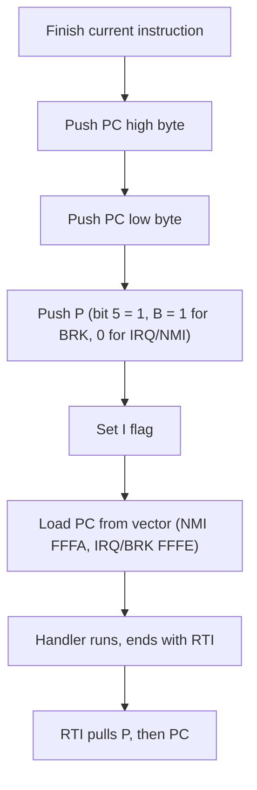

# 6502 cheatsheet

A one-page reference for the **NMOS 6502** as fitted to the BBC Micro Model B (2 MHz). It covers the registers, the flags, the addressing modes and all **151 documented opcodes**, grouped by job, plus the timing rules, the interrupt sequence and the gotchas that catch out programmers and emulator writers alike.

Hex is written the BBC way, as `&FF`. In assembler, `#` means "immediate" (the operand *is* the value), so `LDA #&41` loads &41 but `LDA &41` loads the byte *at* address &0041.

**Contents**

1. [Registers](#1-registers)
2. [The status register (P)](#2-the-status-register-p)
3. [Memory map essentials](#3-memory-map-essentials)
4. [Addressing modes](#4-addressing-modes)
5. [Cycle-counting rules](#5-cycle-counting-rules)
6. [Instruction reference, by group](#6-instruction-reference-by-group)
7. [Opcode matrix (all 256 bytes)](#7-opcode-matrix-all-256-bytes)
8. [How opcodes are encoded](#8-how-opcodes-are-encoded)
9. [Interrupts, BRK and reset](#9-interrupts-brk-and-reset)
10. [Decimal mode](#10-decimal-mode)
11. [Comparisons and branching recipes](#11-comparisons-and-branching-recipes)
12. [Common idioms](#12-common-idioms)
13. [Gotchas, all in one place](#13-gotchas-all-in-one-place)
14. [Undocumented opcodes](#14-undocumented-opcodes)
15. [BBC Micro specifics](#15-bbc-micro-specifics)

---

## 1. Registers

| Register | Name | Width | What it holds | Notes |
|---|---|---|---|---|
| **A** | Accumulator | 8 bits | The main working register. All arithmetic and logic results land here. | The only register that `ADC`, `SBC`, `AND`, `ORA`, `EOR` and `BIT` work with. |
| **X** | Index X | 8 bits | Counter / index / offset. | Used by `zp,X`, `abs,X` and `(zp,X)`. The only register that can be copied to or from S (`TSX`, `TXS`). |
| **Y** | Index Y | 8 bits | Counter / index / offset. | Used by `abs,Y` and `(zp),Y`, which is the mode for walking through memory via a pointer. |
| **S** (SP) | Stack pointer | 8 bits | Low byte of the next **free** stack slot. The stack lives at **&0100–&01FF**. | Grows **downwards**. Push = write to &0100+S then S−1. Pull = S+1 then read. Wraps within page 1. |
| **PC** | Program counter | 16 bits | Address of the next byte to fetch. | Not directly readable. `JSR` pushes it, `RTS`/`RTI` restore it. |
| **P** | Processor status | 8 bits (6 real) | The flags: `N V - B D I Z C`. | See the next section. |

There are no other registers. Everything else (the "zero page" pseudo-registers, pointers and so on) lives in memory.

---

## 2. The status register (P)

```
 bit:  7   6   5   4   3   2   1   0
       N   V   -   B   D   I   Z   C
```

| Bit | Flag | Name | Set (1) when… | Who sets it | Who reads it | Notes |
|---|---|---|---|---|---|---|
| 7 | **N** | Negative | Bit 7 of the result is 1. | Almost every instruction that produces a value. `BIT` copies bit 7 of memory. | `BMI`, `BPL` | "Negative" only if you're treating the byte as signed (two's complement). It's just bit 7. |
| 6 | **V** | Overflow | A *signed* add/subtract gave a result outside −128…+127. | `ADC`, `SBC`, `BIT` (copies bit 6 of memory), `CLV`, `PLP`, `RTI`. | `BVC`, `BVS` | There's no `SEV`. It's set when both inputs share a sign and the result has the other one. |
| 5 | **-** | (unused) | Always reads as 1. | Nobody | — | Pushed as 1 by `PHP`, `BRK`, IRQ, NMI. |
| 4 | **B** | Break | **Doesn't really exist** as a latch. | — | Only visible in the *pushed copy* of P. | Pushed as 1 by `PHP` and `BRK`, as 0 by IRQ and NMI. That's how an IRQ handler tells `BRK` from a hardware IRQ. `PLP`/`RTI` ignore it. |
| 3 | **D** | Decimal | BCD arithmetic is on. | `SED`, `CLD`, `PLP`, `RTI` | `ADC`, `SBC` only | Undefined after reset on the NMOS 6502, and **not** cleared by interrupts. |
| 2 | **I** | Interrupt disable | IRQs are masked. | `SEI`, `CLI`, `PLP`, `RTI`; set automatically by IRQ, NMI, `BRK` and reset. | IRQ line logic | Doesn't mask NMI. `CLI`/`SEI`/`PLP` changes take effect **one instruction late** (see gotchas). |
| 1 | **Z** | Zero | The result was &00. | Almost every value-producing instruction. Compares set it when equal. | `BEQ`, `BNE` | `BIT` sets it from `A AND M`, not from either operand alone. |
| 0 | **C** | Carry | Unsigned overflow out of bit 7 (add), **no** borrow (subtract), the bit shifted out (shifts), or "register ≥ memory" (compares). | `ADC`, `SBC`, `CMP`/`CPX`/`CPY`, `ASL`/`LSR`/`ROL`/`ROR`, `CLC`, `SEC`, `PLP`, `RTI`. | `BCC`, `BCS`, `ADC`, `SBC`, `ROL`, `ROR` | For subtraction, C is an inverted borrow: **C=1 means no borrow**. Hence `SEC` before `SBC`. |

**Which instructions leave the flags alone?** Stores (`STA`/`STX`/`STY`), `TXS`, `PHA`, `PHP`, all branches, `JMP`, `JSR`, `RTS`, and `NOP`.

---

## 3. Memory map essentials

The 6502 sees a flat 64 KB (&0000–&FFFF). Three areas are special to the CPU itself:

| Range | Name | Why it's special |
|---|---|---|
| **&0000–&00FF** | Zero page | Shorter (2-byte) and faster instructions. The only place a pointer for `(zp),Y` / `(zp,X)` can live. Treat it as 256 extra registers. |
| **&0100–&01FF** | Stack page | Hard-wired as the stack. S indexes into it. |
| **&FFFA–&FFFB** | NMI vector | Address of the NMI handler (low byte first). |
| **&FFFC–&FFFD** | RESET vector | Where execution starts at power-on / reset. |
| **&FFFE–&FFFF** | IRQ/BRK vector | Shared by hardware IRQ and the `BRK` instruction. |

All 16-bit values are **little-endian**: low byte at the lower address. `JMP &1234` assembles to `4C 34 12`.

---

## 4. Addressing modes

The 13 modes. "EA" means effective address, the address the instruction finally reads or writes.

| Mode | Syntax | Bytes | How the EA is formed | Example | Typical use | Gotchas |
|---|---|---|---|---|---|---|
| Implied | `CLC` | 1 | No operand. | `INX` | Register/flag ops. | Still takes 2 cycles: the CPU does a dummy read of the next byte. |
| Accumulator | `ASL A` | 1 | Operates on A. | `ROL A` | Shifting A. | Some assemblers write it as plain `ASL`. |
| Immediate | `#nn` | 2 | The operand byte *is* the value. | `LDA #&41` | Constants. | Forgetting `#` is the classic bug: `LDA 41` reads memory at &0029. |
| Zero page | `nn` | 2 | EA = `&00nn`. | `LDA &70` | Fast variables. | — |
| Zero page,X | `nn,X` | 2 | EA = `(nn + X) AND &FF`. | `LDA &70,X` | Small tables in ZP. | **Wraps within zero page**: `LDA &F0,X` with X=&20 reads &0010, not &0110. |
| Zero page,Y | `nn,Y` | 2 | EA = `(nn + Y) AND &FF`. | `LDX &70,Y` | Only `LDX` and `STX`. | Same wrap. |
| Absolute | `nnnn` | 3 | EA = `nnnn`. | `STA &7C00` | Anywhere in memory. | — |
| Absolute,X | `nnnn,X` | 3 | EA = `nnnn + X` (16-bit). | `LDA &3000,X` | Tables, arrays. | +1 cycle on reads if the page is crossed. Stores and RMW always take the extra cycle. |
| Absolute,Y | `nnnn,Y` | 3 | EA = `nnnn + Y` (16-bit). | `LDA &3000,Y` | Same. | As above. |
| Indirect | `(nnnn)` | 3 | EA = the 16-bit word stored at `nnnn`. | `JMP (&020E)` | Only `JMP`: jumping through vectors. | **Page bug**: `JMP (&10FF)` reads the high byte from &1000, not &1100. |
| Indexed indirect | `(nn,X)` | 2 | Pointer at `(nn + X) AND &FF`; EA = that word. | `LDA (&70,X)` | Table of pointers in ZP. Often used with X=0 as plain `(zp)`. | Both the pointer address and its high byte wrap in ZP: `(&FF,X)` with X=0 reads the pointer from &00FF and &0000. |
| Indirect indexed | `(nn),Y` | 2 | Pointer at `nn`/`nn+1` in ZP; EA = pointer + Y. | `LDA (&70),Y` | **The** way to walk memory through a pointer (strings, screen, buffers). | Pointer high byte at `(nn+1) AND &FF`. +1 cycle on reads if `pointer+Y` crosses a page. |
| Relative | `label` | 2 | EA = PC (after the branch) + signed offset (−128…+127). | `BNE loop` | Branches only. | The offset counts from the **next** instruction. `D0 FE` is a branch to itself. |

**`(nn,X)` vs `(nn),Y`, in one picture:**

```
(nn,X): index first, then indirect     (nn),Y: indirect first, then index
  ZP[nn+X] ─┐                            ZP[nn] ─┐
  ZP[nn+X+1]┴─► address ─► data          ZP[nn+1]┴─► address + Y ─► data
```

---

## 5. Cycle-counting rules

The tables below give the base cycle count. Adjustments:

| Symbol | Rule |
|---|---|
| `+p` | **+1 if a page boundary is crossed** (the high byte of the EA differs from the high byte of the base address). Applies to *reads* via `abs,X`, `abs,Y` and `(zp),Y`. |
| `+b` | Branches: **2** if not taken, **3** if taken to the same page, **4** if taken across a page (page of the target vs page of the *next* instruction). |
| (none) | Stores (`STA abs,X` etc.) and read-modify-write instructions (`INC abs,X` etc.) **always** take the worst-case time, because they can't risk writing to a wrong, un-fixed address. |

Rules of thumb:

- Every instruction takes at least **2** cycles.
- Each memory access costs one cycle, and the 6502 accesses memory on **every** cycle (some are dummy reads).
- Read-modify-write (`ASL`, `LSR`, `ROL`, `ROR`, `INC`, `DEC` on memory): zp=5, zp,X=6, abs=6, abs,X=7.
- Pushes take 3, pulls take 4, `JSR`/`RTS`/`RTI` take 6, `BRK` and interrupts take 7.
- At 2 MHz, one cycle is **0.5 µs**. A 50 Hz frame is **40,000 cycles**.

---

## 6. Instruction reference, by group

Each group has an **overview table** (what it does, what it's for, flags, gotchas), then an **opcode table** (every addressing mode with opcode, bytes and cycles).

Flag columns show only the flags that change. `—` means none. In operations, `M` is the memory operand, `←` is assignment.

### 6.1 Load and store

| Mnemonic | Name | Operation | Used for | Flags | Gotchas |
|---|---|---|---|---|---|
| `LDA` | Load A | A ← M | Getting a value into A. | N Z | — |
| `LDX` | Load X | X ← M | Setting up a counter or index. | N Z | No `zp,X` or `abs,X` mode; uses `,Y` instead. |
| `LDY` | Load Y | Y ← M | Setting up a counter or index. | N Z | No `,Y` modes; uses `,X` instead. |
| `STA` | Store A | M ← A | Writing to memory or I/O. | — | Stores never set flags. No immediate mode (meaningless). |
| `STX` | Store X | M ← X | | — | Only zp, zp,Y and abs. No `abs,Y`. |
| `STY` | Store Y | M ← Y | | — | Only zp, zp,X and abs. No `abs,X`. |

| Mode | `LDA` | `LDX` | `LDY` | `STA` | `STX` | `STY` | Bytes |
|---|---|---|---|---|---|---|---|
| `#nn` | &A9 · 2 | &A2 · 2 | &A0 · 2 | — | — | — | 2 |
| `zp` | &A5 · 3 | &A6 · 3 | &A4 · 3 | &85 · 3 | &86 · 3 | &84 · 3 | 2 |
| `zp,X` | &B5 · 4 | — | &B4 · 4 | &95 · 4 | — | &94 · 4 | 2 |
| `zp,Y` | — | &B6 · 4 | — | — | &96 · 4 | — | 2 |
| `abs` | &AD · 4 | &AE · 4 | &AC · 4 | &8D · 4 | &8E · 4 | &8C · 4 | 3 |
| `abs,X` | &BD · 4+p | — | &BC · 4+p | &9D · 5 | — | — | 3 |
| `abs,Y` | &B9 · 4+p | &BE · 4+p | — | &99 · 5 | — | — | 3 |
| `(zp,X)` | &A1 · 6 | — | — | &81 · 6 | — | — | 2 |
| `(zp),Y` | &B1 · 5+p | — | — | &91 · 6 | — | — | 2 |

(Each cell is `opcode · cycles`.)

### 6.2 Register transfers

All are 1 byte, implied mode, **2 cycles**.

| Mnemonic | Opcode | Operation | Used for | Flags | Gotchas |
|---|---|---|---|---|---|
| `TAX` | &AA | X ← A | Using a computed value as an index. | N Z | — |
| `TAY` | &A8 | Y ← A | Same, for Y. | N Z | — |
| `TXA` | &8A | A ← X | Doing arithmetic on X. | N Z | — |
| `TYA` | &98 | A ← Y | Doing arithmetic on Y. | N Z | — |
| `TSX` | &BA | X ← S | Reading the stack pointer, e.g. to peek at stacked values with `LDA &0101,X`. | N Z | — |
| `TXS` | &9A | S ← X | Setting the stack pointer (`LDX #&FF : TXS` at start-up). | **—** | The only transfer that **doesn't** set N and Z. |

There's no `TXY` or `TYX`. Go through A (`TXA : TAY`), which corrupts A.

### 6.3 Stack

All 1 byte, implied.

| Mnemonic | Opcode | Cycles | Operation | Used for | Flags | Gotchas |
|---|---|---|---|---|---|---|
| `PHA` | &48 | 3 | push A | Saving A. | — | — |
| `PHP` | &08 | 3 | push P (with B=1, bit 5=1) | Saving flags. | — | The pushed copy has **B=1**. |
| `PLA` | &68 | 4 | pull A | Restoring A. | N Z | Sets flags, unlike `PHA`. |
| `PLP` | &28 | 4 | pull P | Restoring flags. | all (except B and bit 5, which don't exist) | A change to I takes effect after the **next** instruction. |

There's no `PHX`/`PHY` on the NMOS 6502 (that's the 65C02). Save X with `TXA : PHA`.

Typical register save/restore in a routine:

```
PHP : PHA : TXA : PHA : TYA : PHA      \ save P, A, X, Y
...
PLA : TAY : PLA : TAX : PLA : PLP      \ restore in reverse order
```

### 6.4 Logic

| Mnemonic | Name | Operation | Used for | Flags | Gotchas |
|---|---|---|---|---|---|
| `AND` | AND | A ← A AND M | Clearing bits (masking): `AND #&0F` keeps the low nibble. Testing if any of a set of bits is set. | N Z | — |
| `ORA` | OR | A ← A OR M | Setting bits: `ORA #&80`. | N Z | — |
| `EOR` | Exclusive OR | A ← A EOR M | Flipping bits: `EOR #&FF` is NOT. Toggling. Simple checksums. | N Z | There's no `NOT` instruction; use `EOR #&FF`. |
| `BIT` | Bit test | Z ← (A AND M = 0); N ← M bit 7; V ← M bit 6 | Testing bits **without** changing A. Polling hardware status bits 7 and 6 with one instruction, then `BMI`/`BVS`. | N V Z | A isn't changed. N and V come from **memory**, not the AND result. No immediate mode on the NMOS 6502. |

| Mode | `AND` | `ORA` | `EOR` | `BIT` | Bytes |
|---|---|---|---|---|---|
| `#nn` | &29 · 2 | &09 · 2 | &49 · 2 | — | 2 |
| `zp` | &25 · 3 | &05 · 3 | &45 · 3 | &24 · 3 | 2 |
| `zp,X` | &35 · 4 | &15 · 4 | &55 · 4 | — | 2 |
| `abs` | &2D · 4 | &0D · 4 | &4D · 4 | &2C · 4 | 3 |
| `abs,X` | &3D · 4+p | &1D · 4+p | &5D · 4+p | — | 3 |
| `abs,Y` | &39 · 4+p | &19 · 4+p | &59 · 4+p | — | 3 |
| `(zp,X)` | &21 · 6 | &01 · 6 | &41 · 6 | — | 2 |
| `(zp),Y` | &31 · 5+p | &11 · 5+p | &51 · 5+p | — | 2 |

**The `BIT abs` skip trick:** the byte &2C followed by a 2-byte "operand" makes the CPU skip those two bytes harmlessly. Code jumps into the middle to get a different entry point. You'll see this in MOS and BASIC disassemblies.

### 6.5 Arithmetic

| Mnemonic | Name | Operation | Used for | Flags | Gotchas |
|---|---|---|---|---|---|
| `ADC` | Add with carry | A ← A + M + C | Addition, multi-byte addition (carry ripples to the next byte). | N V Z C | There's **no add-without-carry**. Do `CLC` first. In decimal mode (D=1) it's a BCD add (§10). |
| `SBC` | Subtract with carry | A ← A − M − (1 − C) | Subtraction, multi-byte subtraction. | N V Z C | Do **`SEC`** first. C=0 afterwards means a borrow happened (result went below 0 unsigned). BCD if D=1. |

| Mode | `ADC` | `SBC` | Bytes |
|---|---|---|---|
| `#nn` | &69 · 2 | &E9 · 2 | 2 |
| `zp` | &65 · 3 | &E5 · 3 | 2 |
| `zp,X` | &75 · 4 | &F5 · 4 | 2 |
| `abs` | &6D · 4 | &ED · 4 | 3 |
| `abs,X` | &7D · 4+p | &FD · 4+p | 3 |
| `abs,Y` | &79 · 4+p | &F9 · 4+p | 3 |
| `(zp,X)` | &61 · 6 | &E1 · 6 | 2 |
| `(zp),Y` | &71 · 5+p | &F1 · 5+p | 2 |

**How the flags come out (binary mode):**

| Flag | `ADC` | `SBC` |
|---|---|---|
| C | 1 if the unsigned sum > &FF | 1 if **no borrow** (A ≥ M + borrow-in, unsigned) |
| V | 1 if both inputs have the same sign and the result's sign differs | 1 if the inputs have different signs and the result's sign differs from A's |
| N | bit 7 of the result | bit 7 of the result |
| Z | result = &00 | result = &00 |

Worked examples:

| Instruction | A before | C before | A after | N | V | Z | C | Why |
|---|---|---|---|---|---|---|---|---|
| `ADC #&01` | &7F | 0 | &80 | 1 | **1** | 0 | 0 | +127 + 1 = +128, which doesn't fit in a signed byte. |
| `ADC #&01` | &FF | 0 | &00 | 0 | 0 | 1 | **1** | 255 + 1 = 256: unsigned overflow. |
| `SBC #&01` | &00 | 1 | &FF | 1 | 0 | 0 | **0** | 0 − 1 borrows. |
| `SBC #&01` | &80 | 1 | &7F | 0 | **1** | 0 | 1 | −128 − 1 = −129, which doesn't fit. |

**Trick:** `SBC M` is exactly `ADC (M EOR &FF)` in binary mode. That's how the hardware does it, and how the emulator does it.

### 6.6 Compare

| Mnemonic | Name | Operation | Used for | Flags | Gotchas |
|---|---|---|---|---|---|
| `CMP` | Compare A | set flags from A − M (result discarded) | Testing A against a value before a branch. | N Z C | Does **not** use or change V, and ignores the incoming C and the D flag. |
| `CPX` | Compare X | set flags from X − M | Loop termination: `CPX #10 : BNE loop`. | N Z C | Only `#`, zp and abs modes. |
| `CPY` | Compare Y | set flags from Y − M | Same, for Y. | N Z C | Only `#`, zp and abs modes. |

After a compare: **Z=1 ⇔ reg = M**, **C=1 ⇔ reg ≥ M (unsigned)**, N = bit 7 of `reg − M` (which is **not** a reliable signed less-than; see §11).

| Mode | `CMP` | `CPX` | `CPY` | Bytes |
|---|---|---|---|---|
| `#nn` | &C9 · 2 | &E0 · 2 | &C0 · 2 | 2 |
| `zp` | &C5 · 3 | &E4 · 3 | &C4 · 3 | 2 |
| `zp,X` | &D5 · 4 | — | — | 2 |
| `abs` | &CD · 4 | &EC · 4 | &CC · 4 | 3 |
| `abs,X` | &DD · 4+p | — | — | 3 |
| `abs,Y` | &D9 · 4+p | — | — | 3 |
| `(zp,X)` | &C1 · 6 | — | — | 2 |
| `(zp),Y` | &D1 · 5+p | — | — | 2 |

### 6.7 Increment and decrement

| Mnemonic | Name | Operation | Used for | Flags | Gotchas |
|---|---|---|---|---|---|
| `INC` | Increment memory | M ← (M + 1) AND &FF | Counters in memory. | N Z | **Doesn't touch C**, so it can't ripple into a 16-bit counter by itself (see idioms). No `INC A` on the NMOS 6502: use `CLC : ADC #1`. Ignores D. |
| `DEC` | Decrement memory | M ← (M − 1) AND &FF | Counters in memory. | N Z | As above. |
| `INX` | Increment X | X ← (X + 1) AND &FF | Loop index. | N Z | &FF → &00 sets Z. |
| `INY` | Increment Y | Y ← (Y + 1) AND &FF | Loop index. | N Z | — |
| `DEX` | Decrement X | X ← (X − 1) AND &FF | Count-down loops: `DEX : BNE loop` is the fastest loop. | N Z | &00 → &FF. |
| `DEY` | Decrement Y | Y ← (Y − 1) AND &FF | Same. | N Z | — |

| Mnemonic | Implied | zp | zp,X | abs | abs,X |
|---|---|---|---|---|---|
| `INC` | — | &E6 · 5 | &F6 · 6 | &EE · 6 | &FE · 7 |
| `DEC` | — | &C6 · 5 | &D6 · 6 | &CE · 6 | &DE · 7 |
| `INX` | &E8 · 2 | — | — | — | — |
| `INY` | &C8 · 2 | — | — | — | — |
| `DEX` | &CA · 2 | — | — | — | — |
| `DEY` | &88 · 2 | — | — | — | — |

Bytes: implied 1, zp/zp,X 2, abs/abs,X 3.

### 6.8 Shifts and rotates

| Mnemonic | Name | Operation | Used for | Flags | Gotchas |
|---|---|---|---|---|---|
| `ASL` | Arithmetic shift left | C ← [7…0] ← 0 | Multiply by 2. Moving bit 7 into C to test it. | N Z C | — |
| `LSR` | Logical shift right | 0 → [7…0] → C | Unsigned divide by 2. Moving bit 0 into C (odd/even test). | N Z C | N is always 0 afterwards. Not a *signed* shift: for that, `CMP #&80 : ROR A`. |
| `ROL` | Rotate left | C ← [7…0] ← C | Multi-byte shift left (continues an `ASL` into the next byte). | N Z C | It's a **9-bit** rotate through C, not an 8-bit one. |
| `ROR` | Rotate right | C → [7…0] → C | Multi-byte shift right. | N Z C | 9-bit through C. (Very early 1975 6502s lacked `ROR`; any BBC CPU has it.) |

```
ASL:  C <- [b7 b6 b5 b4 b3 b2 b1 b0] <- 0
LSR:  0 -> [b7 b6 b5 b4 b3 b2 b1 b0] -> C
ROL:  C <- [b7 b6 b5 b4 b3 b2 b1 b0] <- C(old)
ROR:  C(old) -> [b7 b6 b5 b4 b3 b2 b1 b0] -> C
```

| Mode | `ASL` | `LSR` | `ROL` | `ROR` | Bytes |
|---|---|---|---|---|---|
| `A` | &0A · 2 | &4A · 2 | &2A · 2 | &6A · 2 | 1 |
| `zp` | &06 · 5 | &46 · 5 | &26 · 5 | &66 · 5 | 2 |
| `zp,X` | &16 · 6 | &56 · 6 | &36 · 6 | &76 · 6 | 2 |
| `abs` | &0E · 6 | &4E · 6 | &2E · 6 | &6E · 6 | 3 |
| `abs,X` | &1E · 7 | &5E · 7 | &3E · 7 | &7E · 7 | 3 |

### 6.9 Jumps, subroutines and returns

| Mnemonic | Opcode | Mode | Bytes | Cycles | Operation | Used for | Flags | Gotchas |
|---|---|---|---|---|---|---|---|---|
| `JMP` | &4C | abs | 3 | 3 | PC ← nnnn | Unconditional jump. | — | — |
| `JMP` | &6C | (abs) | 3 | 5 | PC ← word at nnnn | Jumping through a vector (MOS vectors at &0200+). | — | **Page-wrap bug**: if the pointer is at &xxFF, the high byte is read from &xx00. |
| `JSR` | &20 | abs | 3 | 6 | push (PC+2) high, then low; PC ← nnnn | Calling a subroutine. | — | Pushes the address of its **own last byte** (return address − 1), not the next instruction. |
| `RTS` | &60 | impl | 1 | 6 | pull PC; PC ← PC + 1 | Returning from `JSR`. | — | Adds 1 to the pulled address. The "push address−1 then `RTS`" trick uses this to jump via a table. |
| `RTI` | &40 | impl | 1 | 6 | pull P; pull PC | Returning from an interrupt or `BRK`. | all (from stack) | Does **not** add 1 (unlike `RTS`). A change to I takes effect immediately. |
| `BRK` | &00 | impl | 1 (+1 padding) | 7 | push PC+2, push P with B=1, I ← 1, PC ← word at &FFFE | Software interrupt. On the BBC: raising an error (`BRK`, error number, message, &00). | I | Effectively **2 bytes**: the return address skips the byte after `BRK`. On NMOS, D is not cleared. |
| `NOP` | &EA | impl | 1 | 2 | nothing | Padding, timing delays, patching out code. | — | — |

There are no conditional calls or returns and no relative jumps longer than a branch. `JMP` has no indexed modes; build jump tables with `JMP (vector)` or the `RTS` trick.

### 6.10 Branches

All are 2 bytes, relative mode. Cycles: **2** not taken, **3** taken, **4** taken across a page. None change flags.

| Mnemonic | Opcode | Branch if… | Flag test | Typical use |
|---|---|---|---|---|
| `BPL` | &10 | plus | N = 0 | Bit 7 clear; loop while index ≥ 0 (signed, `DEX : BPL`). |
| `BMI` | &30 | minus | N = 1 | Bit 7 set (polling a status bit after `BIT`/`LDA`). |
| `BVC` | &50 | overflow clear | V = 0 | After signed arithmetic; after `BIT` (bit 6 clear). Also used as a "branch always" when V is known to be 0. |
| `BVS` | &70 | overflow set | V = 1 | Signed overflow; bit 6 set after `BIT`. |
| `BCC` | &90 | carry clear | C = 0 | **Unsigned <** after a compare. No carry out after `ADC`. Borrow after `SBC`. |
| `BCS` | &B0 | carry set | C = 1 | **Unsigned ≥** after a compare. |
| `BNE` | &D0 | not equal | Z = 0 | Loop until counter hits 0. Not-equal after a compare. |
| `BEQ` | &F0 | equal | Z = 1 | Equal after a compare. Result zero. |

Gotchas:
- The range is **−128…+127 bytes from the next instruction**. For a longer conditional jump, invert the test and jump over a `JMP`: `BNE skip : JMP far : .skip`.
- There's **no "branch always"**. Use `JMP`, or a branch on a flag you know (`CLV : BVC target`).
- **No `BLT`, `BGE`** etc. Those are just aliases some assemblers offer for `BCC`/`BCS`.

### 6.11 Flag operations

All 1 byte, implied, **2 cycles**.

| Mnemonic | Opcode | Operation | Used for | Gotchas |
|---|---|---|---|---|
| `CLC` | &18 | C ← 0 | Before `ADC`. | — |
| `SEC` | &38 | C ← 1 | Before `SBC`. | — |
| `CLI` | &58 | I ← 0 | Enabling IRQs. | Takes effect after the **following** instruction. `CLI : SEI` lets one pending IRQ in. |
| `SEI` | &78 | I ← 1 | Disabling IRQs around critical code. | An IRQ already pending can still be taken straight after `SEI`. |
| `CLV` | &B8 | V ← 0 | Resetting overflow. | There's **no `SEV`**. To set V: `BIT` a byte with bit 6 set (an `RTS` opcode, &60, is a popular choice). |
| `CLD` | &D8 | D ← 0 | Back to binary arithmetic. | Good practice at the start of an interrupt handler on NMOS. |
| `SED` | &F8 | D ← 1 | BCD arithmetic. | Remember to `CLD` before calling code that expects binary. |

---

## 7. Opcode matrix (all 256 bytes)

Row = high nibble, column = low nibble. `·` = undocumented / illegal on the NMOS 6502 (§14). Mode abbreviations: `#` immediate, `zp`, `zx` zp,X, `zy` zp,Y, `ab` absolute, `ax` abs,X, `ay` abs,Y, `ix` (zp,X), `iy` (zp),Y, `in` (abs), `A` accumulator, `rel` relative, blank = implied.

|   | x0 | x1 | x2 | x3 | x4 | x5 | x6 | x7 | x8 | x9 | xA | xB | xC | xD | xE | xF |
|---|---|---|---|---|---|---|---|---|---|---|---|---|---|---|---|---|
| **0x** | BRK | ORA ix | · | · | · | ORA zp | ASL zp | · | PHP | ORA # | ASL A | · | · | ORA ab | ASL ab | · |
| **1x** | BPL rel | ORA iy | · | · | · | ORA zx | ASL zx | · | CLC | ORA ay | · | · | · | ORA ax | ASL ax | · |
| **2x** | JSR ab | AND ix | · | · | BIT zp | AND zp | ROL zp | · | PLP | AND # | ROL A | · | BIT ab | AND ab | ROL ab | · |
| **3x** | BMI rel | AND iy | · | · | · | AND zx | ROL zx | · | SEC | AND ay | · | · | · | AND ax | ROL ax | · |
| **4x** | RTI | EOR ix | · | · | · | EOR zp | LSR zp | · | PHA | EOR # | LSR A | · | JMP ab | EOR ab | LSR ab | · |
| **5x** | BVC rel | EOR iy | · | · | · | EOR zx | LSR zx | · | CLI | EOR ay | · | · | · | EOR ax | LSR ax | · |
| **6x** | RTS | ADC ix | · | · | · | ADC zp | ROR zp | · | PLA | ADC # | ROR A | · | JMP in | ADC ab | ROR ab | · |
| **7x** | BVS rel | ADC iy | · | · | · | ADC zx | ROR zx | · | SEI | ADC ay | · | · | · | ADC ax | ROR ax | · |
| **8x** | · | STA ix | · | · | STY zp | STA zp | STX zp | · | DEY | · | TXA | · | STY ab | STA ab | STX ab | · |
| **9x** | BCC rel | STA iy | · | · | STY zx | STA zx | STX zy | · | TYA | STA ay | TXS | · | · | STA ax | · | · |
| **Ax** | LDY # | LDA ix | LDX # | · | LDY zp | LDA zp | LDX zp | · | TAY | LDA # | TAX | · | LDY ab | LDA ab | LDX ab | · |
| **Bx** | BCS rel | LDA iy | · | · | LDY zx | LDA zx | LDX zy | · | CLV | LDA ay | TSX | · | LDY ax | LDA ax | LDX ay | · |
| **Cx** | CPY # | CMP ix | · | · | CPY zp | CMP zp | DEC zp | · | INY | CMP # | DEX | · | CPY ab | CMP ab | DEC ab | · |
| **Dx** | BNE rel | CMP iy | · | · | · | CMP zx | DEC zx | · | CLD | CMP ay | · | · | · | CMP ax | DEC ax | · |
| **Ex** | CPX # | SBC ix | · | · | CPX zp | SBC zp | INC zp | · | INX | SBC # | NOP | · | CPX ab | SBC ab | INC ab | · |
| **Fx** | BEQ rel | SBC iy | · | · | · | SBC zx | INC zx | · | SED | SBC ay | · | · | · | SBC ax | INC ax | · |

Patterns worth noticing:
- Column **x0** of odd rows is the 8 branches; column **x8** is all the 1-byte flag, stack and Y ops.
- Column **x1/x5/x9/xD** (and the odd-row versions) is the "group 1" ALU family: same 8 instructions in the same row order.
- Columns **x3, x7, xB, xF** are entirely undocumented.

---

## 8. How opcodes are encoded

Most opcodes split as `aaabbbcc`: **cc** picks the instruction family, **aaa** picks the operation, **bbb** picks the addressing mode. The 6502's decoder is a PLA, not a lookup table, which is why the matrix has such regular columns. An emulator can just use a 256-entry table, but the pattern helps you read hex dumps.

**cc = 01 (group 1, the ALU ops)**

| aaa | 000 | 001 | 010 | 011 | 100 | 101 | 110 | 111 |
|---|---|---|---|---|---|---|---|---|
| op | ORA | AND | EOR | ADC | STA | LDA | CMP | SBC |

| bbb | 000 | 001 | 010 | 011 | 100 | 101 | 110 | 111 |
|---|---|---|---|---|---|---|---|---|
| mode | (zp,X) | zp | # | abs | (zp),Y | zp,X | abs,Y | abs,X |

(`STA #` would be &89, which is undocumented.)

**cc = 10 (group 2, shifts and X/memory ops)**

| aaa | 000 | 001 | 010 | 011 | 100 | 101 | 110 | 111 |
|---|---|---|---|---|---|---|---|---|
| op | ASL | ROL | LSR | ROR | STX | LDX | DEC | INC |

| bbb | 000 | 001 | 010 | 011 | 101 | 111 |
|---|---|---|---|---|---|---|
| mode | # | zp | A | abs | zp,X | abs,X |

For `STX`/`LDX`, the `,X` modes become `,Y` (you can't index X by X). In rows 8–F, bbb=010 gives `TXA`, `TAX`, `DEX` and `NOP` instead of an accumulator mode, and bbb=110 gives `TXS` and `TSX`.

**cc = 00 (group 3, Y/compare/jump ops)**

| aaa | 001 | 010 | 011 | 100 | 101 | 110 | 111 |
|---|---|---|---|---|---|---|---|
| op | BIT | JMP | JMP (ind) | STY | LDY | CPY | CPX |

| bbb | 000 | 001 | 011 | 101 | 111 |
|---|---|---|---|---|---|
| mode | # | zp | abs | zp,X | abs,X |

**Branches** are `xxy10000`: **xx** picks the flag (00=N, 01=V, 10=C, 11=Z) and **y** is the value that makes the branch go. So &D0 = `11 0 10000` = "branch if Z=0" = `BNE`.

---

## 9. Interrupts, BRK and reset

| Event | Trigger | Maskable by I? | Vector | B in pushed P | Cycles | Notes |
|---|---|---|---|---|---|---|
| **IRQ** | IRQ line held **low** (level-triggered). | Yes | &FFFE | 0 | 7 | Keeps firing until the device's flag is cleared. On the BBC: VIAs, ACIA, ADC and 8271. |
| **NMI** | **Falling edge** on NMI. | **No** | &FFFA | 0 | 7 | Edge-triggered, so it fires once per edge. On the BBC: the 8271 disc controller (and Econet). |
| **BRK** | Opcode &00. | **No** | &FFFE (shared with IRQ) | **1** | 7 | Pushes PC+2. |
| **RESET** | RESET line released. | — | &FFFC | (nothing really written) | 7 | Does 3 dummy "pushes" (S decrements by 3 but nothing is written), sets I. Registers otherwise undefined. |

**What the CPU does on IRQ/NMI/BRK** (after finishing the current instruction):



Telling `BRK` from an IRQ inside the shared handler:

```
PHA
TSX
LDA &0102,X     \ the stacked P (above the A we just pushed)
AND #&10        \ B flag
BNE was_brk
```

Gotchas:
- **Interrupts are only sampled between instructions.** A long instruction delays the response by up to 6 cycles; that latency matters for cycle-exact effects.
- **I-flag delay:** after `CLI`, `SEI` or `PLP`, the new I value only affects interrupt polling after the *next* instruction. `RTI` takes effect immediately.
- **NMOS doesn't clear D** on interrupt entry. A handler that does decimal-sensitive arithmetic should `CLD` first.
- **NMI hijacking:** on NMOS, an NMI arriving during the first cycles of a `BRK` or IRQ sequence makes it use the NMI vector, and the BRK can be lost. Rarely matters for the BBC, but it explains odd edge cases in test suites.
- Interrupt handlers must preserve every register they touch. The CPU saves only P and PC.

---

## 10. Decimal mode

With **D=1**, `ADC` and `SBC` treat each nibble as a decimal digit 0–9 (BCD). `&19 + &01 = &20`, not `&1A`. No other instruction is affected: `INC`, `DEC`, `INX`, compares and shifts stay binary.

| | Binary (D=0) | Decimal (D=1) |
|---|---|---|
| `&09 + &01` | &0A | &10 |
| `&99 + &01` | &9A | &00, C=1 |
| `&10 − &01` | &0F | &09 |
| `&00 − &01` | &FF, C=0 | &99, C=0 |

**NMOS flag quirks in decimal mode:**

| Flag | `ADC` (D=1) | `SBC` (D=1) |
|---|---|---|
| C | Correct (decimal carry). | Correct (decimal borrow). |
| Z | From the **binary** sum, so `&99 + &01` gives A=&00 but **Z=0**. | From the binary result. |
| N, V | From an intermediate value (after the low-digit fix-up, before the high-digit one). | From the binary result. |

So **only trust A and C** in decimal mode on an NMOS chip. Invalid BCD (nibbles A–F) still gives a definite, testable answer, because the adder just applies the same "+6" fix-ups. The 65C02 fixed the flags at the cost of an extra cycle; the BBC's NMOS 6502 has the quirks.

---

## 11. Comparisons and branching recipes

After `CMP M` (or `CPX`/`CPY`):

| Condition (unsigned) | Branch | Notes |
|---|---|---|
| A = M | `BEQ` | |
| A ≠ M | `BNE` | |
| A < M | `BCC` | |
| A ≥ M | `BCS` | |
| A > M | `BEQ skip : BCS yes` (or compare the other way round) | No single instruction. |
| A ≤ M | `BCC yes : BEQ yes` | |

**Signed** comparisons need N and V together, because N alone is wrong when the subtraction overflows:

```
SEC
SBC M           \ A - M, sets N and V (CMP doesn't set V)
BVC no_ov
EOR #&80        \ overflow flipped the sign, so flip it back
.no_ov
BMI a_less_than_m   \ signed A < M
                    \ otherwise signed A >= M
```

**16-bit unsigned compare** (`lo`/`hi` against `lo2`/`hi2`):

```
LDA lo : CMP lo2      \ C from the low bytes
LDA hi : SBC hi2      \ high bytes with borrow
BCC less              \ C=0: value < value2
```

(Z is only meaningful for the high byte here; test equality separately if needed.)

---

## 12. Common idioms

| Task | Code | Cycles | Why it works |
|---|---|---|---|
| 16-bit add | `CLC : LDA a : ADC b : STA r : LDA a+1 : ADC b+1 : STA r+1` | — | Carry from the low byte flows into the high byte. |
| 16-bit subtract | `SEC : LDA a : SBC b : STA r : LDA a+1 : SBC b+1 : STA r+1` | — | Borrow flows the same way. |
| 16-bit increment | `INC p : BNE done : INC p+1 : .done` | 8 or 12 (zp) | `INC` doesn't set C, but Z tells you the low byte wrapped. |
| 16-bit decrement | `LDA p : BNE skip : DEC p+1 : .skip : DEC p` | — | Check for &00 *before* decrementing. |
| Negate A (two's complement) | `EOR #&FF : CLC : ADC #1` | 6 | Invert then add 1. |
| Absolute value | `BPL pos : EOR #&FF : CLC : ADC #1 : .pos` | — | |
| Multiply A by 10 | `ASL A : STA t : ASL A : ASL A : CLC : ADC t` | — | 10x = 8x + 2x. |
| Swap nibbles | `ASL A : ADC #&80 : ROL A : ASL A : ADC #&80 : ROL A` | 12 | A known trick: rotates A by 4 bits in place. |
| Test bit 7 / bit 6 of an I/O register | `BIT &FE4D : BMI irq : BVS t1` | 4 + branch | `BIT` copies bits 7 and 6 straight into N and V. |
| Odd/even | `LSR A : BCS odd` | — | Bit 0 drops into C. (Destroys A.) |
| Clear a page | `LDA #0 : TAX : .l STA &3000,X : INX : BNE l` | ~2,560 | X wraps from &FF to &00, setting Z. |
| Copy via pointer | `LDY #0 : .l LDA (src),Y : STA (dst),Y : INY : BNE l` | — | 256 bytes; then `INC src+1 : INC dst+1` for the next page. |
| Jump table | `LDA hi,X : PHA : LDA lo,X : PHA : RTS` | — | Table holds **address − 1**, because `RTS` adds 1. |
| Set V | `BIT any_rts_opcode` | 3–4 | Any byte with bit 6 set will do. |
| Signed shift right | `CMP #&80 : ROR A` | 4 | `CMP` copies bit 7 into C, then `ROR` shifts it back in. |
| Save/restore I | `PHP : SEI : … : PLP` | — | Restores the *previous* interrupt state rather than blindly `CLI`. |

---

## 13. Gotchas, all in one place

**Instruction behaviour**
1. **No add/subtract without carry.** `CLC` before `ADC`, `SEC` before `SBC`, or you'll be off by one.
2. **`SBC` carry is inverted borrow.** C=1 means *no* borrow.
3. **`INC`/`DEC`/`INX`… don't touch C** (or V). They only set N and Z.
4. **`TXS` doesn't set flags**; every other transfer does.
5. **`PLA` sets N and Z**; `PHA` doesn't.
6. **Stores never set flags.** If you want to test a value you just stored, it's still in the register, so test that (or use `CMP #0`).
7. **`BIT` sets N and V from memory**, not from the AND. Only Z depends on A.
8. **`CMP` doesn't touch V**, so signed comparisons need `SBC`.
9. **`LSR` always clears N.**
10. **`ROL`/`ROR` are 9-bit rotates** through C.

**Addressing**

11. **Forgetting `#`.** `LDA 10` reads address &000A.
12. **Zero-page indexing wraps** at &FF: `LDA &FF,X` with X=1 reads &0000.
13. **`(zp),Y` pointers wrap** too: a pointer at &FF uses &FF and &00.
14. **`JMP (&xxFF)` bug**: the high byte comes from &xx00.
15. **Page-crossing costs a cycle** on indexed reads, and a taken branch to another page costs 2 extra.

**Stack and subroutines**

16. **S points to the next free slot**, not the last item. The top item is at &0101+S.
17. **`JSR` pushes return address − 1.** `RTS` adds 1. `RTI` doesn't.
18. **The stack is only 256 bytes and wraps silently.** Deep recursion overwrites itself without any error.
19. **`BRK` is 2 bytes long**: the return address skips the byte after it. The BBC uses that byte for an error number.

**Interrupts and flags**

20. **B isn't a real flag.** It only exists in the pushed copy.
21. **Bit 5 always reads 1.**
22. **`CLI`/`SEI`/`PLP` act one instruction late.**
23. **D isn't cleared** by interrupts or (reliably) by reset on NMOS.
24. **N, V and Z are unreliable in decimal mode** on NMOS.

**Hardware-level (emulator writers)**

25. **Read-modify-write does a dummy write.** `INC &FE4D` writes the *original* value back, then the new one. That double write matters for I/O registers where writing clears bits (like a VIA's IFR).
26. **Indexed addressing does a dummy read** from the un-fixed address (wrong page) when a page is crossed, and stores/RMW always do it. Reading some I/O registers has side effects, so it can matter.
27. **Implied instructions read the next byte anyway** (and throw it away).
28. **Every cycle is a bus access.** There's no idle cycle; that's why cycle counts equal memory-access counts.

---

## 14. Undocumented opcodes

The 105 unused byte values (`·` in the matrix) aren't no-ops. Because the decoder is a PLA, they activate fragments of real instructions at once, and some are stable and predictable:

| Name | Typical opcode | What it does |
|---|---|---|
| `LAX` | &A7 (zp) | LDA and LDX together. |
| `SAX` | &87 (zp) | Store A AND X. |
| `DCP` | &C7 (zp) | DEC memory, then CMP. |
| `ISC` (`ISB`) | &E7 (zp) | INC memory, then SBC. |
| `SLO` | &07 (zp) | ASL memory, then ORA. |
| `RLA` / `SRE` / `RRA` | &27 / &47 / &67 | ROL+AND, LSR+EOR, ROR+ADC. |
| `NOP` variants | &1A, &04, &0C, … | Do nothing, with 1–3 bytes and various cycle counts. |
| `KIL` (`JAM`) | &02, &12, … | Lock up the CPU until reset. |

MOS 1.20 and BASIC II don't use them, but some games do. They're an **optional extra** in Part 12 of the build plan; until then, the emulator treats them as unimplemented.

---

## 15. BBC Micro specifics

| Topic | Detail |
|---|---|
| CPU | NMOS 6502 (later boards: 6512) at **2 MHz**. |
| Zero page use | MOS reserves most of &00–&FF. &70–&8F are free for user machine code under BASIC. |
| Stack | MOS sets S=&FF at reset. BASIC uses page 1 too; don't assume it's empty. |
| Vectors | MOS indirects its calls through RAM vectors at **&0200–&0235** (e.g. `WRCHV` at &020E, `IRQ1V` at &0204, `BRKV` at &0202) so you can hook them with `JMP (vector)` semantics. |
| `BRK` errors | `BRK`, error number, message, &00. MOS jumps through `BRKV`; BASIC prints the message and the number becomes `ERR`. |
| I/O | Memory-mapped at **&FC00–&FEFF** (FRED, JIM and SHEILA). Accesses to the slower 1 MHz devices stretch the CPU cycle; modelling that is an optional cycle-accuracy extra in the build plan. |
| Interrupt sources | IRQ: System VIA (&FE40), User VIA (&FE60), ACIA, ADC. NMI: 8271 disc controller. |
| Vectors at the top of ROM | &FFFA/&FFFC/&FFFE are in the MOS ROM, so the hardware vectors can't be changed; MOS forwards them through the RAM vectors. |

**Sources:** MOS Technology *MCS6500 Microcomputer Family Programming Manual* (1976); the *BBC Microcomputer Advanced User Guide* (chapters on the 6502 and on interrupts); 6502.org (Bruce Clark's decimal-mode and branch notes); BeebWiki (memory map and MOS vectors). See also the stage write-ups in [`docs/stages/`](../stages/) for how each group is implemented in this emulator.
