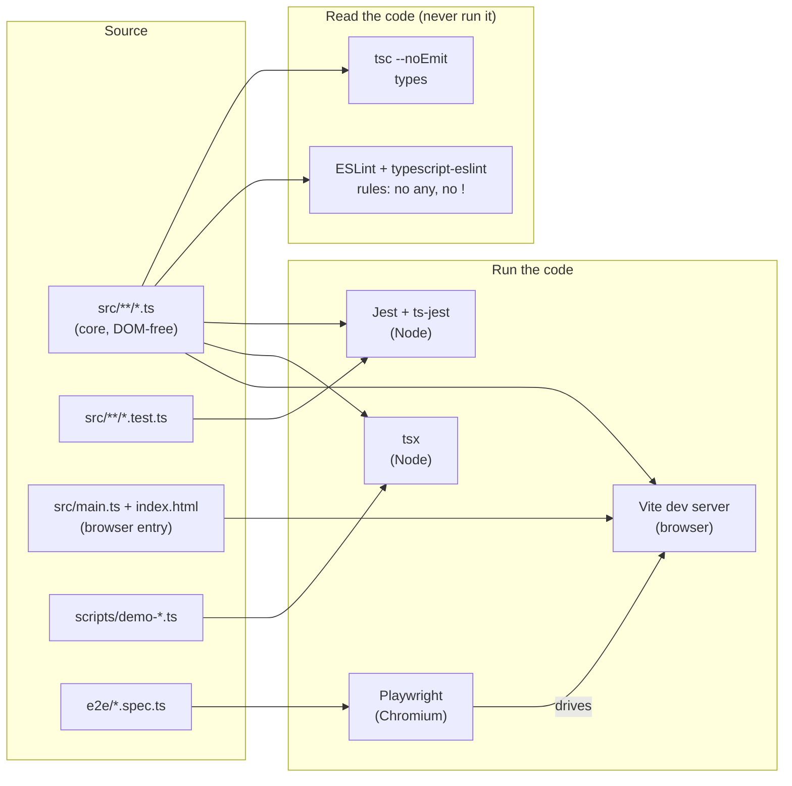
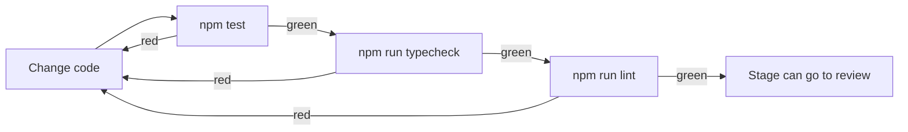

# Stage 00: Tooling & conventions

> **Part:** 1 (Foundations) · **Branch:** `stage/00-tooling` · **Needs:** none
> **Status:** done

## Goal

Get the toolchain in place and make it strict before any emulator code exists. There are five tools: TypeScript, Vite, Jest, Playwright and ESLint, plus `tsx` for demos. Each has one job. Doing this first means that from Stage 01 onwards every byte-handling function is written under rules that catch the bugs emulators are most prone to.

## What you can now see

All four checks are green, and the browser shows the page heading.

```bash
npm test && npm run typecheck && npm run lint   # all green, no output from tsc or eslint
npm run demo:hello
```

Expected `demo:hello` output:

```
Hello from the BBC Micro emulator toolchain!
Node v24.14.1, running TypeScript via tsx
RAM: 32768 bytes (&0000-&7FFF)
&FF + 1 as a plain number : 256
&FF + 1 masked with & &FF : 0
&FF + 1 stored in RAM[0]  : 0
```

The last three lines preview Stage 01. A plain JS number doesn't wrap (`256`). Masking does wrap it (`0`). A `Uint8Array` wraps on store (`0`), which is why our RAM will be one.

In the browser:

```bash
npm run dev      # then open http://localhost:5173
```

You should see the heading **"BBC Micro Model B"** above an empty 640×512 canvas (transparent by default, so it is invisible until Stage 31 draws on it). The tab title is "BBC Micro".

**To see the linter doing its job** (don't commit this), create `src/deliberate-bad.ts`:

```ts
export function readOpcode(rom: any, pc: number): number {
  return rom.bytes[pc];
}

const table = new Map<number, () => number>();
export function dispatch(op: number): number {
  return table.get(op)!();
}
```

`npx tsc --noEmit` **passes** (exit 0), because all of this is legal TypeScript. `npm run lint` **fails**:

```
  1:28  error  Argument 'rom' should be typed with a non-any type  @typescript-eslint/explicit-module-boundary-types
  1:33  error  Unexpected any. Specify a different type            @typescript-eslint/no-explicit-any
  2:3   error  Unsafe return of a value of type `any`              @typescript-eslint/no-unsafe-return
  2:14  error  Unsafe member access .bytes on an `any` value       @typescript-eslint/no-unsafe-member-access
  7:10  error  Forbidden non-null assertion                        @typescript-eslint/no-non-null-assertion

✖ 5 problems (5 errors, 0 warnings)
```

Then delete the file.

## The real hardware

None yet. Stage 00 is about the workshop, not the machine. One hardware fact does shape the tooling, though, and it's worth stating now:

- The 6502 has an **8-bit data bus** and a **16-bit address bus**. Every value it touches is a byte (`&00`–`&FF`) or an address (`&0000`–`&FFFF`), and those values **wrap**: `&FF + 1 = &00`, and `&FFFF + 1 = &0000`.
- JavaScript has only one number type, a 64-bit IEEE-754 float. In JS, `0xff + 1` is `256`, not `0`. Nothing in the language stops a "byte" from quietly becoming `256`, `-1` or `3.5`.

So the tooling has to help us keep values inside their hardware width. TypeScript can't express "an integer from 0 to 255" (it only has `number`). What it *can* do is make sure a value really is a `number` and not `undefined`, a string or `any`, and that closes off a whole family of silent bugs. Masking (`& 0xff`) is still our job, and it is covered in Stage 01.

## Key concepts

### 1. Each tool has exactly one job

| Tool | Job | When it runs | Command |
|---|---|---|---|
| **TypeScript (`tsc`)** | Checks types. It emits no code here (`noEmit: true`), so it's a pure checker. | Before commit, in CI | `npm run typecheck` |
| **ESLint** | Checks *style and rule* problems that are legal TypeScript but dangerous: `any`, `!`, unused variables. | Before commit | `npm run lint` |
| **Jest** (+ `ts-jest`) | Runs unit tests (`src/**/*.test.ts`) under Node. This is where almost all emulator testing happens. | Constantly | `npm test` |
| **tsx** | Runs a `.ts` file directly under Node, with no build step. Used for CLI demos in `scripts/`. | On demand | `npm run demo:<name>` |
| **Vite** | A dev server that serves `index.html` and compiles `src/main.ts` on the fly for the browser. | While developing the UI | `npm run dev` |
| **Playwright** | Drives a real Chromium browser to check what's on the page. | For browser milestones | `npm run test:e2e` |

`tsc` and ESLint **never run the code**. They read it. Jest, tsx, Vite and Playwright **do** run it. Notice that Jest, tsx and Vite each strip types *without checking them*: `ts-jest` does check, but tsx and Vite don't. That is why `npm run typecheck` is its own step and why the "done" gate is all three commands together:

```bash
npm test && npm run typecheck && npm run lint
```

### 2. Why `any` is banned

`any` switches the type checker off for a value, and it spreads: anything derived from an `any` is also `any`. In an emulator the classic bug looks like this:

```ts
const rom: any = JSON.parse(text);   // came from a fixture
const opcode = rom.bytes[pc];        // any, and no one checks it
a = (a + opcode) & 0xff;             // if opcode is undefined → NaN & 0xff = 0
```

`NaN & 0xff` is `0`, so the accumulator silently becomes `&00`. You wouldn't see a crash or an error, just a wrong flag three thousand instructions later. With `unknown` instead of `any`, TypeScript refuses to let you index into `rom` until you've *proved* its shape, and that is where the bug gets caught.

ESLint's `@typescript-eslint/no-explicit-any` catches the written word `any`. The "implied" kind (for example a parameter with no annotation) is already an error under `strict` (`noImplicitAny`). The two work together.

### 3. Why `!` (non-null assertion) is banned

`value!` tells TypeScript "trust me, this isn't `undefined`". Indexing a typed array or a `Map` is the obvious place you'd reach for it:

```ts
const handler = opcodeTable.get(opcode)!;  // what if the opcode is unimplemented?
handler();                                 // TypeError: handler is not a function
```

In an emulator, "this can't be undefined" is exactly the assumption that breaks when the CPU wanders into data and fetches an opcode you haven't implemented yet. Banning `!` forces an explicit branch (`` if (!handler) throw new Error(`Unimplemented opcode &${hex}`) ``) that gives a useful message instead. Stage 04 relies on precisely this.

### 4. Type-aware linting

Some ESLint rules only need the syntax tree ("is the word `any` written here?"). Others need **type information** ("is this `+` adding a number to a string?"). `typescript-eslint` can ask the TypeScript compiler for types, which makes linting slower but much sharper. We turn on the **type-checked** preset (`strictTypeChecked`), because the rules it adds, like `no-unsafe-*` and `restrict-plus-operands`, are exactly the ones that catch `any` leaking in from JSON or `fetch`.

### 5. Core vs web split (a convention, set up now)

The emulator core must run identically in Jest, in tsx and in the browser. So anything that touches `document` or `window` lives under `src/web/` (or `src/main.ts`, the browser entry point), and everything else is plain logic. We don't enforce this with a lint rule yet. We'll note it and revisit it once `src/web/` exists (Stage 03).

## Diagrams

How the tools relate to the source tree:



The "definition of done" gate every stage passes through:



## Our design

- **ESLint 10 flat config** (`eslint.config.js`). Flat config is the only format ESLint 10 supports: a single exported array of config objects, applied in order.
  - `@eslint/js` recommended rules as the base.
  - `typescript-eslint`'s `strictTypeChecked` preset, with `projectService: true` so each file is linted using the real `tsconfig.json`.
  - Explicit `'error'` for `no-explicit-any` and `no-non-null-assertion`. Both are already in the preset, but we write them out so the rule is visible in the config and survives any future preset changes.
  - `explicit-function-return-type` for exported functions (`explicit-module-boundary-types`), matching the CLAUDE.md rule.
  - Ignores `node_modules`, `dist`, `test-results`, `playwright-report`, `roms`, `discs`, `test-fixtures`.
- **`tsconfig.json`** gains `scripts/` in `include`, so demos are type-checked and linted like everything else.
- **`tsx`** (dev dependency) runs `scripts/demo-hello.ts` via `npm run demo:hello`.
- **`index.html`** gets an `<h1>` heading above the canvas.
- **`src/sanity.test.ts`** stays as the smoke test until Stage 01 brings real tests.

Alternatives considered:
- *`ts-node`* instead of `tsx`: it is slower and fussier about ESM. `tsx` uses esbuild and "just works" with `"type": "module"`.
- *Non-type-aware lint only* (`recommended` rather than `strictTypeChecked`): it's faster, but it misses the `no-unsafe-*` family, which is the whole point.

## Code walkthrough

- [`eslint.config.js`](../../eslint.config.js): the flat config. It has four entries, applied in order:
  1. `ignores` for build output, reports and the local-only `roms/`, `discs/` and `test-fixtures/` folders.
  2. `js.configs.recommended`, the core JS rules, applied to every file (including the `.js` config files).
  3. A block scoped to `**/*.ts` that `extends` `strictTypeChecked` and turns on `projectService`. This is where type-aware linting happens. `tsconfigRootDir: import.meta.dirname` tells the parser where `tsconfig.json` lives.
  4. The project's own rules, written out explicitly.
  Wrapping everything in `tseslint.config(...)` gives type checking of the config itself, and it's what makes the `extends` key work inside a flat-config object.
- [`scripts/demo-hello.ts`](../../scripts/demo-hello.ts): the first tsx demo. Look at `String(ram.length)` in the template literals. `strictTypeChecked` includes `restrict-template-expressions`, which rejects numbers inside `${}` so that you convert them deliberately. It's a bit fussy, but the same rule catches `${undefined}` turning into the text "undefined" on screen.
- [`package.json`](../../package.json): new `lint` (`eslint .`) and `demo:hello` (`tsx scripts/demo-hello.ts`) scripts, and new dev dependencies `eslint`, `@eslint/js`, `typescript-eslint` and `tsx`. All of these are tooling; the emulator still has **zero runtime dependencies**.
- [`tsconfig.json`](../../tsconfig.json): `scripts` added to `include`, so demos are type-checked. Type-aware linting also needs this, because `projectService` only knows about files a tsconfig includes.
- [`index.html`](../../index.html): the `<h1>BBC Micro Model B</h1>` heading.
- [`e2e/smoke.spec.ts`](../../e2e/smoke.spec.ts): now also asserts the heading text.

## Tests

| Test file | What it proves |
|---|---|
| `src/sanity.test.ts` | Jest + ts-jest can run TypeScript tests under Node (smoke test, removed once real tests exist). |
| `e2e/smoke.spec.ts` | Vite serves the page: title "BBC Micro", an `<h1>` reading "BBC Micro Model B", and a visible `#screen` canvas. |
| _manual, not committed_ | A deliberate `any` and `!` make `npm run lint` fail with 5 errors while `tsc` passes. |

Nothing in this stage needs ROMs or fixtures.

## Gotchas & hardware quirks

- **`tsc` doesn't reject explicit `any`.** `strict` only bans *implicit* `any`. Writing the word `any` is always legal TypeScript. ESLint is the only thing that catches it, which is why lint is part of the "done" gate.
- **tsx and Vite don't type-check.** They strip types with esbuild and run whatever is left. A demo can *run* fine and still have type errors, so always run `npm run typecheck`.
- **`projectService` only lints files a tsconfig includes.** If you add a new top-level folder of `.ts` files and forget to add it to `tsconfig.json`, ESLint reports a "file not found in project" parsing error. That's why `scripts` was added.
- **`typescript-eslint` pins its TypeScript range** (currently `>=4.8.4 <6.1.0`). We're on TypeScript 6.0.3, which is inside the range. If a future `npm install` bumps TypeScript to 6.1, lint may complain until `typescript-eslint` catches up.
- **`restrict-template-expressions`** is strict about numbers in template strings. Wrap them in `String(...)`, or (from Stage 01) use our own `hex8`/`hex16`.
- **favicon 404.** The browser console shows `favicon.ico` 404 because we don't have one. It's harmless.

## Playwright verification

- **MCP (interactive):** navigated to `http://localhost:5173`. The page title is "BBC Micro", and the accessibility snapshot shows `heading "BBC Micro Model B" [level=1]`. The only console entry is the favicon 404. (The canvas doesn't appear in an accessibility snapshot because it has no role or text, so the e2e test checks it by selector instead.)
- **Durable:** `e2e/smoke.spec.ts` now asserts the heading as well as the title and canvas. `npm run test:e2e` → 1 passed.
- `.playwright-mcp/` (the MCP's snapshot and log output) is added to `.gitignore`.

## Check your understanding

1. `tsc --noEmit` passed on `deliberate-bad.ts`, but `npm run lint` failed. Why does TypeScript's `strict` mode allow `rom: any`?
2. Which of our tools **run** the code, and which only **read** it? Which of the runners also check types?
3. In a later stage, `opcodeTable[opcode]` might be `undefined` for an opcode we haven't implemented. What would `opcodeTable[opcode]!()` do at runtime, and what should we write instead?
4. `demo:hello` printed `256` for `0xff + 1` but `0` for `RAM[0]`. What is the `Uint8Array` doing that a plain number isn't?
5. Why do we lint with *type information* (`strictTypeChecked` + `projectService`) rather than just the syntax-only `recommended` rules?

<details>
<summary>Answers</summary>

1. `strict` turns on `noImplicitAny`, which only complains when TypeScript *would have to guess* `any`. An explicit `any` is a deliberate opt-out that the language permits. The `no-explicit-any` lint rule is what bans it.
2. **Read only:** `tsc` and ESLint. **Run:** Jest, tsx, Vite and Playwright (which drives the browser that Vite serves). Of the runners, only `ts-jest` type-checks. tsx and Vite strip types without checking, which is why `typecheck` is a separate step.
3. It would throw `TypeError: ... is not a function`, a generic crash with no clue which opcode or address caused it. Instead, check it explicitly: `` const handler = opcodeTable[opcode]; if (handler === undefined) throw new Error(`Unimplemented opcode &${hex8(opcode)} at &${hex16(pc)}`); ``
4. A `Uint8Array` stores each element as an unsigned 8-bit integer, so assigning `256` keeps only the low 8 bits (`256 mod 256 = 0`), just as a real 8-bit latch would. A plain JS number is a 64-bit float with no width at all, so it has to be masked by hand (`& 0xff`).
5. Many dangerous patterns look fine syntactically: reading a property from an `any` that came from `JSON.parse`, returning it, adding it to a number. Only with type information can ESLint see that a value *is* `any` (even without the word appearing), so the `no-unsafe-*` rules depend on it.

</details>

## Further reading

- [typescript-eslint: Linting with type information](https://typescript-eslint.io/getting-started/typed-linting)
- [typescript-eslint: shared configs (`strictTypeChecked`)](https://typescript-eslint.io/users/configs)
- [ESLint: configuration files (flat config)](https://eslint.org/docs/latest/use/configure/configuration-files)
- [TypeScript handbook: `strict` and `noImplicitAny`](https://www.typescriptlang.org/tsconfig#strict)
- [MDN: `Uint8Array`](https://developer.mozilla.org/en-US/docs/Web/JavaScript/Reference/Global_Objects/Uint8Array), which covers how typed arrays convert (and wrap) stored values
- [tsx](https://tsx.is/)
