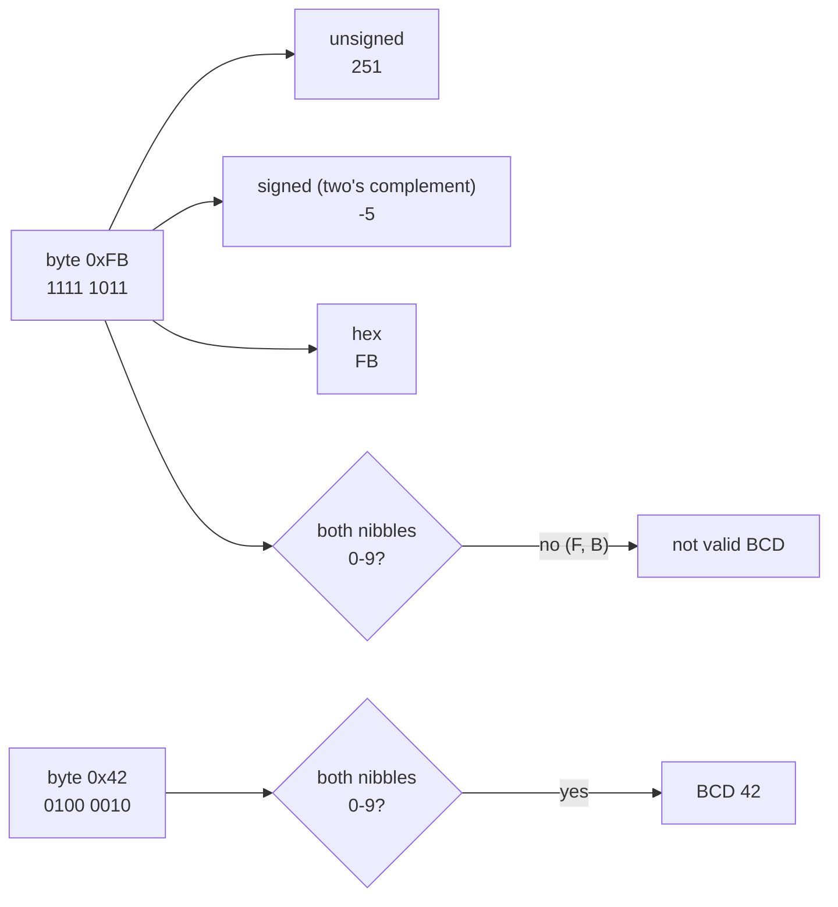
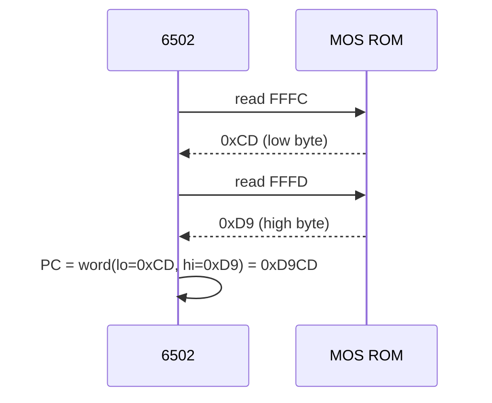
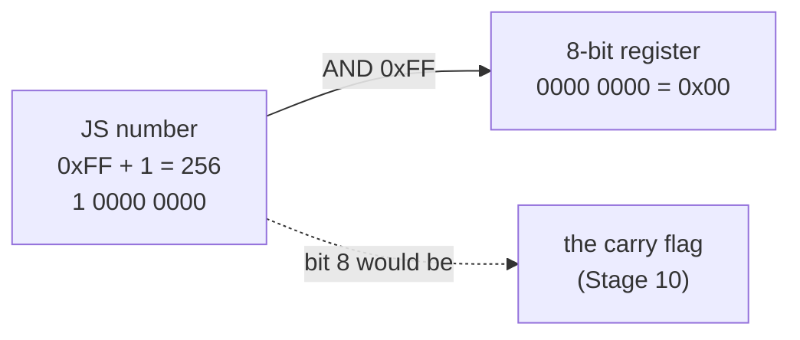

# Stage 01: Numbers the machine speaks

> **Part:** 1 (Foundations) · **Branch:** `stage/01-numbers` · **Needs:** 00
> **Status:** done

## Goal

Build a small, exhaustively tested toolkit, `src/util/bits.ts`, for the handful of number formats the 6502 and the BBC use. These are bytes, 16-bit words, signed bytes and BCD. The toolkit also formats them in hex. Every later stage leans on these helpers: the CPU uses them for flags and branch offsets, the memory viewer uses them to format hex, and the trace uses them for register dumps. They come first so that one set of tested functions carries "how numbers work on this machine", instead of it being scattered through the codebase.

## What you can now see

```bash
npm run demo:numbers -- 200
```

```
Decimal  Hex  Binary     Signed  In memory  As BCD   Read as BCD
-------  ---  ---------  ------  ---------  -------  -----------
200      &C8  1100 1000  -56     C8         - (>99)  invalid

Signed = two's complement (bytes only). In memory = little-endian, low byte first.
As BCD = the number encoded as BCD (0-99 only). Read as BCD = the byte decoded as BCD.
```

Reading across the row: 200 is `&C8`, which is `1100 1000` (nibbles `C` and `8`). Bit 7 is set, so read as a signed byte it's −56 (200 − 256). It's too big to encode as BCD, and as a BCD byte it's invalid because the high nibble `C` isn't a decimal digit.

With no arguments, the demo shows the edge values:

```bash
npm run demo:numbers
```

```
Decimal  Hex    Binary               Signed  In memory  As BCD   Read as BCD
-------  -----  -------------------  ------  ---------  -------  -----------
0        &00    0000 0000            0       00         &00      0
1        &01    0000 0001            1       01         &01      1
42       &2A    0010 1010            42      2A         &42      invalid
127      &7F    0111 1111            127     7F         - (>99)  invalid
128      &80    1000 0000            -128    80         - (>99)  80
200      &C8    1100 1000            -56     C8         - (>99)  invalid
251      &FB    1111 1011            -5      FB         - (>99)  invalid
255      &FF    1111 1111            -1      FF         - (>99)  invalid
55757    &D9CD  1101 1001 1100 1101  -       CD D9      - (>99)  -
```

Things to spot:
- **42**: in binary it's `&2A`, but encoded as BCD it's `&42`. And the byte `&2A` read *as* BCD is invalid. The two encodings really are different.
- **`&7F` / `&80`**: the cliff where the signed reading jumps from +127 to −128.
- **`&80`**: one byte that is 128, −128 **and** BCD 80, depending on how you read it.
- **`&D9CD`** (the MOS 1.20 reset vector) is stored in memory as `CD D9`, low byte first.

You can also try other formats, and see wrap-around:

```bash
npm run demo:numbers -- '&FB' -5 %1010 0xD9CD 65536 -1
```

This ends with:

```
  &FB → 251 (a byte)
  -5 → 251 (wrapped to 8 bits)
  %1010 → 10 (a byte)
  0xD9CD → 55757 (a word)
  65536 → 0 (wrapped to 16 bits)
  -1 → 255 (wrapped to 8 bits)
```

Quote `&FB` in the shell (`'&FB'`), because a bare `&` means "run in the background" to bash.

## The real hardware

The 6502 is an **8-bit CPU with a 16-bit address bus** (see the pin description in the MCS6500 family hardware and programming manuals):

- **Data bus: 8 lines (D0–D7).** Every value moved between the CPU and memory or devices is one **byte**, `&00`–`&FF` (0–255). The registers A, X, Y, S and P are all 8 bits wide.
- **Address bus: 16 lines (A0–A15).** The CPU can name `2^16 = 65,536` locations, `&0000`–`&FFFF`. PC, the program counter, is the one 16-bit register.
- **The arithmetic unit is 8 bits wide.** Adding `&FF + &01` gives `&00` with the **carry flag** set. The ninth bit falls out into C, and the register itself simply wraps.
- **Addresses wrap too.** Incrementing PC past `&FFFF` gives `&0000`, and zero-page indexing wraps within page zero (`&FF + X=1 → &00`, Stage 05).

Since the bus is only 8 bits wide, a 16-bit address is stored in memory as **two bytes**, and the 6502 always puts the **low byte first** (little-endian). Your own `roms/os12.rom` shows this. The last six bytes of the MOS, at `&FFFA–&FFFF`, are:

```
&FFFA: 00 0D   → NMI   vector = &0D00
&FFFC: CD D9   → RESET vector = &D9CD
&FFFE: 1C DC   → IRQ   vector = &DC1C
```

When the Model B is switched on, the 6502 reads `&FFFC` (`&CD`) and `&FFFD` (`&D9`), puts them together as `&D9CD`, and starts executing there. We do exactly that in Stage 04.

Two more number formats come straight from the instruction set:

- **Signed bytes (two's complement).** Branch instructions store a signed 8-bit offset. For example, `BNE` with operand `&FB` means "jump back 5 bytes". The N (negative) flag is simply bit 7 of the result, because in two's complement bit 7 *is* the sign.
- **BCD (binary-coded decimal).** With the D flag set (`SED`), `ADC` and `SBC` treat each nibble as a decimal digit, so `&19 + &01 = &20`, not `&1A`. The 6502 does this in hardware, and it's the subject of Stage 11.

## Key concepts

### 1. Bits, nibbles, bytes, words

| Unit | Bits | Range (unsigned) | Example |
|---|---|---|---|
| bit | 1 | 0–1 | the carry flag |
| nibble | 4 | `&0`–`&F` (0–15) | one hex digit, or one BCD digit |
| byte | 8 | `&00`–`&FF` (0–255) | the A register, one memory cell |
| word | 16 | `&0000`–`&FFFF` (0–65,535) | PC, an address |

Bits are numbered from **0 (least significant) to 7**. Bit *n* is worth `2^n`, so the byte `&C8` is:

```
bit:     7  6  5  4    3  2  1  0
value: 128 64 32 16    8  4  2  1
&C8  =   1  1  0  0    1  0  0  0   = 128 + 64 + 8 = 200
         └── C ──┘     └── 8 ──┘
```

Each hex digit is exactly one nibble, which is why hex is the natural notation. You can read the binary off a hex number four bits at a time.

### 2. `&` hex notation

BBC BASIC and the Advanced User Guide write hex with a leading `&`, as in `&FE40`. In TypeScript we write `0xFE40`. Our formatters (`hex8`, `hex16`) return **just the digits** (`"C8"`, `"FE40"`), always upper case and zero-padded to the full width, so that callers can add `&` in UI text or use the bare digits in a hex dump (Stage 02). Zero-padding matters because `&0D00` and `&D00` are the same number, but a column of addresses only lines up if they all have four digits.

### 3. Masking and wrap-around: why JS needs help

JavaScript has one number type: a 64-bit float. It has no idea that we mean "a byte":

```ts
0xff + 1          // 256     the hardware would give &00 (carry out)
0x00 - 1          // -1      the hardware would give &FF (borrow)
0xffff + 1        // 65536   the hardware would give &0000
```

The cure is **masking** with bitwise AND. It keeps the low *n* bits and throws the rest away, which is exactly what a register of width *n* does:

```ts
(0xff + 1) & 0xff     // 0      keep 8 bits
(0x00 - 1) & 0xff     // 255    works for negatives too: -1 is ...1111 in two's complement
(0xffff + 1) & 0xffff // 0      keep 16 bits
```

Why does masking a negative number work? JS bitwise operators first convert the number to a **32-bit two's-complement integer**, and -1 in that form is thirty-two 1 bits. `& 0xff` keeps the bottom eight: `&FF`.

**The rule for this project:** every function in `bits.ts` masks its inputs, and every value written to a register or memory is masked. That's cheap (one AND), and it makes "the byte became 256" impossible.

### 4. Two's complement: signed bytes

The same eight bits can be read two ways. Unsigned, `&FB` is 251. As a **signed** (two's-complement) byte, the top bit is worth **−128** instead of +128:

```
&FB = 1111 1011
unsigned: 128+64+32+16+8+2+1 = 251
signed:  -128+64+32+16+8+2+1 = -5
```

Or, more simply: **if the value is ≥ `&80`, subtract `&100` (256).** `&FB − &100 = −5`.

| Byte | Unsigned | Signed |
|---|---|---|
| `&00` | 0 | 0 |
| `&01` | 1 | 1 |
| `&7F` | 127 | **127** (largest positive) |
| `&80` | 128 | **−128** (most negative) |
| `&FB` | 251 | −5 |
| `&FF` | 255 | −1 |

The clever part is that **the adder doesn't care**. `&05 + &FB = &100`, which masks to `&00`. Read signed, that's 5 + (−5) = 0. Read unsigned, it's 5 + 251 = 256 with a carry. Either way it's the same bits. The CPU only has one adder. The *flags* tell you how to interpret the result: C for unsigned overflow, V for signed overflow (Stage 10), and N which is just bit 7.

To get a JS negative number from a signed byte, we use `toSigned8`. The 6502 needs it for branches: target = PC + `toSigned8(offset)`.

### 5. Little-endian words

A 16-bit value is split into a **low byte** and a **high byte**:

```
&D9CD
  hi = &D9  = (w >> 8) & &FF
  lo = &CD  =  w       & &FF
  word(lo, hi) = (hi << 8) | lo = &D9CD
```

The 6502 stores and reads them **low byte first**. That's why the reset vector's bytes appear as `CD D9` in the ROM. Our `word(lo, hi)` helper takes its arguments **in memory order** (low, then high), so reading a vector looks like `word(read(0xFFFC), read(0xFFFD))`, which matches the bytes as you see them in a dump.

Why little-endian? When the 6502 computes `abs,X`, it fetches the low byte first and can start adding X to it while it's still fetching the high byte. Low-first makes the carry propagate in the order the bytes arrive.

### 6. BCD: binary-coded decimal

In BCD, each nibble holds one decimal digit, `0`–`9`. The byte `&42` *means* forty-two:

```
decimal 42  →  BCD &42 = 0100 0010   (nibbles 4 and 2)
decimal 42  →  binary &2A = 0010 1010
```

- **Encoding** (`binaryToBcd`): tens digit into the high nibble, units into the low. Only 0–99 fit in one byte.
- **Decoding** (`bcdToBinary`): high nibble × 10 + low nibble.
- **Valid** BCD bytes have both nibbles ≤ 9. So `&3A` or `&C8` is **not** valid BCD. There are exactly **100 valid values** out of 256.

Why would a CPU bother? Displaying a score or a clock in decimal needs no division if it's already stored as digits, and division is very expensive on a 6502 (there's no divide instruction). What the NMOS 6502 does with *invalid* BCD in decimal mode is a real quirk, and it's covered in Stage 11. This stage's helpers simply **refuse invalid input** by throwing a `RangeError`, and `isValidBcd()` lets callers check first.

### 7. Testing single bits

`bit(value, n)` asks "is bit *n* set?" and `setBit(value, n, on)` sets or clears it. The P register is eight flags packed into one byte (Stage 04):

```
P = &24 = 0010 0100
bit(0x24, 2) → true    (I, interrupt disable)
bit(0x24, 0) → false   (C, carry)
setBit(0x24, 0, true) → &25
```

## Diagrams

One byte, three readings:



Reading the RESET vector, little-endian:



Masking as a register of fixed width:



## Our design

`src/util/bits.ts` holds **pure functions only**. They have no state and no classes, and apart from the hex formatters they don't allocate (formatters build strings, so they're for UI and trace, never the CPU hot path).

```ts
export function hex8(value: number): string;           // "C8"  (masks to 8 bits)
export function hex16(value: number): string;          // "D9CD" (masks to 16 bits)
export function toSigned8(value: number): number;      // 0xFB → -5
export function lo(value: number): number;             // 0xD9CD → 0xCD
export function hi(value: number): number;             // 0xD9CD → 0xD9
export function word(lo: number, hi: number): number;  // (0xCD, 0xD9) → 0xD9CD, memory order
export function isValidBcd(value: number): boolean;    // 0x42 → true, 0x3A → false
export function bcdToBinary(value: number): number;    // 0x42 → 42, throws RangeError if invalid
export function binaryToBcd(value: number): number;    // 42 → 0x42, throws RangeError outside 0-99
export function bit(value: number, n: number): boolean;            // is bit n set?
export function setBit(value: number, n: number, on: boolean): number;
```

Decisions:
- **Formatters return bare digits** (no `&` or `0x`), so one function serves hex dumps, the trace and the UI. Callers add the prefix.
- **`word(lo, hi)` takes its arguments in memory order.** It's easy to get this backwards. Matching the order of the bytes in a dump makes a mistake visible.
- **`bit` returns `boolean`**, not `0 | 1`, because it's used as a condition (`if (bit(p, 0))`). Converting to a number is trivial where needed.
- **BCD helpers throw on invalid input.** The alternative, silently computing `&C8 → 12×10+8 = 128`, would hide bugs. The CPU's decimal mode (Stage 11) works nibble-by-nibble and won't call these helpers, so the throw never lands in the hot path.
- **`isValidBcd` is an addition** not listed in the build plan. The demo needs to ask "is this valid BCD?" without catching exceptions, and so will tests later.
- The demo's binary formatting (`1100 1000`) is kept **local to the demo script**. Nothing else needs it yet, so it doesn't go in `bits.ts` (don't build ahead).

## Code walkthrough

- [`src/util/bits.ts`](../../src/util/bits.ts) has eleven small functions. The ones that carry the ideas:
  - `hex8`/`hex16`: **mask first**, then `toString(16)`, upper-case, pad. Masking inside the formatter means `hex8(-1)` gives `"FF"`, the same bits the hardware would hold, rather than `"-1"`.
  - `toSigned8`: `b < 0x80 ? b : b - 0x100`. That's the "subtract 256 if bit 7 is set" rule, written literally. (A common alternative is `(b << 24) >> 24`, which uses JS's 32-bit arithmetic shift to copy bit 7 into all the upper bits: "sign extension". Both give the same answer. We use the version you can read.)
  - `word(low, high)`: `((high & 0xff) << 8) | (low & 0xff)`. Masking each half separately stops a bad low byte (say `0x1CD`) from spilling a bit into the high byte.
  - `binaryToBcd`: `(tens << 4) | units`. The tens digit goes in the high nibble.
  - `bcdToBinary`: `(b >> 4) * 10 + (b & 0x0f)`, but only after `isValidBcd` passes.
  - `setBit`: `value | (1 << n)` to set, `value & ~(1 << n)` to clear. `~` flips every bit of the mask, so `~(1 << 2)` is `...1111 1011`, which clears exactly bit 2.
- [`scripts/demo-numbers.ts`](../../scripts/demo-numbers.ts) parses `&`/`$`/`0x`/`%` literals with one regex, chooses byte or word width, and prints the table. The nibble-grouped binary formatter lives here, not in `bits.ts`, because nothing else needs it yet.
- `src/sanity.test.ts` has been **removed**. It was only there until real tests existed (Stage 00).

## Tests

| Test file | What it proves |
|---|---|
| `src/util/bits.test.ts` → `hex8` / `hex16` | Two and four upper-case digits, **all 256 bytes round-trip**, and wrap-around (`&FF + 1 → "00"`, `-1 → "FF"`, `&FFFF + 1 → "0000"`). |
| → `toSigned8` | Edge values `&00 &01 &7F &80 &FB &FF`. For **every byte**, the result is negative exactly when bit 7 is set, stays in −128..127, and masks back to the original bits. |
| → `lo` / `hi` / `word` | The real MOS 1.20 NMI, RESET and IRQ vectors. **All 65,536 words round-trip.** Out-of-range bytes can't leak into the other half. |
| → BCD | **Exactly 100 of 256 bytes are valid.** Every value 0–99 round-trips (and its hex digits read as the decimal number). Invalid bytes (`&3A`, `&C8`, `&FF`) and out-of-range numbers (100, 200, −1, 4.5) throw `RangeError`. |
| → `bit` / `setBit` | Flag bits in `P=&24`, set and clear without disturbing other bits, and consistency for every byte × bit position. |

20 tests. None need ROMs or fixtures. (The vector values in the tests come from `os12.rom`, but they're written in as constants, so the tests don't read the file.)

## Gotchas & hardware quirks

- **JS bitwise operators work on 32-bit signed integers.** `0xff << 24` is `-16777216`, not `4278190080`. At our widths (8 and 16 bits) this never bites, but it is why `toSigned8` can use `(b << 24) >> 24`, and why you should never shift a byte left by 24 or more and expect a positive number.
- **`~` produces negatives.** `~0x04` is `-5`. That's fine inside `value & ~mask` (the AND keeps only bits that were in `value`), but `~x` on its own must be masked: `~x & 0xff`.
- **`word(lo, hi)` order.** The arguments follow memory order (low first). Writing `word(hi, lo)` by mistake gives `&CDD9` instead of `&D9CD`, and the CPU would jump into the middle of nowhere. The vector tests catch this.
- **`&` in the shell.** `npm run demo:numbers -- &FB` backgrounds the command. Quote it: `'&FB'`.
- **Invalid BCD is deliberately unsupported here.** The real NMOS 6502 does produce *defined* (if odd) results in decimal mode for bytes like `&3A`. That's CPU behaviour, handled nibble-wise in Stage 11. These helpers are for converting numbers, not emulating the ALU.
- **Formatters allocate.** `hex8` and `hex16` build strings. Never call them in `step()` or `tick()`. They're for UI and trace output.

## Playwright verification

n/a. This is a CLI-only stage.

## Check your understanding

1. What is `(0x00 - 1) & 0xff`, and why does masking a *negative* JS number give a sensible byte?
2. A `BNE` instruction at `&1000` has the operand `&F0`. Branches are relative to the address *after* the two-byte instruction. Where does it jump to?
3. You see the bytes `00 80` at `&FFFC` in a ROM dump. What is the reset address, and what `word(...)` call produces it?
4. Is `&59` valid BCD? What about `&5A`? What decimal number does `&59` represent in BCD, and what number is it in plain binary?
5. `&05 + &FB` gives `&00` with a carry. Explain why that one result is correct whether you read the operands as unsigned or as signed.

<details>
<summary>Answers</summary>

1. `255` (`&FF`). JS bitwise operators convert their operands to 32-bit two's-complement integers, and −1 in that form is all 1 bits. `& 0xff` keeps the bottom eight, `1111 1111`. That's exactly what an 8-bit register holds after decrementing `&00`.
2. `&F0` as a signed byte is `&F0 − &100 = −16`. The next instruction is at `&1002`, so the target is `&1002 − 16 = &0FF2`.
3. `&8000`, from `word(0x00, 0x80)`. The low byte comes first in memory, so `00` is the low byte and `80` the high. (That's the start of sideways ROM, and a real Model B would never have its reset vector there. It's just an example.)
4. `&59` is valid (nibbles 5 and 9) and means **59** in BCD. In plain binary it's 5×16 + 9 = **89**. `&5A` is **not** valid, because `A` (10) isn't a decimal digit.
5. Unsigned: 5 + 251 = 256, which doesn't fit in 8 bits, so the byte wraps to `&00` and the ninth bit becomes the carry. Signed: `&FB` is −5, and 5 + (−5) = 0. The adder produces the same bits either way. Only the *interpretation* differs, which is why the 6502 has both C (unsigned) and V (signed) flags.

</details>

## Further reading

- *MCS6500 Microcomputer Family Programming Manual* (MOS Technology, 1976): the sections on ADC/SBC decimal mode and on relative addressing (signed branch offsets).
- *BBC Microcomputer Advanced User Guide*: the memory map chapter, and how the MOS uses the vectors at `&FFFA–&FFFF`.
- [6502.org: Decimal mode tutorial (Bruce Clark)](http://www.6502.org/tutorials/decimal_mode.html), which is also essential for Stage 11.
- [BeebWiki: Hexadecimal notation](https://beebwiki.mdfs.net/Hexadecimal) (why `&`).
- [MDN: Bitwise operators](https://developer.mozilla.org/en-US/docs/Web/JavaScript/Reference/Operators#bitwise_shift_operators) and the 32-bit conversion they perform.
