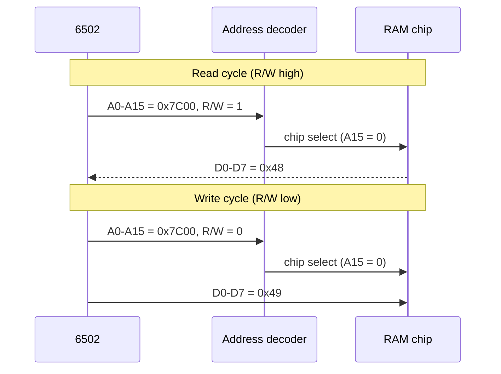
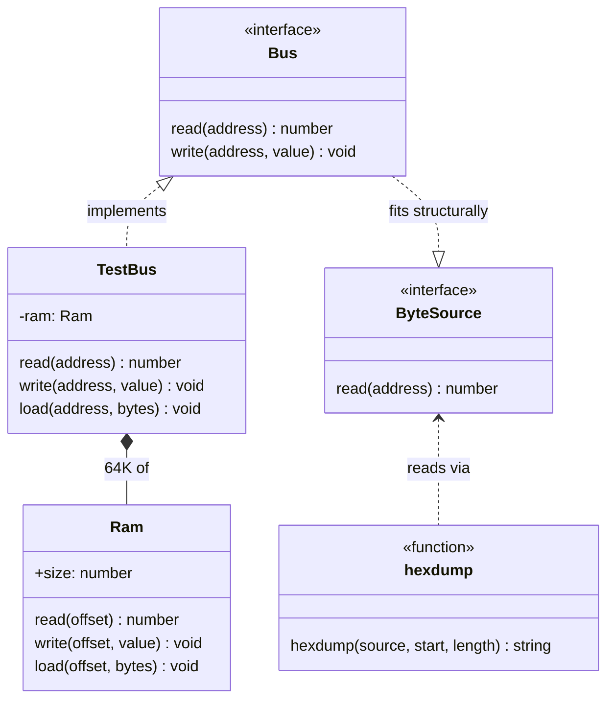
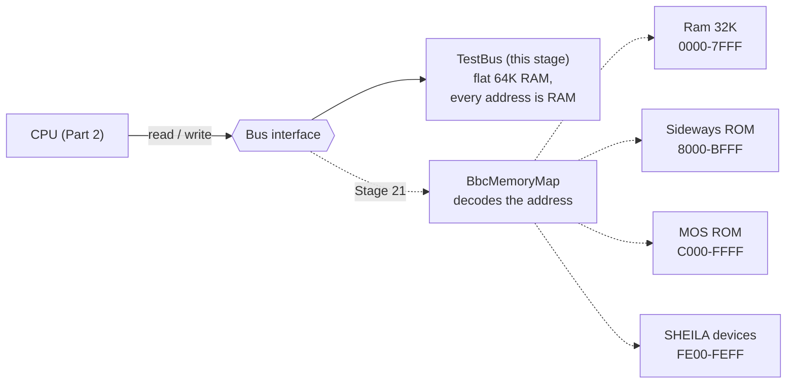
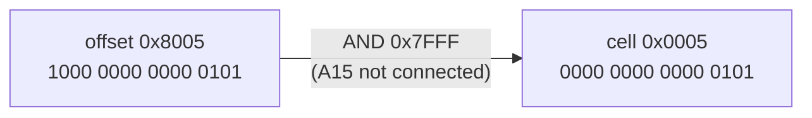

# Stage 02: Memory & the bus

> **Part:** 1 (Foundations) · **Branch:** `stage/02-memory-bus` · **Needs:** 01
> **Status:** done

## Goal

Give the emulator somewhere to keep bytes, and a single narrow doorway to reach them. This stage defines the `Bus` interface (`read(address)` and `write(address, value)`), a `Ram` block, a flat 64K `TestBus` for the CPU to run on in Part 2, and a `hexdump` formatter so we can *look* at memory. It comes before the CPU because the CPU is built on top of the bus. Every instruction in Part 2 is just a sequence of bus reads and writes.

## What you can now see

```bash
npm run demo:hexdump
```

The demo makes a fresh 64K `TestBus` and walks through six steps, printing a hex dump after each one:

```
1. Power on: fresh RAM is all &00
---------------------------------
0000  00 00 00 00 00 00 00 00  00 00 00 00 00 00 00 00  |................|
0010  00 00 00 00 00 00 00 00  00 00 00 00 00 00 00 00  |................|

2. bus.write() a message into Mode 7 screen memory at &7C00
-----------------------------------------------------------
7C00  48 45 4C 4C 4F 2C 20 42  42 43 20 4D 49 43 52 4F  |HELLO, BBC MICRO|
7C10  0D 54 68 65 20 65 6E 64  2E                       |.The end.|
(&0D, the carriage return, is not printable, so it shows as ".")

3. The bus masks: write(&17C20, &148) lands at &7C20 as &48
-----------------------------------------------------------
7C20  48                                                |H|

4. Addresses wrap: a dump from &FFF8 carries on at &0000
--------------------------------------------------------
FFF8  00 00 00 00 00 00 AA BB  CC DD 00 00 00 00 00 00  |................|
0008  00 00 00 00 00 00 00 00                           |........|

5. Your BASIC II ROM at &8000: its header has a readable title
--------------------------------------------------------------
8000  C9 01 F0 1F 60 EA 60 0E  01 42 41 53 49 43 00 28  |....`.`..BASIC.(|
8010  43 29 31 39 38 32 20 41  63 6F 72 6E 0A 0D 00 00  |C)1982 Acorn....|

6. Your MOS 1.20 ROM at &C000: the CPU vectors are its last 6 bytes
-------------------------------------------------------------------
FFF0  02 6C 0C 02 6C 0A 02 6C  08 02 00 0D CD D9 1C DC  |.l..l..l........|
  &FFFA NMI   = &0D00
  &FFFC RESET = &D9CD   (bytes CD D9, low byte first)
  &FFFE IRQ   = &DC1C
```

Steps 5 and 6 need `roms/basic2.rom` and `roms/os12.rom`. If either file is missing, the demo prints a "skipped" line instead. The ROMs are copied into the flat test bus as plain bytes. There's no write protection or paging yet (Stages 21–22).

To dump a range of your choice as well, add a start address and a length (default 64). Quote `&` for the shell:

```bash
npm run demo:hexdump -- '&D9CD' 32
```

```
Your range: &D9CD, 32 bytes
---------------------------
D9CD  A9 40 8D 00 0D 78 D8 A2  FF 9A AD 4E FE 0A 48 F0  |.@...x.....N..H.|
D9DD  09 AD 58 02 4A C9 01 D0  1D 4A A2 04 86 01 85 00  |..X.J....J......|
```

These are **the first bytes a Model B executes after reset**. You can't decode them yet, but by Stage 06 you'll read `A9 40` as `LDA #&40` and `8D 00 0D` as `STA &0D00`. And `AD 4E FE` is `LDA &FE4E`: the MOS reading a System VIA register (SHEILA `&FE4E`) within its first handful of instructions. Memory-mapped I/O shows up almost immediately.

## The real hardware

The 6502 talks to the outside world through three groups of pins (MCS6500 hardware manual, pin descriptions):

- **A0–A15: the address bus.** Sixteen output lines. The CPU drives them to say *which* location it wants, `&0000`–`&FFFF`.
- **D0–D7: the data bus.** Eight lines, and they're bidirectional. On a read, whatever is at that address drives them and the CPU samples them. On a write, the CPU drives them.
- **R/W: read/not-write.** One line. High means "I'm reading", low means "I'm writing".

Plus the clock (φ2). On the Model B the CPU runs at 2 MHz, so one bus cycle is 500 ns. **The 6502 performs exactly one bus access every clock cycle, read or write, with no exceptions.** Even cycles where the CPU is busy "thinking" put *some* address on the bus and do a read (a "dummy read"). That's worth remembering: it becomes important when the thing being read is an I/O chip (see Gotchas).

What the CPU does *not* have is any idea what is connected. There's no "this is RAM" or "this is a timer" signal. The Model B's **address decoding** logic looks at the top address lines and switches on exactly one chip for each access (Advanced User Guide, memory map chapter):

| Address lines say | Chip that answers |
|---|---|
| `&0000–&7FFF` (A15 = 0) | 32K of RAM |
| `&8000–&BFFF` | whichever sideways ROM is selected (Stage 22) |
| `&C000–&FBFF`, `&FF00–&FFFF` | the MOS ROM |
| `&FE00–&FEFF` | SHEILA: one of the I/O chips (VIA, CRTC, ULA, ...) |

This is what **memory-mapped I/O** means. A device register is just an address, and the CPU uses the same `LDA`/`STA` instructions for it as for RAM. For example, the MOS writes to `&FE40` to talk to the System VIA. The 6502 has no separate I/O instructions. The Z80, by contrast, has `IN` and `OUT` and a separate I/O address space.

Two consequences shape our design:

1. **From the CPU's side, the entire machine is two operations:** "read the byte at address *a*" and "write byte *v* to address *a*". That's the whole interface, and it's why our `Bus` has only two methods.
2. **The bus is a fixed width.** There are exactly 16 address lines and 8 data lines, so the address `&10000` or the value `&1FF` can't physically exist on it. The bus masks both.

### RAM on the Model B

The Model B has 32K of RAM, `&0000–&7FFF`. 32K is `&8000` bytes, which is `2^15`, so it needs **15 address lines (A0–A14)** to pick a byte. The RAM chips never see A15; the decoder uses A15 to decide whether RAM is selected at all.

That's a general rule of memory chips: a chip with `2^n` bytes only looks at the bottom *n* address lines. If the decoder switches it on for a wider range, the chip simply ignores the upper lines and the same bytes **repeat** ("mirror") across that range. We model a RAM block the same way. It masks the offset to its own size, so a 32K `Ram` treats offset `&8005` as `&0005`.

(The real Model B RAM is dynamic RAM, shared between the CPU and the video circuitry, which read it on alternate 1 MHz phases. The video side arrives in Parts 6 and 9. For the CPU, it's simply 32K of bytes.)

## Key concepts

### 1. One read, one write: the bus cycle

A **read** cycle:

1. The CPU puts the address on A0–A15 and holds R/W high.
2. The decoder enables the one chip that owns that address.
3. The chip drives the byte onto D0–D7.
4. At the end of φ2, the CPU latches D0–D7.

A **write** cycle is the same, except R/W is low and the CPU drives D0–D7, which the chip latches.

In TypeScript that becomes:

```ts
const value = bus.read(0x7c00);   // read cycle:  address out, byte back
bus.write(0x7c00, 0x48);          // write cycle: address and byte out
```

`LDA &7C00` is three reads to fetch the instruction (`AD 00 7C` at PC, PC+1, PC+2) and a fourth read of `&7C00` itself. `STA &7C00` is three reads to fetch, then one write. We build that in Part 2. For now, the point is that **everything the CPU does is made of these two calls**.

### 2. Why `read()` is a method and not an array lookup

It would be tempting for the CPU to hold a `Uint8Array(65536)` and index it directly. That works for RAM, but not for memory-mapped I/O, because **a read can do something**:

- Reading the System VIA's `&FE44` (Timer 1 counter low) clears the Timer 1 interrupt flag (6522 datasheet; Stage 25).
- Writing `&FE30` doesn't store a byte anywhere. It *switches which ROM* appears at `&8000` (Stage 22).

So every access has to go through code that can decide what the address means. In this stage the answer is always "a byte of RAM", but the CPU will only ever see the `Bus` interface. In Stage 21 we swap the flat `TestBus` for the real BBC memory map, and the CPU doesn't change at all.

### 3. Masking at the boundary

JavaScript numbers aren't 16 or 8 bits wide (Stage 01), so the bus enforces the widths:

```ts
bus.write(0x17c00, 0x148);   // address → 0x17c00 & 0xffff = 0x7c00
                             // value   → 0x148   & 0xff   = 0x48
bus.read(0x7c00);            // → 0x48
bus.write(-1, 0x41);         // address → -1 & 0xffff = 0xffff
```

Where does `&17C00` come from in practice? From the CPU doing arithmetic on an address. `LDA &FFFF,X` with X = `&01` computes `&10000`, and on the real chip that becomes `&0000` because there is no 17th address line. We'll mask in the CPU too, but masking in the bus as well is cheap insurance: a missed mask anywhere upstream can't corrupt memory or read `undefined`.

(A `Uint8Array` already wraps stored values modulo 256. We mask explicitly anyway, both to follow the project rule and because it makes the intent obvious to a reader.)

### 4. Little-endian in memory

Stage 01's `word(lo, hi)` meets real memory here. The MOS 1.20 reset vector at `&FFFC` is stored as two bytes:

```
&FFFC: CD     (low byte)
&FFFD: D9     (high byte)
word(bus.read(0xfffc), bus.read(0xfffd)) = &D9CD
```

A hex dump shows the bytes **in memory order**, `CD D9`, and it's up to you to read them backwards as `&D9CD`.

### 5. The hex dump

A hex dump is the standard way to look at raw memory. Each row shows 16 bytes:

```
7C00  48 45 4C 4C 4F 2C 20 42  42 43 20 4D 49 43 52 4F  |HELLO, BBC MICRO|
^^^^  ^^^^^^^^^^^^^^^^^^^^^^^  ^^^^^^^^^^^^^^^^^^^^^^^   ^^^^^^^^^^^^^^^^
addr  bytes +0..+7             bytes +8..+F              the same bytes as text
```

- **Address:** four hex digits, the address of the first byte on the row.
- **Bytes:** 16 two-digit hex values, with an extra space after the eighth to help the eye find `+8`.
- **ASCII column:** each byte as a character if it's printable ASCII (`&20` space to `&7E` `~`), otherwise `.`. So `&0D` (carriage return), `&7F` (delete) and anything `&80` or above appear as `.`.

16 per row is convenient because the address of every row then changes only in its last hex digit if the dump starts on a multiple of `&10`. Why the ASCII column? Text in memory jumps out immediately: a ROM's title, a BASIC program, or Mode 7 screen memory (which *is* ASCII, one byte per character cell, at `&7C00`).

## Diagrams

A read and a write, as the CPU and the bus see them:



How the TypeScript pieces fit together. The CPU (Part 2) will depend only on `Bus`, and `hexdump` depends only on something it can `read` from:



Today versus Stage 21. The CPU sees the same `Bus` either way; only what's behind it changes:



Masking a 32K RAM chip's offset (why it mirrors):



## Our design

Four small modules:

```ts
// src/memory/bus.ts: what the CPU talks to.
export interface Bus {
  read(address: number): number;               // 0..255
  write(address: number, value: number): void;
}

// src/memory/ram.ts: a block of RAM, 2^n bytes.
export class Ram {
  readonly size: number;
  constructor(size: number);                   // RangeError unless a power of two
  read(offset: number): number;                // offset masked to size - 1
  write(offset: number, value: number): void;  // value masked to 0xff
  load(offset: number, bytes: ArrayLike<number>): void;
}

// src/memory/test-bus.ts: every address is RAM. The CPU's playground in Part 2.
export class TestBus implements Bus {
  read(address: number): number;               // address masked to 0xffff
  write(address: number, value: number): void;
  load(address: number, bytes: ArrayLike<number>): void;
}

// src/util/hexdump.ts
export interface ByteSource { read(address: number): number; }
export function hexdump(source: ByteSource, start: number, length: number): string;
```

Decisions:

- **`Bus` is an interface, not a base class.** The CPU needs a contract, not shared code. `TestBus` and the later `BbcMemoryMap` have nothing in common except those two methods.
- **`Ram` requires a power-of-two size.** This makes "ignore the upper address lines" a single AND (`offset & (size - 1)`), just like the hardware. Every RAM size we need (32K, 64K for the test bus) is a power of two, and a non-power-of-two size is almost certainly a bug, so we throw a `RangeError`.
- **`TestBus` is built from a 64K `Ram`,** not its own array. The `Ram` does the storage and mirroring, and the `TestBus` does the bus's 16-bit masking. That's one job each.
- **`load()` goes through `write()`,** so it gets the same masking and wraps past `&FFFF` like the CPU would. It's a convenience for tests and demos ("put these bytes here"), for example to load a ROM image into the test bus.
- **Fresh RAM is all `&00`.** Real DRAM powers up holding semi-random values, and the MOS clears the memory it uses on a power-on reset. Starting from zero keeps the emulator deterministic, which matters for tests. (Deliberately simplified; see Gotchas.)
- **`hexdump` takes a `ByteSource`, not a `Bus`.** It only needs `read`, so it asks only for `read`. Any `Bus`, a `Ram` or a hand-written stub fits that shape (TypeScript's structural typing), and `src/util` doesn't need to import from `src/memory`.
- **Rows start at `start`,** not at the previous multiple of 16. That's simpler and predictable: you get exactly the bytes you asked for. Aligned rows can come later in the workbench memory panel if they're useful.
- **`hexdump` reads each byte exactly once, in order.** This doesn't matter for RAM, but it will for I/O (see Gotchas), and a test pins it down.
- **No allocation in `read`/`write`.** They're the hottest code in the emulator (every CPU cycle goes through one), so they're a mask and an array access, nothing else. `hexdump` builds strings and is for display only.

## Code walkthrough

- [`src/memory/bus.ts`](../../src/memory/bus.ts) is just the interface, with its contract in the comments: mask the address to 16 bits and the value to 8 bits, and remember that reads may have side effects. There's no code in it, and that's deliberate.
- [`src/memory/ram.ts`](../../src/memory/ram.ts):
  - The constructor checks `(size & (size - 1)) === 0`. That's the classic power-of-two test. A power of two has exactly one bit set (`&8000 = 1000 0000 0000 0000`), and subtracting 1 turns that bit off and every bit below it on (`&7FFF = 0111 1111 1111 1111`), so the AND is zero. Any other number keeps at least one bit in common.
  - `size - 1` is then stored as `mask`. For 32K that's `&7FFF`, one bit per address line A0–A14.
  - `read` is `this.bytes[offset & this.mask]` and `write` is `this.bytes[offset & this.mask] = value & 0xff`. One AND each, with no branches and no allocation. That's the mirroring from Key concept 3, in one expression.
  - The `?? 0x00` in `read` never fires (the mask keeps the index in range), but it keeps the return type a plain `number` if stricter index checking is ever turned on.
- [`src/memory/test-bus.ts`](../../src/memory/test-bus.ts) holds a private 64K `Ram` and masks `address & 0xffff` and `value & 0xff` on the way in. Because the `Ram` is 64K, its own mask (`&FFFF`) happens to be the same as the bus's, so the double mask is redundant here. The two masks mean different things, though ("16 address lines" versus "this chip's size"), and in Stage 21 they'll differ: a 32K RAM behind a 64K bus.
- [`src/util/hexdump.ts`](../../src/util/hexdump.ts) loops over rows, then over up to 16 bytes per row. It builds the hex and ASCII strings together from a **single** `read` per byte, then pads the hex part to a fixed 48 characters (`16 × 3 − 1 + 1` for the mid-row gap) so a short last row's `|` lines up with the full rows above it.
- [`scripts/demo-hexdump.ts`](../../scripts/demo-hexdump.ts) does everything through `bus.write`, `bus.load` and `hexdump`, the same public calls the CPU and workbench will use. The ROM steps use `existsSync` and skip with a message when a file is missing.

## Tests

| Test file | What it proves |
|---|---|
| `src/memory/ram.test.ts` | Fresh RAM is zero. **Every one of the 32K cells** holds its own value. Values are masked to 8 bits (`&148 → &48`, `-1 → &FF`). A 32K `Ram` mirrors (`&8005` is `&0005`). `load` copies in order and wraps at the end of the chip. Sizes that aren't a power of two up to 64K throw `RangeError`. |
| `src/memory/test-bus.test.ts` | It works as a `Bus`. **All 65,536 addresses** are separate bytes. Addresses are masked to 16 bits (`&10000 → &0000`, `&17C00 → &7C00`, `-1 → &FFFF`) and values to 8 bits. The MOS 1.20 vectors read back little-endian as `&0D00`, `&D9CD` and `&DC1C`. `load` wraps from `&FFFF` to `&0000`. Two buses share no state. |
| `src/util/hexdump.test.ts` | The exact row format. Only `&20–&7E` is printed as text (`&1F`, `&7F`, `&80`, `&0D` and `&FF` become `.`). Short last rows keep the ASCII column aligned, including across the mid-row gap. Rows step by 16 from `start`. Dumps wrap at `&FFFF`. **Each byte is read exactly once, in order.** Length 0 gives `''`, and bad lengths throw. |

30 new tests (50 in total). None need ROMs or fixtures. The vector bytes in the `TestBus` test are written in as constants, and only the demo reads `roms/`.

## Gotchas & hardware quirks

- **Reads aren't always harmless.** Dumping RAM is safe, but dumping SHEILA (`&FE00–&FEFF`) through `read()` would *act* on the devices, for example clearing a VIA interrupt flag. Debuggers usually have a side-effect-free "peek" for this. We don't need one until the workbench shows I/O memory, so it's parked (see `PROGRESS.md`).
- **Dummy reads.** The real 6502 reads the bus on *every* cycle, including "wasted" cycles. For example, `LDA &20FF,X` with X = `&01` first reads `&2000` (the address before the carry into the high byte is fixed) and then `&2100`. On RAM nobody can tell. On I/O it's a visible side effect, and some software depends on it. Our instruction-stepped model (BUILD-PLAN §3) performs only the "real" accesses. That's a known simplification, and the cycle-exact extras in Part 12 are where it would be fixed.
- **Power-on RAM contents.** Real DRAM powers up in a semi-random state, not zero. Software that reads memory before writing it could behave differently on real hardware. The MOS clears what it uses on a power-on reset, so for us zero-fill is a safe, deterministic choice.
- **The test bus has no ROM protection.** In step 6 of the demo the MOS image is just bytes in RAM, so `bus.write(0xfffc, 0)` would happily change the reset vector. On a real Model B, a write to ROM does nothing (it may land on RAM or I/O elsewhere, depending on the decoding). The real memory map arrives in Stage 21.
- **`Uint8Array` silently wraps values modulo 256, and silently ignores out-of-range indices.** `bytes[70000] = 1` does nothing and `bytes[70000]` gives `undefined`. That's why masking the *offset* matters even more than masking the value: an unmasked offset doesn't crash, it just loses the write.
- **Quote `&` in the shell.** `npm run demo:hexdump -- &FFF0` backgrounds the command. Use `'&FFF0'`.

## Playwright verification

n/a. This is a CLI-only stage.

## Check your understanding

1. `bus.write(0x1fffe, 0x2aa)`: which address changes, and to what value?
2. A 16K RAM chip (`&4000` bytes) is wired so that it's selected for the whole range `&0000–&7FFF`. You write `&55` to `&0123`. Which *other* address in that range now also reads `&55`, and why?
3. Why is `Bus.read` a method rather than the CPU simply indexing a `Uint8Array`? Give a Model B example where it matters.
4. Is `&C000` a valid size for `new Ram(...)`? Use `size & (size - 1)` to explain.
5. In the demo's MOS dump, the bytes at `&FFFE` and `&FFFF` are `1C DC`. What address does the CPU jump to on an interrupt, and in which dump column would you look for the ROM's title text?

<details>
<summary>Answers</summary>

1. `&FFFE` becomes `&AA`. The address is masked to 16 bits (`&1FFFE & &FFFF = &FFFE`), and the value to 8 bits (`&2AA & &FF = &AA`).
2. `&4123`. A 16K chip has only 14 address lines (A0–A13), so it can't see A14. `&4123` and `&0123` differ only in A14, so they select the same cell. Every byte appears twice in `&0000–&7FFF`.
3. Because an access can have side effects that a plain array lookup can't express. For example, reading `&FE44` (System VIA Timer 1 counter, low byte) clears the Timer 1 interrupt flag, and writing `&FE30` (ROMSEL) changes which ROM appears at `&8000–&BFFF` instead of storing a byte. Going through `read`/`write` lets the memory map decide what each address does, without the CPU knowing.
4. No. `&C000` is `1100 0000 0000 0000`, which has two bits set. `&C000 - 1 = &BFFF` is `1011 1111 1111 1111`, and `&C000 & &BFFF = &8000`, which isn't zero, so the constructor throws `RangeError`. You couldn't make a 48K chip "ignore the upper address lines" with a single mask.
5. `&DC1C`. The bytes are low first, so it's `word(0x1C, 0xDC)`. Text shows up in the **ASCII column** on the right. In the BASIC dump you can read `BASIC` and `(C)1982 Acorn` there.

</details>

## Further reading

- *MCS6500 Microcomputer Family Hardware Manual* (MOS Technology, 1976): pin descriptions for A0–A15, D0–D7, R/W and φ2, and the read and write cycle timing diagrams.
- *BBC Microcomputer Advanced User Guide*: the memory map chapter (the `&0000–&FFFF` layout and SHEILA), and the chapter on sideways ROMs (the header format you can see at `&8000`).
- [6502.org: 6502 bus cycles and "Synertek" hardware notes](http://www.6502.org/documents/datasheets/), and the "Tutorials and Aids" section for how the 6502 uses every cycle.
- [BeebWiki: Memory map](https://beebwiki.mdfs.net/Memory_map).
- [Wikipedia: Memory-mapped I/O](https://en.wikipedia.org/wiki/Memory-mapped_I/O), which compares it with the Z80-style separate I/O port space.
