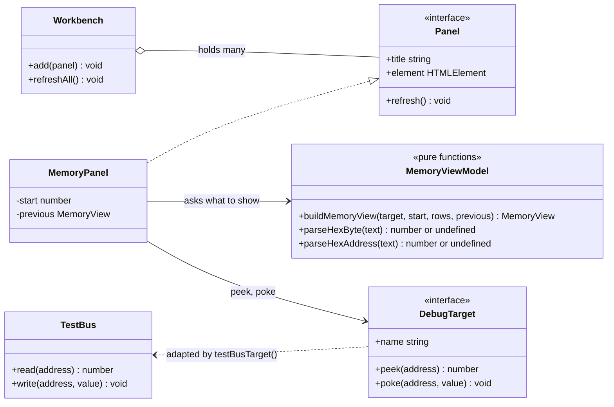
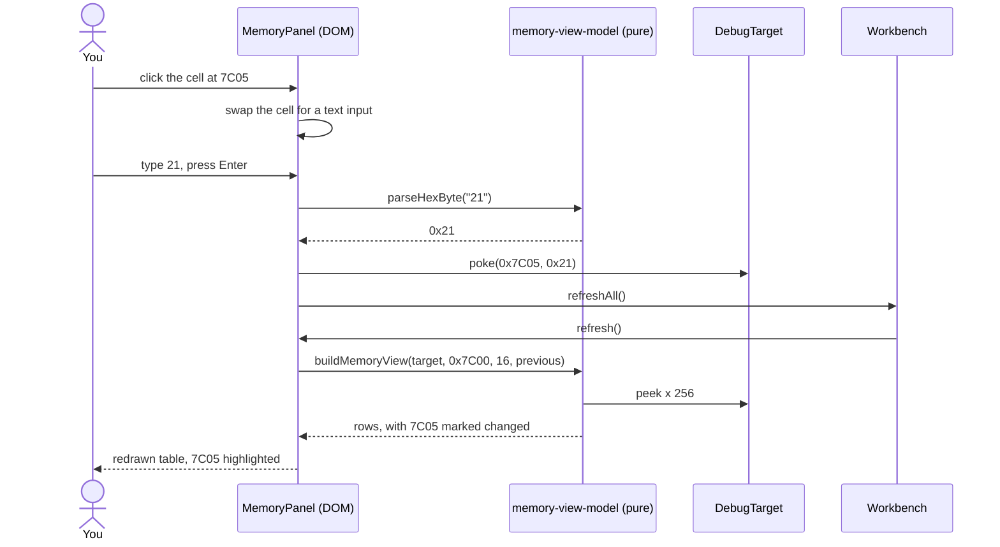

# Stage 03: Workbench shell

> **Part:** 1 (Foundations) · **Branch:** `stage/03-workbench` · **Needs:** 02
> **Status:** done

## Goal

Build the **workbench**: a page of live debug panels in the browser that let us look inside the emulator while it runs. This stage makes the frame (a tiny panel system in plain DOM) and the first panel, a **hex memory viewer** bound to the 64K `TestBus` from Stage 02. You can click any byte and type a new value.

It comes now, before the CPU, because every stage in Part 2 wants a panel of its own: registers in Stage 04, the addressing-mode explorer in Stage 05, disassembly in Stage 18. Building the shell once, with a clean boundary between "the emulator" and "the thing that shows the emulator", means each of those later panels is a small addition.

## What you can now see

```bash
npm run dev      # then open http://localhost:5173
```

Next to the (still black) screen canvas is the **workbench**. Its header says `Target: CPU playground (64K TestBus)`, and it has one panel, **Memory**, showing page `&7C00`:

```
Addr 0  1  2  3  4  5  6  7  8  9  A  B  C  D  E  F  ASCII
7C00 48 45 4C 4C 4F 2C 20 42 42 43 20 4D 49 43 52 4F  HELLO, BBC MICRO
7C10 00 00 00 00 00 00 00 00 00 00 00 00 00 00 00 00  ................
...
7CF0 00 00 00 00 00 00 00 00 00 00 00 00 00 00 00 00  ................
```

(On a narrow window, the workbench wraps below the canvas.) Things to try:

1. **Poke a byte.** Click `2C` at `&7C05` (the comma), type `21` and press Enter. The cell becomes `21` with a yellow highlight, the ASCII column reads `HELLO! BBC MICRO`, and the status line says `Poked &7C05 = &21`.
2. **Get it wrong.** Click a byte and type `123` or `G1`. You get an error, the input stays open, and memory is unchanged. Escape cancels.
3. **Navigate.** Type `&FF1D` in the address box and click **Go**. The page starts at row `FF10`. Click **Next ▶** and you're at `&0010`: the address space wraps.
4. **Poke from DevTools.** Open the console and run `workbench.poke(0x7c10, 0x41)`. The panel redraws with `41` highlighted at `&7C10` and an `A` in the text column. `workbench.peek(0x7c10)` returns `"&41"`.

Refresh the page to start over: the playground lives only in memory.

## The real hardware

There is no hardware in this stage. The workbench is the equivalent of the tools people used *around* a real BBC Micro to see inside it:

- **A machine-code monitor.** ROMs like Computer Concepts' *Exmon* or Watford's *BBC Monitor* printed memory as rows of hex and let you type over a byte. Our memory panel is the same idea.
- **BASIC's `?` operator.** On a real Model B, `?&7C00=&48` pokes `&48` into `&7C00` and `PRINT ~?&7C00` reads it back in hex (User Guide, "Indirection operators"). Clicking a byte in the panel is a graphical `?`.
- **A logic analyser.** Clipped onto the buses, it watches the machine *without disturbing it*. That "without disturbing it" is the hardest part to get right, and it's the reason for the `peek`/`poke` split below.

## Key concepts

### 1. The emulator core must not know the UI exists

The core (CPU, memory, devices) is DOM-free and deterministic (see `CLAUDE.md`). It runs the same in Jest, in a Node CLI demo and in the browser. The workbench lives entirely in `src/web/`, and the dependency arrow only ever points one way:

```
src/web/workbench  ──imports──▶  src/memory, src/util   (core)
src/memory         ──never──▶    src/web
```

Why be strict about this?

- **Testing.** Jest runs in Node, where there is no `document`. If `TestBus` touched the DOM, every CPU test would need a fake browser.
- **Swapping views.** The same core drives a CLI hexdump (Stage 02), a workbench panel (this stage) and, later, the real screen canvas.
- **Determinism.** The core's output depends only on its inputs. A UI that could reach in and change things mid-instruction would break that.

This stage adds an ESLint rule to enforce the split: `document` and `window` are errors outside `src/web/` and `src/main.ts`.

### 2. A panel is a view-model plus a renderer

Each panel has two halves:

| Half | Where | What it does | Tested by |
|---|---|---|---|
| **View-model** | `memory-view-model.ts` (pure functions, no DOM) | Decides *what* to show: which 16 rows, each cell's hex text, the ASCII column, which bytes changed since last time, and parsing what you typed | Jest |
| **Renderer** | `memory-panel.ts` (DOM) | Decides *how* to show it: builds the table, handles clicks and key presses | Playwright |

The view-model is where the logic lives, so it's where the bugs would live. Making it pure (inputs in, plain data out) means Jest can test it in milliseconds without a browser. The renderer is kept thin: it turns the view-model's data into elements and forwards events back.

### 3. `DebugTarget`: looking without touching

The panels don't talk to `TestBus` directly. They talk to a small interface:

```ts
interface DebugTarget {
  readonly name: string;
  peek(address: number): number;               // look, with no side effects
  poke(address: number, value: number): void;  // debugger write
}
```

Why not just use the `Bus` (`read`/`write`)? Because **on a real machine, reading can change things**. Stage 02 noted that reading the System VIA's Timer 1 counter at `&FE44` clears its interrupt flag (6522 datasheet, IFR bit 6). If the memory panel used `bus.read()` to draw page `&FE`, simply *looking* at SHEILA would clear interrupts and change what the program does next. That's the observer effect, and a debugger must avoid it.

So the debugger asks for `peek()`, which promises no side effects. For the flat `TestBus` there's no difference: all 64K is plain RAM, so `peek` is just `read`. When the real BBC memory map arrives (Stage 21), its `peek` will return a device register's current value without triggering the read side effect.

`poke()` is the debugger's write. For RAM it's the same as a CPU write. We keep it separate for symmetry, and because later a debugger might need to write where the CPU can't (for example, patching a ROM byte).

The same interface also lets the workbench swap what it's looking at. In Part 2 the target is a CPU playground (a 6502 on a `TestBus`). From Part 5 it is the whole `BbcModelB`. The panels won't change.

TypeScript's **structural typing** helps here: a core object satisfies `DebugTarget` if it simply *has* `name`, `peek` and `poke`, without importing anything from `src/web/`. The dependency arrow stays one-way.

### 4. Rows of 16, aligned

Memory viewers show 16 bytes per row, and each row starts at an address ending in `0` (`&7C00`, `&7C10`, …). Aligning makes the address of any byte easy to read off: row `&7C10`, column `&D` is `&7C1D`. The panel shows one **page** at a time, 16 rows × 16 bytes = 256 bytes (`&100`). On the 6502 a page is a natural unit: the high byte of the address picks the page, and the low byte picks the byte within it.

If you ask to go to `&7C1D`, the viewer shows the page with rows starting at `&7C10` (the address masked with `& &FFF0`), so the byte you asked for is on the first row.

Addresses wrap like the bus does. Going back a page from `&0000` gives `&FF00`, and the row after `&FFF0` is `&0000`. There's no 17th address line, so `&10000` doesn't exist (Stage 02).

### 5. Parsing what you type

When you click a byte and type, the text needs to become a number `&00`–`&FF`. The view-model accepts the notations you'll meet in BBC material:

| You type | Means | Why it's accepted |
|---|---|---|
| `48` | `&48` | The panel is all hex, so bare digits are hex |
| `&48` | `&48` | BBC BASIC and the Advanced User Guide |
| `$48` | `&48` | 6502 assembler convention (6502.org, most datasheets) |
| `0x48` | `&48` | JavaScript and C |

Anything else, such as `G1`, `&` on its own, or `123` (three digits, too big for a byte), is **rejected** rather than silently masked. Masking is right for the bus, because the hardware really does drop the extra bits. For a person typing, `123` is almost certainly a mistake, so the panel shows an error instead of quietly storing `&23`.

### 6. Highlighting what changed

When memory changes, the panel highlights the bytes whose values differ from the last time it drew. The view-model does this by comparing the new rows with the previous view. It only compares if both views start at the same address, since otherwise it would be comparing different bytes. This is cheap now and pays off in Part 2, when you step an instruction and want to see at a glance which byte `STA` wrote.

## Diagrams

How the pieces relate. Everything in the `web` box can touch the DOM; nothing outside it can:



What happens when you click a byte and type a new value:



If the text doesn't parse (`parseHexByte` returns `undefined`), the panel doesn't call `poke`. It shows the error and leaves the input open for you to fix.

## Our design

**Files** (all new unless noted):

| File | DOM? | Role |
|---|---|---|
| `src/web/workbench/debug-target.ts` | no | The `DebugTarget` interface, and `testBusTarget(bus)` to adapt a `TestBus` |
| `src/web/workbench/memory-view-model.ts` | no | Pure: `buildMemoryView`, `rowStart`, `stepPage`, `parseHexByte`, `parseHexAddress` |
| `src/web/workbench/panel.ts` | yes | The `Panel` interface and the `Workbench` that lays panels out and refreshes them |
| `src/web/workbench/memory-panel.ts` | yes | `createMemoryPanel(target, ...)`: the table, click-to-edit and page navigation |
| `src/main.ts` (changed) | yes | Creates the playground `TestBus`, preloads a message, mounts the workbench |
| `src/util/hexdump.ts` (changed) | no | Exports `toAscii` so the panel's ASCII column matches the CLI hexdump |
| `index.html` (changed) | — | Adds `#workbench` beside `#screen`, plus the styles (light and dark) |
| `eslint.config.js` (changed) | — | Makes browser globals an error outside `src/web/` and `src/main.ts` |
| `e2e/workbench.spec.ts` | — | Durable browser checks for the panel |

The two DOM-free files live under `src/web/` because they belong to the workbench. They're DOM-free so Jest can test them, which is allowed: the rule is that DOM code must be *inside* `src/web/`, not that everything inside must use the DOM.

**The view-model's data:**

```ts
interface MemoryCell {
  readonly address: number;  // 0x7c05
  readonly value: number;    // 0x21
  readonly hex: string;      // "21"
  readonly changed: boolean; // differs from the previous view
}
interface MemoryRow {
  readonly address: number;  // 0x7c00
  readonly label: string;    // "7C00"
  readonly cells: readonly MemoryCell[];
  readonly ascii: string;    // "HELLO, BBC MICRO"
}
interface MemoryView {
  readonly start: number;
  readonly rows: readonly MemoryRow[];
}
```

**Decisions:**

- **Plain DOM, no framework.** The plan says so, and it keeps the project dependency-free. It's also instructive: `refresh()` rebuilds the table's cells. For 256 cells that is instant, so we don't need a virtual DOM or diffing library.
- **Explicit refresh, not polling.** Panels redraw when something tells the workbench to `refreshAll()`: after a poke now, after each Step in Stage 04, and once per frame in Stage 30. There's nothing running yet, so a timer would just redraw the same bytes.
- **Allocation is fine here.** The workbench builds strings and objects freely. It's not the hot path: it runs once per user action or once per frame, never once per instruction.
- **A `window.workbench` handle for the console** (`poke`, `peek`, `refresh`). This makes the "watch the dump update" outcome easy to show: poke from DevTools and the panel updates. It's set in `src/main.ts`, which is browser code.

## Code walkthrough

**[`src/web/workbench/debug-target.ts`](../../src/web/workbench/debug-target.ts)** is the interface and one adapter. `testBusTarget(bus)` returns a plain object whose `peek` calls `bus.read`. That's only valid because every `TestBus` address is RAM, and the comment says so, so Stage 21 knows it has to do better.

**[`src/web/workbench/memory-view-model.ts`](../../src/web/workbench/memory-view-model.ts)** carries the ideas:

- `rowStart(a)` is `a & 0xfff0`: clear the low nibble to get to the start of the row.
- `stepPage(start, n)` is `(start + n * 0x100) & 0xffff`. The mask gives the wrap for free: `0x0000 - 0x100 = -256`, and `-256 & 0xffff = 0xff00`.
- `buildMemoryView` loops rows × 16, calling `target.peek` exactly once per byte. It only compares against `previous` if `previous.start` is the same aligned address. Otherwise, cell *i* of the old view would be a different address from cell *i* of the new one.
- `parseHex` uses one regex, `^(?:&|\$|0x)?([0-9a-f]+)$`, and then a range check (`value < 16 ** maxDigits`). Leading zeros are fine (`0048`), but `123` in a byte field is rejected, not masked.

**[`src/web/workbench/panel.ts`](../../src/web/workbench/panel.ts)**: `createWorkbench` wraps each panel's element in a `<section aria-label="…">` with an `<h2>`. The `aria-label` turns the section into an accessible *region*, which is also how Playwright finds it (`getByRole('region', { name: 'Memory' })`). The workbench knows nothing about memory.

**[`src/web/workbench/memory-panel.ts`](../../src/web/workbench/memory-panel.ts)** is the DOM half:

- `refresh()` asks the view-model for 16 rows and rebuilds `<tbody>`. Each byte cell carries `data-address="7C05"`, so a click knows which address it is.
- **Event delegation:** there's one `click` listener on `<tbody>`, not 256 listeners on cells. Because `refresh()` replaces the cells every time, per-cell listeners would have to be re-attached on every redraw.
- **Editing:** `beginEdit` swaps the cell's text for an `<input>`. Enter parses the text and, only if it's valid, calls `target.poke` then `onPoke()`. Escape and blur (clicking away) cancel. The `done` flag matters: redrawing removes the input from the page, which fires `blur`, and without the flag that would trigger a second redraw.
- The panel calls `onPoke` rather than `refresh()` directly. A poke can change what *other* panels show (in Stage 04 a poke into the code under PC changes the disassembly), so the workbench refreshes everything.

**[`src/main.ts`](../../src/main.ts)** builds the playground: a `TestBus` with `HELLO, BBC MICRO` at `&7C00`, a workbench and a memory panel. It also sets `window.workbench` for the console, via `Object.assign(window, …)` so no cast is needed.

**[`eslint.config.js`](../../eslint.config.js)** gained a `no-restricted-globals` block. `document`, `window`, `navigator`, `requestAnimationFrame` and `HTMLElement` are errors in `src/**` and `scripts/**`, except in `src/web/**` and `src/main.ts`. It was needed because `tsconfig.json` includes the DOM library (the web layer needs it), so `tsc` alone would happily let the CPU use `document`. It was tested with a throwaway `src/util/lint-probe.ts` containing `document`, which ESLint rejected, and then deleted.

**[`src/util/hexdump.ts`](../../src/util/hexdump.ts)**: `toAscii` is now exported, so the panel and the CLI agree on what's printable.

## Tests

| Test file | What it proves |
|---|---|
| `src/web/workbench/memory-view-model.test.ts` | `peek`/`poke` see the same bytes as the bus and mask to 16/8 bits. Rows align to 16 and pages step by `&100`, both wrapping at `&FFFF`. Cells have the right address, value and hex text. The ASCII column shows `.` for non-printables. Only bytes that really changed are marked, and nothing is marked if the view moved. The view-model reads **only through `peek`**, once per byte (checked with a spy target at `&FE40`). The parsers accept `48`/`&48`/`$48`/`0x48` and reject `123`, `&100`, `G1`, `&` and `''`. 39 tests. |
| `e2e/workbench.spec.ts` | In a real browser: the panel shows 16 rows from `7C00` to `7CF0` with the message. Click, type and Enter pokes the byte and highlights only that cell. Invalid input shows an error and leaves memory unchanged. **Go** aligns to the row and **Next** wraps from `&FF10` to `&0010`. A console `workbench.poke` updates the panel. |

No test needs ROMs or fixtures.

## Gotchas & hardware quirks

- **Reading isn't free on real hardware.** The panel's `peek` is plain `bus.read` *only* for the TestBus. Pointing the memory panel at SHEILA (`&FE00`–`&FEFF`) through `read()` would clear VIA interrupt flags just by looking. Stage 21 must give the memory map a genuine side-effect-free `peek`. (This resolves the Stage 02 parking-lot note on the workbench side. The core side is still open.)
- **Masking vs rejecting.** The bus masks (`&148` → `&48`) because that's what wires do. The UI rejects, because a person typing `148` made a mistake. The same number gets different treatment at different boundaries.
- **Highlights last one redraw.** "Changed" means "changed since the last redraw", so the highlight clears on the next refresh, including cancelling an edit. That's what you want when stepping a CPU. It isn't a history of all edits.
- **The whole table is rebuilt on every refresh.** That's fine for 256 cells on a click. Once refresh runs every frame (Stage 30, 50 times a second), we may want to update only the cells' text. We'll measure first.
- **The whole 64K is RAM.** On the playground you can poke `&C000` or `&FFFC`, which you couldn't do on a real Model B (ROM there). That's deliberate for Part 2: we'll poke reset vectors and test programs anywhere.

## Playwright verification

- **MCP (interactive):** opened `http://localhost:5173`, clicked the cell at `&7C05`, typed `&21` and pressed Enter, then took a screenshot of `#workbench`. It showed `21` highlighted at `&7C05`, `HELLO! BBC MICRO` in the ASCII column and `Poked &7C05 = &21` in the status line. The only console error was a `favicon.ico` 404, now silenced with `<link rel="icon" href="data:,">`.
- **Durable:** added `e2e/workbench.spec.ts` (5 tests, listed above). `npm run test:e2e` gives 6/6 passing, including the Stage 00 smoke test.

## Check your understanding

1. Why does the memory panel call `peek()` instead of `bus.read()`, when on the TestBus they return exactly the same thing?
2. The view-model lives in `src/web/` but must not use the DOM. Why put it there, and why keep it DOM-free?
3. You're viewing page `&0000` and click **◀ Prev**. What page do you see, and which single operation in `stepPage` makes that happen?
4. You type `1FF` into a byte cell. The bus would store `&FF` if the CPU wrote `&1FF`. Why does the panel refuse instead?
5. After poking `&7C05`, you click **Go** with `&7B00`, then **Go** with `&7C00` again. Is `&7C05` still highlighted? Why?

<details>
<summary>Answers</summary>

1. Because `peek` is a *promise* of no side effects, and the panel must keep working when the target changes. On the real memory map, `read(0xfe44)` clears the System VIA's T1 interrupt flag, so a debugger using `read` would alter the program it's watching. Coding against `peek` now means the panel won't have to change in Stage 21.
2. It belongs to the workbench (it's about *showing* memory), so it lives with the workbench. It's DOM-free so Jest can test it in Node without a browser. This is where the logic, and therefore the bugs, is.
3. Page `&FF00`. `(0x0000 - 0x100) & 0xffff`: the mask to 16 bits, just like the missing 17th address line.
4. At the bus, masking models real wires dropping the high bits. At the keyboard, `1FF` almost certainly means you made a typo, and silently storing `&FF` would hide it. Rejecting shows you the mistake.
5. No. The view at `&7B00` became `previous`. When you go back to `&7C00`, the starts differ, so nothing is compared or marked. Also, "changed" only ever means "since the last redraw".

</details>

## Further reading

- *BBC Microcomputer User Guide*, "Indirection operators" (`?`, `!`, `$`): the BASIC way to peek and poke.
- *Advanced User Guide*, the memory map chapter: why `&7C00` is Mode 7 screen memory, and why `&FE00`–`&FEFF` is I/O.
- MOS Technology / Rockwell 6522 VIA datasheet, the interrupt flag register: which reads clear flags. This is the reason `peek` exists.
- MDN, "Event delegation" and the ARIA `region` role: the two DOM techniques the panel relies on.
