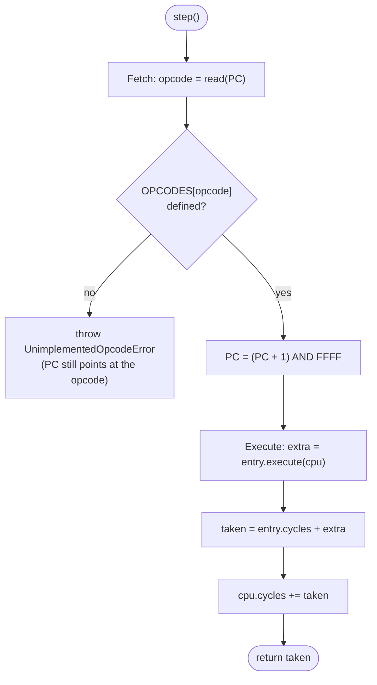
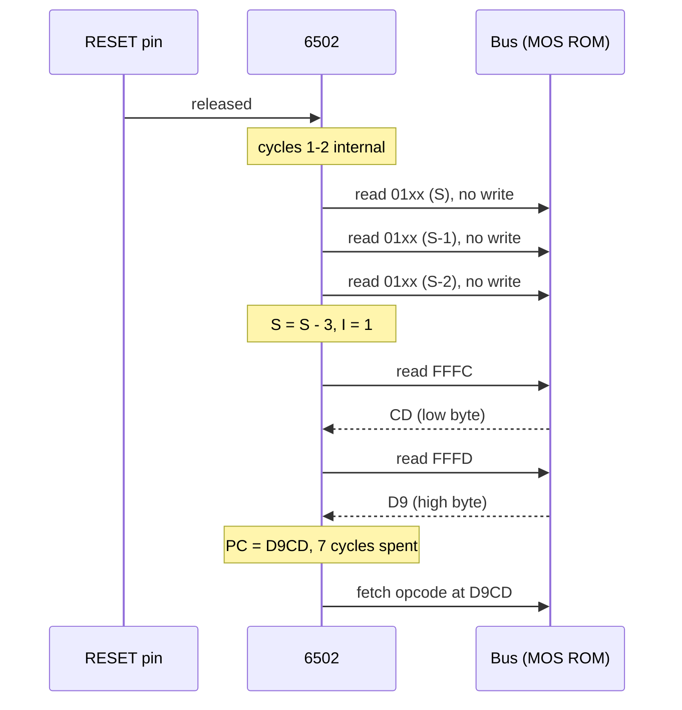
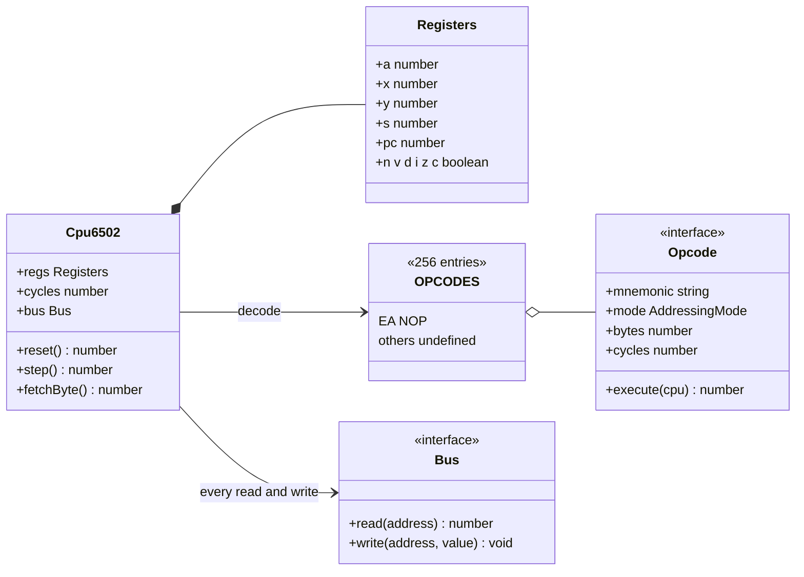

# Stage 04: CPU skeleton

> **Part:** 2 (The 6502 CPU) · **Branch:** `stage/04-cpu-skeleton` · **Needs:** 03
> **Status:** done

## Goal

Give the emulator a **6502 CPU**, but only its skeleton: the six registers, the status flags, the reset sequence, and the **fetch → decode → execute** loop driven by a 256-entry opcode table. The table holds exactly one instruction, **NOP** (`&EA`). Every other opcode stops with a clear error that tells you which byte, at which address, isn't implemented yet.

This comes first in Part 2 because every later CPU stage (loads, stores, arithmetic, branches and so on) is just "add rows to the table". Getting the loop, the table shape and the cycle accounting right now means Stages 05–17 each add instructions without touching the machinery.

## What you can now see

```bash
npm run dev      # then open http://localhost:5173
```

The workbench now has two panels. The new **Registers** panel is on top:

```
A   &00    0 / 0
X   &00    0 / 0
Y   &00    0 / 0
S   &FD    next push → &01FD
PC  &0400
P   &24    %00100100
[N] [V] [-] [B] [D] [I] [Z] [C]      ← I and bit 5 lit; "-" and B dashed (not stored)
Next: &0400: &EA NOP
Cycles: 7 cycles = 3.5 µs at 2 MHz
[Step] [Step ×16] [Reset]
```

Below it, the **Memory** panel now opens on page `&0400`: 256 bytes of `EA`, with the byte at PC outlined in red.

What you're looking at: the page already ran the **reset sequence**. The reset vector at `&FFFC`/`&FFFD` holds `00 04`, so PC = `&0400`. S went from `&00` to `&FD`, I is set, and 7 cycles have passed.

Things to try:

1. **Step.** Click **Step**. PC becomes `&0401` (highlighted yellow as changed), the red outline in the memory panel moves one byte right, and Cycles says `9 cycles = 4.5 µs`. Each NOP is 1 byte and 2 cycles.
2. **Walk the page.** Click **Step ×16** repeatedly. After 256 NOPs PC reaches `&0500`, where memory is `&00` (BRK, Stage 17). The 16th click runs the last NOPs (`Ran 16 (32 cycles)`), and the 17th says `unimplemented opcode &00 at &0500` in red, PC stays on `&0500`, and Cycles reads `519` (7 + 256 × 2).
3. **Reset.** Click **Reset**. PC goes back to `&0400`, and S drops by 3 again, to `&FA`. Reset really does move S down, even though it writes nothing.
4. **Plant a future instruction.** Click the byte at `&0402` in the memory panel and type `A9`. Step until PC reaches it: "Next" shows `&0402: &A9 (not implemented yet)` and **Step** reports `unimplemented opcode &A9 at &0402`. That's `LDA #`, and it arrives in Stage 06.
5. **From DevTools:** `workbench.step()` returns `2`, and `workbench.cpu.regs` shows the live registers.

## The real hardware

The **MOS 6502** is an 8-bit CPU with a 16-bit address bus. The BBC Model B runs it at **2 MHz**: 2,000,000 clock cycles a second, each cycle being one bus read or one bus write (Stage 02). Everything the CPU "knows" is held in six registers inside the chip (MCS6500 Microcomputer Family Programming Manual, §1 and Appendix A):

| Register | Width | Name | What it's for |
|---|---|---|---|
| **A** | 8 bits | Accumulator | The one register arithmetic and logic work on (`ADC`, `AND`, …) |
| **X** | 8 bits | Index X | Counters and offsets (`LDA &2000,X`), and the only way to set S (`TXS`) |
| **Y** | 8 bits | Index Y | Counters and offsets, especially `(zp),Y` pointers |
| **S** | 8 bits | Stack pointer | The low byte of the next free stack slot. The high byte is always `&01`, so the stack is page 1 (`&0100`–`&01FF`) |
| **PC** | 16 bits | Program counter | The address of the next byte to fetch |
| **P** | 8 bits | Processor status | Seven flag bits (really six, see below) |

The status register, bit by bit:

| Bit | 7 | 6 | 5 | 4 | 3 | 2 | 1 | 0 |
|---|---|---|---|---|---|---|---|---|
| Flag | **N** | **V** | – | **B** | **D** | **I** | **Z** | **C** |
| Mask | `&80` | `&40` | `&20` | `&10` | `&08` | `&04` | `&02` | `&01` |
| Meaning | Negative: bit 7 of the last result | oVerflow: signed overflow | unused | Break | Decimal mode | IRQ disable | Zero: last result was `&00` | Carry |

- **N** and **Z** describe the last value loaded or computed. `LDA #&80` sets N (bit 7 is 1) and clears Z. `LDA #&00` sets Z and clears N. (Stage 06.)
- **C** is the carry out of bit 7 in additions and shifts, and "no borrow" in subtractions. (Stages 10, 13.)
- **V** is signed overflow: `&7F + &01 = &80` is "127 + 1 = −128", which is wrong in signed arithmetic, so V is set. (Stage 10.)
- **D** switches `ADC`/`SBC` into binary-coded decimal. (Stage 11.)
- **I** masks the IRQ interrupt input. When I is 1, IRQs wait. (Stage 17.)
- **B** and **bit 5** are the odd ones out: **there is no flip-flop for either inside the chip.** They only exist in the *copy* of P that is pushed onto the stack. Bit 5 is always pushed as 1. B is pushed as 1 by `PHP` and `BRK` and as 0 by an IRQ or NMI, which is how an interrupt handler tells a `BRK` from a hardware interrupt. (Stages 15 and 17. The best evidence is the transistor-level Visual6502 model: there is simply no latch for them.)

### The reset sequence

When the RESET pin is released, the 6502 runs a fixed **7-cycle** sequence (6502.org, "Reset"; confirmed by Visual6502 traces):

1. Two cycles of internal housekeeping.
2. Three cycles that look like pushes of PC and P, but with the R/W line held *high*, so they are **reads** of `&0100+S`, `&0100+S−1`, `&0100+S−2`. Nothing is written, but **S still goes down by 3**. That's why, if S happened to be `&00` at power-on, it's `&FD` after reset.
3. It sets **I = 1**, so no IRQ can arrive before the OS is ready for it.
4. Two reads of the **reset vector**: the low byte at `&FFFC`, then the high byte at `&FFFD`. These become PC.

It does **not** clear D on the NMOS 6502 (the later CMOS 65C02 does). A, X and Y are left as they were, which at power-on means "whatever the transistors settled to".

On a Model B, the vector lives in the MOS ROM: bytes `CD D9` at `&FFFC`, so PC = `&D9CD` (we dumped those bytes in Stage 02). The MOS's reset code knows the CPU gives it very little. Within its first few instructions it does `SEI`, `CLD` (because D might be 1!) and `LDX #&FF : TXS` to put the stack at the top of page 1. We'll watch that happen in the Stage 23 trace.

The other two vectors, `&FFFA` (NMI) and `&FFFE` (IRQ/BRK), wait until Stage 17.

### Fetch, decode, execute

Once running, the 6502 does the same thing forever:

1. **Fetch:** read the byte at PC (the **opcode**) and add 1 to PC.
2. **Decode:** work out what that byte means: which operation, which addressing mode, how many operand bytes follow.
3. **Execute:** read any operand bytes (adding to PC each time), do the operation, update registers and flags, and read or write memory.

Then the next fetch starts from wherever PC now points. There's no separate "list of instructions" in the machine: the CPU just trusts that PC points at an opcode. If it points at data, the data gets executed.

Every instruction takes a fixed number of cycles, sometimes plus one or two (for page crossings and taken branches, from Stage 05 on). **NOP** (`&EA`, "no operation") is the simplest: 1 byte, **2 cycles**. Cycle 1 fetches `&EA`. Cycle 2 reads the next byte and throws it away, because the 6502 always reads *something* on every cycle, and doesn't increment PC for it (MCS6500 manual, Appendix A: NOP, implied, 1 byte, 2 cycles).

## Key concepts

### 1. Registers are just numbers, but they must be masked

In the chip, A is 8 wires. In JavaScript, `cpu.a` is a 64-bit float. If an instruction does `a = a + 1` on `&FF`, the chip gives `&00` and JavaScript gives `256`. So every register write in the CPU will be masked: `& 0xff` for A, X, Y and S, and `& 0xffff` for PC (Stage 01). This stage's NOP only changes PC, and `(pc + 1) & 0xffff` is what makes `&FFFF` + 1 wrap to `&0000`, just as the real 16-bit program counter does.

### 2. Storing flags: six booleans, not one byte

There are two sensible ways to keep P in an emulator:

| | One byte `p` | Six booleans `n v d i z c` |
|---|---|---|
| Setting Z after a load | `p = (p & ~0x02) \| (v === 0 ? 0x02 : 0)` | `z = v === 0` |
| Reading C in `ADC` | `(p & 0x01)` | `c ? 1 : 0` |
| `PHP`, `BRK`, IRQ (push P) | push `p` | **pack** into a byte |
| `PLP`, `RTI` (pull P) | `p = pulled` | **unpack** from a byte |

Almost every instruction sets N and Z, and several read C, so they happen constantly. Pushing and pulling P happens rarely. So we keep **six booleans** and convert only at the stack. As a bonus, this makes the B/bit-5 truth visible in the types: there is nowhere to store them, because the chip doesn't store them either.

The two conversions live in `flags.ts`:

- `packP(flags, b)` builds the byte: each flag in its bit, **bit 5 always 1**, and **B from the argument** (the caller knows whether this is `PHP`/`BRK` or an interrupt).
- `unpackP(flags, byte)` does the reverse and **ignores bits 4 and 5**, because there's nothing to put them in.

A worked example. After reset: N=0 V=0 D=0 I=1 Z=0 C=0.

```
packP(flags, b = false)
  N V - B D I Z C
  0 0 1 0 0 1 0 0   = &24     (bit 5 forced on, I set)
packP(flags, b = true)
  0 0 1 1 0 1 0 0   = &34     (what PHP would push)
unpackP(flags, &FF)
  N=1 V=1 D=1 I=1 Z=1 C=1     (bits 5 and 4 are dropped on the floor)
```

The round trip is: for every byte `p`, `packP(unpackP(p), false) === (p & &CF) | &20`. That is, bits 4 and 5 are lost and bit 5 comes back as 1, and everything else survives. The tests check all 256 values.

### 3. The opcode table: 256 slots

An opcode is one byte, so there are exactly **256** possible opcodes. The 6502 documents **151** of them (56 instructions in various addressing modes). The other 105 do odd, undocumented things, and a dozen of them lock the CPU up completely (`&02` is one). Undocumented opcodes are an optional extra in Part 12.

The real chip decodes with a **PLA**, a grid of about 130 pattern-matching lines that look at bit patterns in the opcode (the `aaabbbcc` layout on 6502.org). In software, the simplest and fastest decoder is a **lookup table**: an array of 256 entries indexed by the opcode byte. Each entry says:

| Field | NOP's value | Why we store it |
|---|---|---|
| `mnemonic` | `'NOP'` | Error messages now, the disassembler in Stage 18 |
| `mode` | `'implied'` | Which addressing mode (Stage 05 adds the other 12) |
| `bytes` | `1` | Instruction length, for the disassembler and assembler |
| `cycles` | `2` | The base cycle cost |
| `execute` | a function | The work. It returns **extra** cycles (0 for NOP; page crossings later) |

A slot with no entry (`undefined`) means "not implemented yet". Hitting one is not a crash, it's information: the CPU throws an `UnimplementedOpcodeError` naming the byte and address (for example `unimplemented opcode &A9 at &0400`), and **leaves PC pointing at the offending opcode** so the workbench shows exactly where it stopped. In Stage 06, that error is how you'll know `LDA #` is needed; by Stage 17 no documented opcode will ever raise it.

### 4. `step()` returns cycles

The CPU executes one whole instruction per `step()`, adds its cost to a running `cycles` total, and **returns** the cost. This is the instruction-stepped timing model from BUILD-PLAN §3: from Stage 27 the machine will call `cpu.step()`, get back (say) 2, and tick every device by 2 cycles. At 2 MHz, 2 cycles is 1 µs. The running total lets us say how much emulated time has passed: 40,000 cycles is one 50 Hz frame.

`step()` is the **hot path**: it will run about a million times a second of emulated time. So it allocates nothing: no objects, arrays or closures are created per instruction. The opcode table and its `execute` functions are created once, at module load.

### 5. Reset is also a "step"

`reset()` does the 7-cycle sequence above: S goes down by 3 (with no writes), I is set, PC is loaded from `&FFFC`/`&FFFD`, and 7 cycles are added to the total. It reads the vector *through the bus*, the same as any other CPU read, so on the real memory map (Stage 21) it will read the MOS ROM.

We don't model the three dummy stack reads or the dummy read in NOP's second cycle. In the instruction-stepped model, reads that don't affect the result are skipped (see the Stage 02 parking-lot note). Reading RAM has no side effects, so nothing on the Model B can tell.

## Diagrams

The fetch → decode → execute loop, as `step()` implements it:



The reset sequence on a Model B, over time:



How the pieces relate in code:



## Our design

**Files:**

| File | DOM? | Role |
|---|---|---|
| `src/cpu/registers.ts` | no | The `Registers` interface and `createRegisters()` (power-on state) |
| `src/cpu/flags.ts` | no | P bit masks named after the datasheet, `packP`, `unpackP` |
| `src/cpu/opcodes.ts` | no | The `Opcode` interface and the 256-entry `OPCODES` table (NOP only) |
| `src/cpu/cpu6502.ts` | no | `Cpu6502`: `reset()`, `step()`, `fetchByte()`, the `cycles` total, `UnimplementedOpcodeError` |
| `src/web/workbench/registers-view-model.ts` | no | Pure: what the registers panel shows (hex, flag lights, what changed) |
| `src/web/workbench/registers-panel.ts` | yes | The registers and flags panel, with **Step**, **Step ×16** and **Reset** |
| `src/web/workbench/debug-target.ts` (changed) | no | Adds `CpuTarget`: a `DebugTarget` that also has registers, cycles, `step` and `reset` |
| `src/web/workbench/memory-view-model.ts` (changed) | no | Cells gain `isPc`, so the memory panel can outline the byte at PC |
| `src/web/workbench/memory-panel.ts` (changed) | yes | Optional `pc` option; draws the `.pc` outline |
| `src/web/workbench/dom.ts` | yes | The shared `button()` helper, moved out of the memory panel now that two panels use it |
| `src/main.ts` (changed) | yes | The playground now has a CPU, a page of NOPs at `&0400` and a reset vector pointing at it |

**The core types:**

```ts
// flags.ts: masks from the MCS6500 manual's P register diagram
export const P_C = 0x01, P_Z = 0x02, P_I = 0x04, P_D = 0x08,
             P_B = 0x10, P_UNUSED = 0x20, P_V = 0x40, P_N = 0x80;

export interface StatusFlags { n: boolean; v: boolean; d: boolean; i: boolean; z: boolean; c: boolean }
export function packP(flags: Readonly<StatusFlags>, b: boolean): number;
export function unpackP(flags: StatusFlags, p: number): void;   // writes into flags, no allocation

// registers.ts
export interface Registers extends StatusFlags { a: number; x: number; y: number; s: number; pc: number }

// opcodes.ts
export type AddressingMode = 'implied';            // Stage 05 adds the other 12
export interface Opcode {
  readonly mnemonic: string;
  readonly mode: AddressingMode;
  readonly bytes: number;
  readonly cycles: number;
  readonly execute: (cpu: Cpu6502) => number;       // returns EXTRA cycles
}
export const OPCODES: readonly (Opcode | undefined)[];  // length 256

// cpu6502.ts
export class Cpu6502 {
  readonly regs: Registers;
  cycles: number;
  constructor(readonly bus: Bus);
  reset(): number;     // 7
  step(): number;      // cycles for this instruction
  fetchByte(): number; // read(PC), PC += 1: for operand fetches from Stage 05
}
```

**Decisions:**

- **A class for the CPU, plain data for the registers.** `Cpu6502` owns its registers, its bus and its cycle count, and nothing is global, so two CPUs in one test never interfere. The registers are a plain mutable object so a panel can read them and a test can set them up in one line.
- **`execute` returns extra cycles, the table holds the base.** The base cost is fixed per opcode and belongs in the table, where the disassembler and tests can see it. Only the variable part (page crossings, taken branches) depends on what happened at run time.
- **Throw on unimplemented, and don't move PC.** Silently treating unknown opcodes as NOPs would let a program "run" through garbage and fail far away from the real problem. A loud, precise error is the most useful thing a half-built CPU can do.
- **`AddressingMode` starts with one member.** Stage 05 defines all 13. Listing them now would be building ahead.
- **The panel binds to `CpuTarget`, not to `Cpu6502` directly.** In Part 5 the same panel will look at the CPU inside `BbcModelB`, and `step()` there will also tick the devices. The panel doesn't need to know.
- **Reset doesn't zero the cycle counter.** On real hardware time keeps flowing through a reset (the BREAK key resets the CPU while the video keeps running), so `cycles` is "emulated time since power-on".

## Code walkthrough

**[`src/cpu/flags.ts`](../../src/cpu/flags.ts)** holds eight masks named after the datasheet (`P_N = 0x80` … `P_C = 0x01`) and two functions:

- `packP` ORs together one mask per true flag, always ORs in `P_UNUSED`, and ORs in `P_B` only if the caller says so.
- `unpackP` tests each real bit with `(byte & mask) !== 0` and writes the answer into the flags object it's given. It never looks at `P_B` or `P_UNUSED`. Writing into an existing object, instead of returning a new one, keeps it allocation-free for `PLP` and `RTI` later.

**[`src/cpu/registers.ts`](../../src/cpu/registers.ts)**: `Registers` *extends* `StatusFlags`, so `cpu.regs.z` is a flag and `cpu.regs.a` is the accumulator, all on one plain object. `packP(cpu.regs, false)` works directly, because a `Registers` *is* a `StatusFlags`.

**[`src/cpu/opcodes.ts`](../../src/cpu/opcodes.ts)**: `buildTable()` makes an array of 256 `undefined`s and fills slot `0xea`. It runs once when the module loads. `OPCODES` is typed `readonly (Opcode | undefined)[]`, so TypeScript forces `step()` to handle the empty slot. The type only imports `Cpu6502` (`import type`), so there's no runtime circular import between the table and the CPU.

**[`src/cpu/cpu6502.ts`](../../src/cpu/cpu6502.ts)**: the whole loop is six lines.

```ts
step(): number {
  const r = this.regs;
  const opcode = this.bus.read(r.pc);                 // fetch
  const entry = OPCODES[opcode];                      // decode
  if (entry === undefined) throw new UnimplementedOpcodeError(opcode, r.pc);
  r.pc = (r.pc + 1) & 0xffff;
  const taken = entry.cycles + entry.execute(this);   // execute
  this.cycles += taken;
  return taken;
}
```

The check comes *before* PC moves, which is why a failed step leaves PC on the bad opcode and the cycle count untouched. `reset()` is `s = (s - 3) & 0xff`, `i = true`, then `pc = word(read(0xfffc), read(0xfffd))`, using `word()` from Stage 01 to put the low byte first. `fetchByte()` is the same read-then-advance used by the fetch, ready for Stage 05's operands.

**[`src/web/workbench/debug-target.ts`](../../src/web/workbench/debug-target.ts)**: `CpuTarget` adds `registers`, `cycles`, `step()` and `reset()` to `DebugTarget`. `playgroundTarget` spreads in the Stage 03 `testBusTarget` for `peek`/`poke` and uses a getter for `cycles`, because a plain property would capture the number once and never update.

**[`src/web/workbench/registers-view-model.ts`](../../src/web/workbench/registers-view-model.ts)**:

- `buildRegistersView` builds the P value with `packP(r, false)` (the IRQ view: bit 5 on, B off) and walks `FLAG_BITS` from bit 7 to bit 0 to make the lights. B and `-` are marked `stored: false`, and the panel draws them dashed.
- The "Next" line peeks the byte at PC and looks it up in `OPCODES`. It uses the same table the CPU uses, so the panel can tell you an opcode will fail *before* you press Step.
- `stepMany` turns an `UnimplementedOpcodeError` into a message and rethrows anything else. Any other exception would be a real bug and shouldn't be hidden as a status line.

**[`src/web/workbench/registers-panel.ts`](../../src/web/workbench/registers-panel.ts)** is the DOM half, built the same way as the memory panel. After any Step or Reset it calls `onRun()`, which refreshes *every* panel. That's how the memory panel's PC outline moves.

**[`src/main.ts`](../../src/main.ts)** loads 256 NOPs at `&0400`, writes `&00 &04` to `&FFFC`, creates the CPU and calls `reset()`.

## Tests

| Test file | What it proves |
|---|---|
| `src/cpu/flags.test.ts` | The masks match N V - B D I Z C. `packP` always sets bit 5, sets B only on request, and puts each flag in its own bit. After reset it gives `&24`. `unpackP` sets all six from `&FF`, clears all six from `&30` (B and bit 5 go nowhere) and masks its input. **All 256 bytes** round-trip: `packP(unpackP(p)) === (p & &CF) \| &20`. 14 tests. |
| `src/cpu/cpu6502.test.ts` | Power-on state. Reset loads PC from `&FFFC`/`&FFFD` (`&D9CD` for MOS 1.20's bytes), sets I, takes S from `&00` to `&FD` and wraps it (`&01` → `&FE`), writes nothing in page 1, leaves A/X/Y/D alone, and costs 7 cycles. NOP advances PC by 1, costs 2 cycles and changes nothing else. It also walks a page and wraps PC at `&FFFF`. The table has 256 slots and only `&EA` is filled. Unimplemented opcodes throw with the opcode and address and leave PC and cycles unchanged. `fetchByte` wraps. Two CPUs share no state. 19 tests. |
| `src/web/workbench/registers-view-model.test.ts` | `playgroundTarget` exposes live registers and cycles. Register hex and detail text, flag lights and their `stored` marking, the "Next" line for implemented and unimplemented opcodes, change marking, `formatCycles`, and `stepMany` stopping cleanly at an unimplemented opcode. 11 tests. |
| `src/web/workbench/memory-view-model.test.ts` (changed) | A new test: exactly the cell at PC is marked `isPc`. 40 tests. |
| `e2e/cpu.spec.ts` | In a browser: the state after reset, Step (PC, cycles, the changed highlight and the memory outline), stepping off the page into the BRK error at `&0500` with 519 cycles, and Reset taking S to `&FA`. |
| `e2e/workbench.spec.ts` (changed) | Now goes to `&7C00` first, since the panel opens on `&0400`. The status locator is scoped to the Memory panel, because there are now two status lines. |

No test needs ROMs or fixtures. Totals: 134 Jest tests, 10 Playwright tests.

## Gotchas & hardware quirks

- **B is not a flag.** It's tempting to give the CPU a `b` register bit, and many emulators do. But then `PLP` would load it, `PHP` would push whatever was loaded, and an IRQ handler checking the pushed B would be fooled. With no field to store it in, that bug can't happen.
- **Reset doesn't write, but it does move S.** The three "pushes" are reads. If you model them as writes, you'll corrupt page 1 on BREAK, which matters because a BASIC program survives a soft BREAK (Stage 36).
- **Reset doesn't clear D.** The MOS's early `CLD` is there for a reason. The 65C02 fixed this, but the Model B has an NMOS 6502.
- **The power-on values are our choice.** A real 6502's A, X, Y and S are unpredictable at power-on. We use 0 so that tests are deterministic. The MOS sets everything it cares about.
- **Not modelled yet:** the dummy read in NOP's second cycle and the three dummy stack reads during reset. Reading RAM has no side effects, so nothing on the Model B can tell. This is the same cycle-accuracy trade-off already in the parking lot.
- **PC wraps.** `&FFFF` + 1 is `&0000`. On a BBC this never happens in practice, because `&FFxx` is the MOS and vectors, but the mask costs nothing and keeps the emulator honest.
- **`cycles` is a float.** At 2 MHz, JavaScript's exact-integer limit (2^53) is reached after about 142 years of emulated time. That's fine.

## Playwright verification

- **MCP (interactive):** opened `http://localhost:5173`, clicked **Step** twice and took a screenshot of `#workbench`. It showed PC `&0402` highlighted, `Next: &0402: &EA NOP`, `Cycles: 11 cycles = 5.5 µs at 2 MHz`, the I and bit-5 lights on with B and `-` dashed, and the red outline on the third `EA` at `&0402`. There were no console warnings or errors.
- **Durable:** added `e2e/cpu.spec.ts` (4 tests). `npm run test:e2e` gives 10/10 passing.

## Check your understanding

1. After reset on our playground, P shows `&24`. Which bits are set, and why is one of them set even though no instruction set it?
2. Reset "pushes" three times but writes nothing. What changes, and what would go wrong on a Model B if the emulator really wrote PC and P to the stack at reset?
3. Why does `step()` look up the opcode *before* incrementing PC, rather than after?
4. Stepping 256 NOPs from `&0400` after reset leaves Cycles at 519. Where does each part of that number come from, and how much emulated time is it?
5. We store six booleans instead of a P byte. Name one operation that gets cheaper and one that gets more expensive, and explain why the trade is worth it.

<details>
<summary>Answers</summary>

1. Bit 2 (I, `&04`) and bit 5 (`&20`). Reset sets I so no IRQ can arrive before the OS has set up its handlers. Bit 5 has no flip-flop and always reads back as 1 when P is pushed or shown. We display P the way an IRQ would push it (B = 0), so the value is `&24`.
2. Only S changes: it goes down by 3 (from `&00` to `&FD`), because R/W is held high so the "pushes" become reads. If the emulator wrote to the stack, every BREAK (a reset) would scribble 3 bytes into page 1. Page 1 is where the MOS and BASIC keep live data, and a soft BREAK is meant to leave a BASIC program recoverable with `OLD`.
3. So that when the slot is empty, PC still points at the offending opcode. The error names the right address, the workbench outlines the right byte, and nothing about the machine's state has changed. It's also the right shape for later: the cycles only get added after a successful execute.
4. 7 cycles for the reset sequence, plus 256 NOPs × 2 cycles = 512. At 2 MHz each cycle is 0.5 µs, so 519 cycles is 259.5 µs, about 1/77th of a 50 Hz frame (40,000 cycles).
5. Cheaper: setting N and Z, which almost every instruction does (`z = value === 0` instead of masking bits in and out of a byte), and testing C. More expensive: `PHP`, `PLP`, `BRK`, `RTI` and interrupts, which must pack or unpack. Those happen far less often than flag updates, and as a bonus the B/bit-5 truth is built into the types.

</details>

## Further reading

- *MCS6500 Microcomputer Family Programming Manual* (MOS Technology, 1976): §1 on the registers and P, and Appendix A for the instruction list with bytes and cycles (NOP: `&EA`, implied, 1 byte, 2 cycles).
- 6502.org, "6502 Reset" and "The B flag": why B only exists on the stack.
- Visual6502 (visual6502.org): step the transistor-level simulation through a reset and watch the three read cycles on the stack page.
- *Advanced User Guide*, the memory map and "Interrupts" chapters: the vectors at `&FFFA`–`&FFFF` and what the MOS does from RESET.
- 6502.org, "Decoding the 6502 instruction set" (the `aaabbbcc` layout): how the real chip's PLA decodes what our table looks up.
