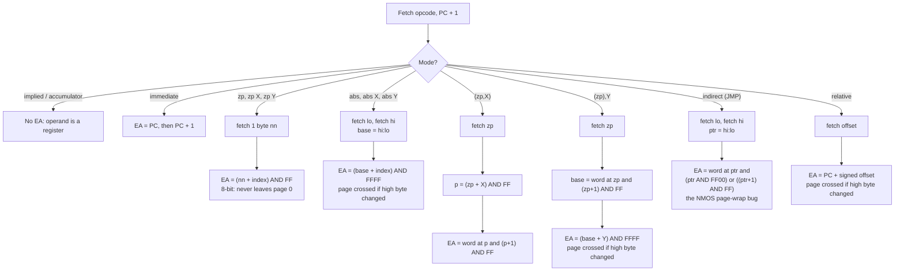
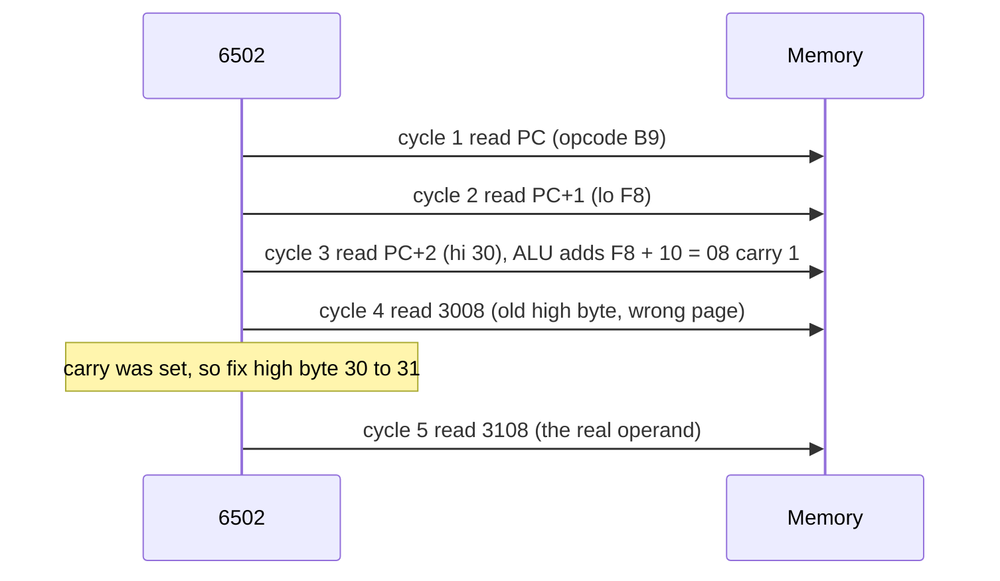
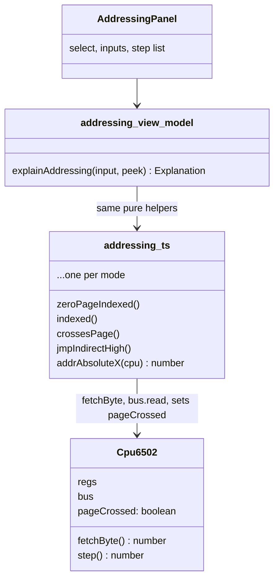

# Stage 05: Addressing modes

> **Part:** 2 (The 6502 CPU) · **Branch:** `stage/05-addressing-modes` · **Needs:** 04
> **Status:** done

## Goal

Teach the CPU the **13 ways an instruction finds its operand**. After this stage, the CPU has a set of small functions that each work out an *effective address* (the address the instruction will finally read or write). Each function fetches its operand bytes from after the opcode, follows any pointers, adds any index register, and reports whether it **crossed a page**.

This stage still adds no new instructions. It comes before them because the 151 documented opcodes are really ~56 operations × a handful of addressing modes. `LDA` alone has 8 modes. If we write each mode once and get its wrap-arounds right, every later stage just says "`LDA` = load, using mode M", and the subtle bugs live in exactly one place.

## Start here: what addressing modes are for

*(Added during review: read this first if the rest of the doc feels like it starts in the middle.)*

### Verb + where

Every 6502 instruction is a **verb** plus a **where**:

```
LDA  &7C00
───  ─────
verb  where:  "load into A"  "from address &7C00"
```

The **verb** (`LDA` load, `STA` store, `ADC` add, `INC` add one…) does the manipulating. The **addressing mode** is how the "where" is written, and its only job is to answer **"which byte of memory does the verb act on?"** Addressing modes never change data; they only *find* it. That's why this stage adds no instructions. It builds the "where" part once, so every verb from Stage 06 on can reuse it.

### Why more than one way

It's like telling a friend where something is:

| You say… | Mode |
|---|---|
| "Here it is, take it." | **Immediate**: the value is inside the instruction |
| "It's in drawer 70." | **Zero page**: a short, nearby address |
| "It's at house 7C00." | **Absolute**: a full address |
| "It's 5 houses along from 7C00." | **Indexed**: an address plus X or Y |
| "Check drawer 70; there's a note saying where it is." | **Indirect**: the address is stored in memory |
| "Go back 3 steps." | **Relative**: a distance from here |
| "You already have it." | **Implied / accumulator**: no memory needed |

Each suits a different job, and the more flexible ones cost more time.

### Low and high bytes

A memory location holds **one byte**: two hex digits, `&00`–`&FF`. An address has **four** hex digits (`&0000`–`&FFFF`), so it can't fit in one location. The 6502 splits it down the middle:

```
&7C00  →  high byte &7C (left pair), low byte &00 (right pair)
```

When an address is stored in memory, the **low byte goes first**. So `&7C00` is stored as `00 7C`. To read an address back from memory, **swap the pair and join it**: `00 7C` → `7C 00` → `&7C00`.

You've already met this: the reset vector at `&FFFC`/`&FFFD` holds `00 04`, which is why PC starts at `&0400`.

### One cycle = one trip to memory

The 6502 reads or writes exactly one byte per cycle. So an instruction's cycle count is (nearly always) **the number of bytes it has to touch**. `LDA &7C00` takes 4 cycles because it reads 4 bytes: the opcode `AD`, the address's low byte `00`, its high byte `7C`, and then the data at `&7C00`. (A few modes also spend a cycle adding X inside the chip.)

### The jobs, step by step

The setting: in Mode 7 the screen is just memory, one byte per character, starting at `&7C00` (top-left). The playground has put `HELLO, BBC MICRO` there. To see it, go to **Memory → `&7C00` → Go**: `48 45 4C 4C 4F` = H E L L O.

**Job 1: a constant. Immediate.** `LDA #&41` is the bytes `A9 41`. The `#` means "this *is* the value". The CPU reads the opcode, then `41`, and that's it: **2 cycles**.

**Job 2: a fixed place. Absolute.** `STA &7C00` is the bytes `8D 00 7C`. The CPU reads the opcode, `00`, `7C` (→ `&7C00`), then writes there, and "A" appears top-left: **4 cycles**.

**Job 3: a favourite variable. Zero page.** Addresses `&0000`–`&00FF` have high byte `&00`, so only the low byte needs writing. `LDA &70` (`A5 70`) reads the same byte as `LDA &0070` (`AD 70 00`), but it's one byte shorter and **3 cycles instead of 4**. The BBC reserves `&70`–`&8F` for your programs.

**Job 4: walk along a list. Indexed.** `LDA &7C00,X` (`BD 00 7C`) means "`&7C00` plus X". The instruction never changes; only X does:

| X | Address | Byte | Letter |
|---|---|---|---|
| `&00` | `&7C00` | `48` | H |
| `&01` | `&7C01` | `45` | E |
| `&02` | `&7C02` | `4C` | L |
| `&03` | `&7C03` | `4C` | L |
| `&04` | `&7C04` | `4F` | O |

*To try it:* Explorer → Mode `Absolute,X`, Operand `&7C00`, then type X = `00`, `01`, … `04` and watch "…which holds" change.

**Job 5: data that could be anywhere. Indirect, (zp),Y.** `&7C00,X` only works for text at `&7C00`, because the address is baked into the instruction. Instead, keep the address *in memory* (a **pointer**) and tell the instruction to look there. `LDA (&70),Y` (`B1 70`) reads the pointer from `&70`/`&71`, then adds Y:

| Cycle | Reads | Gets | Meaning |
|---|---|---|---|
| 1 | instruction | `B1` | "LDA, (indirect),Y" |
| 2 | next | `70` | the pointer is at `&70` |
| 3 | `&0070` | `00` | pointer low byte |
| 4 | `&0071` | `7C` | pointer high byte → `&7C00` |
| 5 | `&7C00` + Y | the letter | into A |

*To try it:* Memory → Go to `&0070` and you'll see `00 7C`. Change the `7C` at `&0071` to `7D`, and the explorer now follows the pointer to `&7D00`. You redirected the instruction without touching it. (Change it back afterwards.)

**Job 6: a redirectable jump. Indirect JMP.** The MOS's print entry at `&FFEE` is `JMP (&020E)`: "jump to the address stored at `&020E`/`&020F`". A program can overwrite those two bytes to send all printing to its own code. That's a *vector*.

**Job 7: loops and IFs. Relative.** `BNE` stores *how far* to jump (−128..+127), not where. That works wherever the code sits, and it fits in one byte.

**Job 8: no memory needed. Implied / accumulator.** `INX` (add 1 to X) and `ASL A` (double A) already know what they work on.

The other two modes are variations: **zero page,X** (Job 4 on zero page) and **(indirect,X)** (X picks one of a list of pointers in zero page).

The rest of this doc is the detail behind those jobs. The **edge cases** (the yellow lines in the explorer: zero-page wrap, page crossing, the JMP bug) are what happens when the arithmetic runs off the end of a page. Come back to them once the jobs feel natural.

## What you can now see

```bash
npm run dev      # then open http://localhost:5173
```

A third panel, **Addressing modes**, sits below Memory. It opens on `LDA (&70),Y`:

```
Mode [(Indirect),Y (&nn),Y]  Operand [&70]  X [&00]  Y [&00]  A [&00]  At [&0400]
Try: [Zero-page wrap] [Page cross] [Screen pointer] [Pointer wrap] [JMP bug] [Branch back]

LDA (&70),Y    &0400: B1 70
 1. Operand &70: the pointer lives in zero page at &0070. Follow the pointer FIRST, then index.
 2. Read pointer low byte from &0070: &00.
 3. Read pointer high byte from &0071: &7C. Pointer = &7C00.
 4. Add Y to the low byte: &00 + &00 = &00, no carry. EA = &7C00.
EA = &7C00, which holds &48
LDA (&70),Y: 5 cycles
```

`&48` is the "H" of `HELLO, BBC MICRO` in Mode 7 screen memory. The playground has planted a pointer to `&7C00` at `&70`/`&71`.

Things to try:

1. **Walk the screen.** Type `&07` into Y. The EA becomes `&7C07`, which holds `&42` ("B"). This is how real code walks a buffer: a fixed pointer plus a moving Y.
2. **Zero-page wrap.** Click **Zero-page wrap: LDA &FF,X**. Step 2 is highlighted: `&FF + &01 = &0100`, but the carry is dropped, so the EA is `&0000`.
3. **Page cross.** Click **Page cross: LDA &30F8,Y**. The highlighted step shows the CPU reading the wrong-page address `&3008` before it fixes the high byte, and the cycle line reads `4 + 1 (page crossed) = 5 cycles`. Now change Y to `&07`: no carry, so 4 cycles.
4. **The JMP bug.** Click **JMP bug: JMP (&30FF)**. The high byte comes from `&3000`, not `&3100`, so the jump goes to `&0400` instead of `&8000`. Change the operand to `&3100`: no bug when the pointer isn't at the end of a page.
5. **Pointer wrap.** Click **Pointer wrap: LDA (&FF,X)**. The pointer's two bytes come from `&00FF` and `&0000`.
6. **Branches.** Click **Branch back: BNE −128**. The offset `&80` is −128, counted from `&0402`, giving `&0382`. That's in a different page, so a taken branch costs 4 cycles. Try `&FE`: a branch to itself.
7. **Poke and watch.** In the Memory panel, go to `&0070` and change `&71` from `7C` to `30`. The explorer redraws straight away: the pointer is now `&3000`.
8. **Bad input.** Type `&100` into Y: "Y must be one byte, &00-&FF".

The explorer only ever *peeks*. Exploring changes no memory and no registers.

## The real hardware

The 6502 has a 16-bit address bus but only an **8-bit ALU**. Its internal address arithmetic is done one byte at a time, and that one fact explains almost every quirk in this stage.

An instruction is 1, 2 or 3 bytes: the **opcode**, then up to two **operand bytes**. The opcode byte itself encodes the mode. For example, all of these are `LDA`, and only the opcode byte differs (MCS6500 Programming Manual, Appendix B):

| Assembly | Bytes | Mode | Cycles |
|---|---|---|---|
| `LDA #&41` | `A9 41` | immediate | 2 |
| `LDA &70` | `A5 70` | zero page | 3 |
| `LDA &70,X` | `B5 70` | zero page,X | 4 |
| `LDA &7C00` | `AD 00 7C` | absolute | 4 |
| `LDA &7C00,X` | `BD 00 7C` | absolute,X | 4 (+1 if page crossed) |
| `LDA &7C00,Y` | `B9 00 7C` | absolute,Y | 4 (+1 if page crossed) |
| `LDA (&70,X)` | `A1 70` | (indirect,X) | 6 |
| `LDA (&70),Y` | `B1 70` | (indirect),Y | 5 (+1 if page crossed) |

Notice that a 16-bit operand is stored **low byte first**: `&7C00` is the bytes `00 7C`. This is the same little-endian order as the reset vector in Stage 04.

### The 13 modes

| Mode | Syntax | Operand bytes | Effective address | Model B example |
|---|---|---|---|---|
| Implied | `INX` | 0 | none: the opcode says what to use | `CLI`, `RTS` |
| Accumulator | `ASL A` | 0 | none: the operand is A | `ROL A` |
| Immediate | `LDA #&nn` | 1 | the operand byte itself (it lives at PC) | `LDA #&87` |
| Zero page | `LDA &nn` | 1 | `&00nn` | user zero page `&70`–`&8F` |
| Zero page,X | `LDA &nn,X` | 1 | `(&nn + X) AND &FF` | |
| Zero page,Y | `LDX &nn,Y` | 1 | `(&nn + Y) AND &FF` | only `LDX` and `STX` use it |
| Absolute | `LDA &nnnn` | 2 | `&nnnn` | `STA &FE40` (System VIA) |
| Absolute,X | `LDA &nnnn,X` | 2 | `&nnnn + X` (16-bit) | `STA &7C00,X` (Mode 7 screen) |
| Absolute,Y | `LDA &nnnn,Y` | 2 | `&nnnn + Y` (16-bit) | |
| Indirect | `JMP (&nnnn)` | 2 | the word stored at `&nnnn` | `JMP (&020E)` (the OSWRCH vector) |
| (Indirect,X) | `LDA (&nn,X)` | 1 | the word stored at zero page `(&nn + X) AND &FF` | |
| (Indirect),Y | `LDA (&nn),Y` | 1 | (the word stored at zero page `&nn`) + Y | the workhorse for pointers |
| Relative | `BNE label` | 1 | PC + signed offset | every branch |

Only `JMP` uses indirect mode. Only branches use relative mode. The MOS's `OSWRCH` entry at `&FFEE` is literally `JMP (&020E)`: it jumps through the vector in page 2, which is how a program can redirect all character output (Advanced User Guide, §"Vectors").

### Zero page is special

Page zero (`&0000`–`&00FF`) has its own modes that take a **one-byte** operand. They are a byte shorter and a cycle faster than absolute mode: `LDA &70` is 2 bytes and 3 cycles, while `LDA &0070` is 3 bytes and 4 cycles, and both read the same byte. That's why the MOS and BASIC fight over zero page, and why the AUG reserves `&70`–`&8F` for user programs.

The catch is that zero-page modes **can never leave page zero**. The CPU computes `&nn + X` in its 8-bit ALU and just drops the carry, because the high byte of the address is hard-wired to `&00`. So `LDA &FF,X` with X = `&01` reads `&0000`, not `&0100`.

## Key concepts

### 1. The effective address

Every mode except implied and accumulator ends in one 16-bit number: the address of the byte the instruction will operate on. Call it the **EA**. `LDA` reads from the EA, `STA` writes to it, and `INC` reads, modifies and writes it back. Separating "find the EA" from "do the operation" is what lets us write each mode only once.

Immediate mode fits this too. Its EA is simply **the address of the operand byte**, i.e. PC. `LDA #&41` at `&0400` has EA = `&0401`, and reading `&0401` gives `&41`. So immediate needs no special case in the instructions.

### 2. Page crossing, and why it costs a cycle

A **page** is 256 bytes sharing the same high byte: `&7C00`–`&7CFF` is page `&7C`. Here is what `LDA &30F8,Y` with Y = `&10` really does, one bus cycle at a time (MCS6500 manual, Appendix A, cycle tables):

| Cycle | Address bus | What happens |
|---|---|---|
| 1 | PC | fetch opcode `&B9` |
| 2 | PC+1 | fetch low byte `&F8` |
| 3 | PC+2 | fetch high byte `&30`. Meanwhile the ALU adds `&F8 + &10 = &08`, **carry 1** |
| 4 | `&3008` | read using the *old* high byte `&30` with the *new* low byte `&08`. This is the wrong address! |
| 5 | `&3108` | fix the high byte (`&30 + carry = &31`) and read again: the right byte |

The CPU optimistically reads in cycle 4 before it knows whether the high byte needs fixing. If the add **didn't** carry (no page crossed), that guess was right and the instruction finishes in 4 cycles. If it **did** carry, the CPU spends a 5th cycle fixing the high byte and reading again.

So the rule is: **for indexed reads, +1 cycle when `(base AND &FF00) ≠ (EA AND &FF00)`**. The modes that can pay this penalty are absolute,X, absolute,Y and (indirect),Y.

> **Stores always pay.** A read from the wrong address is harmless, but a *write* to the wrong address would corrupt memory (or poke a VIA register!). So `STA &30F8,Y` always takes the 5-cycle path, page crossing or not. That's a Stage 07 detail. This stage only *reports* the crossing, and the instruction decides what it costs.

### 3. Wrap-around: where the 8-bit ALU shows through

| Calculation | Width | Example | Result |
|---|---|---|---|
| zp,X / zp,Y | 8-bit, carry dropped | `&FF + &01` | `&0000` |
| (zp,X) pointer location | 8-bit, carry dropped | `(&FF + &00)`, high byte from `&00` | pointer bytes at `&00FF` and `&0000` |
| (zp),Y pointer's high byte | 8-bit | pointer at `&FF` | low from `&00FF`, high from `&0000` |
| abs,X / abs,Y / (zp),Y final add | 16-bit | `&FFFF + &01` | `&0000` (wraps the whole address space) |
| JMP (ind) pointer's high byte | 8-bit **bug** | `JMP (&30FF)` | low from `&30FF`, high from **`&3000`**, not `&3100` |
| Relative branch target | 16-bit | `&0480 + (-&90)` | `&03F0` |

### 4. The JMP (indirect) bug

`JMP (&30FF)` should read the target's low byte from `&30FF` and its high byte from `&3100`. The NMOS 6502 increments only the **low byte** of the pointer to find the second byte, exactly as it does in zero page, so it reads the high byte from `&3000` instead. The 65C02 fixed this (at the cost of an extra cycle). The BBC Micro's 6502 is NMOS, so we must reproduce the bug. Real software relies on it rarely, but test suites check it, and Stage 19 will catch us if we get it wrong.

### 5. Indexed-indirect vs indirect-indexed

These two look alike and are easy to confuse, because the *order of the brackets* is the order of the operations.

- **`(&70,X)`: index first, then follow the pointer.** Add X to `&70` (in zero page), read a pointer from there, and the pointer *is* the EA. It's useful for a table of pointers in zero page. It's rarely used on the BBC; `(&70,X)` with X = 0 is sometimes used as "`(&70)`", which the NMOS 6502 doesn't have.
- **`(&70),Y`: follow the pointer first, then index.** Read a pointer from `&70`/`&71`, and add Y to it. That's "pointer + offset", the classic way to walk a buffer anywhere in memory. For example, with `&70`/`&71` = `00 7C`, `LDA (&70),Y` with Y = `&05` reads `&7C05`, the sixth character of the Mode 7 screen.

### 6. Relative branches

A branch's operand is a **signed** offset, `-128`..`+127` (the `toSigned8` helper from Stage 01). It's added to the PC *after* the branch instruction has been fetched, i.e. the address of the next instruction. So `BNE` at `&0400` with offset `&FE` (−2) jumps to `&0402 − 2 = &0400`: itself, an infinite loop. A taken branch costs +1 cycle, and if the target is in a different page from the next instruction, +1 more (the same "fix the high byte" step as above). The branch instructions themselves arrive in Stage 14.

## Diagrams

How each mode turns operand bytes into an effective address. The 8-bit (wrap within a page) steps are marked.



Why a page crossing costs a cycle: the timeline of `LDA abs,Y` when the low-byte add carries.



## Our design

### `src/cpu/addressing.ts`

**Pure address arithmetic.** Small, allocation-free functions that do only the math, with no bus access. Both the CPU and the workbench explorer use them, so the wrap rules live in exactly one place:

```ts
zeroPageIndexed(zp, index)    // (zp + index) & 0xff
indexed(base, index)          // (base + index) & 0xffff
crossesPage(from, to)         // ((from ^ to) & 0xff00) !== 0
zeroPagePointerHigh(zp)       // (zp + 1) & 0xff
jmpIndirectHigh(ptr)          // (ptr & 0xff00) | ((ptr + 1) & 0xff)   the NMOS bug
relativeTarget(pc, offset)    // (pc + toSigned8(offset)) & 0xffff
```

**One effective-address function per mode** that has an address (11 of the 13; implied and accumulator have none). Each takes the CPU, fetches its operand bytes with `cpu.fetchByte()` (advancing PC), reads any pointer from the bus, and **returns the EA as a number**:

```ts
export function addrAbsoluteX(cpu: Cpu6502): number {
  const base = fetchWord(cpu);
  const ea = indexed(base, cpu.regs.x);
  cpu.pageCrossed = crossesPage(base, ea);
  return ea;
}
```

**How page crossing gets reported.** A function can only return one number, and the hot path rule says no `{ ea, crossed }` objects. So the crossing goes into a field on the CPU, `cpu.pageCrossed`, which every EA function sets (to `false` when it can't cross). An instruction's `execute` reads it straight after: `return cpu.pageCrossed ? 1 : 0`.

*Alternatives considered:*
- Returning `ea | 0x10000` as a flag bit would avoid the field, but it's too clever to read.
- A module-level variable would break "no hidden global state" (two machines would share it).
- Returning the extra cycle count directly would mix up timing and addressing, and stores would have to ignore it anyway.

**The mode names** become a union literal type, replacing Stage 04's `'implied'`-only type in `opcodes.ts`:

```ts
export type AddressingMode =
  | 'implied' | 'accumulator' | 'immediate'
  | 'zeroPage' | 'zeroPageX' | 'zeroPageY'
  | 'absolute' | 'absoluteX' | 'absoluteY'
  | 'indirect' | 'indexedIndirectX' | 'indirectIndexedY'
  | 'relative';
```

A `MODES` table (built with `as const`) records each mode's operand byte count and assembler syntax. The explorer uses it now, and the assembler (Stage 08) and disassembler (Stage 18) will use it later.

### The addressing-mode explorer (workbench)

`src/web/workbench/addressing-view-model.ts` is DOM-free and tested with Jest. Given a mode, the operand, X, Y and the instruction's address, it builds the list of **steps** the 6502 would take, e.g. "read pointer low byte from `&0070`: `&00`". It reads memory through `DebugTarget.peek`, so exploring never changes anything. It uses the same pure helpers as the CPU, so the explorer can't disagree with the emulator about wrap rules. A test also checks that it agrees with the real EA functions for every mode.

`addressing-panel.ts` is just the DOM: a mode selector, inputs and the step list. The playground preloads a few pointers in zero page (`&70`/`&71` → `&7C00`, plus one at `&FF`/`&00` for the wrap case) and a `JMP (&30FF)` trap, so there's something to follow straight away.



## Code walkthrough

- [`src/cpu/addressing.ts`](../../src/cpu/addressing.ts): the heart of the stage.
  - `AddressingMode`, the 13-name union, and `MODES`, the operand byte count and syntax for each mode. `satisfies Record<AddressingMode, ModeInfo>` makes TypeScript complain if a mode is missing, while `as const` keeps the literal types (so `MODES.absolute.operandBytes` has type `2`, not `number`).
  - **Pure helpers**: `zeroPageIndexed`, `indexed`, `crossesPage`, `zeroPagePointerHigh`, `jmpIndirectHigh` and `relativeTarget`. Every wrap rule in the stage is one of these one-liners. `crossesPage` uses XOR: `(from ^ to) & 0xff00` is non-zero exactly when the high bytes differ.
  - **EA functions**: `addrImmediate` … `addrRelative`. Each is called with PC on the first operand byte (step() has already fetched the opcode). Each fetches via `cpu.fetchByte()`, so PC wraps `&FFFF → &0000` correctly. Each always assigns `cpu.pageCrossed`, even to `false`, so no stale value can leak from the previous instruction.
  - `addrImmediate` returns PC itself. That's the trick that lets `LDA #&41` and `LDA &70` share one "read the EA" implementation in Stage 06.
- [`src/cpu/cpu6502.ts`](../../src/cpu/cpu6502.ts): gains the `pageCrossed` field. Nothing in `step()` uses it yet, because there are no instructions with operands yet.
- [`src/cpu/opcodes.ts`](../../src/cpu/opcodes.ts): `Opcode.mode` now uses the full `AddressingMode` type from `addressing.ts`.
- [`src/web/workbench/addressing-view-model.ts`](../../src/web/workbench/addressing-view-model.ts): `explainAddressing()` walks the same calculation as the CPU, using the same helpers, but records a sentence for each step and reads memory through `peek`. `EXAMPLES` gives one real opcode per mode (`LDA` where it can), so the panel can show the bytes (`B1 70`) and the cycle count. `parseExplorerInput()` validates the text fields, and `PRESETS` holds the worked examples.
- [`src/web/workbench/addressing-panel.ts`](../../src/web/workbench/addressing-panel.ts): the DOM only. It re-explains on every `input` event and on `refresh()`, so pokes elsewhere show up. The operand box is disabled for implied/accumulator, and A is enabled only for accumulator.
- [`src/main.ts`](../../src/main.ts): plants the example pointers (`&70`/`&71`, `&FF`/`&00`, and the `&30FF` trap) and adds the panel.

## Tests

| Test file | What it proves |
|---|---|
| `src/cpu/addressing.test.ts` | The pure helpers (8-bit zero-page wrap, 16-bit indexed wrap, page-cross detection, the JMP high-byte bug, and signed relative offsets). For every mode with an EA: the address, the PC advance (1 or 2 operand bytes), and `pageCrossed`. Includes `LDA &FF,X` → `&0000`; `&30F8,X/Y` + `&10` crossing; `&30F0,Y` + `&0F` = `&30FF` *not* crossing; `&FFFF,X` + 1 → `&0000`; `(&FF,X)`/`(&FF),Y` pointers wrapping to `&00`; `JMP (&30FF)` reading `&3000`; branches across pages both ways; an operand straddling `&FFFF`/`&0000`; and a stale `pageCrossed` being cleared. |
| `src/web/workbench/addressing-view-model.test.ts` | The explorer's bytes, steps, results and cycle text for each kind of mode. Warning steps appear for wraps, crossings and the JMP bug. **Agreement:** for 11 modes × 5 awkward cases, `explainAddressing` gives the same EA and page crossing as the real CPU function. Input parsing and the presets are covered too. |
| `e2e/addressing.spec.ts` | In the browser: the default `(&70),Y` explanation, the zero-page-wrap, page-cross and JMP-bug presets, live re-explaining on typing, and the error for a bad byte. |

Totals: 197 Jest tests and 15 Playwright tests, all passing. No tests need ROMs.

## Gotchas & hardware quirks

- **Zero page never leaves page zero.** This applies to zp,X, zp,Y, the `(zp,X)` pointer location, and the high byte of *any* zero-page pointer (`(&FF),Y` reads `&FF` and `&00`). It's easy to write `(zp + x) & 0xffff` by mistake. That would pass most tests and break the MOS.
- **`(zp),Y` *can* leave page zero.** Only the pointer *lookup* wraps in page zero. Adding Y to the pointer is a full 16-bit add, and it can cross a page (+1 cycle on reads).
- **Immediate's EA is PC.** It isn't the operand value. Mixing the two up is the classic first bug in a 6502 emulator.
- **Relative offsets count from the next instruction**, not from the branch opcode. `&FE` is "branch to myself".
- **The page-cross penalty belongs to the instruction, not the mode.** Reads pay +1 only on a crossing, stores and read-modify-write always take the long path, and branches have their own rule. So this stage *reports* `pageCrossed`, and Stages 06, 07, 09 and 14 decide what it costs.
- **JMP (ind) bug.** It's reproduced deliberately. The 65C02 (not used in the Model B) fixed it.
- **Not modelled: the dummy reads.** The real CPU reads the wrong-page address (`&3008` in the example) during a page crossing, and zp,X and `(zp,X)` also do a dummy read of the un-indexed zero-page address. Reads of RAM have no side effects, so this doesn't matter yet. A dummy read of a VIA register *could* matter, and it's already noted in the parking lot for the cycle-exact extras in Part 12.
- **"EA" in the explorer is not the byte `&EA`.** The Memory panel shows page `&0400` full of `EA` bytes (`&EA` = NOP). The explorer uses "EA" as short for *effective address*. Same letters, unrelated meanings. (Found during review; see the parking lot.)
- **The explorer's bytes are hypothetical.** `&0400: AD 00 7C` means "this is what `LDA &7C00` *would* look like at `&0400`". The explorer never writes them, so memory at `&0400` still holds `EA` (NOP). You can poke them in by hand with the Memory panel, but the CPU can't run `LDA` until Stage 06. (Found during review.)
- **`MODES.relative.syntax` is `&nnnn`**, because assemblers write the *target*, not the offset. The assembler (Stage 08) will compute the offset.

## Playwright verification

- **MCP (interactive):** I navigated to the dev server and took an accessibility snapshot of the "Addressing modes" region. The default explanation was `LDA (&70),Y` → `EA = &7C00, which holds &48`. I clicked **JMP bug** and took a screenshot: step 3 is highlighted, reading "Read pointer high byte from &3000, not &3100 …", with jump target `&0400`. There were no console warnings or errors.
- **Durable:** `e2e/addressing.spec.ts` (5 tests), described above. `npm run test:e2e` gives 15 passed.

## Check your understanding

1. `LDA &80,X` runs with X = `&90`. Which address is read, and why isn't it `&0110`?
2. Why does `LDA &2080,X` take 4 cycles with X = `&10`, but 5 with X = `&90`? What is the CPU doing in that extra cycle?
3. Zero page `&70`/`&71` holds `F0 1F`, and Y = `&20`. What does `LDA (&70),Y` read, and does it pay the page-cross cycle? What about `LDA (&70,X)` with X = `&00`?
4. Why does `STA &2080,X` *always* take 5 cycles, even when no page is crossed?
5. A `BEQ` opcode sits at `&04F0` with offset `&20`. What's the target, and how many cycles does the branch take if it's taken?

<details>
<summary>Answers</summary>

1. `&0010`. Zero page,X adds in the 8-bit ALU and drops the carry, because the high byte of a zero-page address is hard-wired to `&00`. `&80 + &90 = &110`, and keeping 8 bits gives `&10`.
2. `&80 + &10 = &90`: no carry, so the CPU's optimistic read of `&2090` in cycle 4 was right. `&80 + &90 = &110`: carry. Cycle 4 reads `&2010` (old high byte, wrong page) and throws it away. Cycle 5 adds the carry to the high byte (`&20 → &21`) and reads `&2110`.
3. The pointer is `&1FF0`, and `&1FF0 + &20 = &2010`. The high byte changed, so it's a page crossing: 5 + 1 = 6 cycles. With `(&70,X)` and X = 0, the pointer *is* the EA: `&1FF0`, always 6 cycles, with no index added after the pointer, so there's no crossing to pay for.
4. During cycle 4 the CPU doesn't yet know whether the high byte needs fixing. For a read, a wrong-address read is harmless. For a write, writing to the wrong address would corrupt memory (or trigger an I/O register), so a store always waits for the fix-up cycle.
5. The next instruction is at `&04F2`, and `&04F2 + &20 = &0512`. That's a different page from `&04F2`, so a taken branch costs 2 + 1 + 1 = 4 cycles.

</details>

## Further reading

- *MCS6500 Microcomputer Family Programming Manual* (MOS Technology, 1976). Chapter 5 and Chapter 6 cover the addressing modes, and Appendix A has the cycle-by-cycle bus activity for each mode, including the page-cross fix-up cycle.
- *MCS6500 Microcomputer Family Hardware Manual*, Appendix A: the same timing, from the pin's point of view.
- 6502.org, "6502 Addressing Modes" and the NMOS 6502 opcode tables (cycles and page-cross notes).
- *BBC Microcomputer Advanced User Guide*: the memory map (user zero page `&70`–`&8F`) and the chapter on vectors (`OSWRCH` = `JMP (&020E)`).
- BeebWiki, "Zero page", for how the MOS and BASIC split up page zero.
