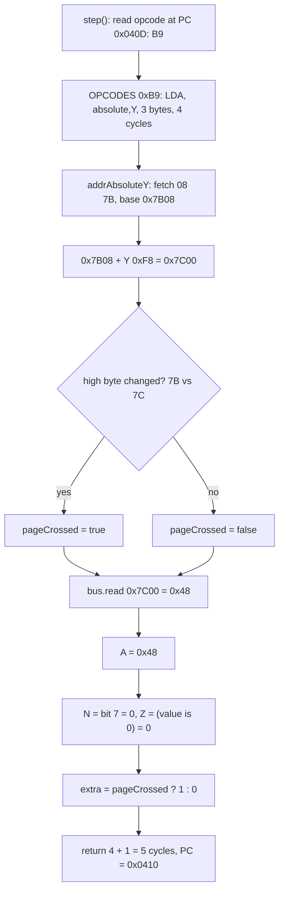
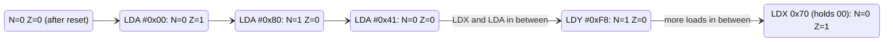
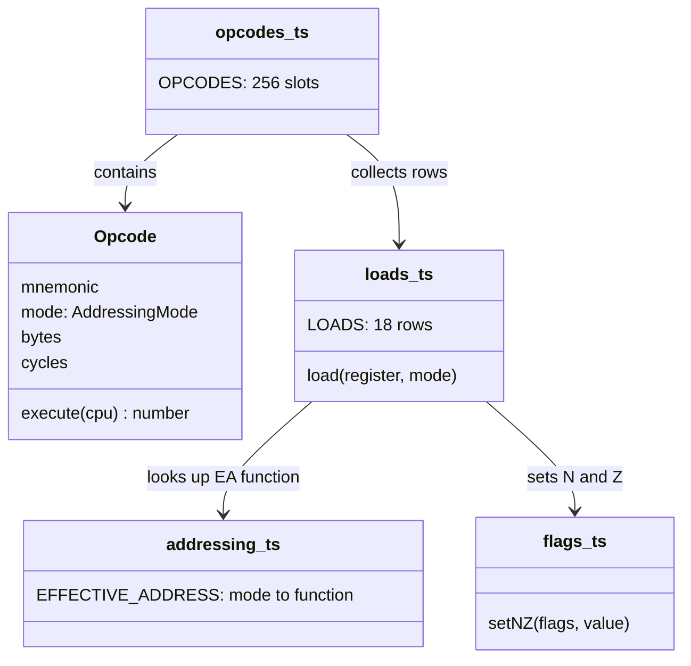

# Stage 06: Loads

> **Part:** 2 (The 6502 CPU) · **Branch:** `stage/06-loads` · **Needs:** 05
> **Status:** done

## Goal

This stage gives the CPU its first real instructions: **`LDA`, `LDX` and `LDY`**, in all 18 of their opcodes. A load copies one byte from memory into a register and sets two flags, **N** and **Z**, from it. That's all a load does.

Loads come first for two reasons:

- **They're the simplest instructions that use an addressing mode.** Stage 05 built the "where" (the effective-address functions), and a load is just "where" plus "copy". Every bug a load could have is either a wrong address (Stage 05's job) or a wrong flag (this stage's job).
- **They're the most common instructions in real code.** Nearly every routine in the MOS starts by loading something. Once loads work, the CPU can do more than walk through NOPs. It can pick bytes out of memory and show you their value and their flags.

## What you can now see

### In the browser

```bash
npm run dev      # then open http://localhost:5173
```

The playground now starts on a real program. A new **Program** panel (between Registers and Memory) lists eleven hand-assembled loads at `&0400`, and ▶ marks the line the next **Step** will run:

```
   Address Bytes     Source        Watch for
 ▶ &0400   A9 00     LDA #&00      A=&00: Z=1 (zero), N=0
   &0402   A9 80     LDA #&80      A=&80: N=1 (bit 7 set), Z=0
   &0404   A9 41     LDA #&41      A=&41 "A": N=0, Z=0
   &0406   A2 07     LDX #&07      X=&07, ready to index
   &0408   BD 00 7C  LDA &7C00,X   &7C07 holds "B" (&42): 4 cycles
   &040B   A0 F8     LDY #&F8      Y=&F8: N=1, it's ≥ &80
   &040D   B9 08 7B  LDA &7B08,Y   &7B08+&F8 = &7C00 "H": page crossed, 5 cycles
   &0410   A0 04     LDY #&04      Y=&04
   &0412   B1 70     LDA (&70),Y   pointer &7C00 + 4 = &7C04 "O" (&4F)
   &0414   A6 70     LDX &70       X=&00 (pointer low byte): Z=1
   &0416   AC 01 7C  LDY &7C01     Y=&45 "E", A and X unchanged
```

The same bytes are in the **Memory** panel: row `0400` now reads `A9 00 A9 80 A9 41 A2 07 BD 00 7C …`, followed by NOPs (`EA`) to the end of the page.

Things to try:

1. **Step once.** A stays `&00`, but the **Z** light comes on: the value loaded was zero. PC moves by 2, to `&0402`, and the cycle count goes from 7 to 9.
2. **Step again.** `LDA #&80`: A = `&80`, the detail column reads `128 / −128`, **N** comes on and **Z** goes off. Same byte, two readings. N just copies bit 7.
3. **Step through `LDA &7C00,X`** (the fifth line). A becomes `&42`, the "B" of `HELLO, BBC MICRO`. The message says `Ran 1 (4 cycles)`.
4. **Step through `LDA &7B08,Y`** (the seventh line). The message says `Ran 1 (5 cycles)`: `&7B08 + &F8` carried into the high byte.
5. **Watch `LDX &70`** (the tenth line). A still holds `&4F`, but **Z** comes on because X just loaded `&00`. The flags describe the *last* load, not A.
6. **Change the program.** Press **Reset**, then click the byte at `&0401` in the Memory panel and type `FF`. The Program panel strikes through the bytes and marks the line "(edited)". Step once, and A becomes `&FF` with N set. The listing is only notes; memory is what runs.
7. **Run off the end.** Press **Step ×16** until it stops. After 11 loads and 231 NOPs it halts at `&0500`: `unimplemented opcode &00 at &0500` (BRK arrives in Stage 17).

### In the terminal

```bash
npm run demo:loads
```

```
Stage 06: loads. Each line is one cpu.step().

after reset                         A=00 X=00 Y=00  N=0 Z=0  C=0 I=1

addr  bytes     source         cyc  registers after          watch for
----  --------  -------------  ---  -----------------------  ---------
0400  A9 00     LDA #&00         2  A=00 X=00 Y=00  N=0 Z=1  A=&00: Z=1 (zero), N=0
0402  A9 80     LDA #&80         2  A=80 X=00 Y=00  N=1 Z=0  A=&80: N=1 (bit 7 set), Z=0
0404  A9 41     LDA #&41         2  A=41 X=00 Y=00  N=0 Z=0  A=&41 "A": N=0, Z=0
0406  A2 07     LDX #&07         2  A=41 X=07 Y=00  N=0 Z=0  X=&07, ready to index
0408  BD 00 7C  LDA &7C00,X      4  A=42 X=07 Y=00  N=0 Z=0  &7C07 holds "B" (&42): 4 cycles
040B  A0 F8     LDY #&F8         2  A=42 X=07 Y=F8  N=1 Z=0  Y=&F8: N=1, it's ≥ &80
040D  B9 08 7B  LDA &7B08,Y      5  A=48 X=07 Y=F8  N=0 Z=0  &7B08+&F8 = &7C00 "H": page crossed, 5 cycles
0410  A0 04     LDY #&04         2  A=48 X=07 Y=04  N=0 Z=0  Y=&04
0412  B1 70     LDA (&70),Y      5  A=4F X=07 Y=04  N=0 Z=0  pointer &7C00 + 4 = &7C04 "O" (&4F)
0414  A6 70     LDX &70          3  A=4F X=00 Y=04  N=0 Z=1  X=&00 (pointer low byte): Z=1
0416  AC 01 7C  LDY &7C01        4  A=4F X=00 Y=45  N=0 Z=0  Y=&45 "E", A and X unchanged

PC=&0419, 40 cycles since power-on (7 of them reset).
C=0 V=0 D=0 I=1: loads never touch these.
```

### Hand-assembling one line yourself

This is how `LDA &7B08,Y` became `B9 08 7B`:

1. Look up `LDA` with `absolute,Y` in the opcode table: **`B9`**, 3 bytes, 4+ cycles.
2. Split the address `&7B08` into its high byte `&7B` and low byte `&08`.
3. Write the low byte first: **`B9 08 7B`**.

## The real hardware

### What a load does on the chip

The *MCS6500 Programming Manual* (§2.1–2.3) describes each load in one line:

| Instruction | Operation | Flags changed |
|---|---|---|
| `LDA` | M → A | N, Z |
| `LDX` | M → X | N, Z |
| `LDY` | M → Y | N, Z |

"M" is the byte at the effective address. Of the six flags the chip stores (N V D I Z C), a load changes **only N and Z**. **C, V, D and I are left exactly as they were.** That matters more than it sounds. A program can do `CLC`, then a run of loads, then `ADC`, and the carry is still clear when the `ADC` arrives.

### The 18 load opcodes

This is the load section of the opcode table (MCS6500 Programming Manual, Appendix B; 6502.org opcode table). `+` means "+1 cycle if a page is crossed":

| Mode | `LDA` | `LDX` | `LDY` | Bytes | Cycles |
|---|---|---|---|---|---|
| immediate `#&nn` | `A9` | `A2` | `A0` | 2 | 2 |
| zero page `&nn` | `A5` | `A6` | `A4` | 2 | 3 |
| zero page,X `&nn,X` | `B5` | — | `B4` | 2 | 4 |
| zero page,Y `&nn,Y` | — | `B6` | — | 2 | 4 |
| absolute `&nnnn` | `AD` | `AE` | `AC` | 3 | 4 |
| absolute,X `&nnnn,X` | `BD` | — | `BC` | 3 | 4+ |
| absolute,Y `&nnnn,Y` | `B9` | `BE` | — | 3 | 4+ |
| (indirect,X) `(&nn,X)` | `A1` | — | — | 2 | 6 |
| (indirect),Y `(&nn),Y` | `B1` | — | — | 2 | 5+ |

That's 8 + 5 + 5 = **18 opcodes**. Three things stand out:

1. **Every load opcode is `&Ax` or `&Bx`.** That's no accident (see *Reading an opcode table* below).
2. **`LDX` has no `,X` modes, and `LDY` has no `,Y` modes.** You can't index a register by itself. Where `LDA` would use X, `LDX` swaps in Y (`LDX &nn,Y`, `LDX &nnnn,Y`). `zero page,Y` exists *only* for `LDX` and `STX`.
3. **Only `LDA` has the indirect modes.** The pointer modes are for the accumulator. X and Y are the *index* registers; they help other instructions find data, so the chip doesn't give them pointers of their own.

## Key concepts

### 1. Where N and Z come from

After a load, the chip looks at the byte it just loaded and sets two flags from it:

- **N (negative) = bit 7 of the value.** The chip just copies the top bit.
- **Z (zero) = 1 if the value is `&00`, otherwise 0.**

| Value | Binary | N | Z | As a signed byte |
|---|---|---|---|---|
| `&00` | `%00000000` | 0 | **1** | 0 |
| `&41` | `%01000001` | 0 | 0 | +65 |
| `&7F` | `%01111111` | 0 | 0 | +127 |
| `&80` | `%10000000` | **1** | 0 | −128 |
| `&FF` | `%11111111` | **1** | 0 | −1 |

**Why is bit 7 called "negative"?** It's because of two's complement (Stage 01). Read as a signed byte, any value with bit 7 set is negative: `&80`–`&FF` are −128…−1. The chip itself has no idea whether you mean the byte as signed or unsigned. It just copies bit 7. If you meant "unsigned", N simply tells you "this is `&80` or more".

**Z=1 means "the value *was* zero".** It's a common trip-up: Z doesn't hold the value's zero-ness the other way round. `LDA #&00` sets Z, and `LDA #&01` clears it. When the panel's Z light is on, the last value was `&00`.

**Why do loads set flags at all?** Because the branch instructions (Stage 14) only look at flags. Setting N and Z on every load means you can test a value **just by loading it**, with no compare instruction. The classic case is printing a string that ends in a `&00` byte:

```
.loop  LDA (&70),Y     ; load the next character: sets Z if it's the &00 terminator
       BEQ done        ; Z=1? then stop
       JSR &FFEE       ; OSWRCH: print it
       INY
       BNE loop
.done
```

There's no `CMP #&00` in that loop. The load did the test for free.

**The flags reflect the *last* thing loaded, whichever register it went into.** `LDA #&80` then `LDX #&00` leaves N=0, Z=1, even though A still holds `&80`. There's one set of flags, not one per register.

### 2. Reading an opcode table

An opcode table row like this:

```
LDA  abs,X   BD   3 bytes   4+ cycles
```

tells you four things:

- **`BD`** is the byte the CPU sees. It's the only thing in memory that says "this is `LDA` with absolute,X".
- **3 bytes**: the opcode plus a 2-byte operand (the address, low byte first). PC goes up by 3.
- **4 cycles**: the base time. With the 2 MHz clock on the Model B, that's 2 µs.
- **`+`**: one more cycle if adding X carries into the high byte (a page crossing, Stage 05).

**The bytes and cycles follow from the mode.** The bytes are 1 (opcode) plus the mode's operand bytes, which Stage 05's `MODES` table already records. The cycles are mostly "one per byte the CPU has to touch":

| Mode | Cycles | Where they go |
|---|---|---|
| immediate | 2 | opcode, operand (the operand *is* the data) |
| zero page | 3 | opcode, address, data |
| zero page,X | 4 | opcode, address, *add X*, data |
| absolute | 4 | opcode, address low, address high, data |
| absolute,X | 4 (+1) | as absolute, plus a fix-up cycle if the add carried |
| (indirect,X) | 6 | opcode, zp address, *add X*, pointer low, pointer high, data |
| (indirect),Y | 5 (+1) | opcode, zp address, pointer low, pointer high, data (+ fix-up) |

**Why are they all `&Ax`/`&Bx`?** The 6502's decoder splits each opcode byte into three fields, `aaa bbb cc` (6502.org, "6502 Instruction Set Decoding"):

```
&BD = %101 111 01
       ───  ───  ──
       aaa  bbb  cc
       LD   abs,X "group 1" (the A instructions)
```

- **`aaa = %101`** means "load" in every group. That's why every load is `&A0`–`&BF`.
- **`cc`** picks the group: `01` for `LDA` (and the other accumulator instructions), `10` for `LDX`, `00` for `LDY`.
- **`bbb`** picks the addressing mode within the group.

So `LDA` with `bbb = 000…111` gives `A1 A5 A9 AD B1 B5 B9 BD`: (zp,X), zp, #, abs, (zp),Y, zp,X, abs,Y, abs,X. The emulator doesn't decode it this way (a 256-entry table is simpler and faster), but it's why the table looks so regular. It will also help when you meet the assembler in Stage 08.

### 3. A load is "where" plus "copy"

Every load runs the same three steps, whichever register and mode it uses:

1. **Find the byte:** call the mode's effective-address function from Stage 05. It fetches the operand bytes, moves PC past them, and sets `cpu.pageCrossed`.
2. **Copy it:** `bus.read(address)` into A, X or Y.
3. **Set N and Z** from the value.

Then it returns **one extra cycle if a page was crossed**, and none otherwise. Loads are *reads*, so they get to take the optimistic shortcut that Stage 05 explained: the CPU reads straight away and only spends the extra cycle if the high byte turned out to need fixing.

## Diagrams

How one `LDA &7B08,Y` runs, with Y = `&F8`:



The flags through the playground program, one load at a time. Each load sets N and Z from the value it loads, and C, V, D and I never change:



## Our design

### Data, then behaviour

Each load opcode is described by a **row of data** that looks just like the manual's table:

```ts
// src/cpu/instructions/loads.ts
{ opcode: 0xbd, mnemonic: 'LDA', mode: 'absoluteX', bytes: 3, cycles: 4 },
```

The `execute` function isn't written out 18 times. A single factory builds it from the register and the mode:

```ts
function load(register: 'a' | 'x' | 'y', mode: AddressedMode): (cpu: Cpu6502) => number {
  const effectiveAddress = EFFECTIVE_ADDRESS[mode];   // looked up once, at module load
  return (cpu) => {
    const value = cpu.bus.read(effectiveAddress(cpu));
    cpu.regs[register] = value;
    setNZ(cpu.regs, value);
    return cpu.pageCrossed ? 1 : 0;
  };
}
```

**Why a factory?** The three loads really are *the same operation* aimed at different registers. Writing it once makes that visible, and a bug fixed in one place is fixed for all 18 opcodes.

**Does it break "no allocation in the hot path"?** No. The factory runs **18 times, once each, when the module loads**, and builds 18 small functions that live for the whole program. `step()` only *calls* them, and calling a function allocates nothing. `cpu.regs[register]` with a fixed key is an ordinary property write.

### New pieces

- **`setNZ(flags, value)`** in `src/cpu/flags.ts`: `n = (value & 0x80) !== 0`, `z = (value & 0xff) === 0`. Loads use it now. Transfers, increments, logic and shifts will all use it later, so it lives with the other flag helpers.
- **`EFFECTIVE_ADDRESS`** in `src/cpu/addressing.ts`: a `Record` from each of the 11 modes that have an address to its Stage 05 function. The opcode row says `mode: 'absoluteX'`, and the factory looks up `addrAbsoluteX`. Because both come from the same `mode` field, **the row's mode and the code's behaviour can't drift apart**.
- **`src/cpu/instructions/loads.ts`**: the 18 rows. From now on each instruction group gets its own file in `instructions/`, and `opcodes.ts` just collects them into the 256-slot table. `buildTable` throws if two groups claim the same opcode.
- **`src/playground/loads-program.ts`**: the hand-assembled demo program as a **listing** (address, bytes, assembly, comment). The browser playground, the CLI demo and a Jest test all load it from here, so they always run the same bytes.

### The playground

`main.ts` used to fill `&0400` with NOPs. Now it loads the listing at `&0400` and fills the rest of the page with NOPs, so stepping off the end still stops at the unimplemented `BRK` at `&0500`. A small **Program** panel shows the listing with the line at PC highlighted. The bytes are in memory for real, so you can watch them in the Memory panel too.



## Code walkthrough

- [`src/cpu/flags.ts`](../../src/cpu/flags.ts): **`setNZ(flags, value)`**, two lines: `n = (value & 0x80) !== 0`, `z = (value & 0xff) === 0`. It masks to 8 bits so a stray `&100` can never look non-zero.
- [`src/cpu/addressing.ts`](../../src/cpu/addressing.ts): **`EFFECTIVE_ADDRESS`**, a `Record<AddressedMode, …>` at the end of the file. `AddressedMode` is `AddressingMode` minus `implied` and `accumulator`, so TypeScript won't let you look up an EA for a mode that hasn't got one, and won't compile if a mode is missing from the record.
- [`src/cpu/instructions/loads.ts`](../../src/cpu/instructions/loads.ts): the heart of the stage.
  - `load(register, mode)` looks up the EA function **once**, and returns the execute function: read, store, `setNZ`, then `return cpu.pageCrossed ? 1 : 0`.
  - `lda()`, `ldx()` and `ldy()` are one-line helpers so the `LOADS` table reads like the manual: `lda(0xbd, 'absoluteX', 3, 4)`.
  - The comments on the `LDX` and `LDY` blocks point out the swapped index register.
- [`src/cpu/opcodes.ts`](../../src/cpu/opcodes.ts):
  - **`OpcodeDefinition`** is an `Opcode` plus the `opcode` byte it lives at.
  - `GROUPS` lists every implemented group (`[NOP]`, `LOADS`).
  - **`buildTable(groups)`** drops each row into its slot and throws if two rows claim the same byte. That will catch copy-paste slips as the table grows to 151 opcodes.
- [`src/playground/listing.ts`](../../src/playground/listing.ts): the `ListingLine` type (address, bytes, source, comment), plus `loadListing()` and `listingEnd()`.
- [`src/playground/loads-program.ts`](../../src/playground/loads-program.ts): the eleven-line program. The browser, the CLI demo and Jest all import it from here.
- [`src/main.ts`](../../src/main.ts): loads the listing at `&0400`, fills `&0419`–`&04FF` with NOPs, and adds the Program panel.
- [`src/web/workbench/listing-view-model.ts`](../../src/web/workbench/listing-view-model.ts) and [`listing-panel.ts`](../../src/web/workbench/listing-panel.ts): the Program panel. The view-model marks the line at PC as `current`, and compares each line's bytes with `peek()` to flag `modified`. The panel only builds a table.
- [`scripts/demo-loads.ts`](../../scripts/demo-loads.ts): the CLI trace (`npm run demo:loads`).

## Tests

| Test file | What it proves |
|---|---|
| `src/cpu/instructions/loads.test.ts` | **Every one of the 18 opcodes:** it copies the byte at the effective address into the right register; `&00` sets Z and clears N; `&80` sets N and clears Z; `&41` clears both; it changes only that register, N, Z and PC (the other two registers and C, V, D, I are untouched, including flags that start set); PC advance and cycle count. **Page crossing:** all five crossing-capable opcodes (`BD B9 B1 BE BC`) pay +1 at `&30F8 + &10`, and nothing extra at `&30F8 + &07 = &30FF`. **Table checks:** 8/5/5 split, every opcode in `&A0`–`&BF`, bytes = 1 + operand bytes, all installed in `OPCODES`. **Sequences:** flags follow the last load whatever the register, `LDA &FF,X` wraps to `&0000`, and `LDA #&70` loads `&70` itself. |
| `src/cpu/flags.test.ts` | `setNZ` for `&00 &01 &41 &7F &80 &FE &FF`, that it leaves V, D, I and C alone and can clear as well as set, and that it masks to 8 bits. |
| `src/cpu/addressing.test.ts` | `EFFECTIVE_ADDRESS` covers exactly the 11 addressed modes and maps them to the Stage 05 functions. |
| `src/cpu/cpu6502.test.ts` | `buildTable` places rows and refuses duplicates. The table now holds NOP plus the 18 loads; the unimplemented-opcode test now uses `&8D` (`STA`, Stage 07). |
| `src/playground/listing.test.ts` | `loadListing` writes bytes low-byte-first at each address; `listingEnd`. |
| `src/playground/loads-program.test.ts` | The hand assembly is right: lines are contiguous from `&0400` to `&0419`, every opcode byte matches its mnemonic, every line has the right number of bytes. Running it gives the registers, N/Z and cycles each comment promises, 40 cycles in all, with C/V/D/I untouched. |
| `src/web/workbench/listing-view-model.test.ts` | The Program panel's rows, the `current` marker following PC, and `modified` after a poke. |
| `src/web/workbench/registers-view-model.test.ts` | Updated: `&A9` now shows as `LDA`, and `&8D` as not implemented. |
| `e2e/loads.spec.ts` | In the browser: the listing with ▶ on `&0400`; Z then N lighting up; all eleven loads ending at A=`&4F`, X=`&00`, Y=`&45` after 40 cycles; the page-crossing line taking 5 cycles; poking `&0401` marks the line "edited" and changes what's loaded. |
| `e2e/cpu.spec.ts` | Updated for the new program: the first Step is `LDA #&00` (PC `&0402`), and stepping off the page now stops at `&0500` after 502 cycles. |

Totals: 356 Jest tests and 20 Playwright tests, all passing. I checked that the tests can fail: breaking the page-cross cycle and N in `load()` made 42 of the load tests fail. No tests need ROMs.

## Gotchas & hardware quirks

- **Loads leave C, V, D and I alone.** It's tempting to write a helper that "sets the flags" and clears the rest. Every test therefore starts some flags *set* and checks they survive.
- **Z=1 means the value was zero.** Both the light and the test names are worded that way round on purpose.
- **There's one set of flags.** `LDX` and `LDY` overwrite N and Z just like `LDA` does, so a branch after `LDX` tests X, not A.
- **`LDX` indexes by Y, `LDY` by X.** `&B6` is `LDX &nn,Y`. A copy-paste from the `LDA` rows would give `zeroPageX`, so the test cases name the index register explicitly.
- **zero page,Y exists only for `LDX` (and `STX`, Stage 07).** `LDA &70,Y` isn't an instruction. An assembler has to use `LDA &0070,Y` (absolute,Y, 3 bytes) instead. Stage 08 will need to know this.
- **Only reads get the page-cross shortcut.** Loads return `pageCrossed ? 1 : 0`. Stores (Stage 07) will *not*, because a write can't risk the wrong address.
- **Immediate's operand is the data.** `LDA #&70` loads `&70`; it doesn't read `&0070`. There's a test with `&99` planted at `&0070` to prove it.
- **The 18 closures are built once.** The factory pattern looks like "creating functions", but only at module load. `step()` allocates nothing.
- **Not modelled:** the dummy reads during zp,X / (zp,X) / page-crossing loads (already in the parking lot). Unimplemented opcodes like `LAX` (`&A7`, `&AF`, …) that also load registers are left for the optional extras in Part 12.

## Playwright verification

- **MCP (interactive):** I navigated to the dev server and clicked **Step** twice, then took a full-page screenshot. Registers showed A = `&80` (`128 / −128`), PC = `&0404`, P = `&A4`, and the **N** light on. The Program panel's ▶ was on `&0404 A9 41 LDA #&41`. The Memory panel had `&0404` outlined as PC, and row `0400` read `A9 00 A9 80 A9 41 A2 07 BD 00 7C A0 F8 B9 08 7B`. There were no console warnings or errors.
- **Durable:** `e2e/loads.spec.ts` (5 tests), plus the updated `e2e/cpu.spec.ts`. `npm run test:e2e` gives 20 passed.

## Check your understanding

1. After `LDA #&C0`, what are N and Z? What about after `LDA #&00` followed by `LDY #&01`?
2. You want to load X from `&2000 + Y`. Which opcode do you use, how many bytes is it, and how many cycles does it take when Y = `&10`? What if the base is `&20F8`?
3. Hand-assemble `LDY &7C00,X` and `LDX &70,Y`.
4. A program does `SEC` (set carry), then `LDA #&00`. Is C still set? Why does that matter?
5. Why can `LDA (&70),Y` take 5 *or* 6 cycles, while `LDA (&70,X)` always takes 6?

<details>
<summary>Answers</summary>

1. `&C0` = `%11000000`: bit 7 is set, so N=1, and it isn't zero, so Z=0. After `LDA #&00` then `LDY #&01`, the flags come from the *last* load, `&01`, so N=0 and Z=0. A still holds `&00`, but Z doesn't say so any more.
2. `LDX &2000,Y` is opcode `&BE`, 3 bytes (`BE 00 20`). `&2000 + &10 = &2010` stays in page `&20`, so it takes 4 cycles. `&20F8 + &10 = &2108` carries into the high byte, so it takes 4 + 1 = 5 cycles.
3. `LDY &7C00,X` is `BC 00 7C` (absolute,X, low byte first). `LDX &70,Y` is `B6 70` (zero page,Y, which only `LDX` and `STX` have).
4. Yes, C is still set. Loads change only N and Z. That matters because multi-byte arithmetic (Stage 10) sets or clears the carry, then loads each byte before adding it. If loads cleared C, the carry would be lost between bytes.
5. `(&70),Y` reads the pointer, *then* adds Y to it. That 16-bit add can carry into the high byte, and a read takes the optimistic path, paying +1 only when it does. `(&70,X)` adds X to the zero-page address *before* reading the pointer, and that add stays in page zero. The pointer is used as is, so there's no carry to fix up, and the time is always 6.

</details>

## Further reading

- *MCS6500 Microcomputer Family Programming Manual* (MOS Technology, 1976): §2 for `LDA`/`LDX`/`LDY` and the flags they change, and Appendix B for the opcode table with bytes and cycles.
- 6502.org, "6502 Instruction Set Decoding" (the `aaabbbcc` pattern) and the NMOS 6502 opcode reference.
- BeebWiki, "6502 instruction set".
