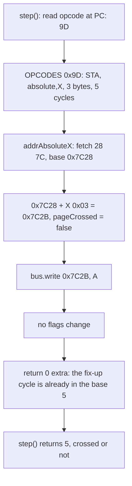
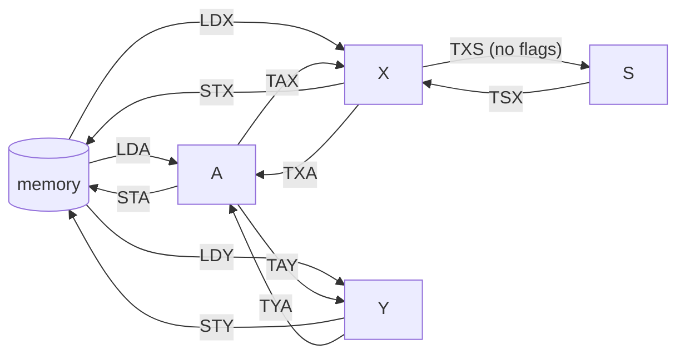
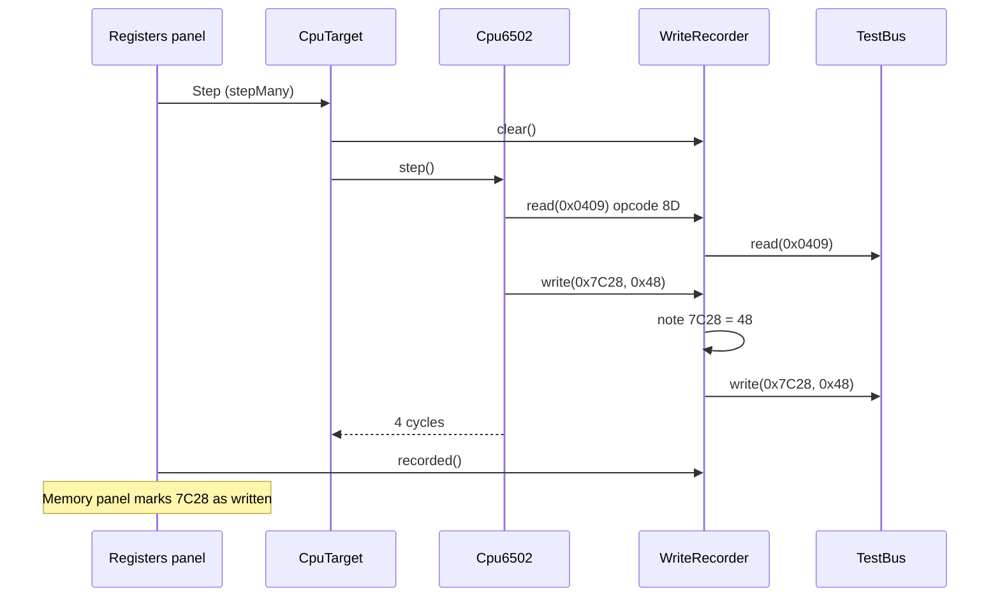
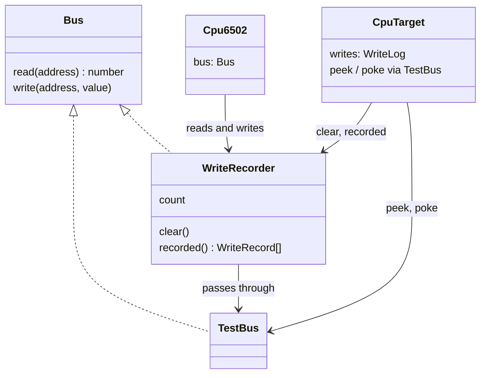

# Stage 07: Stores & transfers

> **Part:** 2 (The 6502 CPU) · **Branch:** `stage/07-stores-transfers` · **Needs:** 06
> **Status:** done

## Goal

Stage 06 taught the CPU to copy a byte **from memory into a register**. This stage adds the other two directions:

- **Stores** (`STA`, `STX`, `STY`, 13 opcodes) copy a register **into memory**. They are the first instructions that *write* to the bus.
- **Transfers** (`TAX`, `TAY`, `TXA`, `TYA`, `TSX`, `TXS`, 6 opcodes) copy **one register into another**, without touching memory at all.

With loads, stores and transfers in place, the CPU can move data anywhere: memory to register, register to register, and register back to memory. Everything else in Part 2 is about *changing* data on the way.

Two hardware details make this stage more than "loads backwards":

1. **Stores never take the page-cross shortcut.** `LDA &7C28,X` takes 4 cycles unless the index carries into the high byte. `STA &7C28,X` *always* takes 5.
2. **`TXS` is the only transfer that doesn't set N and Z.** The other five do.

## What you can now see

### In the browser

```bash
npm run dev      # then open http://localhost:5173
```

The playground now starts on the Stage 07 program. The **Program** panel lists 20 hand-assembled lines at `&0400` that copy "HELLO" from row 0 of the Mode 7 screen to row 1:

```
   Address Bytes     Source        Watch for
 ▶ &0400   BA        TSX           X=&FD: reset left S at &FD. TSX sets N=1
   &0401   A2 FF     LDX #&FF      X=&FF, ready for the stack
   &0403   A9 00     LDA #&00      A=&00: Z=1, N=0
   &0405   9A        TXS           S=&FF. No flags: N stays 0 though &FF is negative
   &0406   AD 00 7C  LDA &7C00     A="H" (&48)
   &0409   AA        TAX           X=&48: a copy, A still holds "H"
   &040A   8E 28 7C  STX &7C28     writes "H" at &7C28, row 1 of Mode 7
   &040D   AD 01 7C  LDA &7C01     A="E" (&45)
   &0410   A8        TAY           Y=&45: a copy of A
   &0411   8C 29 7C  STY &7C29     writes "E" at &7C29
   &0414   AE 02 7C  LDX &7C02     X="L" (&4C)
   &0417   8A        TXA           A=&4C: a copy of X
   &0418   8D 2A 7C  STA &7C2A     writes "L" at &7C2A: 4 cycles
   &041B   A2 03     LDX #&03      X=&03
   &041D   9D 28 7C  STA &7C28,X   writes "L" at &7C2B: 5 cycles, no page crossed
   &0420   AC 04 7C  LDY &7C04     Y="O" (&4F)
   &0423   98        TYA           A=&4F: a copy of Y
   &0424   A0 2C     LDY #&2C      Y=&2C (44)
   &0426   91 70     STA (&70),Y   pointer &7C00 + &2C: writes "O" at &7C2C, 6 cycles
   &0428   8D 04 7C  STA &7C04     "O" over "O": written, but not changed
```

Under the Memory table there's a new line: **`Wrote: nothing in the last run`**.

Things to try:

1. **Step once (`TSX`).** X becomes `&FD` and **N** lights. S was `&FD` after reset, and `TSX` sets N and Z from it.
2. **Step three more times (to `TXS`).** S becomes `&FF`, but **N stays off and Z stays on**, exactly as `LDA #&00` left them. X = `&FF` has bit 7 set, and a `TAX` would have turned N on. `TXS` doesn't.
3. **Type `&7C00` in the Memory panel's address box and press Go**, so you can watch the screen memory. Then step through `LDA &7C00`, `TAX` and `STX &7C28`. The message says `Ran 1 (4 cycles), 1 write`, byte `&7C28` turns **bold with a blue bar** (and yellow, because it also changed from `&00`), and the line underneath reads `Wrote: &7C28 ← &48`.
4. **Step on to `STA &7C28,X`** (line 15). The message says **`Ran 1 (5 cycles)`**. `&7C28 + 3` doesn't cross a page, but a store pays the fix-up cycle anyway. Compare it with the 4 cycles `LDA &7C00,X` took in Stage 06.
5. **Step to the last line, `STA &7C04`.** Byte `&7C04` gets the blue bar but **no yellow fill**. The CPU wrote it, but the value (`&4F`, "O") didn't change. Row `7C20`'s ASCII column now reads `........HELLO...`.
6. **Press Reset, then Step ×16.** All four writes from those 16 instructions are marked at once, and the message says `Ran 16 (49 cycles), 4 writes`. Click an address in the **Wrote:** line to jump to it.
7. **Poke a byte** (click `&7C05`, type `21`, Enter). It turns yellow (changed) but gets no blue bar. A poke is the debugger's write, not the CPU's.

The Stage 06 program is still available at **http://localhost:5173/?program=loads**.


*(The screenshot is a local file in the gitignored `.playwright-mcp/` folder. Re-create it with step 6.)*

### In the terminal

```bash
npm run demo:stores
```

```
Stage 07: stores & transfers. Each line is one cpu.step().

row 0 (&7C00): "HELLO, BBC MICRO"   row 1 (&7C28): "................"
after reset                         A=00 X=00 Y=00 S=FD  N=0 Z=0

addr  bytes     source         cyc  registers after               wrote        watch for
----  --------  -------------  ---  ----------------------------  -----------  ---------
0400  BA        TSX              2  A=00 X=FD Y=00 S=FD  N=1 Z=0               X=&FD: reset left S at &FD. TSX sets N=1
0401  A2 FF     LDX #&FF         2  A=00 X=FF Y=00 S=FD  N=1 Z=0               X=&FF, ready for the stack
0403  A9 00     LDA #&00         2  A=00 X=FF Y=00 S=FD  N=0 Z=1               A=&00: Z=1, N=0
0405  9A        TXS              2  A=00 X=FF Y=00 S=FF  N=0 Z=1               S=&FF. No flags: N stays 0 though &FF is negative
0406  AD 00 7C  LDA &7C00        4  A=48 X=FF Y=00 S=FF  N=0 Z=0               A="H" (&48)
0409  AA        TAX              2  A=48 X=48 Y=00 S=FF  N=0 Z=0               X=&48: a copy, A still holds "H"
040A  8E 28 7C  STX &7C28        4  A=48 X=48 Y=00 S=FF  N=0 Z=0  &7C28←48     writes "H" at &7C28, row 1 of Mode 7
040D  AD 01 7C  LDA &7C01        4  A=45 X=48 Y=00 S=FF  N=0 Z=0               A="E" (&45)
0410  A8        TAY              2  A=45 X=48 Y=45 S=FF  N=0 Z=0               Y=&45: a copy of A
0411  8C 29 7C  STY &7C29        4  A=45 X=48 Y=45 S=FF  N=0 Z=0  &7C29←45     writes "E" at &7C29
0414  AE 02 7C  LDX &7C02        4  A=45 X=4C Y=45 S=FF  N=0 Z=0               X="L" (&4C)
0417  8A        TXA              2  A=4C X=4C Y=45 S=FF  N=0 Z=0               A=&4C: a copy of X
0418  8D 2A 7C  STA &7C2A        4  A=4C X=4C Y=45 S=FF  N=0 Z=0  &7C2A←4C     writes "L" at &7C2A: 4 cycles
041B  A2 03     LDX #&03         2  A=4C X=03 Y=45 S=FF  N=0 Z=0               X=&03
041D  9D 28 7C  STA &7C28,X      5  A=4C X=03 Y=45 S=FF  N=0 Z=0  &7C2B←4C     writes "L" at &7C2B: 5 cycles, no page crossed
0420  AC 04 7C  LDY &7C04        4  A=4C X=03 Y=4F S=FF  N=0 Z=0               Y="O" (&4F)
0423  98        TYA              2  A=4F X=03 Y=4F S=FF  N=0 Z=0               A=&4F: a copy of Y
0424  A0 2C     LDY #&2C         2  A=4F X=03 Y=2C S=FF  N=0 Z=0               Y=&2C (44)
0426  91 70     STA (&70),Y      6  A=4F X=03 Y=2C S=FF  N=0 Z=0  &7C2C←4F     pointer &7C00 + &2C: writes "O" at &7C2C, 6 cycles
0428  8D 04 7C  STA &7C04        4  A=4F X=03 Y=2C S=FF  N=0 Z=0  &7C04←4F     "O" over "O": written, but not changed

row 0 (&7C00): "HELLO, BBC MICRO"   row 1 (&7C28): "HELLO..........."
PC=&042B, 70 cycles since power-on (7 of them reset).
```

Notice that the N and Z columns never change on a store line. Stores don't touch the flags.

## The real hardware

### What stores and transfers do

From the *MCS6500 Programming Manual* (§2.1–2.3 for stores, §7 for transfers):

| Instruction | Operation | Flags changed |
|---|---|---|
| `STA` | A → M | none |
| `STX` | X → M | none |
| `STY` | Y → M | none |
| `TAX` | A → X | N, Z |
| `TAY` | A → Y | N, Z |
| `TXA` | X → A | N, Z |
| `TYA` | Y → A | N, Z |
| `TSX` | S → X | N, Z |
| `TXS` | X → S | **none** |

A **store changes no flags at all**. It doesn't produce a new value, it only puts an existing one somewhere. A **transfer is a copy, not a move**. After `TAX`, A still holds its value, and X holds the same value too.

### The 13 store opcodes

This is the store section of the opcode table (MCS6500 Programming Manual, Appendix B; 6502.org opcode table). There are no `+` marks in the cycles column, because a page crossing never changes a store's time:

| Mode | `STA` | `STX` | `STY` | Bytes | Cycles |
|---|---|---|---|---|---|
| zero page `&nn` | `85` | `86` | `84` | 2 | 3 |
| zero page,X `&nn,X` | `95` | — | `94` | 2 | 4 |
| zero page,Y `&nn,Y` | — | `96` | — | 2 | 4 |
| absolute `&nnnn` | `8D` | `8E` | `8C` | 3 | 4 |
| absolute,X `&nnnn,X` | `9D` | — | — | 3 | **5** |
| absolute,Y `&nnnn,Y` | `99` | — | — | 3 | **5** |
| (indirect,X) `(&nn,X)` | `81` | — | — | 2 | 6 |
| (indirect),Y `(&nn),Y` | `91` | — | — | 2 | **6** |

That's 7 + 3 + 3 = **13 opcodes**. Compare it with the loads table from Stage 06:

- **There's no immediate store.** `STA #&41` would mean "store A into the operand byte", so the program would overwrite itself. The slot where it would be, `&89`, does nothing on the NMOS 6502 (it's an undocumented 2-byte NOP), and we leave it empty.
- **`STX` and `STY` have no absolute indexed modes.** `LDX &nnnn,Y` exists, but `STX &nnnn,Y` doesn't. Only the zero-page indexed forms survived (`STX &nn,Y` and `STY &nn,X`). The empty slots `&9E` and `&9C` hold unstable undocumented opcodes, which is out of scope. Stage 08's assembler has to reject `STX &2000,Y`.
- **The three bold cycle counts are one more than the matching load's base time.** That is the page-cross story, below.

### The 6 transfer opcodes

| Instruction | Opcode | Bytes | Cycles |
|---|---|---|---|
| `TAX` | `AA` | 1 | 2 |
| `TAY` | `A8` | 1 | 2 |
| `TXA` | `8A` | 1 | 2 |
| `TYA` | `98` | 1 | 2 |
| `TSX` | `BA` | 1 | 2 |
| `TXS` | `9A` | 1 | 2 |

These are all *implied* mode: the opcode names both registers, so there's no operand. They take 2 cycles, like `NOP`: one to fetch the opcode, and one in which the copy happens (the chip also does a discarded read of the next byte, which we don't model).

**There is no `TAS`, `TYS` or `TSY`.** The only way into or out of S is through X. If you want to save S in memory, you do `TSX : STX &70`.

## Key concepts

### 1. Why stores always pay for the page crossing

Stage 05 explained the optimistic trick used by indexed reads. The 6502 has an 8-bit adder, so for `&nnnn,X` it adds X to the **low byte** first, and immediately **reads** from (old high byte, new low byte). If the add didn't carry, that guess was right and the instruction is done. If it did carry, the CPU throws the byte away, fixes the high byte in an extra cycle, and reads again.

For a read, a wrong guess is harmless: the wrong byte is ignored. **A write can't be thrown away.** If `STA &7CFF,X` with X = `&01` wrote straight away, it would write to `&7C00`, which is the wrong address, and that byte in memory would be destroyed. So a store **always** waits for the fix-up cycle, carry or not, and only then writes.

Here is the cycle-by-cycle version for `STA &7CFF,X` with X = `&01` (based on the per-cycle tables in the *MCS6500 Hardware Manual* and 6502.org's "6502.txt" cycle timing notes):

| Cycle | Address bus | R/W | What happens |
|---|---|---|---|
| 1 | PC | read | fetch opcode `&9D` |
| 2 | PC+1 | read | fetch low byte `&FF` |
| 3 | PC+2 | read | fetch high byte `&7C`, and add X to the low byte: `&FF + &01 = &00`, carry 1 |
| 4 | `&7C00` | read | **dummy read** at (old high, new low), while the high byte is fixed: `&7C + 1 = &7D` |
| 5 | `&7D00` | **write** | store A at the correct address |

When nothing carries (`STA &7C28,X` with X = `&03`), cycle 4 still happens. It reads `&7C2B`, which is the right address, but the CPU writes nothing until cycle 5. The chip doesn't check whether the carry happened, so the time is always 5. That's why the table has no `+`.

The same goes for `STA &nnnn,Y` (5, against `LDA`'s 4+) and `STA (&nn),Y` (6, against `LDA`'s 5+). In our emulator this means **a store's execute function ignores `cpu.pageCrossed` and returns 0 extra cycles**. The extra cycle is already in the base count.

The same rule will come back in Stage 09. Read-modify-write instructions such as `INC &nnnn,X` write too, so they always take their full time.

> **Why this matters on a BBC Micro:** that dummy read in cycle 4 is a real bus read. On RAM it's harmless. On a device register in SHEILA (`&FE00`–`&FEFF`), a read can have side effects: reading the System VIA's T1 low counter clears its interrupt flag. So `STA &FE3F,X` with X = `&05` (which crosses into `&FE44`) actually *reads* `&FE44` before writing it. We don't model dummy reads yet (see the parking lot in `PROGRESS.md`), but this is the kind of detail Part 12's cycle-exact extras would add.

### 2. Transfers set N and Z, except `TXS`

`TAX`, `TAY`, `TXA`, `TYA` and `TSX` all set N and Z from the value copied, the same way a load does (Stage 06):

- `TAX` with A = `&80`: X = `&80`, N = 1, Z = 0.
- `TYA` with Y = `&00`: A = `&00`, N = 0, Z = 1.
- `TSX` just after our reset (S = `&FD`): X = `&FD`, N = 1, Z = 0.

**`TXS` changes no flags.** The manual just lists its flags as "none". Here's the most likely reason:

- **S isn't a data register. It's the stack's bookkeeping.** You set it once at reset, or restore it when unwinding, and you never want to *test* it the way you'd test a loaded value.
- **Code that sets S often needs the flags untouched.** A routine can save S with `TSX : STX save`, and later put it back with `LDX save : TXS`. If `TXS` set flags, restoring the stack would clobber the N and Z that the code is about to branch on.

That second point is a design rationale, not something the datasheet states, so treat it as the likely reason rather than a fact.

The asymmetry trips people up. **`TSX` sets flags and `TXS` doesn't.** Our playground program shows both. Its first line is `TSX`, which turns N on because S = `&FD`. Three lines later, `TXS` copies X = `&FF` into S, and N stays *off*, even though `&FF` has bit 7 set.

### 3. Why every 6502 program starts with `LDX #&FF : TXS`

On a real 6502, S comes up at power-on with whatever value the transistors settle to. Reset then drops it by 3 (Stage 04). So **S is unpredictable after reset**, and any program that's going to use the stack must set it first. `TXS` is the only way to write S, and only X can feed it:

```
LDX #&FF     ; A2 FF
TXS          ; 9A      S = &FF: the next push goes to &01FF, the top of page 1
```

The stack lives in page 1 (`&0100`–`&01FF`). It grows **downwards**, and S holds the low byte of the next free slot (Stage 15 builds the push and pull instructions). `&FF` gives the whole page. I believe MOS 1.20's reset routine (at `&D9CD`) does exactly this within its first few instructions. We'll confirm it when we single-step into the MOS in Stage 23.

Our emulator starts S at `&00`, so after reset S is `&FD`. That's why the playground's `TSX` gives `&FD`.

### 4. Every transfer is a load or a store in disguise

Stage 06 showed that the 6502's decoder splits each opcode into `aaa bbb cc`, and that `aaa = %101` means "load" (`&A0`–`&BF`). For stores, `aaa = %100` (`&80`–`&9F`). Now look at where the transfers sit:

| Opcode | Binary `aaa bbb cc` | `aaa` | Reads like |
|---|---|---|---|
| `TAX` `&AA` | `101 010 10` | load, `LDX` column | "load X from A" |
| `TSX` `&BA` | `101 110 10` | load, `LDX` column | "load X from S" |
| `TAY` `&A8` | `101 010 00` | load, `LDY` column | "load Y from A" |
| `TXA` `&8A` | `100 010 10` | store, `STX` column | "store X into A" |
| `TXS` `&9A` | `100 110 10` | store, `STX` column | "store X into S" |
| `TYA` `&98` | `100 110 00` | store, `STY` column | "store Y into A" |

Every transfer **into** X or Y is in the load rows, and every transfer **out of** X or Y is in the store rows. The chip reuses the load/store logic, with a register standing in for memory. It also explains the flags pattern:

- **Loads set N and Z**, so the "load X/Y from …" transfers do too.
- **Stores set nothing**, so you might expect the "store …" transfers to set nothing either. But `TXA` and `TYA` do set N and Z, because the destination is A, and writing A always updates N and Z. Only `TXS`, whose destination is S, keeps the store's "no flags" behaviour.

We don't decode opcodes this way (a 256-entry table is simpler), but it helps the table stop looking random.

### 5. A write is not the same as a change

This stage's observable outcome is the Memory panel **highlighting bytes the CPU wrote**. The panel already has a "changed" highlight (since Stage 03), which compares this view with the previous one. Why do we need another?

Because **a write and a change are different events**:

| Event | Written? | Changed? |
|---|---|---|
| `STA &7C04` when A = `&4F` and `&7C04` already holds `&4F` | **yes** | no |
| You poke `&7C05` from the Memory panel | no (the CPU didn't do it) | **yes** |
| `STA &7C28` when A = `&48` and `&7C28` held `&00` | **yes** | **yes** |

On a real machine the first row matters. Writing the same value to a RAM byte does nothing visible, but writing to a device register is an *action*. For example, writing `&00` to the 6845 CRTC's address register selects register 0, even if it was already selected. The emulator's devices will see every write, so the debugger should too.

To see writes, we put a **recorder** between the CPU and the bus. It passes every read and write straight through, and also notes each write's address and value in a small pre-allocated buffer. The CPU doesn't know it's there, because it still only sees a `Bus`.

## Diagrams

How one `STA &7C28,X` runs (X = `&03`), compared with the load from Stage 06:



The data paths this stage adds. Loads (Stage 06) move memory into registers, and now stores go back the other way and transfers move between registers. S only connects to X:



Where the write recorder sits. The CPU, the panels and the bus each keep their own job:



## Our design

### Stores: the same factory shape as loads

```ts
// src/cpu/instructions/stores.ts
function store(register: 'a' | 'x' | 'y', mode: AddressedMode): (cpu: Cpu6502) => number {
  const effectiveAddress = EFFECTIVE_ADDRESS[mode];   // looked up once, at module load
  return (cpu) => {
    cpu.bus.write(effectiveAddress(cpu), cpu.regs[register]);
    return 0;   // never +1: the fix-up cycle is in the base count
  };
}
```

It mirrors Stage 06's `load` exactly, with two differences: it **writes** instead of reading, and it **returns 0**. Nothing else changes. No flags, no `pageCrossed` check. The 13 rows read like the manual's table: `sta(0x9d, 'absoluteX', 3, 5)`.

The EA functions from Stage 05 still set `cpu.pageCrossed` for stores. The store simply doesn't look at it. That keeps the addressing modes ignorant of who's calling them, which is the point of having them separate.

### Transfers: one factory, plus `TXS` on its own

```ts
// src/cpu/instructions/transfers.ts
function transfer(from: Register8, to: 'a' | 'x' | 'y'): (cpu: Cpu6502) => number {
  return (cpu) => {
    const value = cpu.regs[from];
    cpu.regs[to] = value;
    setNZ(cpu.regs, value);
    return 0;
  };
}

/** TXS: X → S. The one transfer that sets no flags. */
function txs(cpu: Cpu6502): number {
  cpu.regs.s = cpu.regs.x;
  return 0;
}
```

`TXS` is deliberately **not** `transfer('x', 's')` with a "skip the flags" option. The type of `to` doesn't even allow `'s'`, so the factory *can't* build a flag-setting `TXS` by mistake. The special case gets its own function and its own comment.

### The write recorder

A new core class, `WriteRecorder` in `src/memory/write-recorder.ts`:

- It **implements `Bus`** and wraps another `Bus`. `read()` passes straight through. `write()` passes through, and also notes the address and value.
- **No allocation on the hot path.** The notes go into a pre-allocated `Uint16Array` (addresses) and `Uint8Array` (values) of fixed capacity (64). `write()` just stores two numbers and bumps a count. If more than 64 writes happen before the next `clear()`, the count keeps going but the extra entries aren't kept, and the panel says "+N more".
- `clear()` resets the count. `recorded()` builds an array of `{ address, value }` for the debug views. It allocates, but it's only called by the workbench, never by `step()`.

It lives in `src/memory/` and is DOM-free. It's a debugging tool, but it's a *bus*, and it will work in front of the real memory map in Stage 21 too.

**What counts as "the last step"?** When you click **Step ×16**, should the panel show the writes of the 16th instruction only, or of all 16? Showing all 16 is more useful, so the rule is: **`stepMany` clears the recorder once, then runs its instructions.** The highlight covers everything written since you last pressed a run button. One click of **Step** is one instruction, so that's the same thing.

**Pokes aren't recorded.** The debug target's `poke()` writes to the `TestBus` directly, not through the recorder, because a poke is the debugger's write and not the CPU's.

### The workbench

- `CpuTarget` gains `writes`, the recorder (seen through the narrower `WriteLog` interface: count, read, clear). `playgroundTarget(bus)` now builds the CPU and the recorder itself, so there's exactly one place where they're wired together.
- `buildMemoryView` takes its optional extras as an options object (`{ previous, pc, written }`) now that there are three of them. Each `MemoryCell` gains `written: boolean`.
- The Memory panel draws written bytes in **bold with a blue bar underneath**. It stays distinct from the yellow "changed" fill and the red PC outline, so a byte can show any combination. Under the table, a line lists the last run's writes, for example `Wrote: &7C28 ← &48`. Each address is a button that jumps to that page, because most stores in the program land on page `&7C`, not on page `&04` where the panel opens.
- The Registers panel's message mentions writes: `Ran 1 (4 cycles), 1 write`.

### The playground program

There's a new hand-assembled listing in `src/playground/stores-program.ts`. It copies "HELLO" from row 0 of the Mode 7 screen (`&7C00`) to row 1 (`&7C28`, since a Mode 7 row is 40 = `&28` bytes). Each letter takes a different route through the registers, using each transfer once and five different store forms. It ends with a store that writes the same value a byte already holds, so you can see a write that isn't a change.

The browser playground now runs this program. The Stage 06 loads program is still there: open `/?program=loads` to run it instead (the e2e tests for Stage 06 use this). The shared set-up ("HELLO, BBC MICRO" at `&7C00`, the pointer at `&70`) moves into `src/playground/setup.ts` so the browser, the CLI demos and the tests can't drift apart.



## Code walkthrough

- [`src/cpu/instructions/stores.ts`](../../src/cpu/instructions/stores.ts): `store(register, mode)` looks up the EA function once and returns `(cpu) => { cpu.bus.write(ea(cpu), cpu.regs[register]); return 0; }`. The `STORES` table has 13 rows, and the indexed rows are commented with "always 5 (LDA is 4+)".
- [`src/cpu/instructions/transfers.ts`](../../src/cpu/instructions/transfers.ts): `transfer(from, to)` for the five flag-setting copies. `to` has the type `'a' | 'x' | 'y'`, so it can't target S. `txs` is a separate two-line function.
- [`src/cpu/opcodes.ts`](../../src/cpu/opcodes.ts): `GROUPS` now has `[NOP], LOADS, STORES, TRANSFERS`, which is 38 opcodes. `buildTable` would throw if any of them collided.
- [`src/memory/write-recorder.ts`](../../src/memory/write-recorder.ts): `WriteRecorder implements Bus`. `write()` stores into a `Uint16Array`/`Uint8Array` pair (capacity 64) and passes the write on. `recorded()` (which allocates, and is for the debug views only) and `clear()`. `WriteLog` is the narrower interface the workbench sees.
- [`src/web/workbench/debug-target.ts`](../../src/web/workbench/debug-target.ts): `playgroundTarget(bus)` wires `Cpu6502 → WriteRecorder → TestBus`, with `peek`/`poke` going straight to the `TestBus`. `CpuTarget.writes`.
- [`src/web/workbench/registers-view-model.ts`](../../src/web/workbench/registers-view-model.ts): `stepMany` clears the log once and returns `writes`. `describeRun` builds the "Ran 1 (4 cycles), 1 write" message (moved out of the panel so Jest can test it).
- [`src/web/workbench/memory-view-model.ts`](../../src/web/workbench/memory-view-model.ts): `buildMemoryView(target, start, rows, { previous, pc, written })`, `MemoryCell.written`, and `summariseWrites` for the "Wrote:" line.
- [`src/web/workbench/memory-panel.ts`](../../src/web/workbench/memory-panel.ts): the `written` class, and the "Wrote:" line whose addresses are buttons that call `goTo`. The CSS is in [`index.html`](../../index.html) (`--written`, `td.byte.written`).
- [`src/playground/setup.ts`](../../src/playground/setup.ts): `loadPlaygroundData` (the message and the `&70` pointer), now shared by `main.ts`, both demos and both program tests.
- [`src/playground/stores-program.ts`](../../src/playground/stores-program.ts): the 20-line listing.
- [`src/main.ts`](../../src/main.ts): picks the program from `?program=` (default `stores`), and passes `target.writes` to the Memory panel.
- [`scripts/demo-stores.ts`](../../scripts/demo-stores.ts): the CLI trace (`npm run demo:stores`).

## Tests

| Test file | What it proves |
|---|---|
| `src/cpu/instructions/stores.test.ts` | **Every one of the 13 opcodes:** it writes the register to the EA; it makes **exactly one** bus write (checked with a `WriteRecorder`); it changes no register and no flag (tried with all flags set and all clear, storing values that would set N or Z if it were a load); PC advance and cycles. **Page crossing:** `9D 99 91` at `&30F8 + &10` write `&3108` (not `&3008`) in the *same* time as when they stay in the page. **Table:** 7/3/3, all in `&80`–`&9F`, no immediate (`&89` empty), no `&9E`/`&9C`, and the indexed stores are exactly LDA's base + 1. **Wrap-around:** `STA &FF,X`, `STX &FF,Y`, and `STA (&FF),Y` with its pointer split across `&FF`/`&00`. A store-then-load round trip. |
| `src/cpu/instructions/transfers.test.ts` | Each of the 6: copies (the source keeps its value), changes only the destination (plus N, Z) and PC; `&00`/`&80`/`&41` flag cases for the five that set flags; for `TXS`, N and Z are left exactly as they were for each of those values. 1 byte, 2 cycles. "Into X/Y" opcodes are in the load rows, "out of X/Y" in the store rows. `TSX` after reset gives `&FD`; `LDX #&FF : TXS`; `TSX : TXS` round trip. |
| `src/memory/write-recorder.test.ts` | Reads pass through and aren't recorded; writes pass through and are recorded in order; a same-value write is still recorded; masking; `clear()`; capacity (keeps 64, counts the rest, and the extra writes still reach memory). |
| `src/playground/stores-program.test.ts` | The hand assembly is contiguous and every opcode byte matches its mnemonic; it uses all six transfers and all three stores; line by line, the registers, S, N/Z, cycles **and writes** match the comments; it ends with "HELLO" at `&7C28` and row 0 intact; 6 writes in 63 cycles. |
| `src/web/workbench/memory-view-model.test.ts` | Updated for the options object. New: `written` marks a same-value write that isn't `changed`; `summariseWrites` text, "+N more", empty. |
| `src/web/workbench/registers-view-model.test.ts` | New: the target records CPU writes but not pokes; `stepMany` clears once per run and counts its writes; `describeRun` messages. The "not implemented" examples now use `&E8` (`INX`, Stage 09). |
| `src/cpu/cpu6502.test.ts` | The table now holds 38 opcodes (NOP + 18 + 13 + 6); the unimplemented-opcode example is `&E8`. |
| `e2e/stores.spec.ts` | In the browser: the 20-line listing; `TSX` sets N but `TXS` leaves N and Z; a load writes nothing; `STX &7C28` is marked, and its Wrote link jumps to it; `STA &7C28,X` takes 5 cycles; "O" over "O" is written but not changed; Step ×16 marks all 4 writes; a poke is changed but not written. |
| `e2e/loads.spec.ts`, `e2e/cpu.spec.ts` | Loads now runs at `/?program=loads`. The CPU spec is updated for the new default program (first step is `TSX`, and it stops at `&0500` after 496 cycles). |

Totals: **509 Jest tests and 28 Playwright tests, all passing**. I checked that the tests can fail: making stores pay `+1` on a page cross, and making `TXS` set N and Z, gave 8 failures. No tests need ROMs.

## Gotchas & hardware quirks

- **Stores never return `pageCrossed ? 1 : 0`.** It's the easiest copy-paste bug from `loads.ts`, and the crossing tests are there to catch it. The fix-up cycle is in the base count: `9D`/`99` are 5, and `91` is 6.
- **A store sets no flags.** `STA` of `&00` doesn't set Z. If you want to test a value, you load it (or transfer it), not store it.
- **`TSX` sets flags, `TXS` doesn't.** The type of `transfer`'s `to` parameter makes it impossible to build a flag-setting `TXS` by accident.
- **No `STA #&nn`, no `STX &nnnn,Y`, no `STY &nnnn,X`.** Those slots (`&89`, `&9E`, `&9C`) hold undocumented opcodes and stay empty here. Stage 08's assembler must reject these forms.
- **S only talks to X.** To save S you need `TSX : STX somewhere`. That costs you X.
- **A write isn't a change.** That's why the recorder exists, rather than relying on the panel's diff. It will matter for device registers from Part 4 onwards.
- **The recorder is "since the last run", not "this instruction".** Step ×16 shows all 16 instructions' writes, because `stepMany` clears the log once. The console's `workbench.step()` clears before each step.
- **Pokes bypass the recorder** because `peek`/`poke` go to the `TestBus` directly. If they went through the CPU's bus, your own edits would show as CPU writes.
- **Not modelled:** the dummy read in cycle 4 of an indexed store (a real bus read, which matters on SHEILA). It's already in the parking lot along with the other dummy reads.
- **Memory panel jumps are row-aligned.** Clicking `&7C28` in the Wrote line shows rows from `7C20`, because `goTo` aligns to the 16-byte row, as it always has.

## Playwright verification

- **MCP (interactive):** I opened the dev server, went to `&7C00`, and stepped all 20 lines. The final message was `Ran 1 (4 cycles), 1 write`, the Wrote line read `Wrote: &7C04 ← &4F`, and `&7C04` was the only written cell, with **no** `changed` class. After a reload and **Step ×16**, the Wrote line read `&7C28 ← &48, &7C29 ← &45, &7C2A ← &4C, &7C2B ← &4C`, and a screenshot of the Memory panel showed those four bytes bold with a blue bar (and yellow, since they changed from `&00`). There were no console warnings or errors.
- **Durable:** `e2e/stores.spec.ts` (8 tests), plus the updated `cpu.spec.ts` and `loads.spec.ts`. `npm run test:e2e` gives 28 passed.

## Check your understanding

1. `LDA &20F8,X` with X = `&10` takes 5 cycles. How long does `STA &20F8,X` take with the same X, and how long with X = `&01`? Why?
2. After `LDA #&00 : LDX #&80 : TXS`, what are N and Z? What would they be if the last instruction were `TXA` instead?
3. A routine wants to save the stack pointer at `&70` and restore it later. Write the four instructions, and say which register you lose.
4. Hand-assemble `STY &70,X`, `STX &2000` and `STA (&70),Y`. Why can't you assemble `STX &2000,Y`?
5. A program does `LDA &7C04 : STA &7C04`. Memory doesn't change. Why does the workbench still mark `&7C04`, and why might that matter on a real BBC Micro?

<details>
<summary>Answers</summary>

1. 5 cycles both times. A store always spends the fix-up cycle, because writing to the not-yet-fixed address would destroy the wrong byte. So crossing (`&20F8 + &10 = &2108`) and not crossing (`&20F9`) cost the same. The load gets 4 when it doesn't cross, because a wrong guess for a read is simply discarded.
2. `TXS` sets no flags, so they're still the ones `LDX #&80` set: N = 1, Z = 0. With `TXA` instead, A becomes `&80` and the flags are set from it, which also gives N = 1, Z = 0. To see the difference, try `LDX #&80 : LDA #&00 : TXS` instead: the flags stay at Z = 1, N = 0 from the `LDA`, while `TXA` in its place would give N = 1, Z = 0.
3. `TSX : STX &70` to save, and `LDX &70 : TXS` to restore. You lose X both times, because S only connects to X.
4. `STY &70,X` = `94 70`, `STX &2000` = `8E 00 20` and `STA (&70),Y` = `91 70`. There is no absolute,Y form of `STX`. Its slot `&9E` holds an unstable undocumented opcode, so an assembler has to reject it (only `STX &nn,Y`, `96`, exists).
5. Because the CPU really did a write cycle there. The recorder notes writes, not changes. On RAM it makes no difference, but at a device register (SHEILA, `&FExx`) a write is an action, for example selecting a CRTC register or acknowledging an interrupt. Repeating a value can still do something.

</details>

## Further reading

- *MCS6500 Microcomputer Family Programming Manual* (MOS Technology, 1976): §2 for `STA`/`STX`/`STY`, §7 for the transfers and the stack pointer, and Appendix B for the opcode table.
- *MCS6500 Microcomputer Family Hardware Manual*, Appendix A: cycle-by-cycle bus activity, including the dummy read before an indexed write.
- 6502.org: the NMOS 6502 opcode table, and "6502 Instruction Set Decoding" for the `aaabbbcc` layout.
- *BBC Microcomputer Advanced User Guide*, memory map chapter: `&7C00` as the Mode 7 screen, and page 1 as the 6502 stack.
