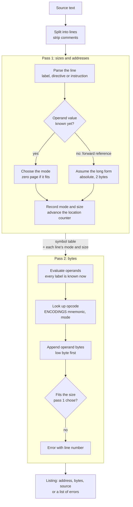
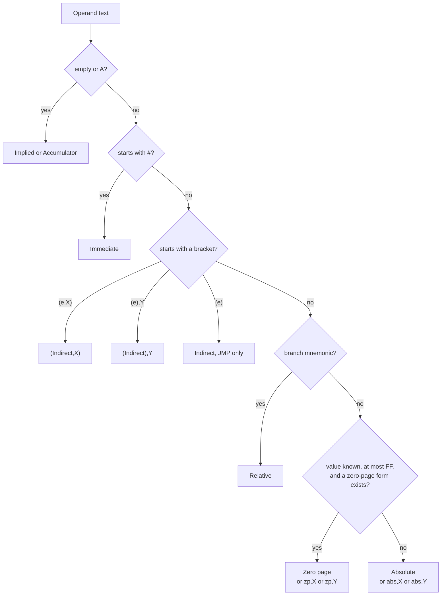
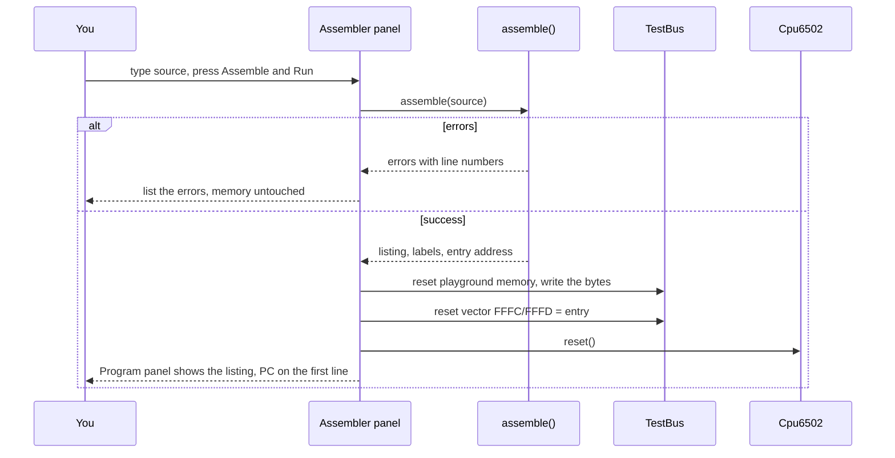

# Stage 08: Mini assembler

> **Part:** 2 (The 6502 CPU) · **Branch:** `stage/08-assembler` · **Needs:** 07
> **Status:** done

## Goal

Up to now every playground program was **hand-assembled**: we looked up each opcode in a table, counted bytes, worked out addresses, and typed hex into a listing. That's worth doing once, but it's slow and easy to get wrong. This stage builds a small **assembler**: a program that turns text like `LDA &7C00,X` into the bytes `BD 00 7C`.

It comes here, before most of the instruction set, for two reasons:

1. **Every later stage needs test programs.** From Stage 09 on, the demos have loops and branches. Branch offsets in particular are miserable to count by hand.
2. **Encoding is the mirror image of decoding.** The CPU's opcode table goes byte → (mnemonic, mode). The assembler's table goes (mnemonic, mode) → byte. Building both and checking that they agree is a strong test of each.

The assembler encodes **all 151 documented opcodes**, including the ones the CPU can't run yet. You can assemble `INX` today. Stepping onto it gives the familiar "unimplemented opcode" error until Stage 09.

## What you can now see

### In the browser

```bash
npm run dev      # then open http://localhost:5173
```

There's a new **Assembler** panel under Registers. It opens on the Stage 08 example, already assembled and loaded:

```
Assembled 36 bytes from 15 lines. Runs from &0400.
Labels: screen = &7C00, row2 = &7C50, ptr = &80, start = &0400, target = &041F, message = &0421
```

The **Program** panel now shows the *assembler's* listing, with labels in the Source column and ▶ on `start: LDA target`.

Things to try:

1. **Compare the first two lines of the Program panel.** `LDA target` is `AD 1F 04` (absolute, 3 bytes), because `target` is a forward reference. `STA ptr` is `85 80` (zero page, 2 bytes), because `ptr = &80` was defined before it was used.
2. **Find `target: .word row2` at `&041F`.** Its bytes are `50 7C`: `&7C50`, low byte first.
3. **Press Step 13 times**, then type `&7C50` into the Memory panel's address box and press Go. Row `7C50` starts `42 42 43`: "BBC".
4. **Step once more.** The status says `unimplemented opcode &50 at &041F`. The CPU ran straight off the end of the code into the `.word`, and `&50` (`BVC`) isn't implemented yet. The CPU can't tell code from data.
5. **Break the program on purpose.** Change the first `LDA message` to `LDA mesage` and add `STX &1234,Y` as a new last line, then press **Assemble & Run** (or Ctrl+Enter). You'll see each error with its line number, and the program that was already loaded stays loaded:
   ```
   2 errors: nothing was loaded.
   • line 15: unknown label "mesage"
   • line 26: STX has no Absolute,Y mode (it has &nn, &nn,Y, &nnnn)
   ```
6. **Write your own.** Clear the editor and type:
   ```
   *= &0400
   LDX #&41
   TXA
   STA &7C00
   ```
   Assemble & Run, then Step three times. A = `&41`, and `&7C00` now holds "A".
7. **Pick "Stage 07: stores & transfers"** from the dropdown and press Assemble & Run. You get the same 20 lines and bytes as the hand-assembled Stage 07 listing, and no line is marked "edited".

`?program=stores` and `?program=loads` still open on the earlier stages' programs.


*(The screenshot is a local file in the gitignored `.playwright-mcp/` folder. Reload http://localhost:5173 to see the same view.)*

### In the terminal

```bash
npm run demo:asm                       # the Stage 08 example
npm run demo:asm -- --example stores   # an earlier stage's program
npm run demo:asm -- my-program.asm     # your own file
```

```
Assembled example "labels"

addr  bytes     source                   ; comment
----  --------  -----------------------  ---------
0400  AD 1F 04  start: LDA target        ; forward reference: absolute, 3 bytes
0403  85 80     STA ptr                  ; ptr is already known: zero page, 2 bytes
0405  AD 20 04  LDA target+1
0408  85 81     STA ptr+1                ; the pointer at &80/&81 now holds &7C50
040A  A0 00     LDY #0
040C  AD 21 04  LDA message              ; "B"
040F  91 80     STA (ptr),Y              ; to &7C50
0411  A0 01     LDY #1
0413  AD 22 04  LDA message+1            ; "B"
0416  91 80     STA (ptr),Y              ; to &7C51
0418  AE 23 04  LDX message+2            ; "C"
041B  8E 52 7C  STX row2+2               ; to &7C52, no pointer needed
041E  EA        NOP                      ; the CPU can't stop yet: it runs on into the data
041F  50 7C     target: .word row2       ; a word is stored low byte first: 50 7C
0421  42 42 43  message: .byte &42, &42, &43  ; "BBC"

36 bytes. Entry: &0400
Labels: screen=&7C00  row2=&7C50  ptr=&80  start=&0400  target=&041F  message=&0421
```

A file with mistakes prints every error, and the command exits with status 1:

```
bad.asm: 3 error(s)
  line 2: unknown mnemonic "LDQ"
      loop: LDQ #1
  line 3: STX has no Absolute,Y mode (it has &nn, &nn,Y, &nnnn)
      STX &1234,Y
  line 4: BNE target &0500 is 252 bytes away; a branch reaches -128..+127
      BNE far
```

## The real hardware

There's no assembler chip. The CPU only ever sees bytes: it has no idea what "LDA" means. An assembler is a **tool for people**, and everything it knows comes from the CPU's instruction encoding:

- **Each opcode is one byte**, `&00`–`&FF`. The NMOS 6502 documents 151 of them, spread over **56 mnemonics** and **13 addressing modes** (MCS6500 Microcomputer Family Programming Manual, Appendix B, "Instruction set summary").
- **Operands follow the opcode** and are 0, 1 or 2 bytes long, decided by the mode. A 2-byte operand is stored **low byte first** (little-endian). `LDA &7C00,X` is `BD 00 7C`, not `BD 7C 00`.
- **The opcode table is sparse.** Not every mnemonic has every mode. `LDA` has 8 modes, `STA` has 7 (no immediate), `STX` has only 3, and `JMP` is the only instruction with plain `(indirect)`. An assembler must reject `STX &1234,Y` because no such opcode exists.
- **The opcodes have a pattern.** The 6502 decodes them with a PLA (Stage 04), which matches bit patterns. For the eight "group one" instructions (`ORA AND EOR ADC STA LDA CMP SBC`) the opcode is laid out as `aaabbbcc`:

  ```
   bit:  7 6 5   4 3 2   1 0
         a a a   b b b   c c
         │       │       └─ 01 = group one
         │       └─ addressing mode
         └─ which instruction
  ```

  | `bbb` | mode | | `aaa` | instruction |
  |---|---|---|---|---|
  | 000 | `(&nn,X)` | | 000 | ORA |
  | 001 | `&nn` | | 001 | AND |
  | 010 | `#&nn` | | 010 | EOR |
  | 011 | `&nnnn` | | 011 | ADC |
  | 100 | `(&nn),Y` | | 100 | STA |
  | 101 | `&nn,X` | | 101 | LDA |
  | 110 | `&nnnn,Y` | | 110 | CMP |
  | 111 | `&nnnn,X` | | 111 | SBC |

  So `LDA &nnnn,X` is `101 111 01` = `&BD`, and `STA #&nn` would be `100 010 01` = `&89`, which is exactly the slot that's *missing* from the documented table (it's an undocumented NOP on the NMOS 6502). We don't use this pattern to assemble, because the other groups are much less regular, but a test uses it as an independent check on the hand-typed encoding table.

### How BBC programmers did it

The BBC Micro has an assembler **built into BBC BASIC**. You write assembly between `[` and `]` inside a BASIC program, and BASIC assembles it when the line runs. Because a single run can't know where a *later* label is, the BBC User Guide teaches this idiom:

```basic
10 FOR pass% = 0 TO 2 STEP 2
20   P% = &0900
30   [ OPT pass%
40   .loop LDA &70 : BNE loop
50   ]
60 NEXT pass%
```

`P%` is the assembler's location counter, and the loop runs the assembler **twice**. `OPT 0` on the first pass hides "No such variable" errors for labels that haven't been seen yet. `OPT 2` on the second pass reports them. That's two-pass assembly done by hand, with a `FOR` loop. Our assembler does the same two passes internally.

Our syntax is closer to modern cross-assemblers than to BBC BASIC: labels end in `:` (BBC BASIC starts them with `.`), comments start with `;` (BBC BASIC uses `\`), and data uses `.byte`/`.word` (BBC BASIC uses `EQUB`/`EQUW`). The numbers use the BBC's `&`.

## Key concepts

### 1. Assembly is a notation for bytes

One line of assembly is one instruction, and it always becomes the same bytes:

```
LDA &7C00,X
│   │     └─ ,X        → mode is Absolute,X
│   └─ &7C00 (2 bytes) → operand bytes 00 7C (low first)
└─ LDA
LDA + Absolute,X       → opcode &BD

result: BD 00 7C
```

The assembler's job has three parts:

1. **Work out the mode** from the operand's *shape* (`#`, brackets, `,X`, `,Y`) and *size*.
2. **Look up the opcode** in a table indexed by mnemonic and mode.
3. **Append the operand bytes**, low byte first.

### 2. The operand's shape picks the mode

| You write | Mode | Operand bytes |
|---|---|---|
| *(nothing)* | Implied (`NOP`, `TAX`) or Accumulator (`ASL`) | 0 |
| `A` | Accumulator (`ASL A`, `ROR A`) | 0 |
| `#&41` | Immediate | 1 |
| `&70` | Zero page | 1 |
| `&7C00` | Absolute | 2 |
| `&70,X` / `&70,Y` | Zero page,X / ,Y | 1 |
| `&7C00,X` / `&7C00,Y` | Absolute,X / ,Y | 2 |
| `(&30FF)` | Indirect (`JMP` only) | 2 |
| `(&70,X)` | (Indirect,X) | 1 |
| `(&70),Y` | (Indirect),Y | 1 |
| `label` after a branch | Relative | 1 |

Three cases need more than shape:

- **Zero page or absolute?** `LDA &70` and `LDA &0070` read the same byte. The zero-page form is one byte shorter and one cycle faster, so the assembler picks it **whenever the value fits in a byte and the instruction has a zero-page form**. It goes by the *value*, not the number of digits you typed, so `LDA &0070` assembles to `A5 70`.
- **No zero-page form.** `LDA &70,Y` *looks* like zero page,Y, but `LDA` has no zero page,Y mode. The assembler quietly uses absolute,Y instead: `B9 70 00`. (Only `LDX` and `STX` have zero page,Y.)
- **Branches.** `BNE loop` names a target *address*, but the instruction stores a signed **offset** from the next instruction (Stage 05). The assembler does the subtraction:

  ```
  &0410  D0 ??    BNE loop       ; loop is at &0406
  offset = target − (address of the next instruction)
         = &0406  − &0412
         = −12    → &F4 (two's complement, Stage 01)
  &0410  D0 F4    BNE loop
  ```

  The offset must fit in a signed byte, −128 to +127. A branch further than that is an **error**, not something to fix silently: on a 6502 you have to rewrite it as a branch over a `JMP`.

### 3. Labels, and why one pass isn't enough

A **label** names an address, so you never have to count bytes:

```
        *= &0400
start:  LDA message      ; where's message? we haven't got there yet!
        STA &7C50
message: .byte &42
```

To encode `LDA message` the assembler needs `message`'s address. To know *that*, it needs the size of every instruction before `message`, including `LDA message` itself. That's circular. The classic fix is **two passes**:

- **Pass 1** walks the source working out only **sizes and addresses**. Each label gets the current address. When an operand uses a label that hasn't been seen yet (a **forward reference**), the assembler can't know its value, so it **assumes the worst case: 2 bytes** (absolute).
- **Pass 2** walks the source again. Every label is known now, so it produces the real bytes.

There's a trap here. Suppose the forward reference turns out to be in zero page:

```
        LDA ptr          ; pass 1: ptr unknown → assume absolute (3 bytes)
        ...
ptr:    ...              ; turns out ptr = &0070
```

If pass 2 now chose zero page (2 bytes), everything after this line would move up one byte, and every label recorded in pass 1 would be wrong. (Assemblers call this a **phase error**.) So **pass 2 must use the size pass 1 chose**. `LDA ptr` stays `AD 70 00`. It still works, it's just one byte longer than it could be. If you want the short form, define the label (or constant) *before* using it.

### 4. Directives: things that aren't instructions

| Directive | Meaning | Example → bytes |
|---|---|---|
| `*= expr` | Set the location counter: the next byte goes here | `*= &0400` |
| `.byte a, b, …` | Literal bytes, each `&00`–`&FF` | `.byte &48, &49` → `48 49` |
| `.word a, b, …` | 16-bit values, **low byte first** | `.word &7C50` → `50 7C` |
| `name = expr` | A **constant**: a name for a number, no bytes emitted | `screen = &7C00` |

Constants aren't in the build plan for this stage. They're a small addition because without them the only way to name `&7C00` would be to put a label there. A constant behaves exactly like a label, except that you choose its value instead of the location counter choosing it.

### 5. Numbers and expressions

The BBC writes hex as `&FF`. Most other 6502 material (including 6502.org and the datasheets) writes `$FF`. The assembler accepts both, plus `%` for binary and plain decimal:

| Literal | Value |
|---|---|
| `&7C` | 124 |
| `$7C` | 124 |
| `%01111100` | 124 |
| `124` | 124 |

Don't confuse `#` with a number base. `#` means **immediate mode**: `LDA #&41` loads the value `&41`, while `LDA &41` loads the byte *stored at* `&41`. Forgetting the `#` is the most common 6502 bug there is, and an assembler can't catch it, because both are valid.

An **expression** is a sum of numbers and names: `screen + 80`, `ptr + 1`, `table - 1`. That's enough to reach the high byte of a pointer (`STA ptr+1`) or a row of the screen. There's no `*`, `/` or brackets, because brackets already mean "indirect" in an operand.

### 6. Errors with line numbers

An assembler's error messages are its user interface. Each error says **which line** and **what's wrong, in 6502 terms**, and the assembler collects every error in one go instead of stopping at the first:

```
line 3: unknown mnemonic "LDQ"
line 5: STX has no Absolute,Y mode (it has Zero page, Zero page,Y, Absolute)
line 7: unknown label "mesage"
line 9: BNE target &04A0 is 140 bytes away; a branch reaches −128..+127
line 11: &1234 doesn't fit in a byte
```

If there are any errors, no bytes are produced at all. Half a program in memory is worse than none.

## Diagrams

The two passes, and what each one carries forward:



How the operand's shape and value pick the mode:



From text in the editor to a CPU you can step:



## Our design

### Files

| File | What it holds |
|---|---|
| `src/asm/encodings.ts` | `ENCODINGS`: the (mnemonic, mode) → opcode table for all 56 mnemonics and 151 opcodes, as data. |
| `src/asm/parse.ts` | Pure text handling: numbers, expressions, operand shapes, and splitting a line into label / statement / comment. |
| `src/asm/assembler.ts` | `assemble(source)`: the two passes, mode choice, error collection. |
| `src/playground/examples.ts` | Example programs as assembly source, including the Stage 06 and 07 programs. |
| `src/web/workbench/assembler-panel.ts` (+ view-model) | The editor panel. |

### The encoding table is data

```ts
export const ENCODINGS = {
  LDA: { immediate: 0xa9, zeroPage: 0xa5, zeroPageX: 0xb5, absolute: 0xad,
         absoluteX: 0xbd, absoluteY: 0xb9, indexedIndirectX: 0xa1, indirectIndexedY: 0xb1 },
  STX: { zeroPage: 0x86, zeroPageY: 0x96, absolute: 0x8e },
  // ... 56 mnemonics
} as const satisfies Record<string, Partial<Record<AddressingMode, number>>>;

export type Mnemonic = keyof typeof ENCODINGS;
```

It reuses the CPU's `AddressingMode` type and `MODES` table (operand sizes), so the assembler and CPU can't disagree about what a mode *is*. It doesn't reuse the CPU's `OPCODES` table, because that only holds what's implemented so far, and the assembler must know all 151. A test checks that every opcode the CPU *does* implement has the same mnemonic and mode in both tables.

### The result is a value, not an exception

```ts
type Assembly =
  | { ok: true; lines: AssembledLine[]; symbols: ReadonlyMap<string, number>; entry: number }
  | { ok: false; errors: AssemblyError[] };
```

`assemble()` never throws for a mistake in the source: errors are ordinary output, and the editor shows them all. (Inside, each line's parser throws a small `LineError`, which the pass catches and turns into an `AssemblyError` with that line number.)

An `AssembledLine` has `address`, `bytes`, `source` and `comment`, which is exactly the shape of the Stage 06 `ListingLine`. So the existing **Program** panel and `loadListing()` work on assembled programs unchanged.

### Decisions

- **Labels are case-sensitive; mnemonics and registers aren't.** `lda`, `LDA` and `Lda` are all fine, but `Loop` and `loop` are different labels. `A`, `X` and `Y` can't be label names, because `ASL A` would be ambiguous.
- **`*=` must come first.** A program that emits a byte before any `*=` is an error rather than silently landing at `&0000`.
- **The entry point is the first byte emitted.** "Assemble & Run" points the reset vector there.
- **`BRK` assembles to one byte** (`&00`). The CPU skips a padding byte after it (Stage 17), but assemblers traditionally leave adding it to you.
- **Not built:** strings in `.byte`, `*` as "the current address" in expressions, `<`/`>` (low/high byte), macros, and the undocumented opcodes. None of them are needed yet.

## Code walkthrough

### [`src/asm/encodings.ts`](../../src/asm/encodings.ts): the table as data

One object, 56 keys, 151 opcodes, grouped the way the opcode bits group them. The `as const satisfies …` pattern gives two things at once:

- `satisfies` checks every value is a `Partial<Record<AddressingMode, number>>`, so a typo like `zeroPgae` fails to compile.
- `as const` keeps the exact keys, so `type Mnemonic = keyof typeof ENCODINGS` is the union `'ADC' | 'AND' | …`, and `isMnemonic(text): text is Mnemonic` narrows a user's string to it.

`opcodeFor(mnemonic, mode)` and `encodingsOf(mnemonic)` are the only ways in, so the rest of the assembler never indexes the object directly.

### [`src/asm/parse.ts`](../../src/asm/parse.ts): text → structure

Three layers, each built on the one below:

1. `parseNumber` and `parseExpression` turn `screen + 80` into `{ terms: [{sign: 1, value: 'screen'}, {sign: 1, value: 80}] }`. Names stay names, because their values may not be known yet. `evaluate(expr, symbols)` returns `undefined` until they are.
2. `parseOperand` looks only at the operand's **shape** and returns one of seven kinds (`none`, `accumulator`, `immediate`, `direct` with an optional index, `indirect`, `indexedIndirectX`, `indirectIndexedY`). It doesn't decide zero page or absolute: that needs the value. It also catches the classic slips, `(&70,Y)` and `(&70),X`, with a "did you mean" message.
3. `parseLine` splits off the comment, then recognises `*=`, `name = value`, `label:`, `.byte`/`.word`, or a mnemonic.

Every mistake is a `throw new LineError('…')`. The parser doesn't know line numbers, which keeps it simple to test one line at a time.

### [`src/asm/assembler.ts`](../../src/asm/assembler.ts): two passes

- **`chooseMode(mnemonic, operand, value)`** is the decision diagram above, in code. `value` is `undefined` when pass 1 hits a forward reference, and then `fits` is false and the long form wins.
- **Pass 1** (`texts.forEach`) parses each line, defines its label at the current `pc`, chooses the mode, and records a `Planned` entry holding the line's address and mode. Labels on lines of their own are held in `pendingLabels` and attached to the next line that makes bytes, so the listing can show `message: .byte …`.
- **Between the passes**, constants that used later names (`row2 = screen + 80` written before `screen = &7C00`) are evaluated repeatedly until nothing changes. Anything still unknown depends on itself or on a missing label.
- **Pass 2** (`encode`) evaluates the operand for real and produces bytes using **pass 1's mode**. This is where range errors, branch distances and unknown labels are caught.
- Errors from both passes go into one list, which is sorted by line. Any error means `{ ok: false }` and no bytes.

### [`src/playground/examples.ts`](../../src/playground/examples.ts) and [`setup.ts`](../../src/playground/setup.ts)

`sourceFromListing()` turns the Stage 06 and 07 hand listings back into source text. `installProgram(bus, lines, entry)` builds a clean playground (zeroed memory, the "HELLO, BBC MICRO" data, the explorer's pointers, the NOP page), loads the bytes, and points the reset vector at `entry`. That set-up used to live in `main.ts`, where Jest couldn't reach it.

### The web side

- [`assembler-view-model.ts`](../../src/web/workbench/assembler-view-model.ts): `describeAssembly(result)` gives the status line, the error list and the labels line. It's pure and tested.
- [`assembler-panel.ts`](../../src/web/workbench/assembler-panel.ts): the textarea, example picker and button. It calls `onAssembled` and doesn't know what "run" means.
- [`main.ts`](../../src/main.ts): `onAssembled` installs the program, resets the CPU, clears the write log, points the Program panel at the new listing, and refreshes everything. The **Program** panel ([`listing-panel.ts`](../../src/web/workbench/listing-panel.ts)) now takes a getter, `() => listing`, so it always shows the latest assembly.

## Tests

| Test file | What it proves |
|---|---|
| `src/asm/encodings.test.ts` | 56 mnemonics, 151 opcodes, no opcode used twice. **Agrees with the CPU's `OPCODES`** on every implemented opcode. Group one follows the `aaabbb01` pattern (an independent check on the hand-typed table). The branches sit at `xxy10000`. |
| `src/asm/parse.test.ts` | `&`, `$`, `%` and decimal literals. `+`/`-` expressions and unknown names. Every operand shape, including the `(&nn,Y)` and `(&nn),X` mistakes. Labels, constants, directives, and the "a label needs a colon" hint. |
| `src/asm/assembler.test.ts` | All 13 modes in one program, byte for byte. Zero page chosen by value (`LDA &0070` → `A5 70`) with fallback to absolute (`LDA &70,Y` → `B9 70 00`). A forward reference stays absolute. Backward and forward labels. Branches at exactly +127/−128 and errors one byte beyond. `.byte`/`.word` (little-endian), multiple `*=` blocks, the entry point. 20 error messages, including that errors are collected in line order. |
| `src/playground/examples.test.ts` | **The Stage 06 and 07 sources assemble to exactly the hand-assembled bytes, addresses and comments.** The labels example's layout, its forward reference, its `.word`, and that running it writes "BBC" to `&7C50` then stops on `&50` at `&041F`. |
| `src/playground/setup.test.ts` | `installProgram`: NOP page, BRK at `&0500`, reset vector, clean memory with playground data restored. |
| `src/web/workbench/assembler-view-model.test.ts` | Status text, singular/plural, error list, labels line, and "nothing to run". |
| `e2e/assembler.spec.ts` | The page opens assembled. The example writes "BBC" and stops on the data. Typing a program and pressing Assemble & Run works. Errors are listed and the old program stays. The picker's Stage 07 source matches the hand listing. |

`e2e/cpu.spec.ts` and `e2e/stores.spec.ts` now open `?program=stores` explicitly, because the default page shows the Stage 08 example.

Totals: **630 Jest tests** (24 suites) and **33 Playwright tests**, all passing. No tests need ROMs.

## Gotchas & hardware quirks

- **`LDA &0070` is zero page.** The assembler goes by the value, not by how you wrote it. To force absolute on a zero-page address, you'd need a syntax this assembler doesn't have. On the 6502 that matters only for timing, or for the `abs,X` page-crossing tricks used in cycle-counted code.
- **Forward references cost a byte.** `LDA ptr` before `ptr = &70` is `AD 70 00`, not `A5 70`. Define zero-page names at the top. That's why the example's constants come first.
- **The CPU can't tell code from data.** The example's `NOP` is followed by `.word row2`, and the CPU happily tries to execute `&50`. Until Stage 15 gives us `JMP`, programs can't stop themselves.
- **`#` isn't a number base.** `LDA #&41` and `LDA &41` both assemble without complaint and do completely different things.
- **Assemble & Run is a reset, not a power-on.** The cycle counter keeps counting, and S drops by 3 on every reset (Stage 04), exactly as on the real chip.
- **Assemble & Run starts from clean memory.** Pokes made in the Memory panel are wiped, and the playground data is put back. The same source therefore always gives the same machine.
- **Errors after a broken line can cascade.** A line that fails in pass 1 produces no bytes, so later addresses move up. A branch further down might then *also* report a wrong distance. Fix the first error first.
- **`BRK` is one byte here.** The real `BRK` pushes PC+2, skipping a "signature" byte after the opcode (Stage 17). If you need that byte, add a `.byte` yourself.
- **Not built** (see "Decisions"): strings, `*` as the current address, `<`/`>`, macros and undocumented opcodes.

## Playwright verification

- **MCP:** loaded http://localhost:5173 at 1400×1100 and took a full-page screenshot (`.playwright-mcp/stage08-assembler.png`, shown above). It shows the Assembler panel with the example, the "Assembled 36 bytes from 15 lines. Runs from &0400." status, the labels line, and the Program panel's assembled listing with ▶ on `start: LDA target` (`AD 1F 04`).
- **Durable:** `e2e/assembler.spec.ts` (5 tests, listed above). The whole suite (33 tests) passes.

## Check your understanding

1. `ptr = &80` is defined at the top of the example, and `target` near the bottom. Why does `STA ptr` assemble to 2 bytes but `LDA target` to 3, even though both values are known by the end?
2. What does `LDA &70,Y` assemble to, and why isn't it zero page,Y?
3. A `BNE` at `&0450` branches back to a label at `&03D0`. Will it assemble? Show the arithmetic.
4. Why must pass 2 use the mode pass 1 chose, instead of choosing again now that every label is known?
5. `STA #&41` is an error, but the slot where it "should" be, `&89`, isn't empty on a real NMOS 6502. Using the `aaabbbcc` pattern, explain why `&89` is where `STA #` would be.

<details>
<summary>Answers</summary>

1. Pass 1 decides each instruction's size when it reaches it. At `STA ptr`, `ptr` is already `&80`, which fits in a byte, so it gets zero page (`85 80`). At `LDA target`, `target` hasn't been seen, so pass 1 must assume the worst and reserve 2 operand bytes. Pass 2 keeps that size, so it's `AD 1F 04`.
2. `B9 70 00`: `LDA` absolute,Y. `LDA` has no zero page,Y mode (only `LDX` and `STX` do), so the assembler falls back to the two-byte form.
3. No. The next instruction is at `&0452`, and `&03D0 − &0452 = −130`, which is outside −128..+127. The assembler reports "BNE target &03D0 is -130 bytes away". Fix it with `BEQ skip` / `JMP label` / `skip:`.
4. Pass 1 has already given every label an address based on the sizes it chose. If pass 2 shrank an instruction from 3 bytes to 2, every later byte would move, every later label would be wrong, and the bytes that used them would point at the wrong places (a phase error).
5. `STA` is `aaa = 100` and immediate is `bbb = 010`, with `cc = 01`: `100 010 01` = `&89`. Storing into an immediate operand is meaningless (it would overwrite the program's own byte), so MOS never documented it. On the NMOS chip, `&89` behaves as a 2-byte NOP.

</details>

## Further reading

- *MCS6500 Microcomputer Family Programming Manual* (MOS Technology, 1976), Appendix B: the instruction set summary this stage's table comes from, and the chapter on addressing modes.
- 6502.org, "6502 Opcodes" (Andrew Jacobs' reference page). It has each mnemonic's modes, bytes and cycles on one page.
- 6502.org / Visual6502 wiki, "6502 all 256 Opcodes", and the `aaabbbcc` decoding write-ups ("The 6502 instruction set decoded"): the pattern behind the opcode grid.
- *BBC Microcomputer User Guide*, the chapter on the assembler in BBC BASIC: `[`/`]`, `OPT`, `P%` and the two-pass `FOR` loop idiom.
- BeebWiki, "Assembler" and "OPT": BBC BASIC assembler syntax (`.label`, `EQUB`, `EQUW`, `\` comments).
