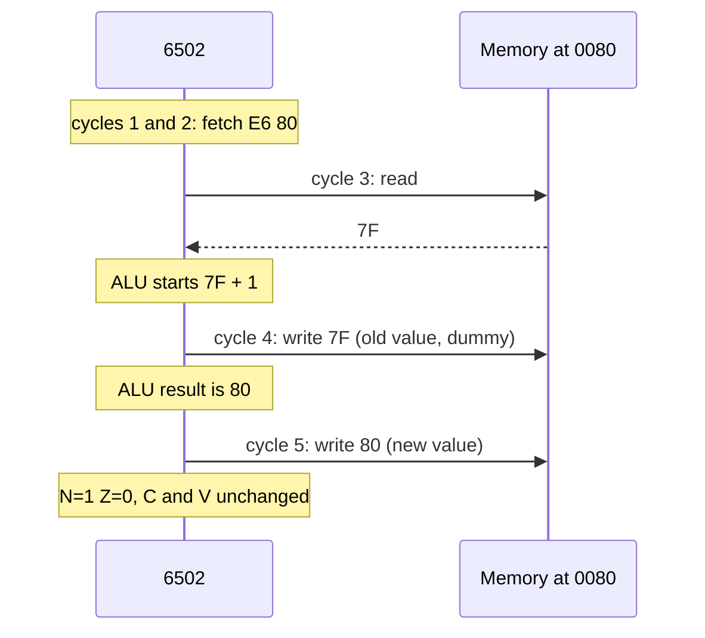
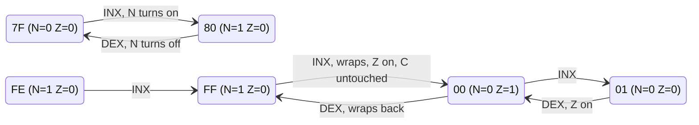
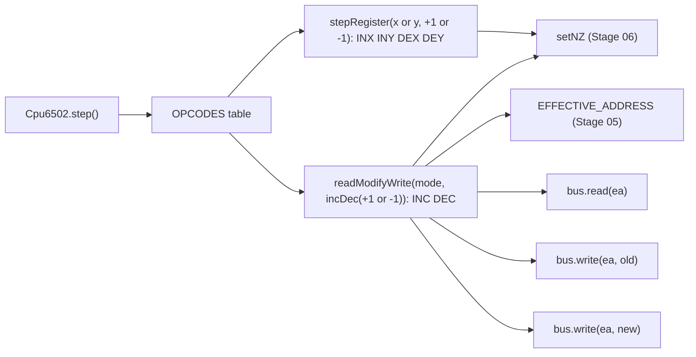

# Stage 09: Increment & decrement

> **Part:** 2 (The 6502 CPU) · **Branch:** `stage/09-inc-dec` · **Needs:** 08
> **Status:** done

## Goal

Until now the CPU could only **move** bytes: memory to register (loads), register to memory (stores) and register to register (transfers). This stage adds the first instructions that **change** a byte, by the smallest possible amount: one.

- **`INX`, `INY`, `DEX`, `DEY`** (4 opcodes) add or subtract 1 from an index register.
- **`INC`, `DEC`** (8 opcodes) add or subtract 1 from a byte **in memory**, without going through A at all.

They come before `ADC` (Stage 10) because they teach two ideas without the complication of carry and overflow:

1. **8-bit wrap-around.** `&FF + 1` is `&00`, and `&00 − 1` is `&FF`. A register has no ninth bit to catch the overflow.
2. **Read-modify-write (RMW).** `INC &80` has to read the byte, change it inside the CPU, and write it back. It's the CPU's first instruction that does a read and a write to the same address, and the real NMOS 6502 does that write **twice**.

## What you can now see

### In the browser

```bash
npm run dev      # then open http://localhost:5173
```

The playground now opens on the **Stage 09: increment & decrement** example (the Assembler panel's picker). It's already assembled, and the Program panel lists 16 lines at `&0400`:

```
   Address Bytes     Source            Watch for
 ▶ &0400   A2 FE     start: LDX #&FE   X=&FE: N=1, bit 7 is set
   &0402   E8        INX               X=&FF: still negative
   &0403   E8        INX               X=&00: wraps round. Z=1, N=0, no carry
   &0404   CA        DEX               X=&FF: wraps back. N=1, Z=0
   &0405   A0 7F     LDY #&7F          Y=&7F (+127): N=0
   &0407   C8        INY               Y=&80: N=1. +127 + 1 reads as -128
   &0408   88        DEY               Y=&7F: N=0 again
   &0409   A9 FE     LDA #&FE
   &040B   85 80     STA count         count=&FE
   &040D   E6 80     INC count         count=&FF: 5 cycles, 2 writes
   &040F   E6 80     INC count         count=&00: Z=1. A still holds &FE
   &0411   C6 80     DEC count         count=&FF: N=1
   &0413   EE 00 7C  INC screen        "H" becomes "I": 6 cycles, 2 writes
   &0416   A2 01     LDX #1
   &0418   DE FF 7B  DEC screen-1,X    &7BFF+1 crosses a page: still 7 cycles. "H" again
   &041B   EA        NOP               then the NOP slide, and BRK at &0500 stops it
```

Things to try. Keep an eye on the **N**, **Z** and **C** lights in the Registers panel:

1. **Step 3 times** (`LDX #&FE`, `INX`, `INX`). X goes `&FE` → `&FF` → `&00`. On the last step **N goes out and Z lights**. **C stays dark.** The value fell off the top of the byte, but `INX` never reports that through carry.
2. **Step once more (`DEX`).** X wraps back to `&FF`. N lights again and Z goes out.
3. **Step through `LDY #&7F`, `INY`, `DEY`.** N flips on and off as Y crosses `&7F`/`&80`, the boundary between +127 and −128. **V doesn't light.** `INY` doesn't detect signed overflow.
4. **Type `&80` in the Memory panel's address box and press Go.** Step `LDA #&FE`, `STA count`, then `INC count`. The message says **`Ran 1 (5 cycles), 2 writes`**, and the line under the table reads **`Wrote: &0080 ← &FE, &0080 ← &FF`**. That's the NMOS dummy write: the old value goes back out before the new one.
5. **Step the second `INC count`.** `&80` wraps to `&00`, **Z lights**, and Wrote shows `&0080 ← &FF, &0080 ← &00`. A is still `&FE`. `INC` never went through a register.
6. **Go to `&7C00` and step `INC screen`.** `"HELLO"` becomes `"IELLO"` in the ASCII column (6 cycles, 2 writes). Step `LDX #1` and `DEC screen-1,X`. It's 7 cycles, the base address `&7BFF` plus 1 crosses into page `&7C`, and `"I"` goes back to `"H"`.


*(The screenshot is a local file in the gitignored `.playwright-mcp/` folder. Re-create it with steps 4–5.)*

The earlier examples are still in the picker, or at `?program=labels`, `?program=stores` and `?program=loads`.

### In the terminal

```bash
npm run demo:incdec
```

```
Stage 09: increment & decrement. Each line is one cpu.step().

after reset                          A=00 X=00 Y=00 &80=00  N=0 Z=0 C=0   screen: "HELLO"

addr  bytes     source            cyc  registers after                        wrote
----  --------  ----------------  ---  -------------------------------------  -----
0400  A2 FE     LDX #&FE            2  A=00 X=FE Y=00 &80=00  N=1 Z=0 C=0
0402  E8        INX                 2  A=00 X=FF Y=00 &80=00  N=1 Z=0 C=0
0403  E8        INX                 2  A=00 X=00 Y=00 &80=00  N=0 Z=1 C=0
0404  CA        DEX                 2  A=00 X=FF Y=00 &80=00  N=1 Z=0 C=0
0405  A0 7F     LDY #&7F            2  A=00 X=FF Y=7F &80=00  N=0 Z=0 C=0
0407  C8        INY                 2  A=00 X=FF Y=80 &80=00  N=1 Z=0 C=0
0408  88        DEY                 2  A=00 X=FF Y=7F &80=00  N=0 Z=0 C=0
0409  A9 FE     LDA #&FE            2  A=FE X=FF Y=7F &80=00  N=1 Z=0 C=0
040B  85 80     STA count           3  A=FE X=FF Y=7F &80=FE  N=1 Z=0 C=0  &0080←FE
040D  E6 80     INC count           5  A=FE X=FF Y=7F &80=FF  N=1 Z=0 C=0  &0080←FE &0080←FF
040F  E6 80     INC count           5  A=FE X=FF Y=7F &80=00  N=0 Z=1 C=0  &0080←FF &0080←00
0411  C6 80     DEC count           5  A=FE X=FF Y=7F &80=FF  N=1 Z=0 C=0  &0080←00 &0080←FF
0413  EE 00 7C  INC screen          6  A=FE X=FF Y=7F &80=FF  N=0 Z=0 C=0  &7C00←48 &7C00←49
0416  A2 01     LDX #1              2  A=FE X=01 Y=7F &80=FF  N=0 Z=0 C=0
0418  DE FF 7B  DEC screen-1,X      7  A=FE X=01 Y=7F &80=FF  N=0 Z=0 C=0  &7C00←49 &7C00←48
041B  EA        NOP                 2  A=FE X=01 Y=7F &80=FF  N=0 Z=0 C=0

screen: "HELLO". PC=&041C, 58 cycles since power-on (7 of them reset).
```

The `C=0` column never changes, however many times a value wraps. Every `INC`/`DEC` line has exactly two writes.

## The real hardware

### What the six instructions do

From the *MCS6500 Programming Manual* (chapter 7, index registers, for `INX`/`INY`/`DEX`/`DEY`; chapter 10, shift and memory-modify instructions, for `INC`/`DEC`) and the 6502.org instruction reference:

| Instruction | Operation | Flags changed | Modes |
|---|---|---|---|
| `INX` | X + 1 → X | N, Z | implied |
| `INY` | Y + 1 → Y | N, Z | implied |
| `DEX` | X − 1 → X | N, Z | implied |
| `DEY` | Y − 1 → Y | N, Z | implied |
| `INC` | M + 1 → M | N, Z | zp, zp,X, abs, abs,X |
| `DEC` | M − 1 → M | N, Z | zp, zp,X, abs, abs,X |

The important part is the last-but-one column. **Only N and Z change. C and V never do.** An increment that wraps from `&FF` to `&00` does *not* set carry, even though "the sum didn't fit" is exactly what carry means for `ADC`. (Why the designers chose this is in Key concepts below.)

Notice what's missing too:

- **There's no `INC A` or `DEC A`** on the NMOS 6502. To add 1 to A you need `CLC` then `ADC #1` (Stage 10), or a detour through X with `TAX` / `INX` / `TXA`. The CMOS 65C02 added `INC A` (`&1A`) and `DEC A` (`&3A`). On our NMOS chip those bytes are undocumented NOPs, and the BBC Model B has an NMOS chip.
- **There's no `INC abs,Y`.** Memory increments index only by X.
- **There's no `INS` or `DES`** for the stack pointer. S only changes through pushes, pulls and `TXS`.

### The 12 opcodes

From the MCS6500 Programming Manual (Appendix B) and the 6502.org opcode table:

| Instruction | Mode | Opcode | Bytes | Cycles |
|---|---|---|---|---|
| `INX` | implied | `E8` | 1 | 2 |
| `INY` | implied | `C8` | 1 | 2 |
| `DEX` | implied | `CA` | 1 | 2 |
| `DEY` | implied | `88` | 1 | 2 |
| `INC` | zero page `&nn` | `E6` | 2 | 5 |
| `INC` | zero page,X `&nn,X` | `F6` | 2 | 6 |
| `INC` | absolute `&nnnn` | `EE` | 3 | 6 |
| `INC` | absolute,X `&nnnn,X` | `FE` | 3 | **7, always** |
| `DEC` | zero page `&nn` | `C6` | 2 | 5 |
| `DEC` | zero page,X `&nn,X` | `D6` | 2 | 6 |
| `DEC` | absolute `&nnnn` | `CE` | 3 | 6 |
| `DEC` | absolute,X `&nnnn,X` | `DE` | 3 | **7, always** |

Compare `INC &80` (5 cycles) with `LDA &80` (3 cycles). The extra 2 cycles are the "modify" and the "write" of read-modify-write. Like a store, `INC &nnnn,X` never takes the page-cross shortcut, so it's 7 cycles whether the index carries into the high byte or not.

The opcodes also fall into a pattern. `INC` is `&E6`/`&F6`/`&EE`/`&FE` and `DEC` is `&C6`/`&D6`/`&CE`/`&DE`: the same low nibbles (`6` and `E`) in neighbouring columns of the opcode grid. The register forms sit in odd-looking places (`&E8`, `&C8`, `&CA`, `&88`) because the 6502's decoder groups instructions by which internal bus lines they use, not by what a programmer would call them.

### Cycle by cycle: what a read-modify-write does on the bus

The single-cycle tables in the *MCS6500 Hardware Manual* (Appendix A) and the 6502.org cycle-by-cycle notes show what `INC &80` puts on the bus. Here the byte at `&80` holds `&7F` before it runs:

| Cycle | Address bus | Data | R/W | What's happening |
|---|---|---|---|---|
| 1 | `&0400` | `&E6` | read | fetch opcode |
| 2 | `&0401` | `&80` | read | fetch zero-page address |
| 3 | `&0080` | `&7F` | read | **read** the old value |
| 4 | `&0080` | `&7F` | **write** | write the **old value back** while the ALU adds 1 |
| 5 | `&0080` | `&80` | **write** | write the **new value** |

Cycle 4 is the surprise. The ALU needs a cycle to work out `&7F + 1`, but the 6502 has no way to leave the bus idle. Every cycle is either a read or a write. In the middle of an RMW, the chip's control logic has already switched R/W to "write", and the data latch still holds the value it just read. So the old value goes back out to memory for one cycle before the new one replaces it.

To RAM this is harmless: `&80` holds `&7F`, then `&7F`, then `&80`. To a **memory-mapped device** it's two separate writes, and a device register acts on every write. The BBC Micro's I/O lives at `&FC00–&FEFF` (FRED, JIM and SHEILA, AUG §19), so `INC &FE4x` would hit a 6522 VIA register twice. An emulator that skips the extra write can get a device into the wrong state (see Gotchas). The CMOS 65C02 replaced the dummy write with a second *read*, which is one way software can tell the two chips apart.

The indexed forms add a dummy cycle before the read, exactly like Stage 05's indexed modes:

| Mode | Cycles | Bus activity after the operand bytes |
|---|---|---|
| `INC &nn` | 5 | read, write old, write new |
| `INC &nn,X` | 6 | dummy read of `&nn` (adding X), read, write old, write new |
| `INC &nnnn` | 6 | read, write old, write new |
| `INC &nnnn,X` | 7 | dummy read at the un-fixed address, read, write old, write new |

`abs,X` always takes the fix-up cycle for the same reason a store does (Stage 07). The CPU is about to *write* to the address, so it can't risk acting on a half-computed one.

## Key concepts

### 1. Wrap-around: an 8-bit counter is a clock face

A register holds 8 bits, so it counts `&00, &01, … &FE, &FF` and then has nowhere to go. The carry out of bit 7 simply falls off the end:

```
    &FF   = 1111 1111
  +   1
  -------
   &100   = 1 0000 0000
            ^ ninth bit: no flip-flop to hold it, lost
    &00   = 0000 0000      → Z=1, N=0
```

Going down does the same thing in reverse. `&00 − 1` borrows from a ninth bit that isn't there, and every bit flips to 1:

```
    &00   = 0000 0000
  -   1
  -------
    &FF   = 1111 1111      → N=1, Z=0
```

In TypeScript this is just `(value + 1) & 0xff` and `(value - 1) & 0xff`. JS numbers don't wrap on their own (`0xff + 1` is `256` and `0 - 1` is `-1`), so the mask is essential, which is why `CLAUDE.md` says "always mask". `-1 & 0xff` is `255`, which is `&FF`. Two's complement makes the downwards wrap come out right for free.

It helps to picture the 256 values as a clock face. `INX` moves one step clockwise and `DEX` one step anticlockwise. There's no edge to fall off, only the join between `&FF` and `&00`.

### 2. N and Z are the only feedback, and that's enough

`setNZ` (from Stage 06) gives you two facts about the result:

- **Z = 1** when the result is `&00`. After a `DEX`, that means "the counter just reached zero".
- **N = 1** when bit 7 is set. After a `DEX`, that means "the counter just went from `&00` to `&FF`", or in signed terms, from 0 to −1.

These two are exactly what a loop needs. The most common 6502 loop is "count down to zero":

```
        LDX #&05
again:  ...           ; loop body runs with X = 5, 4, 3, 2, 1
        DEX
        BNE again     ; branch while Z=0 (Stage 14)
```

We can't run that yet, because branches are Stage 14. But this is why `DEX` sets Z: the loop test costs no extra instruction.

N also gives you the signed view. `&7F` is +127 and `&80` is −128 in two's complement (Stage 01), so `INY` on `&7F` takes Y from the largest positive byte to the most negative one. N turns on, but **V does not**. `INC` doesn't do signed overflow detection. That's `ADC`'s job (Stage 10).

### 3. Why INC and DEX don't touch carry

This looks like an oversight, but it's deliberate, and it's very useful. Increments and decrements are mostly used for **counters and indexes**, and the instructions inside a loop are mostly arithmetic that *needs* the carry to survive from one pass to the next. Here's a multi-byte addition (it'll run in Stage 10):

```
        LDX #0        ; byte index
        LDY #4        ; bytes to go
        CLC
add:    LDA num1,X
        ADC num2,X    ; uses C from the previous byte
        STA sum,X
        INX           ; next byte: must NOT disturb C
        DEY           ; one fewer to go: must NOT disturb C either
        BNE add       ; branch while Z=0; BNE only looks at Z (Stage 14)
```

If `INX` changed C, every pass through this loop would lose the carry between bytes. Because `INX`/`DEX` leave C alone, the loop works.

The cost of that choice: when you increment a **16-bit** number with `INC`, nothing tells you that the low byte wrapped *through carry*. You use Z instead:

```
        INC ptr       ; low byte
        BNE done      ; didn't wrap to &00? Then the high byte is unchanged
        INC ptr+1     ; it wrapped: carry into the high byte by hand
done:
```

That idiom appears hundreds of times in the BBC MOS. You'll see it once we can branch.

### 4. Read-modify-write: the CPU as its own little pipeline

A load is "address → read → register". A store is "address → register → write". `INC` combines both, with the ALU in between:

1. **Read** the byte into the CPU's internal data latch.
2. **Modify** it in the ALU: +1 or −1.
3. **Write** it back to the same address.

It never uses A, X or Y for the value, which is the whole point. `INC count` changes a counter in memory with A, X and Y all left exactly as they were. Doing the same with loads and stores would cost a register (`LDA count` / `CLC` / `ADC #1` / `STA count`, which is 4 instructions, 10 cycles, and A and C are destroyed).

The same RMW pattern comes back in Stage 13 for the memory shifts and rotates (`ASL &80`, `ROR &1234,X` and so on). They have identical cycle counts and the same double write, so the code we write now gets reused there.

## Diagrams

### What one `INC &80` does



### The wrap-around, as the flag lights see it



### Where the new code sits



## Our design

One new file, `src/cpu/instructions/inc-dec.ts`, in the same shape as the loads, stores and transfers files: small factories run once at module load to build each opcode's `execute`, and a table of rows (`INC_DEC`) that `opcodes.ts` adds to its `GROUPS`.

```ts
type IndexRegister = 'x' | 'y';
type Delta = 1 | -1;
type RmwMode = 'zeroPage' | 'zeroPageX' | 'absolute' | 'absoluteX';

/** INX, INY, DEX, DEY: X or Y ± 1, wrapped to 8 bits. N and Z only. */
function stepRegister(register: IndexRegister, delta: Delta): (cpu: Cpu6502) => number;

/** The bus half of INC/DEC: read, write the old value back, write modify(old). */
function readModifyWrite(mode: RmwMode, modify: (cpu: Cpu6502, value: number) => number): (cpu: Cpu6502) => number;

/** The ALU half: value ± 1, with N and Z set from it. */
function incDec(delta: Delta): (cpu: Cpu6502, value: number) => number;
```

Decisions:

- **The bus pattern and the ALU operation are separate.** `readModifyWrite` only knows the RMW bus sequence. What happens to the byte is a `modify` function passed in: `incDec(+1)` for `INC`, `incDec(-1)` for `DEC`. That mirrors the chip, where the same RMW timing drives different ALU operations. Stage 13's `ASL`/`LSR`/`ROL`/`ROR` on memory have the same four modes and the same cycle counts, so they'll just pass different `modify` functions. For now the helper stays private to this file (no building ahead). Stage 13 will export it.
- **`Delta` is the literal union `1 | -1`**, so `stepRegister('x', 2)` won't compile.
- **We model the dummy write.** The instruction-stepped core doesn't model dummy *reads* (they're parked in `PROGRESS.md`). This dummy write is different, for three reasons. It's a write, so on SHEILA it has a real effect. It costs one extra `bus.write` call and no allocation. And the workbench's write recorder makes it visible, so you can see the quirk for yourself: the Memory panel reports **2 writes** for one `INC`. The dummy read in the indexed modes is still not modelled.
- **`abs,X` ignores `pageCrossed`.** Like a store, the fix-up cycle is already in the base count of 7, so `execute` returns `0`.
- **All the closures are built at module load.** `INCREMENT` and `DECREMENT` are created once, and each opcode's `execute` once. `step()` only calls them, so the hot path still allocates nothing.
- **No change to the assembler.** Stage 08 already encoded all 151 documented opcodes, including these 12. They just didn't run until now.

## Code walkthrough

- [`src/cpu/instructions/inc-dec.ts`](../../src/cpu/instructions/inc-dec.ts) is the whole stage's CPU work.
  - `stepRegister(register, delta)` handles the four register forms. The line that carries the idea is `(cpu.regs[register] + delta) & 0xff`. With `delta = -1` and X = `&00`, JS computes `-1`, and `& 0xff` turns that into `255` = `&FF`. The wrap in both directions is that one mask.
  - `readModifyWrite(mode, modify)` is the RMW bus sequence: `read(ea)`, `write(ea, old)`, `write(ea, modify(cpu, old) & 0xff)`. The middle line is the NMOS dummy write. It returns `0`, so `abs,X` stays at 7 cycles.
  - `incDec(delta)` builds the ALU half, which adds the delta, masks, and calls `setNZ` (Stage 06). `INCREMENT` and `DECREMENT` are built once.
  - `INC_DEC` is the 12-row table, laid out like `LOADS` and `STORES`.
- [`src/cpu/opcodes.ts`](../../src/cpu/opcodes.ts) adds `INC_DEC` to `GROUPS`. `buildTable` would throw if any of the 12 opcodes clashed with an existing one.
- [`src/playground/examples.ts`](../../src/playground/examples.ts) adds `INCDEC_SOURCE`. It's now the first example and the default for `findExample` (and so for `?program=`).
- [`scripts/demo-incdec.ts`](../../scripts/demo-incdec.ts) assembles that source with the Stage 08 assembler and runs it through `installProgram` (the same set-up as the browser), with a `WriteRecorder` so every write prints.
- Two older tests used `&E8` (`INX`) as their example of an unimplemented opcode. They now use `&69` (`ADC #`, Stage 10).

## Tests

| Test file | What it proves |
|---|---|
| `src/cpu/instructions/inc-dec.test.ts` | For each of `INX`/`INY`/`DEX`/`DEY`: the step and wrap at `&00`, `&7E`, `&7F`, `&FE`, `&FF` in both directions; N and Z (each forced to the opposite value first); C, V, D, I untouched set *and* clear, even on a wrap; the other registers, S and memory untouched; 2 cycles, 1 byte. For each of the 8 `INC`/`DEC` opcodes: the byte changes by ±1 at the right effective address; it wraps with Z or N, carry kept; **exactly two writes, old value then new**; A, X, Y, S, V, D, I untouched; cycles and PC. Also: `INC &30FF,X` with X=1 is still 7 cycles; `DEC &FF,X` wraps within page zero; `&7F` → `&80` sets N but not V; the table has 12 rows, all in `OPCODES`, with byte counts matching their modes. |
| `src/playground/examples.test.ts` | The new example assembles and runs: X wraps `&FE → &FF → &00 → &FF` with Z only at `&00`, the counter at `&80` does the same in memory, C never changes, "H" ends back at `&7C00`, and the run takes 7 + 51 cycles. `findExample` now falls back to `incdec`. |
| `src/cpu/cpu6502.test.ts` | The opcode table now holds 50 entries (1 + 18 + 13 + 6 + 12) with the six new mnemonics. |
| `e2e/incdec.spec.ts` | In the browser: the default example; the N/Z lights through the `INX`/`DEX` wrap with C dark; `INC count` says `Ran 1 (5 cycles), 2 writes` and `Wrote: &0080 ← &FF, &0080 ← &00`; `DEC screen-1,X` is 7 cycles across a page. |

The full suite has 738 Jest tests and 37 Playwright tests. None need ROMs or fixtures.

## Gotchas & hardware quirks

- **INC/DEC don't touch carry.** This is the classic bug when people write their own 16-bit increment: they expect `INC lo` to set C on a wrap and follow it with `ADC #0` on the high byte. It doesn't, so the high byte never moves. The fix is `INC lo` / `BNE skip` / `INC hi`, testing Z.
- **They don't touch V either,** even when `&7F` → `&80` crosses the signed boundary.
- **No `INC A` on an NMOS 6502.** Code written for the 65C02 (BBC Master, some later software) may use `&1A`/`&3A`. On a Model B those bytes are undocumented NOPs, and code that uses them just quietly fails to increment.
- **The double write is real and we model it.** On RAM it's invisible. On a device register both writes count. For example, a 6522 VIA clears interrupt flags when you write 1s to its IFR, so an RMW there writes twice, with two different values. Not modelling it would make the emulator behave differently from the hardware for such code. The CMOS 65C02 does a dummy *read* instead, which is one way programs detect which CPU they're on.
- **The indexed modes' dummy read is not modelled.** `INC &nn,X` reads `&nn` before adding X, and `INC &nnnn,X` reads the un-fixed address. Both are harmless on RAM. They're already in the parking-lot item about dummy reads.
- **Zero-page indexing wraps inside page zero.** `DEC &FF,X` with X=2 changes `&01`, not `&0101`. It's the same rule as Stage 05, and it's tested again here because RMW is a new path through it.
- **JS doesn't wrap.** `0 - 1` is `-1` and `0xff + 1` is `256`. Without `& 0xff`, X would hold `-1`, and the next `STX` would write who-knows-what. Every result is masked.

## Playwright verification

- **MCP:** opened `http://localhost:5173/`, stepped all 16 instructions, and read back PC, X, Y, the lit flags, the run message and the Wrote line after each step. Every row matched the CLI trace. For example, after the second `INC count` the lit flags were `- I Z`, with `Ran 1 (5 cycles), 2 writes` and `Wrote: &0080 ← &FF, &0080 ← &00`. Screenshot: `.playwright-mcp/stage09-inc-wrap.png` (above).
- **Durable:** `e2e/incdec.spec.ts` (4 tests). `e2e/assembler.spec.ts` now opens `?program=labels`, because the default example changed.

## Check your understanding

1. X holds `&00` and C is set. What are X, N, Z and C after `DEX`?
2. Why does `INC &80` take 5 cycles when `LDA &80` takes 3? What's on the bus in the extra two?
3. A program has a 16-bit counter at `&70` (low) / `&71` (high) holding `&00FF`. It runs `INC &70`, then `LDA &71` / `ADC #0` / `STA &71`, with C clear beforehand. What does the counter hold afterwards, and why is that wrong?
4. Why is `INC &7BFF,X` 7 cycles whether X is `&00` or `&01`, when `LDA &7BFF,X` is 4 or 5?
5. On a real Model B, what would you expect a logic analyser on the data bus to show for `INC &FE60` if `&FE60` held `&3C`, and why does it matter more there than at `&0080`?

<details>
<summary>Answers</summary>

1. X = `&FF`, N = 1 (bit 7 set), Z = 0, and **C is still 1**. `DEX` never touches carry.
2. A load only reads. An RMW reads (cycle 3), then writes the **old** value back (cycle 4) while the ALU adds 1, then writes the **new** value (cycle 5). The 6502 can't leave the bus idle, so the "thinking" cycle becomes a dummy write.
3. `&0000`. `INC &70` wraps `&FF` → `&00` but doesn't set C, so `ADC #0` adds 0 and the high byte stays `&00`. It should be `&0100`. The fix is `INC &70` / `BNE done` / `INC &71`.
4. It's going to *write* to the address, so it can't take the load's optimistic shortcut of acting before the high byte is fixed. It always spends the fix-up cycle, and that's already in the base count, exactly like `STA abs,X` in Stage 07.
5. A read of `&3C`, then a write of `&3C`, then a write of `&3D`, all at `&FE60`. `&FE60` is a register in the User VIA (SHEILA, AUG §19). A device can act on every write, so it sees two writes and two values. `&0080` is plain RAM, where the extra write changes nothing.

</details>

## Further reading

- *MCS6500 Microcomputer Family Programming Manual* (MOS Technology, 1976): chapter 7 (index registers: `INX`, `INY`, `DEX`, `DEY`), chapter 10 (memory-modify instructions: `INC`, `DEC`), Appendix B (opcode table).
- *MCS6500 Microcomputer Family Hardware Manual*, Appendix A: the cycle-by-cycle bus summary, including read-modify-write.
- 6502.org: "6502 Opcodes" (cycle counts and flags) and the cycle-by-cycle notes in the 6502.org tutorials for RMW behaviour.
- BeebWiki: the BBC Micro memory map (SHEILA at `&FE00–&FEFF`), for which addresses a double write could matter on.
- *BBC Microcomputer Advanced User Guide*, §19 (memory map and I/O).
