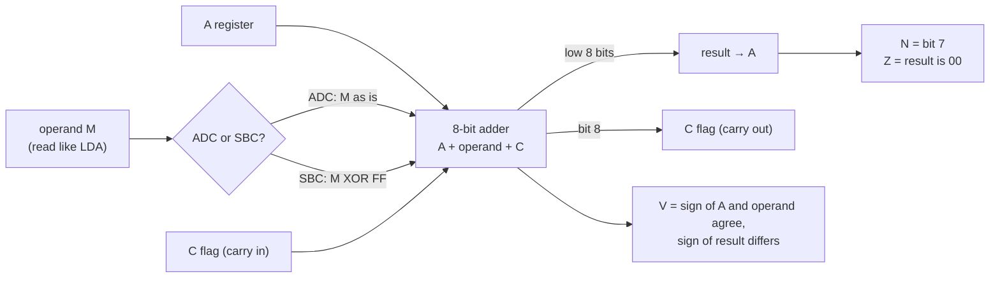
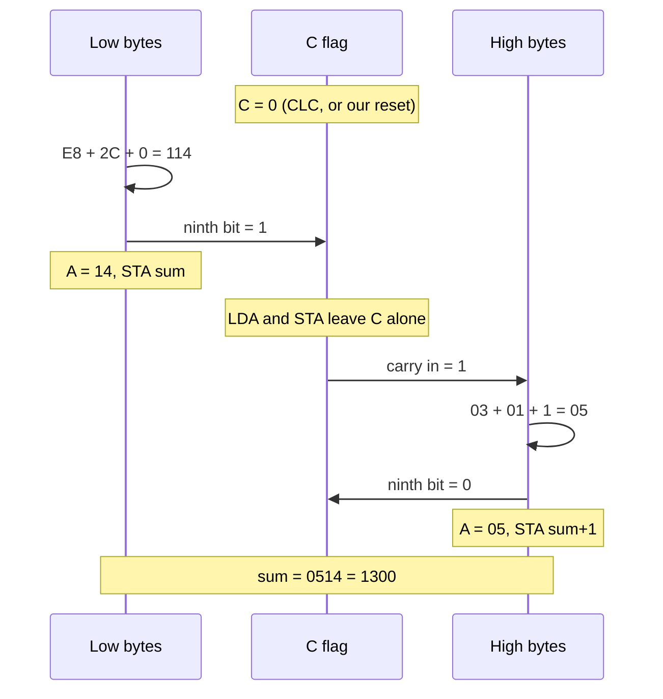

# Stage 10: Binary arithmetic

> **Part:** 2 (The 6502 CPU) · **Branch:** `stage/10-binary-arithmetic` · **Needs:** 09
> **Status:** done

## Goal

The CPU can now **add and subtract** whole bytes:

- **`ADC`**, Add with Carry (8 opcodes): A + M + C → A.
- **`SBC`**, Subtract with Carry (8 opcodes): A − M − (1 − C) → A.

These are the first instructions that set **C** (carry) and **V** (overflow), the two flags Stage 09's increments carefully left alone. This stage covers **binary** mode only (the D flag clear). Decimal mode, where the same opcodes do BCD arithmetic, is Stage 11.

Three ideas carry the stage:

1. **Carry is the ninth bit.** It catches what falls off the top of an addition, and feeds it into the next one. That's how an 8-bit CPU adds 16-, 24- or 32-bit numbers.
2. **Subtraction is addition in disguise.** `SBC` is `ADC` with the operand's bits inverted. Same adder, same flags.
3. **Overflow (V) is about *signed* numbers.** C says "the unsigned answer didn't fit in 0–255". V says "the signed answer didn't fit in −128…+127". They are independent: either, both or neither can be set.

## What you can now see

### In the browser

```bash
npm run dev      # then open http://localhost:5173
```

The playground now opens on the **Stage 10: binary arithmetic** example. The Program panel lists 17 lines at `&0400`:

```
   Address Bytes     Source            Watch for
 ▶ &0400   A9 E8     start: LDA #&E8   low byte of 1000 (&03E8). Real code: CLC first
   &0402   69 2C     ADC #&2C          + low byte of 300 (&012C) = &114: A=&14, C=1
   &0404   85 80     STA sum           STA leaves C alone
   &0406   A9 03     LDA #&03          high byte of 1000. LDA leaves C alone too
   &0408   69 01     ADC #&01          &03 + &01 + carry 1 = &05. C=0
   &040A   85 81     STA sum+1         sum = 14 05: &0514 = 1300
   &040C   A9 50     LDA #&50          +80
   &040E   69 50     ADC #&50          +80 + +80 = +160 won't fit: A=&A0 (-96), V=1, C=0
   &0410   A9 D0     LDA #&D0          -48
   &0412   69 90     ADC #&90          -48 + -112 = -160 won't fit: A=&60 (+96), V=1, C=1
   &0414   A5 80     LDA sum           C=1 now, which SBC needs for "no borrow"
   &0416   E9 E8     SBC #&E8          &14 - &E8 goes below 0: A=&2C, C=0 (borrowed)
   &0418   85 82     STA diff
   &041A   A5 81     LDA sum+1
   &041C   E9 03     SBC #&03          &05 - &03 - borrow 1 = &01. C=1
   &041E   85 83     STA diff+1        diff = 2C 01: &012C = 300 again
   &0420   EA        NOP               then the NOP slide, and BRK at &0500 stops it
```

Things to try. Watch the **N**, **V**, **Z** and **C** lights in the Registers panel:

1. **Step twice** (`LDA #&E8`, `ADC #&2C`). A becomes `&14` and **C lights**. That's the ninth bit of `&114`.
2. **Step three more** (`STA sum`, `LDA #&03`, `ADC #&01`). C stays lit through the store and the load, and then the `ADC` swallows it: A = `&05`, not `&04`. C goes out.
3. **Type `&80` in the Memory panel's address box and press Go.** `&80` and `&81` hold `14 05`, the 16-bit sum `&0514` stored low byte first.
4. **Step `LDA #&50`, `ADC #&50`.** A = `&A0`. **V and N light, and C doesn't.** As unsigned numbers, 80 + 80 = 160 fits. As signed numbers, +160 doesn't, so the result reads as −96.
5. **Step `LDA #&D0`, `ADC #&90`.** A = `&60`. **V and C both light**, and N goes out. Two negatives added up to a positive. Notice that **V stayed lit through `LDA #&D0`**: loads don't touch V.
6. **Step the subtraction.** `SBC #&E8` gives `&2C` and **C goes out**, because it had to borrow. The second `SBC` takes that borrow and gives `&01`, with C lit again. `&82`/`&83` now hold `2C 01`, which is 300.


*(The screenshot is a local file in the gitignored `.playwright-mcp/` folder. Re-create it with step 1.)*

The earlier examples are still in the picker, or at `?program=incdec`, `?program=labels`, `?program=stores` and `?program=loads`.

### In the terminal

```bash
npm run demo:arith
```

It prints the overflow truth table, with each row worked out by running a real `ADC` on the emulated CPU, followed by a trace of the example:

```
The overflow truth table: each row is a real ADC #&nn, with C=0 going in.

A7 M7 R7  A + M = R           signed            C  V
-- -- --  ------------------  ----------------  -  -
 0  0  0  &50 + &10 = &60      +80  +16 =  +96  0  0
 0  0  1  &50 + &50 = &A0      +80  +80 =  -96  0  1  ← doesn’t fit
 0  1  0  &50 + &D0 = &20      +80  -48 =  +32  1  0
 0  1  1  &50 + &90 = &E0      +80 -112 =  -32  0  0
 1  0  0  &D0 + &50 = &20      -48  +80 =  +32  1  0
 1  0  1  &D0 + &10 = &E0      -48  +16 =  -32  0  0
 1  1  0  &D0 + &90 = &60      -48 -112 =  +96  1  1  ← doesn’t fit
 1  1  1  &D0 + &D0 = &A0      -48  -48 =  -96  1  0

V=1 only when A and M have the same sign (A7 = M7) and the result R has the other one.

The Stage 10 example: 1000 + 300 = 1300 in 16 bits, then 1300 - 1000 = 300.

addr  bytes     source            cyc  after                       wrote
----  --------  ----------------  ---  --------------------------  -----
0400  A9 E8     LDA #&E8            2  A=E8  N=1 V=0 Z=0 C=0
0402  69 2C     ADC #&2C            2  A=14  N=0 V=0 Z=0 C=1
0404  85 80     STA sum             3  A=14  N=0 V=0 Z=0 C=1  &0080←14
0406  A9 03     LDA #&03            2  A=03  N=0 V=0 Z=0 C=1
0408  69 01     ADC #&01            2  A=05  N=0 V=0 Z=0 C=0
040A  85 81     STA sum+1           3  A=05  N=0 V=0 Z=0 C=0  &0081←05
040C  A9 50     LDA #&50            2  A=50  N=0 V=0 Z=0 C=0
040E  69 50     ADC #&50            2  A=A0  N=1 V=1 Z=0 C=0
0410  A9 D0     LDA #&D0            2  A=D0  N=1 V=1 Z=0 C=0
0412  69 90     ADC #&90            2  A=60  N=0 V=1 Z=0 C=1
0414  A5 80     LDA sum             3  A=14  N=0 V=1 Z=0 C=1
0416  E9 E8     SBC #&E8            2  A=2C  N=0 V=0 Z=0 C=0
0418  85 82     STA diff            3  A=2C  N=0 V=0 Z=0 C=0  &0082←2C
041A  A5 81     LDA sum+1           3  A=05  N=0 V=0 Z=0 C=0
041C  E9 03     SBC #&03            2  A=01  N=0 V=0 Z=0 C=1
041E  85 83     STA diff+1          3  A=01  N=0 V=0 Z=0 C=1  &0083←01
0420  EA        NOP                 2  A=01  N=0 V=0 Z=0 C=1

sum  at &80/&81 = 14 05  →  &0514
diff at &82/&83 = 2C 01  →  &012C
```

### Getting by without `CLC` and `SEC`

Real code would begin with `CLC` and put `SEC` before the subtraction. We don't have those yet (Stage 14), so the example relies on two facts instead:

- **C is 0 after our reset**, because our power-on state is all zeros. On a real 6502, C is *random* at power-on and reset doesn't touch it. Never rely on this outside the playground.
- **`ADC #&90` happens to leave C=1** (`&D0 + &90 = &160`), which is exactly the "no borrow" that the first `SBC` needs.

## The real hardware

### What the two instructions do

From the *MCS6500 Microcomputer Family Programming Manual* (chapter 2, "The accumulator and arithmetic unit", and Appendix B) and the 6502.org instruction reference:

| Instruction | Operation | Flags changed |
|---|---|---|
| `ADC` | A + M + C → A | N, V, Z, C |
| `SBC` | A − M − (1 − C) → A | N, V, Z, C |

Both have the same eight addressing modes as `LDA`, with the same timings, because they read their operand exactly the way `LDA` does:

| Mode | `ADC` | `SBC` | Bytes | Cycles |
|---|---|---|---|---|
| `#&nn` | `&69` | `&E9` | 2 | 2 |
| `&nn` | `&65` | `&E5` | 2 | 3 |
| `&nn,X` | `&75` | `&F5` | 2 | 4 |
| `&nnnn` | `&6D` | `&ED` | 3 | 4 |
| `&nnnn,X` | `&7D` | `&FD` | 3 | 4 (+1 on page cross) |
| `&nnnn,Y` | `&79` | `&F9` | 3 | 4 (+1 on page cross) |
| `(&nn,X)` | `&61` | `&E1` | 2 | 6 |
| `(&nn),Y` | `&71` | `&F1` | 2 | 5 (+1 on page cross) |

Look at the opcode bytes in binary. The 6502 decodes most instructions as `aaabbbcc`, where `cc = 01` is the "accumulator ALU" group and `bbb` is the addressing mode (the same eight `bbb` values as `LDA`). Only `aaa` changes:

| `aaa` | Instruction | `#&nn` opcode |
|---|---|---|
| `%011` | `ADC` | `&69` = `%011 010 01` |
| `%101` | `LDA` | `&A9` = `%101 010 01` |
| `%111` | `SBC` | `&E9` = `%111 010 01` |

So `ADC`'s opcodes are all `&61`–`&7D`, and `SBC`'s are all `&E1`–`&FD`.

### What's missing

There's **no "add without carry"** instruction. Every addition includes C, so before adding two single bytes you must clear it with `CLC` (`&18`). Every subtraction includes the borrow, so you set C first with `SEC` (`&38`). Forgetting `CLC` is the classic 6502 bug: the answer is sometimes one too big, depending on what an earlier instruction left in C.

**We don't have `CLC` or `SEC` yet.** They're in Stage 14 with the other flag instructions. The example program in this stage gets round that honestly (see "What you can now see").

## Key concepts

### 1. Carry: the ninth bit

Add two bytes in your head: `&E8 + &2C = &114`. That's a 9-bit answer, but A only holds 8 bits. The 6502 keeps the low 8 bits (`&14`) in A and puts the ninth bit (the `1` in `&114`) into **C**.

```
     1110 1000   &E8  (232)
   + 0010 1100   &2C  ( 44)
   -----------
   1 0001 0100   &114 (276)
   ↑ └──────┘
   C     A = &14
```

`ADC` then **adds C back in** next time. That's the whole trick of multi-byte arithmetic: do the low bytes first, and the carry out of them becomes the carry into the high bytes.

#### Worked example: 1000 + 300, in 16 bits

1000 is `&03E8` and 300 is `&012C`. Neither fits in a byte, so each is stored as two: low byte first, like `.word` (Stage 08).

| Step | Instruction | A | C after | |
|---|---|---|---|---|
| 1 | `LDA #&E8` (low byte of 1000) | `&E8` | 0 | |
| 2 | `ADC #&2C` (low byte of 300) | `&14` | **1** | `&E8 + &2C + 0 = &114`: carry out |
| 3 | `STA sum` | | | |
| 4 | `LDA #&03` (high byte of 1000) | `&03` | 1 | `LDA` doesn't touch C |
| 5 | `ADC #&01` (high byte of 300) | `&05` | 0 | `&03 + &01 + 1 = &05`: the carry came in |
| 6 | `STA sum+1` | | | |

`sum` now holds `14 05`, which is `&0514` = 1300. The carry flowed from step 2 into step 5 because nothing between them changed it. `LDA` and `STA` both leave C alone.

The same pattern extends to any size: a 32-bit add is four `LDA`/`ADC`/`STA` triples in a row, low byte first. BBC BASIC's integer variables are 32-bit, and the BASIC ROM adds them exactly like that.

### 2. Subtraction is addition with the operand inverted

The 6502 doesn't have a subtractor. `SBC` feeds the **inverted** operand (`M XOR &FF`, the one's complement) into the same adder:

```
A − M − (1 − C)  =  A + (&FF − M) + C − &100  =  A + ~M + C   (ignoring the 9th bit)
```

Because two's complement says `−M = ~M + 1`, adding `~M` and `1` is the same as subtracting `M`. The `+1` comes from **C**. That's why C means the opposite of what you might expect in subtraction:

| C before `SBC` | Meaning | `SBC` computes |
|---|---|---|
| 1 | no borrow | A − M |
| 0 | borrow | A − M − 1 |

And after `SBC`, **C = 1 means no borrow was needed** (A ≥ M), and **C = 0 means it borrowed** (A < M). This is called an **inverted borrow**. The Z80 and x86 do it the other way round, which catches out people who know those chips.

Worked example: `&05 − &03` with C=1.

```
  A        0000 0101   &05
  ~M     + 1111 1100   &FC   (&03 inverted)
  C      +         1
         -----------
         1 0000 0010   &102  →  A = &02, C = 1 (no borrow)
```

And `&14 − &E8` with C=1: `&14 + &17 + 1 = &2C`, no ninth bit, so **C = 0**: it borrowed. That's the low half of `&0514 − &03E8`. The high half, `&05 − &03` with C=0, gives `&01`, so the answer is `&012C` (300). It's the 16-bit addition run backwards.

Since both instructions use one adder, **one function** computes both in our emulator (see Our design).

### 3. Overflow: when a signed answer doesn't fit

Stage 01 introduced two's complement: the same byte `&D0` is 208 unsigned or −48 signed. The adder doesn't know which you mean. It produces the same bit pattern either way, and sets **two** flags so you can check whichever reading you care about:

- **C** = the unsigned result didn't fit in 0–255.
- **V** = the signed result didn't fit in −128…+127.

When does a signed addition overflow? Only when you add two numbers **of the same sign** and the result comes out **with the other sign**:

- positive + positive = negative (too big: e.g. +80 + +80 = +160, which doesn't fit)
- negative + negative = positive (too small: e.g. −48 + −112 = −160)

Adding a positive and a negative can never overflow, because the answer is always between the two.

#### The overflow truth table

The eight combinations of the sign bits (bit 7) of A, M and the result R, with a real example of each. All have C=0 going in.

| A bit 7 | M bit 7 | R bit 7 | Example | Signed | C | **V** |
|---|---|---|---|---|---|---|
| 0 | 0 | 0 | `&50 + &10 = &60` | +80 + 16 = +96 | 0 | 0 |
| 0 | 0 | **1** | `&50 + &50 = &A0` | +80 + 80 = −96 ✗ | 0 | **1** |
| 0 | 1 | 0 | `&50 + &D0 = &20` | +80 − 48 = +32 | 1 | 0 |
| 0 | 1 | 1 | `&50 + &90 = &E0` | +80 − 112 = −32 | 0 | 0 |
| 1 | 0 | 0 | `&D0 + &50 = &20` | −48 + 80 = +32 | 1 | 0 |
| 1 | 0 | 1 | `&D0 + &10 = &E0` | −48 + 16 = −32 | 0 | 0 |
| 1 | 1 | **0** | `&D0 + &90 = &60` | −48 − 112 = +96 ✗ | 1 | **1** |
| 1 | 1 | 1 | `&D0 + &D0 = &A0` | −48 − 48 = −96 | 1 | 0 |

Read the C and V columns together: all four combinations appear. `&50 + &D0` carries but doesn't overflow (fine as signed: +32, wrong as unsigned). `&50 + &50` overflows but doesn't carry (fine as unsigned: 160, wrong as signed).

That gives a one-line formula. V is set when A and M have the **same** sign **and** R has a **different** sign from A:

```
V = (A XOR R) AND (M XOR R) AND &80   ≠ 0
```

`A XOR R` has bit 7 set if the result's sign differs from A's. `M XOR R` has bit 7 set if it differs from M's. Both differ only when A and M agreed and R flipped.

Inside the chip, V is computed differently, as **carry into bit 7 XOR carry out of bit 7**. If a carry went into the sign bit but none came out (or the other way round), the sign is wrong. It gives the same answer as the formula. Ken Shirriff traced the actual transistors that do it (see Further reading).

For `SBC`, the same formula works with M replaced by the inverted operand `~M`, because that's what went into the adder. In subtraction terms: overflow happens when you subtract a negative from a positive and get a negative (`&50 − &B0` = +80 − −80 = +160 ✗), or a positive from a negative and get a positive.

### 4. N and Z

These are set from the 8-bit result in A, just like a load (`setNZ` from Stage 06): N = bit 7, Z = result is `&00`. So `&FF + &01` gives A = `&00` with **Z = 1 and C = 1**. Compare Stage 09's `INX` from `&FF`, which also gives Z = 1 but leaves C alone.

### What about the D flag?

When D = 1, the NMOS 6502 does `ADC` and `SBC` in **binary-coded decimal** instead. That's Stage 11. In this stage our `ADC`/`SBC` ignore D and always work in binary. That's safe for now because nothing can set D yet: our reset leaves it clear, and `SED` (Stage 14), `PLP` (Stage 15) and `RTI` (Stage 17) don't exist. On the real machine, D's state at power-on is random, which is why the MOS reset code clears it with `CLD` almost straight away (we'll see that when we trace the MOS in Stage 23).

## Diagrams

### One adder, two instructions



### A 16-bit addition: the carry is the hand-off



## Our design

### One ALU function, two thin wrappers

The arithmetic lives in [`src/cpu/instructions/arithmetic.ts`](../../src/cpu/instructions/arithmetic.ts). At its heart is one exported function:

```ts
/** A + value + C → A, setting N V Z C. SBC calls it with value XOR &FF. */
export function addWithCarry(regs: Registers, value: number): void
```

- **It takes the registers and the operand, and returns nothing.** It writes A and the four flags in place, so nothing is allocated on the hot path.
- **`SBC` calls it with `value ^ 0xff`.** That's the hardware's own trick, so both instructions share the flag logic. The tests check `SBC` against an independent "subtract and see if it went negative" formula, which proves the trick is right rather than assuming it.
- **It's exported** so the exhaustive test can sweep it directly, and so Stage 11 can put the decimal-mode branch next to it.

The opcode rows reuse the `LOADS` pattern from Stage 06: a factory looks up the mode's effective-address function once, at module load, and returns a closure that reads the operand, calls the ALU, and returns `1` on a page crossing (these are read instructions, so they pay the fix-up cycle only when the index carries).

```ts
function arithmetic(mode: AddressedMode, alu: (regs: Registers, value: number) => void): (cpu: Cpu6502) => number
```

### Alternatives considered

- **A separate `subtractWithBorrow` written with `−`.** Clearer to read, but it duplicates the flag logic, and it hides the most interesting fact about the 6502's ALU. We use it only as the *test* reference.
- **Computing V as "carry into bit 7 XOR carry out".** That's how the silicon does it, but it needs a second, 7-bit addition. The XOR formula gives the same answer in one line, and the doc explains both.
- **Throwing an error if D is set.** It would flag a program that expects decimal mode, but D can't be set yet, so it would be dead code that Stage 11 deletes. Instead, the stage doc and a comment say "binary only until Stage 11".

## Code walkthrough

- [`src/cpu/instructions/arithmetic.ts`](../../src/cpu/instructions/arithmetic.ts)
  - **`addWithCarry(regs, value)`** is the whole ALU in five lines. `sum` can reach `&1FF` (`&FF + &FF + 1`), so `sum > 0xff` *is* the carry out, and `sum & 0xff` is what goes into A. V uses the XOR formula from Key concepts. N and Z reuse `setNZ` from Stage 06.
  - **`subtractWithCarry(regs, value)`** is a single line: `addWithCarry(regs, value ^ 0xff)`.
  - **`arithmetic(mode, alu)`** is the same factory shape as `load()` in [`loads.ts`](../../src/cpu/instructions/loads.ts). It looks up the effective-address function once, then each call reads the operand, runs the ALU, and returns `+1` if the index crossed a page. Nothing is allocated per instruction.
  - **`ARITHMETIC`** holds the 16 opcode rows, in the same layout as `LOADS`.
- [`src/cpu/opcodes.ts`](../../src/cpu/opcodes.ts) adds `ARITHMETIC` to `GROUPS`. `buildTable` would throw if any of the 16 bytes were already taken.
- [`src/playground/examples.ts`](../../src/playground/examples.ts) adds `ARITHMETIC_SOURCE`, the new default example (`?program=arithmetic`).
- [`scripts/demo-arith.ts`](../../scripts/demo-arith.ts) is the CLI demo (not in the plan). It builds the truth table by running `ADC` on a fresh CPU for each row, so the table in this doc is the emulator's own output rather than something typed by hand.

## Tests

| Test file | What it proves |
|---|---|
| `src/cpu/instructions/arithmetic.test.ts` | **Exhaustive sweeps**: all 256 × 256 × 2 = 131,072 inputs for `addWithCarry`, `ADC #` and `SBC #` (through `cpu.step()`), checked against paper formulas that use plain integer `+`/`−` and signed ranges, *not* the inverted-operand trick. Flags start opposite to the expected answer, so an unwritten flag can't pass by luck. Also: the **V truth table** (8 rows, with all four C/V combinations), SBC overflow both ways, carry/borrow in and out, `&FF + &01` (Z and C), 16-bit add and subtract, and for all 16 opcodes the operand address, flags, untouched registers and memory, PC advance and cycles. Page crossings cost +1 on `abs,X`, `abs,Y` and `(zp),Y`, and the table layout matches `aaabbbcc` and `LDA`'s modes and cycles. `&EB` stays unimplemented. |
| `src/playground/examples.test.ts` | The Stage 10 example carries and overflows at the right steps, and leaves `14 05` at `&80` and `2C 01` at `&82`. The default example is now `arithmetic`. |
| `src/cpu/cpu6502.test.ts` | The opcode count is now 66, including ADC and SBC. The "unimplemented opcode" test now uses `&29` (`AND #`, Stage 12) instead of `&69`. |
| `src/web/workbench/registers-view-model.test.ts` | Same change: `&29` instead of `&69` as the unimplemented example. |
| `e2e/arithmetic.spec.ts` | In the browser: the default example, C lit after the low `ADC` and cleared by the high one, V without C on `&50 + &50`, and the borrow and the `&0083 ← &01` write in the subtraction. |

As a sanity check on the sweeps, two deliberate bugs were planted and then reverted: dropping the `M XOR R` term from V failed 7 tests, and using `~M + 1` for `SBC` (forgetting that C supplies the +1) failed 27.

## Gotchas & hardware quirks

- **There's no add-without-carry instruction.** Forgetting `CLC` gives answers that are randomly one too big. Forgetting `SEC` before `SBC` gives answers that are one too small.
- **C in subtraction is an inverted borrow.** C=1 means no borrow. It's the opposite of the Z80 and x86.
- **C and V are independent.** `&50 + &D0` carries without overflowing, and `&50 + &50` overflows without carrying. Which one matters depends on whether *you* meant the bytes as unsigned or signed. The CPU doesn't know.
- **V is sticky between arithmetic instructions.** Loads, stores, transfers and `INC`/`DEC` never touch it, so a stale V stays lit (step 5 of "What you can now see"). Only `ADC`, `SBC`, `BIT` (Stage 12), `CLV` (Stage 14), `PLP` and `RTI` change it. The SO pin can set it too, but the Model B doesn't use that pin.
- **The paper formula for V is not how the chip does it.** The chip XORs the carry into bit 7 with the carry out of bit 7. The two methods always agree, and the sweep proves it for our formula.
- **Binary only.** Our `ADC`/`SBC` ignore D. Stage 11 adds decimal mode, with the NMOS quirks in how N, V and Z are set.
- **The undocumented `&EB`** is a second `SBC #` on the NMOS 6502. It isn't implemented (Part 12 extras).
- **The indexed modes' dummy read** on a page crossing isn't modelled. It's the same open item as for `LDA` (parking lot).

## Playwright verification

- **MCP:** opened `http://localhost:5173/`, stepped twice, and took a screenshot (above). It shows A = `&14`, the C light on, the `▶` on `&0404 STA sum`, and `Ran 1 (2 cycles)`.
- **Durable:** added `e2e/arithmetic.spec.ts` (4 tests). `e2e/incdec.spec.ts` now opens `?program=incdec`, since the default changed. All 41 e2e tests pass.

## Check your understanding

1. After `LDA #&C0` / `ADC #&C0` with C=0 to start, what are A, C and V? Why?
2. A program adds two 16-bit numbers but forgets the `CLC`. When does it get the wrong answer, and by how much?
3. Why is "C=1" the right setting before a single-byte `SBC`, and what does C=0 *after* an `SBC` tell you?
4. Explain why adding a positive and a negative number can never set V.
5. To add a 24-bit number at `&70`–`&72` to one at `&80`–`&82`, in what order do you process the bytes, and how many `CLC`s do you need?

<details>
<summary>Answers</summary>

1. `&C0 + &C0 = &180`, so **A = `&80`, C = 1**. Signed, that's −64 + −64 = −128, which fits, so **V = 0**. (The sign bits were 1, 1 → 1, so the sign didn't flip.) N = 1.
2. It's wrong whenever C happened to be 1 from an earlier instruction. The low byte comes out one too big, so the whole 16-bit answer is +1. If C happened to be 0, it gets the right answer by luck, which makes the bug hard to find.
3. `SBC` computes A + ~M + C. Two's complement subtraction needs A + ~M + **1**, and C supplies that 1, so C=1 means "no borrow". Afterwards, C=0 means the subtraction went below zero (A was less than M, treating both as unsigned), so a borrow should be taken from the next byte up.
4. The answer lies between the two operands. For example, +100 + −50 = +50. Both operands fit in −128…+127, so anything between them fits too.
5. Low byte first: `&70`+`&80`, then `&71`+`&81`, then `&72`+`&82`, so each carry goes into the next byte up. There's **one** `CLC`, at the start. A `CLC` in the middle would throw away the carry you need.

</details>

## Further reading

- *MCS6500 Microcomputer Family Programming Manual* (MOS Technology, 1976): chapter 2 (ADC, SBC, the carry and overflow flags) and Appendix B (opcode table).
- Bruce Clark, "The Overflow (V) Flag Explained", 6502.org tutorials: [6502.org/tutorials/vflag.html](http://www.6502.org/tutorials/vflag.html).
- Ken Shirriff, "The 6502 overflow flag explained mathematically" and "Reverse-engineering the 6502's overflow circuit" (righto.com, 2012–2013).
- 6502.org, "Multiple-precision arithmetic", for adds and subtracts of any width.
- BBC Micro *Advanced User Guide*, chapter on 6502 assembly (ADC and SBC, and the reminder to use `CLC`/`SEC`).
