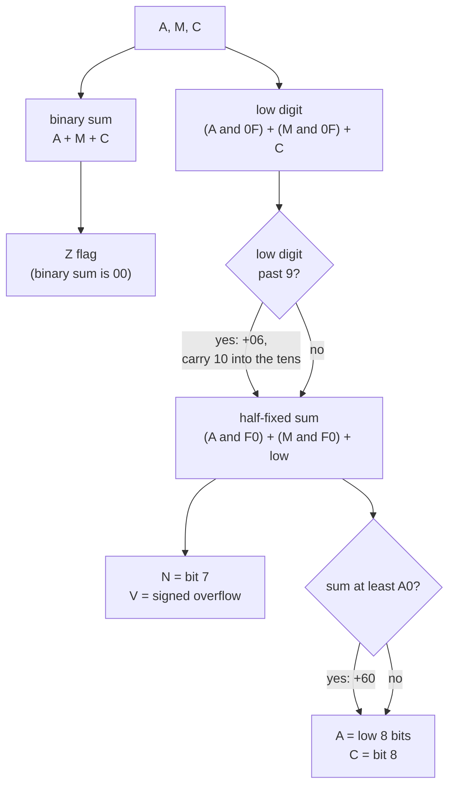
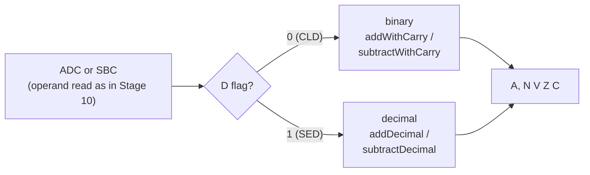

# Stage 11: Decimal mode

> **Part:** 2 (The 6502 CPU) · **Branch:** `stage/11-decimal-mode` · **Needs:** 10
> **Status:** done

## Goal

Stage 10's `ADC` and `SBC` worked in binary. This stage adds the other half of those two instructions: **decimal mode**. When the **D** flag is set, the same 16 opcodes do arithmetic on **binary-coded decimal** (BCD), where each byte holds two decimal digits. `&19 + &01` gives `&20`, not `&1A`.

It also brings two instructions forward from Stage 14, so that programs can turn decimal mode on and off themselves:

- **`SED`** (`&F8`): set D.
- **`CLD`** (`&D8`): clear D.

Three ideas carry the stage:

1. **BCD stores a decimal digit in each nibble**, so the hex digits *read as* the decimal number. Binary addition gets the digits wrong whenever a column goes past 9, and the 6502 fixes that by adding 6.
2. **A and C are right in decimal mode; N, V and Z aren't.** On the NMOS 6502 they come from the wrong stage of the sum, so `&99 + &01` gives A=`&00` with **Z=0**. That's a hardware quirk that real software has to live with, and emulators have to copy.
3. **"Invalid" BCD still does something definite.** Bytes like `&0F` aren't BCD, but the chip's adder doesn't check. It does the same fix-up steps regardless, giving answers like `&0F + &00 = &15`.

## What you can now see

### In the terminal: the score counter

```bash
npm run demo:score
```

The same two instructions, `ADC #&01` and `STA score`, run 100 times, first after `SED` and then after `CLD`. Each grid shows the byte at `&80` after each lap, as hex:

```
  SED (decimal)                    CLD (binary)
  01 02 03 04 05 06 07 08 09 10    01 02 03 04 05 06 07 08 09 0A
  11 12 13 14 15 16 17 18 19 20    0B 0C 0D 0E 0F 10 11 12 13 14
  21 22 23 24 25 26 27 28 29 30    15 16 17 18 19 1A 1B 1C 1D 1E
  ...
  91 92 93 94 95 96 97 98 99 00    5B 5C 5D 5E 5F 60 61 62 63 64

Lap 100 in decimal: &99 + &01 → A=&00 with C=1: the hundred has gone into C.
But N=1 and Z=0, although A is zero. That's the NMOS quirk below.
```

Then it prints a table of decimal `ADC`s, each one run on the emulated CPU:

```
A  + M  + C   A   C  N V Z   binary sum   note
--   --   -   --  -  - - -   ----------   ----
09 + 01 + 0   10  0  0 0 0   &0A          low digit fixed up
58 + 46 + 0   04  1  1 1 0   &9E          both digits fixed up: 104
99 + 01 + 0   00  1  1 0 0   &9A          A=00 but Z=0 and N=1
80 + 80 + 0   60  1  0 1 1   &100         A=60 but Z=1
79 + 00 + 1   80  0  1 1 0   &7A          V=1 from the half-fixed &80
0F + 00 + 0   15  0  0 0 0   &0F          invalid BCD
1A + 00 + 0   20  0  0 0 0   &1A          invalid BCD
```

**There are no branches until Stage 14, so the script plays the part of the loop.** After each `STA`, it puts PC back on the `ADC`. In Stage 14 the program will do that itself with `BNE`.

### In the browser

```bash
npm run dev      # then open http://localhost:5173
```

The playground now opens on the **Stage 11: decimal mode** example (`?program=decimal`):

```
start:  SED               ; D=1: ADC and SBC now work in decimal
        LDA #&09
        ADC #&01          ; &09 + &01 = &10, not &0A. (C=0 after our reset)
        LDA #&95          ; the score is 0995: add 10 points
        ADC #&10          ; 95 + 10 = 105: A=&05, and C=1 carries the hundred
        STA score
        LDA #&09
        ADC #&00          ; 09 + 00 + carry 1 = &10. C=0
        STA score+1       ; score = 05 10, which reads as 1005
        LDA #&80
        ADC #&80          ; 80 + 80 = 160: A=&60, C=1. But Z=1! (binary &100)
        LDA score         ; now take 6 points off. C=1: no borrow in
        SBC #&06          ; 05 - 06 goes below 0: A=&99, C=0 (borrowed)
        STA score
        LDA score+1
        SBC #&00          ; 10 - 00 - borrow 1 = &09. C=1
        STA score+1       ; score = 99 09, which reads as 0999
        LDA #&98
        ADC #&01          ; 98 + 01 + carry 1 = 100: A=&00, C=1. But Z=0, N=1!
        CLD               ; D=0: binary again
        LDA #&10
        SBC #&01          ; &10 - &01 = &0F in binary (decimal would give &09)
        NOP               ; then the NOP slide, and BRK at &0500 stops it
```

Things to try. Watch the **D**, **N**, **Z** and **C** lights:

1. **Step once.** `SED` lights **D**.
2. **Step twice more.** A = `&10`. In Stage 10's binary mode, the same `ADC` gave `&0A`.
3. **Step to `STA score+1` (9 steps in all), then type `&80` in the Memory panel's address box and press Go.** `&80`/`&81` hold `05 10`. Read the high byte first: the score is 1005.
4. **Step `LDA #&80`, `ADC #&80`.** A = `&60`, and **Z lights**, even though A isn't zero. It's the binary sum (`&100`) that's zero.
5. **Step the subtraction (6 steps).** `SBC #&06` gives `&99` and C goes out (it borrowed). The high byte becomes `&09`, so the score is 0999.
6. **Step `LDA #&98`, `ADC #&01`.** A = `&00`, but **Z stays dark and N lights**. That's the opposite way round from step 4.
7. **Step `CLD`, `LDA #&10`, `SBC #&01`.** D goes dark, and A = `&0F`: binary again.


*(The screenshot is a local file in the gitignored `.playwright-mcp/` folder. Re-create it with step 4.)*

**One thing that looks odd:** the Registers panel's detail column shows A = `&60` as "96 / 96". That's its binary meaning (unsigned and signed). As BCD, the same byte means 60. The panel doesn't know which you mean, any more than the CPU does.

The earlier examples are still in the picker, or at `?program=arithmetic`, `?program=incdec`, `?program=labels`, `?program=stores` and `?program=loads`.

### Getting by without `CLC` and `SEC`

As in Stage 10, each `ADC` and `SBC` is placed where C is already what it needs. C=0 from our reset feeds the first `ADC`, and the `&80 + &80` carry is the "no borrow" for the first `SBC`. Real code would put `CLC` before each addition and `SEC` before each subtraction.

## The real hardware

### The D flag

D is bit 3 of P (`P_D = &08`, Stage 04). It changes **only** what `ADC` and `SBC` do. Nothing else on the NMOS 6502 looks at it: `INC`, `DEC`, `INX`, `INY` and the compares (Stage 14) always count in binary, even with D set.

| Instruction | Opcode | Bytes | Cycles | Effect |
|---|---|---|---|---|
| `SED` | `&F8` | 1 | 2 | D = 1 |
| `CLD` | `&D8` | 1 | 2 | D = 0 |

Both are implied mode and change no other flag (MCS6500 Programming Manual, chapter 3, and Appendix B). `PLP` (Stage 15) and `RTI` (Stage 17) can also change D, because they load the whole of P from the stack.

**D is not cleared by reset or by interrupts on the NMOS 6502.** It powers up random. That's why the MOS 1.20 reset code runs `CLD` almost straight away, and why an interrupt handler that does arithmetic needs its own `CLD` (Stage 17). The 65C02, used in the BBC Master, does clear D on reset and interrupts. That's one of the differences between the two chips.

### Timing

On the **NMOS** 6502, decimal `ADC` and `SBC` take **exactly the same cycles** as binary. The fix-up is done inside the same cycle as the addition. (The 65C02 takes one extra cycle in decimal mode, because it fixes up the flags too. Our target is the NMOS chip, so we don't.)

### What the BBC Micro uses it for

BBC BASIC II itself works in binary, but programs and games often keep scores in BCD, because a BCD byte can be printed digit by digit without dividing by 10. The 6502 has no divide instruction, so turning a binary number into decimal digits costs a loop of repeated subtractions. With BCD, each digit is just a nibble.

## Key concepts

### 1. Binary-coded decimal: one digit per nibble

A byte has two nibbles (4 bits each, Stage 01). In BCD, each nibble holds **one decimal digit**, 0–9:

```
  decimal 47  →  BCD &47  =  0100 0111
                            └─4─┘ └─7─┘
```

So a BCD byte holds 00–99, and its **hex digits are the decimal digits**. The memory panel shows `&47`, and you read it as "47". (Stage 01's `binaryToBcd(47)` = `&47` and `bcdToBinary(&47)` = 47 do this conversion.)

The cost is space. One byte holds only 100 of its 256 possible values, so the nibble values `A`–`F` are never used. Those six spare values per nibble are exactly where the trick comes from.

### 2. Why adding 6 fixes the digits

Add `09 + 01` in binary: `&09 + &01 = &0A`. In BCD, that's wrong: `A` isn't a digit, and the answer should be `&10`.

The low nibble went past 9, into one of the six unused values. Adding **6** skips over them: `&0A + &06 = &10`. The 6 makes the nibble overflow at 10 instead of 16, which carries 1 into the tens digit, exactly as decimal addition should.

The same is true of the tens digit. If the high nibble goes past 9, adding `&60` makes it overflow at 100 instead of 160, and that overflow is the carry out, into **C**.

```
  58 + 46 in decimal mode:

                 low nibble          high nibble
  digits         8 + 6 = 14 (&E)     5 + 4 = 9
  > 9?           yes: +6 → &14       the 1 carries in: 9 + 1 = 10 (&A)
  > 9?                               yes: +6 → &10, so C = 1
  result         4                   0                    → A = &04, C = 1

  58 + 46 = 104: A holds the "04", and C holds the hundred.
```

The rule, written per nibble:

| Step | Low digit | High digit |
|---|---|---|
| Add | `(A & &0F) + (M & &0F) + C` | `(A & &F0) + (M & &F0)` + whatever carried out of the low digit |
| If it's past 9 | add `&06`, carry 1 into the high digit | add `&60`, carry 1 out into C |

**C works exactly as in binary**, except that it carries hundreds instead of 256s. So a four-digit BCD score is two bytes, added low byte first, with C handing the carry from one to the next. It's Stage 10's 16-bit addition with D set.

### 3. Subtraction: take 6 away instead

`SBC` in decimal mode borrows at 10 instead of 16. If a digit goes below 0, it subtracts 6 to skip the six unused values going down:

```
  10 − 01 in decimal mode (C = 1, no borrow in):

  low digit:   0 − 1 = −1         below 0: −6, and borrow 1 from the tens
               the nibble reads 9
  high digit:  1 − 0 − 1 = 0
  result       A = &09, C = 1 (no borrow out)
```

A binary subtraction would have given `&0F`. As in Stage 10, **C=1 means no borrow** and C=0 means it borrowed: `&00 − &01` gives A=`&99`, C=0. That's "99, and borrow one from the next byte up", which is right for a decimal counter going down.

### 4. The NMOS quirks: N, V and Z

The 6502 does the decimal fix-up in the same cycle as the add. It has to get the answer into A in time, but the circuits that set N, V and Z look at **earlier stages** of the sum. So in decimal mode on the NMOS 6502:

| Flag | ADC in decimal mode | SBC in decimal mode |
|---|---|---|
| **A** | correct BCD (for valid inputs) | correct BCD (for valid inputs) |
| **C** | correct: the decimal carry | correct (it's the same as binary) |
| **Z** | from the **binary** sum `A + M + C` | same as binary |
| **N** | bit 7 after the low-digit fix-up, **before** the high-digit fix-up | same as binary |
| **V** | signed overflow, from the same half-fixed value as N | same as binary |

Two examples show that Z can be wrong in both directions:

| Sum | A | C | Binary sum | **Z** | |
|---|---|---|---|---|---|
| `&99 + &01` | `&00` | 1 | `&9A` | **0** | A is zero, but Z says it isn't |
| `&80 + &80` | `&60` | 1 | `&100` → `&00` | **1** | A is `&60`, but Z says it's zero |

And N can be wrong, too. In `&99 + &01`, the half-fixed value is `&A0` (the low digit has been fixed up to `&10`, and `&90 + &10 = &A0`), so **N=1** even though A=`&00`.

Is that a bug? Arguably, yes, but it's how every NMOS 6502 behaves, and MOS's documentation never promised more than a correct A and C in decimal mode. (I haven't been able to check the exact wording in the 1976 manual. Clark's tutorial discusses what was and wasn't documented.) The lesson for 6502 programmers is **in decimal mode, test C, and don't trust N, V or Z after ADC**. The lesson for emulator writers is that real programs, and the test suites in Stages 19 and 20, check these flags, so we copy the quirk exactly. The 65C02 fixed it (at the cost of the extra cycle).

#### Where N and V come from

Bruce Clark's tutorial on 6502.org (see Further reading) gives the NMOS behaviour as an algorithm, tested on real chips. For `ADC`:

```
  1. low  = (A & &0F) + (M & &0F) + C
  2. if low ≥ &0A:  low = ((low + &06) & &0F) + &10      fix the low digit, carry into the tens
  3. sum  = (A & &F0) + (M & &F0) + low                 the half-fixed value
     → N = bit 7 of sum
     → V = signed overflow of the same addition (A and M's signs agree, sum's differs)
  4. if sum ≥ &A0:  sum = sum + &60                      fix the high digit
  5. A = sum & &FF,  C = 1 if sum ≥ &100
     Z = 1 if (A + M + C) & &FF = 0                     from the plain binary sum
```

Step 3's value is the one N and V see. Step 4 is the fix-up they miss.

For `SBC`, the flags are all exactly as in binary (Stage 10's `subtractWithCarry`), and only A is fixed up:

```
  1. low  = (A & &0F) − (M & &0F) − (1 − C)
  2. if low < 0:    low = ((low − &06) & &0F) − &10      fix the low digit, borrow from the tens
  3. diff = (A & &F0) − (M & &F0) + low
  4. if diff < 0:   diff = diff − &60                    fix the high digit
  5. A = diff & &FF
```

### 5. Invalid BCD

Nothing stops a program from setting D and adding `&0F`, which isn't BCD. The adder just follows the steps above:

| Sum | Steps | A |
|---|---|---|
| `&0F + &00` | low = `&F` ≥ `&A`, so `((&F + 6) & &F) + &10 = &15` | `&15` |
| `&1A + &00` | low = `&A` → `&10`. sum = `&10 + &10 = &20` | `&20` |
| `&FF + &FF + 1` | low = `&1F` → `&15`. sum = `&F0 + &F0 + &15 = &1F5` → `+&60` = `&255` | `&55`, C=1 |
| `&20 − &0F` | low = `0 − &F = −15` → `((−21) & &F) − &10 = −5`. diff = `&20 − 5 = &1B` | `&1B` |

Some of these make a kind of sense (`&1A` is "1 ten and 10 ones", which is 20), and some don't. They're never what a program wants, but they're what the chip does, so the emulator must do the same. Software sometimes depends on them by accident, and copy protection occasionally did on purpose.

**How sure are we?** The algorithm above is from Clark's tutorial, which says it was checked against every input on real NMOS chips. I'm confident of it, but I can't run a real 6502 here. Stage 19's per-opcode test suite (data recorded from real hardware) will check every one of the 131,072 inputs again, and it's the final word.

## Diagrams

### Decimal ADC: where each result comes from



The three flag boxes hang off three different points in the sum. Only A and C come from the end of it.

### What D switches



## Our design

### Two new ALU functions, and a switch on D

The arithmetic stays in [`src/cpu/instructions/arithmetic.ts`](../../src/cpu/instructions/arithmetic.ts). Stage 10's `addWithCarry` and `subtractWithCarry` don't change at all. Next to them go:

```ts
/** Decimal ADC, NMOS behaviour: A and C are BCD; N and V see the half-fixed sum; Z sees the binary sum. */
export function addDecimal(regs: Registers, value: number): void

/** Decimal SBC, NMOS behaviour: every flag is as in binary, only A is fixed up. */
export function subtractDecimal(regs: Registers, value: number): void
```

and two small dispatchers that the opcode rows call:

```ts
export function add(regs: Registers, value: number): void {
  if (regs.d) addDecimal(regs, value);
  else addWithCarry(regs, value);
}
```

- **The check on D happens per instruction**, not once at module load, because D can change between any two instructions. It's a single boolean test, so it costs nothing measurable and allocates nothing.
- **`subtractDecimal` calls `subtractWithCarry` first** to set the flags (they're the binary ones), then overwrites A with the decimal answer. That says in code what the hardware does: the same flags, a different A.
- **`addDecimal` can't reuse `addWithCarry`**, because its N, V and C are all different. It computes the binary sum only for Z.
- **No tables.** A 256 × 256 × 2 lookup table would be 128 KB and fast, but it hides the steps this stage is about. The steps are a handful of integer operations, which is already cheap.

### SED and CLD, brought forward

They go in a new file, [`src/cpu/instructions/flag-ops.ts`](../../src/cpu/instructions/flag-ops.ts), named for the group it will hold. Stage 14 adds the other five (`CLC`, `SEC`, `CLI`, `SEI`, `CLV`) to the same file. They're the smallest instructions the CPU has: one byte, two cycles, and a single boolean assignment.

### Alternatives considered

- **Putting the D check inside `addWithCarry`.** Fewer functions, but then the binary sweep tests from Stage 10 would quietly depend on D being clear, and the name would stop being true.
- **Choosing the ALU once per opcode, as the factory does for the addressing mode.** Not possible: the addressing mode is fixed by the opcode byte, but D is runtime state.
- **Modelling the 65C02 too, behind an option.** Out of scope (the Model B is NMOS). The doc notes the differences instead.

## Code walkthrough

- [`src/cpu/instructions/arithmetic.ts`](../../src/cpu/instructions/arithmetic.ts)
  - **`addDecimal(regs, value)`** follows Key concepts §4 line by line. `low` is the low digit, fixed up past 9. `sum` is the half-fixed value, so **N and V are set here**, before the `+ &60`. Then the high digit is fixed up, and C and A come from what's left. Z is computed separately from `a + value + carry`, the plain binary sum.
  - **`subtractDecimal(regs, value)`** saves A and the borrow, calls Stage 10's `subtractWithCarry` (which sets all four flags, correctly, because they're the binary ones), and then overwrites A with the decimal answer. JavaScript's `&` works on 32-bit two's complement, so `(-7) & 0x0f` is `9` and `(-103) & 0xff` is `&99`. Those negative intermediates mask down to exactly the right digits.
  - **`add` and `subtract`** check D and call the binary or the decimal function. The opcode rows now use these instead of calling `addWithCarry`/`subtractWithCarry` directly.
  - `addWithCarry` and `subtractWithCarry` themselves didn't change.
- [`src/cpu/instructions/flag-ops.ts`](../../src/cpu/instructions/flag-ops.ts) holds `SED` and `CLD`, each a single assignment to `regs.d`. `FLAG_OPS` goes into `GROUPS` in [`opcodes.ts`](../../src/cpu/opcodes.ts).
- [`src/playground/examples.ts`](../../src/playground/examples.ts) adds `DECIMAL_SOURCE`, the new default example.
- [`scripts/demo-score.ts`](../../scripts/demo-score.ts) is the CLI demo. It assembles a three-line counter twice (once with `SED`, once with `CLD`), runs 100 laps of each, and prints the quirk table from real `ADC`s.

## Tests

| Test file | What it proves |
|---|---|
| `src/cpu/instructions/arithmetic-decimal.test.ts` | **Valid BCD, exhaustively** (100 × 100 × 2 for `ADC #` and for `SBC #`, through `cpu.step()`): A and C match plain decimal arithmetic done with `bcdToBinary`/`binaryToBcd`. **Every input, exhaustively** (256 × 256 × 2 for each): A, N, V, Z and C match a step-by-step transcription of Clark's NMOS algorithm, written in its signed form, whereas our code uses the unsigned XOR form. Flags start opposite to the expected answer. **Worked examples**: `&99 + &01` (Z=0, N=1), `&80 + &80` (Z=1), `&79 + &00 + 1` (V=1), `&58 + &46`, invalid `&0F`, `&1A` and `&FF + &FF + 1`, and five `SBC`s, including `&00 − &01 = &99` and invalid `&20 − &0F = &1B`. Also: D switches the mode per instruction, `CLD` brings binary back, a 16-bit BCD score, **`INX` ignores D**, and all 16 opcodes work in decimal **at their binary cycle counts**, including +1 for a page crossing. |
| `src/cpu/instructions/flag-ops.test.ts` | `SED` and `CLD`: 1 byte, 2 cycles, set or clear D (also when it was already set or clear), and leave A, X, Y, S and the other five flags alone. |
| `src/playground/examples.test.ts` | The Stage 11 example: `&09 + &01 = &10`, the score 0995 + 10 = 1005 then − 6 = 0999 at `&80`/`&81`, the Z quirk both ways, and binary again after `CLD`. The default example is now `decimal`. |
| `src/cpu/cpu6502.test.ts` | The opcode count is now 68, including `SED` and `CLD`. |
| `e2e/decimal.spec.ts` | In the browser: the default example, D lighting on `SED`, Z lit on `&60`, Z dark and N lit on `&00`, the `&0081 ← &09` write, and D going dark on `CLD`. |
| `e2e/arithmetic.spec.ts` | Now opens `?program=arithmetic`, since the default changed. |

As a check on the sweeps, two deliberate bugs were planted and then reverted. Taking Z from the decimal result failed 3 tests. Setting N *after* the high-digit fix-up failed 4.

## Gotchas & hardware quirks

- **N, V and Z are unreliable after a decimal `ADC`** on the NMOS 6502. Z comes from the binary sum, and N and V come from the half-fixed sum. Only A and C are decimal. Test C, not Z.
- **Decimal `SBC`'s flags are all the binary ones.** Its N and Z agree with the decimal A more often than `ADC`'s do, but not always: `&00 − &25` (C=1) gives A=`&75`, but **N=1**, because the binary answer is `&DB`.
- **D affects only `ADC` and `SBC`.** `INC`, `DEC`, `INX`, `INY`, `DEX`, `DEY` and the compares (Stage 14) always count in binary, so `INX` after `SED` still goes `&09 → &0A`.
- **D isn't cleared by reset or interrupts on the NMOS 6502.** A program, and every interrupt handler that does arithmetic, must `CLD` itself. Our power-on state has D=0, but real hardware's is random. The 65C02 clears D on reset and interrupts.
- **No extra cycle.** The NMOS 6502 does the decimal fix-up for free. The 65C02 adds a cycle (and fixes the flags).
- **Invalid BCD is deterministic.** `&0F + &00 = &15` and `&20 − &0F = &1B` are what the NMOS chip does, according to Clark's tutorial. Stage 19's real-hardware test data will confirm every case.
- **`SED` and `CLD` arrived early.** They came forward from Stage 14 at your request, so the example programs can switch modes themselves. Stage 14 adds the other five flag instructions to `flag-ops.ts`.
- **The Registers panel reads A as binary.** `&60` shows as "96", not as BCD 60 (see the parking lot).

## Playwright verification

- **MCP:** opened `http://localhost:5173/` and stepped 11 times. The screenshot (above) shows A = `&60` with the **D, Z and C** lights on and N off, after `ADC #&80` in decimal mode. That's the Z quirk.
- **Durable:** added `e2e/decimal.spec.ts` (5 tests). `e2e/arithmetic.spec.ts` now opens `?program=arithmetic`. All 46 e2e tests pass.

## Check your understanding

1. With D=1 and C=0, what does `ADC #&27` do when A = `&45`? And when A = `&75`?
2. Why does adding 6 fix a BCD digit that has gone past 9?
3. After a decimal `ADC`, a program does `BEQ` to test for a zero score. Why is that a bug on the NMOS 6502, and what should it test instead?
4. A game keeps a 6-digit BCD score in three bytes. How does it add 150 points, and which flag links the bytes?
5. The MOS reset code runs `CLD` almost straight away. What could go wrong without it?

<details>
<summary>Answers</summary>

1. `&45 + &27`: the low digit is 5 + 7 = 12, past 9, so it becomes 2 with a carry, and the high digit is 4 + 2 + 1 = 7. **A = `&72`, C = 0** (45 + 27 = 72). `&75 + &27` = 102, so **A = `&02`, C = 1**.
2. A nibble can count to 15, but a decimal digit should stop at 9. Six values (A–F) lie between. Adding 6 skips over them, so the nibble overflows at 10 instead of 16, and the carry goes into the next digit up, as decimal addition needs.
3. Z comes from the binary sum, not the decimal result, so `&99 + &01` gives A = `&00` with Z = 0, and `&80 + &80` gives A = `&60` with Z = 1. To test for zero, test A afterwards with an instruction that sets Z from it, like `CMP #0` (Stage 14), or store it and load it again. To detect a roll-over past 99, test C.
4. 150 is `00 01 50` in BCD, low byte first. `SED`, `CLC`, then `LDA score : ADC #&50 : STA score`, then `LDA score+1 : ADC #&01 : STA score+1`, then `LDA score+2 : ADC #&00 : STA score+2`. **C** carries each hundred into the next byte. Then `CLD` once it's done.
5. D powers up random on an NMOS 6502, and reset doesn't clear it. If it happened to be set, every `ADC` and `SBC` in the MOS would work in decimal and give wrong answers, for example in address calculations, which would crash the machine in unpredictable ways.

</details>

## Further reading

- Bruce Clark, "Decimal Mode", 6502.org tutorials, especially Appendix A (the exact NMOS and 65C02 algorithms, including invalid BCD and the flags): [6502.org/tutorials/decimal_mode.html](http://www.6502.org/tutorials/decimal_mode.html).
- *MCS6500 Microcomputer Family Programming Manual* (MOS Technology, 1976): chapter 2 (decimal mode) and chapter 3 (SED, CLD).
- BBC Micro *Advanced User Guide*: the 6502 instruction set chapter (SED, CLD and decimal arithmetic).
