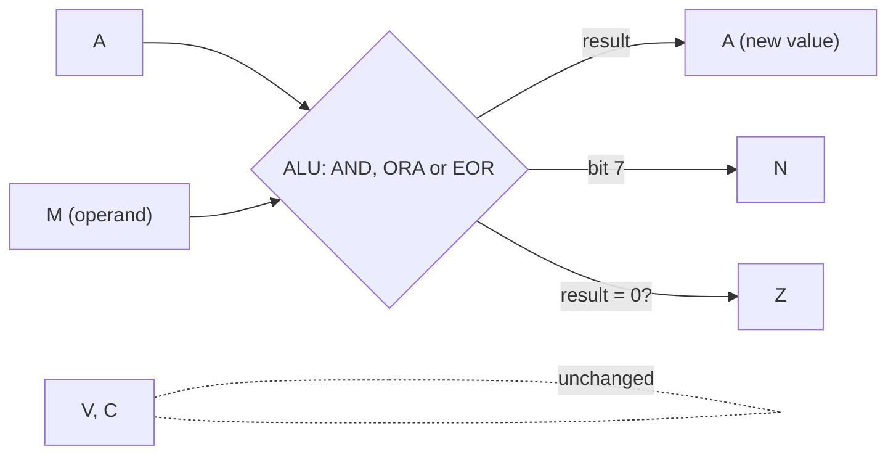
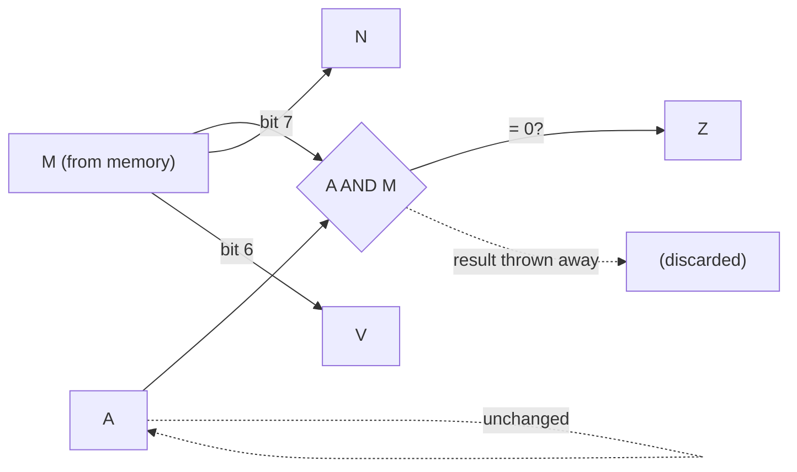
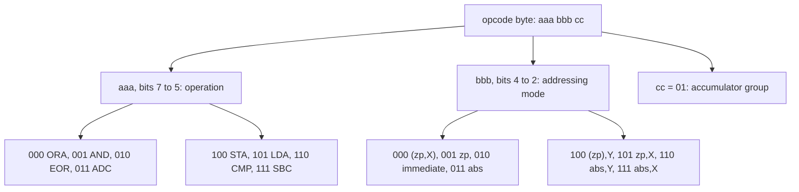

# Stage 12: Logic & BIT

> **Part:** 2 (The 6502 CPU) · **Branch:** `stage/12-logic-bit` · **Needs:** 11
> **Status:** done

## Goal

Stages 10 and 11 gave the CPU arithmetic. This stage adds the other kind of maths an 8-bit machine does all day: **bitwise logic**. That means working on the eight bits of a byte one at a time, with no carries between them.

- **`AND`**: keep only the bits that are 1 in both A and the operand. Use it to **clear** bits, or to pick some out.
- **`ORA`**: a bit is 1 if it's 1 in either. Use it to **set** bits.
- **`EOR`** (exclusive OR): a bit is 1 if it's 1 in exactly one. Use it to **toggle** bits.
- **`BIT`**: *test* bits without changing anything. It works out `A AND M` only to set Z, and copies bits 7 and 6 of memory straight into **N** and **V**.

That's 26 opcodes: 8 addressing modes each for AND, ORA and EOR, plus 2 for BIT.

It comes now because the next stages need it. Stage 13's shifts and rotates work on the same "row of bits" idea. On the real BBC, almost every hardware register (the VIAs, the 6845, the video ULA) is a byte of separate on/off bits that the MOS changes with `AND` and `ORA`.

The Registers panel also gains a **binary view** of A, X and Y, with the bits that changed in the last step highlighted. Logic is much easier to follow in binary than in hex.

## What you can now see

### In the browser: A in binary

```bash
npm run dev     # then open http://localhost:5173
```

The playground opens on the new **Stage 12: logic & BIT** example. The Registers panel has a new column showing **A, X and Y in binary**, with a space between the nibbles. After each step, the bits that just changed are highlighted.

1. Press **Step** twice (`LDA #&B5`, `AND #&0F`). A goes from `%1011 0101` to `%0000 0101`, and **bits 7, 5 and 4** are highlighted: the three 1s that the mask cleared.

   

2. Keep stepping. `ORA #&C0` lights bits 7 and 6 (and N). The first `EOR #&FF` highlights all eight bits, and the second flips them back. Then `AND #&30` gives `&00`, and Z lights.
3. Six steps later, `EOR #&20` turns "H" (`&48`) into "h" (`&68`), and **only bit 5** is highlighted:

   

4. The `STA screen` that follows, and the Memory panel at `&7C00`, show "hELLO". By step 15 it reads "HeLLO".
5. Steps 19–23 are the `BIT` tests. Watch N and V light from memory (`&C1`) while A stays at `&01`. Then Z lights for `A=&02`. Finally `BIT` on a space (`&20`) turns N and V **off**, even though A is `&FF`.

The Stage 11 example is still in the picker, or at `/?program=decimal`.

### In the terminal: masks, worked by the CPU

```bash
npm run demo:logic
```

Each mask is a real `AND`/`ORA`/`EOR #` run on the emulated 6502 and printed in binary:

```
   %1011 0101   &B5
   %0000 1111   &0F  AND #&0F    clear: keep only the low nibble
   ----------
   %0000 0101   &05  N=0 Z=0
...
   %0100 1000   &48
   %0010 0000   &20  EOR #&20    "H" → "h": swap case
   ----------
   %0110 1000   &68  N=0 Z=0
```

Then a table of `BIT` tests:

```
A           M           A AND M     A after  Z  N  V
----------  ----------  ----------  -------  -  -  -
%0000 0001  %1100 0001  %0000 0001  &01      0  1  1
%0000 0010  %1100 0001  %0000 0000  &02      1  1  1
%0000 0000  %1100 0000  %0000 0000  &00      1  1  1
%1111 1111  %0010 0000  %0010 0000  &FF      0  0  0
%1111 1111  %0100 0000  %0100 0000  &FF      0  0  1
```

Then a trace of the whole example, ending with `Screen row 0 at &7C00 now reads: "HeLLO, BBC MICRO"`.

## The real hardware

The three logic instructions use the same piece of the 6502 as `ADC`: the **ALU** (arithmetic logic unit), an 8-bit block that sits between A and the internal data bus. The ALU can add, and it can also AND, OR or EOR its two inputs. For logic it simply doesn't pass a carry from one bit to the next. Each bit of the answer depends only on the same bit of the two inputs.

The MCS6500 Programming Manual (chapter 2) describes all four:

| Instruction | Operation | Flags changed | Modes |
|---|---|---|---|
| `AND` | A ← A ∧ M | N, Z | the 8 "accumulator group" modes |
| `ORA` | A ← A ∨ M | N, Z | the 8 "accumulator group" modes |
| `EOR` | A ← A ⊻ M | N, Z | the 8 "accumulator group" modes |
| `BIT` | Z ← (A ∧ M = 0), N ← M₇, V ← M₆ | N, V, Z | zero page, absolute |

C, D and I are never touched, and V is only touched by `BIT`. A logic result can't overflow or carry, because no bit ever affects another.

### Where they sit in the opcode map

`AND`, `ORA` and `EOR` are in the same family as `LDA`, `ADC` and `SBC`: the **cc = %01** group. In that group, an opcode byte splits up as `aaa bbb cc`:

- `aaa` (bits 7–5) picks the operation.
- `bbb` (bits 4–2) picks the addressing mode.

| `aaa` | Operation | Immediate opcode |
|---|---|---|
| %000 | `ORA` | `&09` |
| %001 | `AND` | `&29` |
| %010 | `EOR` | `&49` |
| %011 | `ADC` | `&69` (Stage 10) |
| %100 | `STA` | (no immediate) |
| %101 | `LDA` | `&A9` (Stage 06) |
| %110 | `CMP` | `&C9` (Stage 14) |
| %111 | `SBC` | `&E9` (Stage 10) |

The `bbb` field is the same for every row, so `AND`'s modes line up with `LDA`'s. They also have the **same lengths and cycle counts**, because the bus work is identical: fetch the operand, then do something with it inside the chip. The only difference is what the ALU does with the operand.

| Mode | `AND` | `ORA` | `EOR` | Bytes | Cycles |
|---|---|---|---|---|---|
| `#&nn` | `&29` | `&09` | `&49` | 2 | 2 |
| `&nn` | `&25` | `&05` | `&45` | 2 | 3 |
| `&nn,X` | `&35` | `&15` | `&55` | 2 | 4 |
| `&nnnn` | `&2D` | `&0D` | `&4D` | 3 | 4 |
| `&nnnn,X` | `&3D` | `&1D` | `&5D` | 3 | 4 (+1 on page cross) |
| `&nnnn,Y` | `&39` | `&19` | `&59` | 3 | 4 (+1 on page cross) |
| `(&nn,X)` | `&21` | `&01` | `&41` | 2 | 6 |
| `(&nn),Y` | `&31` | `&11` | `&51` | 2 | 5 (+1 on page cross) |

`BIT` belongs to a different group (cc = %00, next to `STY`, `LDY` and `CPY`), and the NMOS 6502 only gives it two modes:

| Mode | Opcode | Bytes | Cycles |
|---|---|---|---|
| `BIT &nn` | `&24` | 2 | 3 |
| `BIT &nnnn` | `&2C` | 3 | 4 |

There is **no `BIT #`** on the Model B's 6502. `&89` (`BIT #&nn`) was added with the 65C02, the CMOS chip used in the Master. On our NMOS chip `&89` is an undocumented opcode, and we leave it empty.

## Key concepts

### 1. Bits as eight separate switches

Up to now we've read a byte as a *number*: `&B5` is 181, or −75. Logic instructions read it as **eight separate yes/no switches**, numbered 7 (left) to 0 (right):

```
&B5 = %1011 0101
       ││││ ││││
 bit:  7654 3210
```

Each hex digit is exactly four bits (a **nibble**), which is why the binary view in the panel puts a space in the middle. `&B` is the top nibble `1011` and `&5` is the bottom one `0101`.

### 2. Truth tables: one bit at a time

Each instruction applies the same rule to all 8 bit positions at once:

| A bit | M bit | `AND` | `ORA` | `EOR` |
|---|---|---|---|---|
| 0 | 0 | 0 | 0 | 0 |
| 0 | 1 | 0 | 1 | 1 |
| 1 | 0 | 0 | 1 | 1 |
| 1 | 1 | 1 | 1 | 0 |

### 3. Masks: the operand chooses which bits to change

In practice you rarely think of it as "A AND M". You think of the operand as a **mask** that says which bits to work on:

| Goal | Instruction | Rule | Example |
|---|---|---|---|
| **Clear** some bits | `AND` with 0s where you want to clear | `x AND 0 = 0`, `x AND 1 = x` | `&B5 AND &0F` = `&05` (keep the low nibble) |
| **Set** some bits | `ORA` with 1s where you want to set | `x OR 1 = 1`, `x OR 0 = x` | `&05 ORA &C0` = `&C5` (set bits 7 and 6) |
| **Toggle** some bits | `EOR` with 1s where you want to flip | `x EOR 1 = NOT x`, `x EOR 0 = x` | `&C5 EOR &FF` = `&3A` (flip all eight) |

Worked in binary:

```
  %1011 0101   &B5          %0000 0101   &05          %1100 0101   &C5
  %0000 1111   &0F  AND     %1100 0000   &C0  ORA     %1111 1111   &FF  EOR
  ----------                ----------                ----------
  %0000 0101   &05          %1100 0101   &C5          %0011 1010   &3A
```

Three facts fall out of these rules:

- **`EOR #&FF` is NOT.** The 6502 has no "invert A" instruction, so this is how you do it. It's also the first step of two's-complement negation (Stage 10): `EOR #&FF` then add 1.
- **`EOR` undoes itself.** Applying the same mask twice gets you back where you started: `&C5 EOR &FF EOR &FF` = `&C5`. This is how software draws a sprite or a cursor and then removes it without having saved what was underneath.
- **`AND` with a mask, then test Z,** answers "are any of these bits set?". The answer is Z=0 for yes, Z=1 for none. That's how `AND #&30` on `&C5` gives Z=1: the two bytes have no 1s in common.

### 4. ASCII is full of masks

ASCII was designed so that upper and lower case differ in **one bit**, bit 5 (`&20`):

| Char | Hex | Binary |
|---|---|---|
| `H` | `&48` | `%0100 1000` |
| `h` | `&68` | `%0110 1000` |

So:

- `EOR #&20` **swaps** the case of a letter.
- `ORA #&20` **forces** lower case.
- `AND #&DF` (`%1101 1111`) **forces** upper case.

The example program does all three to "HELLO" in Mode 7 screen memory.

### 5. Masks on the BBC Micro

The MOS uses this pattern everywhere. One example you can look up is in the Advanced User Guide's description of **OSBYTE** calls `&A6`–`&FF`. These calls read and write MOS variables, and the AUG gives the new value as:

> new value = (old value AND Y) EOR X

So `Y` is an `AND` mask (which bits to keep) and `X` is an `EOR` mask (which to flip or set). `X=0, Y=&FF` reads the value without changing it. `X=v, Y=0` writes `v`. One call does read, write, set-bits and clear-bits.

The hardware is the same. A VIA's interrupt enable register, the 6845's registers and the video ULA's control register are all bytes of separate switches. The MOS keeps a copy in RAM, changes one bit with `AND`/`ORA`, and writes the whole byte back. We'll meet each of those in Parts 4, 8 and 9.

### 6. BIT: a test that changes nothing but flags

`BIT` is the odd one out. It's a *read-only* test:

- It works out `A AND M`, uses it to set **Z**, and throws the result away. **A is unchanged.**
- It copies **bit 7 of M** into **N**, and **bit 6 of M** into **V**. These come from the memory byte itself, *not* from the `AND` result. A plays no part in N or V.

Example, with `A = &01` and `M = &C1` (`%1100 0001`):

| Flag | Comes from | Value |
|---|---|---|
| Z | `&01 AND &C1` = `&01`, not zero | 0 |
| N | bit 7 of `&C1` | 1 |
| V | bit 6 of `&C1` | 1 |
| A | (unchanged) | `&01` |

Why is it built like that? Because the top two bits of a byte are the cheapest ones to test. Once N and V hold them, `BMI`/`BPL` and `BVS`/`BVC` (Stage 14) can branch on them directly, without loading anything into A first. So 6502 hardware designers often put their most important status bits in bits 7 and 6. The 6522 VIA does exactly this. Bit 7 of its interrupt flag register (`IFR`, at `&FE4D` for the System VIA) means "this VIA is interrupting", and bit 6 is Timer 1. One `BIT &FE4D` checks both, and leaves A alone for something else. We build the VIA in Part 4.

**The catch:** `BIT` *reads* memory. A read of a hardware register can have side effects (reading the VIA's `T1C-L` clears its interrupt flag, for example). So `BIT` on SHEILA is not a "free look" at a register. Our playground is plain RAM, so this doesn't matter yet. From Stage 21 the memory map has real devices on it.

## Diagrams

How each of the four instructions uses A, the operand M and the flags:



`BIT` routes things differently. Only Z depends on A:



And the opcode byte for the cc = %01 group, showing how the eight operations share the eight modes:



## Our design

### `src/cpu/instructions/logic.ts`

A new instruction group, built like `arithmetic.ts`:

```ts
/** AND: A ← A ∧ M. Clears every bit that is 0 in M. */
export function and(regs: Registers, value: number): void
/** ORA: A ← A ∨ M. Sets every bit that is 1 in M. */
export function or(regs: Registers, value: number): void
/** EOR: A ← A ⊻ M. Flips every bit that is 1 in M. */
export function eor(regs: Registers, value: number): void
/** BIT: Z from A ∧ M; N and V copied from bits 7 and 6 of M. A unchanged. */
export function bit(regs: Registers, value: number): void

export const LOGIC: readonly OpcodeDefinition[]   // 26 rows
```

- The four ALU functions take `(regs, value)` and write into `regs`, just like `addWithCarry`. They don't touch the bus, so tests can sweep all 256 × 256 inputs quickly without stepping a CPU.
- A small private factory, `readOperand(mode, alu)`, turns one of them into an `execute` function. It reads the operand from the effective address, runs the ALU function, and returns `+1` if `cpu.pageCrossed` is set. That's the same shape as `arithmetic()` in Stage 10.

  **Alternative considered:** export `arithmetic()` from `arithmetic.ts` and reuse it. It's tempting, because it's the same five lines. But the factory is about "instructions that read an operand", not about arithmetic, and `CMP` (Stage 14) will want it too. Rather than have `logic.ts` and `compare.ts` reach into `arithmetic.ts`, I've kept a copy in `logic.ts` for now. Stage 14 is the right moment to move it somewhere shared once there are three users. That's noted in the parking lot.
- `BIT` uses the same factory. It only has zero-page and absolute modes, which never cross a page, so the `+1` never applies.
- `opcodes.ts` adds `LOGIC` to `GROUPS`. `buildTable` already throws if two groups claim one opcode.

### The Registers panel: a binary view

`RegisterCell` gains two fields, filled in for A, X and Y:

```ts
/** e.g. "%1011 0101", for A, X and Y; "" for the others. */
readonly binary: string;
/** Bits that differ from the previous view: e.g. &F0 after EOR #&F0. 0 if none, or no previous view. */
readonly changedBits: number;
```

The panel draws the binary as eight `<span>`s, and marks each bit set in `changedBits`. After `EOR #&20` on `&48`, you see exactly one bit, bit 5, light up. `changedBits` is just `old EOR new`, which is itself a nice use of this stage's instruction.

### The example: `logic`

A new default example program, `LOGIC_SOURCE`, walks through masks on A, then the three case-changing tricks on "HELLO" at `&7C00`, then four `BIT` tests. Stage 11's `decimal` example stays available in the picker, and `e2e/decimal.spec.ts` opens it with `?program=decimal`.

### What was using `&29`?

Two tests used `&29` as "an opcode that isn't implemented yet" (`cpu6502.test.ts` and `registers-view-model.test.ts`). `&29` is now `AND #`, so they move to `&0A` (`ASL A`, Stage 13).

## Code walkthrough

- [`src/cpu/instructions/logic.ts`](../../src/cpu/instructions/logic.ts)
  - `and`, `or`, `eor`: one line of JS each (`&`, `|`, `^`), then `setNZ`. JS's bitwise operators work on 32-bit integers, so the result is masked with `& 0xff` to keep A a byte. With two byte inputs it can't actually go over `&FF`, but the mask states the hardware width and costs nothing.
  - `bit`: sets Z from `a & value`, but never assigns `regs.a`. N and V are tested against `P_N` (`&80`) and `P_V` (`&40`) from `flags.ts`. Those masks are the same bits in P as they are in M, which is the whole trick.
  - `readOperand(mode, alu)`: run once per table row at module load. It closes over the effective-address function and the ALU function, so `step()` allocates nothing.
  - `LOGIC`: the 26 rows, in the same column layout as `ARITHMETIC`.
- [`src/cpu/opcodes.ts`](../../src/cpu/opcodes.ts): `LOGIC` added to `GROUPS`.
- [`src/web/workbench/registers-view-model.ts`](../../src/web/workbench/registers-view-model.ts)
  - `formatBinary(value)`: `&B5` → `"%1011 0101"`. It's exported because the CLI demo uses it too.
  - `bitsOf(value, changedMask)`: the eight `RegisterBit`s, bit 7 first. The changed mask is `previous ^ value`, an `EOR`. It has a 1 exactly where a bit flipped.
  - `buildRegistersView` fills `binary` and `bits` for A, X and Y only. P keeps its binary in `detail`, as before.
- [`src/web/workbench/registers-panel.ts`](../../src/web/workbench/registers-panel.ts): a new `td.binary` cell, one `<span class="bit">` per bit, with `on` and `changed` classes and `data-bit`. CSS is in `index.html`.
- [`src/playground/examples.ts`](../../src/playground/examples.ts): `LOGIC_SOURCE`, now the default example.
- [`scripts/demo-logic.ts`](../../scripts/demo-logic.ts): the CLI demo (not in the plan).

## Tests

| Test file | What it proves |
|---|---|
| `src/cpu/instructions/logic.test.ts` | The table has 26 rows: 8 each of AND/ORA/EOR at `aaa` = %001/%000/%010 in the cc = %01 group, with LDA's modes and cycles. BIT has only `&24` (3 cycles) and `&2C` (4). `&89` stays empty. Each ALU function matches a **bit-by-bit truth table** for all 65,536 A × M pairs, and leaves V, C, D and I alone. The worked mask examples, and the three ASCII case tricks. BIT for all 65,536 inputs (Z from A AND M, N/V from M, A unchanged, flags pre-set to the wrong answer). Every opcode through `cpu.step()`: the operand address, A/N/V/Z, untouched C/D/I/X/Y/S/memory, PC advance and cycles. Page-crossing +1 for the 9 indexed read modes. |
| `src/cpu/cpu6502.test.ts` | The implemented-opcode census now includes AND, ORA, EOR and BIT. The "unimplemented" test uses `&0A` (`ASL A`, Stage 13). |
| `src/web/workbench/registers-view-model.test.ts` | Binary for A, X and Y (and none for S/PC/P). Bits come bit 7 first. No bits are marked on the first view. Only bit 5 is marked after `EOR #&20` on `&48`, and bits 7, 5 and 4 after `AND #&0F` on `&B5`. The "not implemented" line uses `&0A`. |
| `src/playground/examples.test.ts` | The logic example's A sequence (`&B5 → &05 → &C5 → &3A → &C5 → &00`), "HeLLO" on screen, the three BIT results, and `logic` as the fallback example. |
| `e2e/logic.spec.ts` | In the browser: the default example, the binary column, the 3 changed bits after AND and the 1 after EOR, and BIT setting and then clearing N/V with A unchanged. |
| `e2e/decimal.spec.ts` | Now opens `?program=decimal`. |

## Gotchas & hardware quirks

- **BIT's N and V come from memory, not from the AND.** It's easy to write `setNZ(regs, a & m)` and call it done. That gets N wrong whenever M has bit 7 set but A doesn't, and it never touches V. The exhaustive test starts every flag at the wrong answer, so a missing write can't pass by luck.
- **BIT leaves A alone.** If it changed A, it would just be `AND` with extra flags.
- **No `BIT #` on the NMOS 6502.** `&89` is a 65C02 opcode. If you see `BIT #` in Master-only code, it won't run on a Model B.
- **Logic never touches C or V** (except BIT's V). The Stage 13 shifts *do* use C, so don't assume "bit instructions" all behave alike.
- **BIT on I/O is a real read.** From Stage 21, `BIT &FE4D` reads the System VIA. Reading some VIA registers clears flags, so a "test" can change hardware state. The playground is plain RAM, so this doesn't show up yet.
- **The highlighted bits are relative to the previous redraw**, not to the previous instruction. After **Step ×16** they show everything that changed during the whole run, which is also what the "changed" highlight on registers already does.
- **A small copy:** `readOperand` in `logic.ts` is the same five lines as `arithmetic()` in `arithmetic.ts`. I kept two copies on purpose until `CMP` (Stage 14) makes three. Then one shared helper earns its place (parking lot).

## Playwright verification

- MCP: opened `http://localhost:5173/`, stepped twice, and took a screenshot of the Registers panel. A=`&05` `%0000 0101`, with bits 7, 5 and 4 highlighted (`.playwright-mcp/stage12-and.png`). Six more steps, and A=`&68` with only bit 5 highlighted (`.playwright-mcp/stage12-eor.png`).
- Durable: `e2e/logic.spec.ts` (4 tests). The whole e2e suite passes (50 tests).

## Check your understanding

1. You want to clear bit 3 of A and leave every other bit alone. Which instruction and which operand byte?
2. A=`&5A`. What is A after `EOR #&5A`, and what are N and Z? Why does that make `EOR` a quick "are these two bytes equal?" test?
3. A=`&00`, and `&70` holds `&80`. After `BIT &70`, what are A, N, V and Z?
4. Why do `AND`, `ORA` and `EOR` take exactly the same cycles as `LDA` in every mode?
5. OSBYTE `&A6`–`&FF` compute `(old AND Y) EOR X`. What X and Y would **toggle** bit 0 of a MOS variable and leave the rest alone?

<details>
<summary>Answers</summary>

1. `AND #&F7`. `&F7` is `%1111 0111`: a 0 only in bit 3, so only bit 3 is cleared.
2. `&00`, with N=0 and Z=1. A byte EOR itself is always 0, because every bit matches. If the bytes differ in any bit, that bit becomes 1. So Z=1 after `EOR` means "they were equal". (It destroys A, though. `CMP` in Stage 14 does the same test without changing A.)
3. A=`&00` (unchanged). Z=1 (`&00 AND &80` = 0). N=1 (bit 7 of `&80`). V=0 (bit 6 of `&80`). N=1 even though A is 0, because N comes from memory.
4. The bus does the same work in each case: fetch the opcode, fetch the operand bytes, work out the address, read one byte. What happens to that byte inside the ALU doesn't add a bus cycle. It overlaps with the next opcode fetch.
5. Y=`&FF` (keep every bit), X=`&01` (then flip bit 0).

</details>

## Further reading

- MCS6500 Microcomputer Family Programming Manual, chapter 2 (AND, ORA, EOR, BIT) and Appendix B (opcode table).
- BBC Micro Advanced User Guide: the OSBYTE chapter, calls `&A6`–`&FF` ("new value = (old value AND Y) EOR X"). Also the 6522 VIA chapter, on `IFR` bits 7 and 6.
- 6502.org: "6502 Opcodes" (the logic and BIT entries), and the opcode-matrix articles on the `aaa bbb cc` layout.
- BeebWiki: the OSBYTE pages, for real examples of AND/EOR masks on MOS variables.
