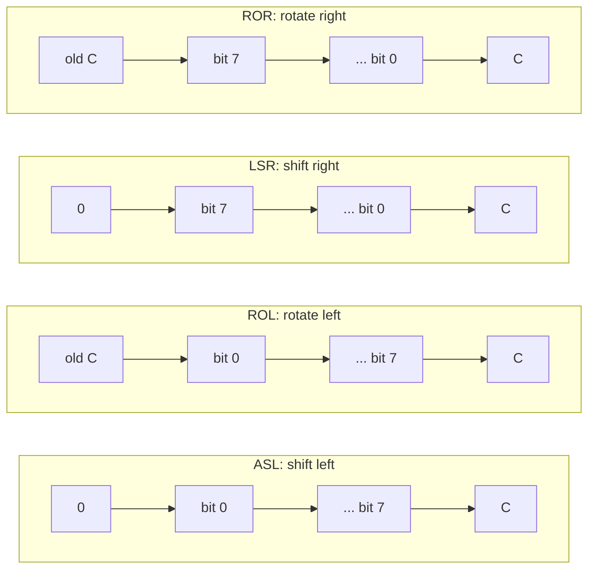
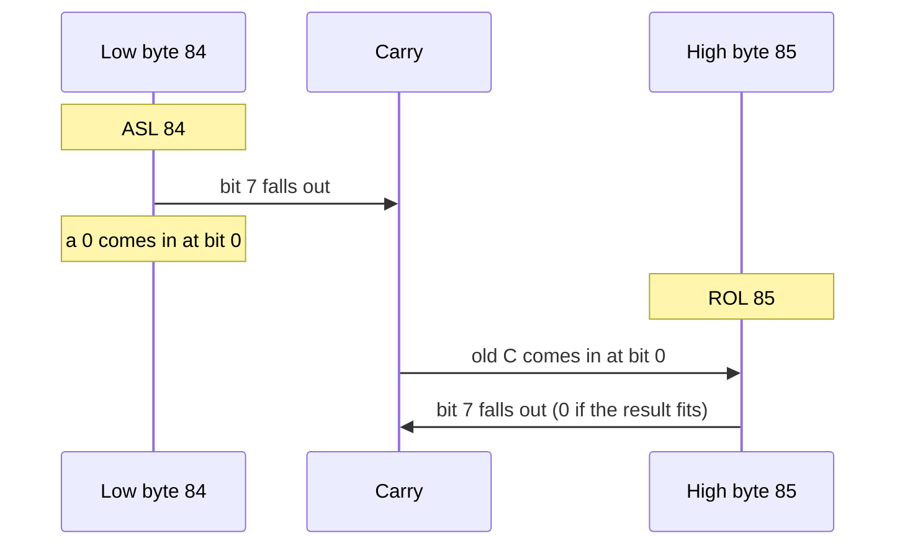
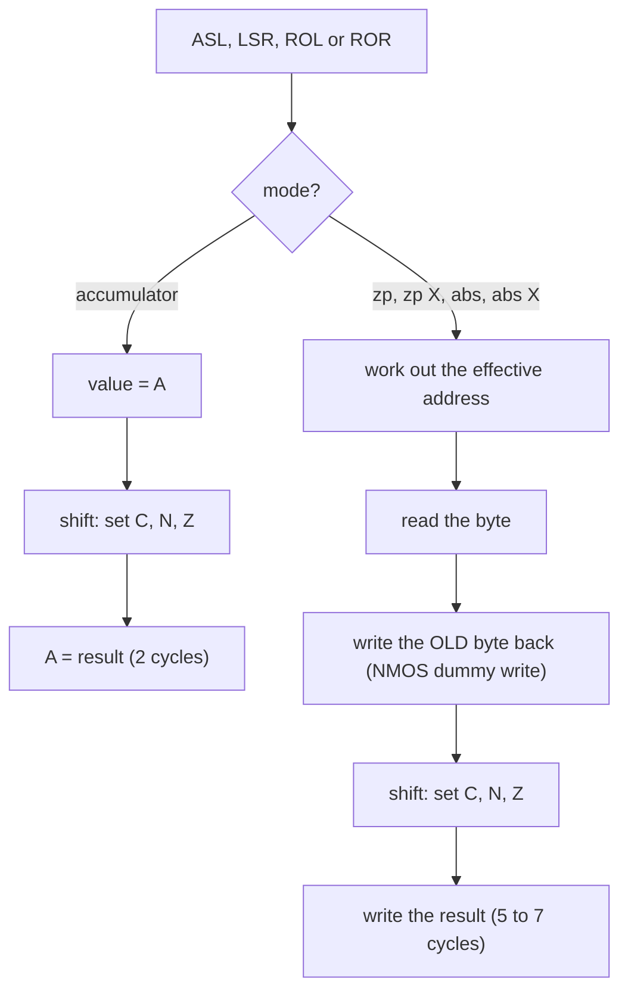

# Stage 13: Shifts & rotates

> **Part:** 2 (The 6502 CPU) · **Branch:** `stage/13-shifts-rotates` · **Needs:** 12
> **Status:** done

## Goal

Stage 12 treated a byte as eight separate switches. This stage **moves** those switches sideways:

- **`ASL`** (arithmetic shift left): every bit moves one place left. A 0 comes in at bit 0, and bit 7 falls out into **C**.
- **`LSR`** (logical shift right): every bit moves one place right. A 0 comes in at bit 7, and bit 0 falls out into **C**.
- **`ROL`** (rotate left): like `ASL`, but the **old C** comes in at bit 0.
- **`ROR`** (rotate right): like `LSR`, but the **old C** comes in at bit 7.

Each has five forms: on A (the **accumulator** mode, `ASL A`) and on a byte in memory (zero page, zero page,X, absolute, absolute,X). That's 20 opcodes.

Moving binary digits left one place doubles a number, the same way that moving decimal digits left multiplies by ten. So this stage is where the 6502, which has no multiply instruction, learns to multiply. The demo multiplies by 10 using only shifts and one add: **x·10 = x·8 + x·2**.

It comes now because the CPU already has the two things shifts lean on: `ADC` (Stage 10), to add the shifted pieces back together, and the "read-modify-write" machinery from `INC`/`DEC` (Stage 09), which the memory forms reuse exactly.

## What you can now see

### In the terminal: × 10 with shifts

```bash
npm run demo:times10
```

The demo assembles a 16-bit "× 10" routine (`ASL`/`ROL` three times, keep the × 2, then a two-byte `ADC`), lists it, and runs it on the emulated 6502 for a table of inputs:

```
     x    x * 10    result     C   cycles
------  --------  --------    -   ------
     0         0         0    0       60
    23       230       230    0       60
  1000     10000     10000    0       60
  6553     65530     65530    0       60
  6554     65540         4    1       60   65540 doesn't fit in 16 bits: wrapped, and C=1 says so
```

(Some rows trimmed.) Every input takes the same 60 cycles, which is 30 µs on the BBC's 2 MHz 6502. Then it traces x = 1000 (`&03E8`) through the shifts in 16-bit binary. You can see each `ASL` drop bit 7 of the low byte into C, and the `ROL` after it pick C up in bit 0 of the high byte:

```
after         &81         &80        value  C
------------  ---------------------  -----  -
(start)       %0000 0011  1110 1000   1000
ASL num       %0000 0011  1101 0000    976  1
ROL num+1     %0000 0111  1101 0000   2000  0
...
STA num+1     %0010 0111  0001 0000  10000  0
```

### In the browser: bits sliding

```bash
npm run dev     # then open http://localhost:5173
```

The playground opens on the new **Stage 13: shifts & rotates** example. Watch the binary view of A in the Registers panel:

1. Press **Step** three times (`LDA #23`, `STA num`, `ASL A`). A goes from `%0001 0111` (&17) to `%0010 1110` (&2E, 46). The highlighted bits show the whole pattern has moved one place left. The status line says `Ran 1 (2 cycles)`.

   

2. Step to 7 (the `ADC`). A = `&E6` = 230 = 23 × 10, and C is still off: the last `ASL` left it clear, so no `CLC` was needed.
3. Steps 9 and 10 are the two `LSR`s. 230 → 115 (C=0), then 115 → 57, and **C lights**: 115 was odd, and the remainder fell into C.
4. Step 11, `ASL num`, works on memory. The status says `Ran 1 (5 cycles), 2 writes`, and the Memory panel's Wrote line shows `&0080 ← &17, &0080 ← &2E`: the NMOS dummy write, exactly as with `INC`.
5. Steps 16 and 17 double the 16-bit word at `&84`/`&85` from `C0 01` to `80 03`.
6. Steps 19 to 22 walk one bit round the 9-bit ring. After `LSR A` the bit is in C (A=`&00`, Z on). After `ROR A` it's in bit 7 (A=`&80`, N on, C off):

   

   Then `ROL A` puts it back in C, and the last `ROL A` brings it in at bit 0, where it started.

The Stage 12 example is still in the picker, or at `/?program=logic`.

## The real hardware

The shifts use the same ALU as `ADC` and `AND`. The ALU can shift its input one place right, and "shift left" is done by adding the value to itself (A + A = 2A). (That detail comes from people reverse-engineering the chip's die, such as the Visual 6502 project. The manual only describes the result.) Either way, the bit that drops off the end goes into the carry flag, and the bit coming in at the other end is either 0 (shifts) or the old carry (rotates).

The MCS6500 Programming Manual (chapter 10, "Shift and memory modify instructions") describes all four:

| Instruction | What happens | C after | N, Z | V, D, I |
|---|---|---|---|---|
| `ASL` | `C ← b7 ← b6 … b0 ← 0` | old bit 7 | from result | unchanged |
| `LSR` | `0 → b7 → … b0 → C` | old bit 0 | from result (**N always 0**) | unchanged |
| `ROL` | `C ← b7 ← … b0 ← C` | old bit 7 | from result | unchanged |
| `ROR` | `C → b7 → … b0 → C` | old bit 0 | from result | unchanged |

Two things in that table are worth a second look:

- **`LSR` always clears N.** A 0 always enters bit 7, so the result can never look negative.
- **None of them touch V.** Not even `ASL`, which can turn `&40` (+64) into `&80` (−128). The 6502 leaves signed overflow detection for shifts to you.

### Where they sit in the opcode map

Stage 12 met the `aaa bbb cc` layout for the cc = %01 group. The shifts are the first half of the **cc = %10** group, and the second half is old friends:

| `aaa` | Operation | Zero page opcode |
|---|---|---|
| %000 | `ASL` | `&06` |
| %001 | `ROL` | `&26` |
| %010 | `LSR` | `&46` |
| %011 | `ROR` | `&66` |
| %100 | `STX` | `&86` (Stage 07) |
| %101 | `LDX` | `&A6` (Stage 06) |
| %110 | `DEC` | `&C6` (Stage 09) |
| %111 | `INC` | `&E6` (Stage 09) |

`INC` and `DEC` live in the same group as the shifts. That's why they have exactly the same four memory modes, the same lengths and the same cycle counts. To the chip, all six are "read a byte, push it through the ALU, write it back". The only thing that differs is what the ALU does in the middle.

For the shifts, `bbb` picks one of five modes, and `bbb` = %010 means "the accumulator". In the other rows that slot holds something else entirely: `&8A` (`TXA`), `&AA` (`TAX`), `&CA` (`DEX`) and `&EA` (`NOP`). That's why there's `ASL A` but no `INC A` on the NMOS 6502: its slot was already taken by `NOP`.

| Mode | `bbb` | `ASL` | `ROL` | `LSR` | `ROR` | Bytes | Cycles |
|---|---|---|---|---|---|---|---|
| `A` | %010 | `&0A` | `&2A` | `&4A` | `&6A` | 1 | 2 |
| `&nn` | %001 | `&06` | `&26` | `&46` | `&66` | 2 | 5 |
| `&nn,X` | %101 | `&16` | `&36` | `&56` | `&76` | 2 | 6 |
| `&nnnn` | %011 | `&0E` | `&2E` | `&4E` | `&6E` | 3 | 6 |
| `&nnnn,X` | %111 | `&1E` | `&3E` | `&5E` | `&7E` | 3 | 7 (always) |

- **The accumulator form is fast.** No memory is involved, so it costs only 2 cycles, the same as `INX`.
- **The memory forms are read-modify-write (RMW),** exactly like `INC`. They read the byte, write the **old value back** (the NMOS dummy write from Stage 09), then write the new value. Two writes to the same address.
- **`&nnnn,X` always takes 7 cycles.** Like a store, an RMW instruction can't risk acting on the wrong address, so it always pays for the page-crossing fix-up, whether or not a page is crossed.

**A piece of history:** the very first 6502s (1975 to mid-1976) shipped without a working `ROR`. Later chips have it, and every 6502 in a BBC Micro (from 1981) does. You may see old listings that build a right-rotate out of other instructions. That's why.

## Key concepts

### 1. Shifting left multiplies by 2

In decimal, moving every digit one place left (and putting a 0 on the end) multiplies by 10: 23 → 230. In binary, the same move multiplies by **2**, because each place is worth twice the one to its right:

```
  &17 = %0001 0111 =  23
  ASL
  &2E = %0010 1110 =  46      every bit moved one place left, a 0 came in at bit 0
```

So `ASL` is "× 2". Do it three times and you have "× 8". The bit that falls off the top goes into C. If it was a 1, the answer didn't fit in 8 bits, and C is the **ninth bit** of the result, just as it is after `ADC`:

```
  &C0 = %1100 0000 = 192
  ASL
  &80 = %1000 0000 = 128, C=1      192 × 2 = 384 = &180: C holds the "1" of &180
```

### 2. Shifting right divides by 2

`LSR` moves every bit right, which halves the number, **rounding down**. The bit that falls off the bottom goes into C, so C is the **remainder**:

```
  &73 = %0111 0011 = 115
  LSR
  &39 = %0011 1001 =  57, C=1      115 ÷ 2 = 57 remainder 1
```

That makes `LSR` then "is C set?" the quickest way to ask "was this number odd?".

`LSR` is for **unsigned** numbers. It puts a 0 into bit 7, so a negative signed number becomes positive: `&FE` (−2) → `&7F` (+127). An "arithmetic shift right" that keeps the sign needs a trick with `CMP` (Stage 14): `CMP #&80` copies bit 7 into C, then `ROR A` shifts it back in at the top.

### 3. Rotating through carry: the ninth bit

The rotates treat **C and the byte together as a 9-bit ring**. `ROL` moves everything one step left round the ring: bit 7 goes into C, and the old C comes in at bit 0. `ROR` goes the other way.

```
             ROL                                 ROR
  C   b7 b6 b5 b4 b3 b2 b1 b0         C   b7 b6 b5 b4 b3 b2 b1 b0
  ↑   ↑                    │          │   ↓                    │
  └───┘←──── shift left ───┘          └──→──── shift right ────┘
       (old C into b0)                     (b0 into C)
```

Because the ring has nine places, nine `ROL`s (or nine `ROR`s) put everything back where it started.

### 4. Why rotates exist: numbers bigger than a byte

On their own, the rotates look odd. Their real job is to **carry a shift from one byte into the next**, the same way `ADC` carries an add from one byte into the next.

Say the 16-bit number `&01C0` (448) is stored low byte first, at `&84`/`&85`. To double it:

```
  ASL &84   ; low byte:  &C0 = %1100 0000 → %1000 0000 = &80, C=1  (bit 7 fell out)
  ROL &85   ; high byte: &01 = %0000 0001 → %0000 0011 = &03, C=0  (C came in at bit 0)
                         &01C0 (448) × 2 = &0380 (896)
```

`ASL` starts the chain with a 0 at the very bottom. `ROL` passes C from byte to byte. A 32-bit shift is `ASL`, `ROL`, `ROL`, `ROL`, from the lowest byte up. Shifting right goes the other way: `LSR` the **top** byte first, then `ROR` each lower byte.

| | Starts the chain | Continues the chain |
|---|---|---|
| Add | `CLC` then `ADC` (Stage 14 for `CLC`) | `ADC` |
| Shift left | `ASL` | `ROL` |
| Shift right | `LSR` (top byte) | `ROR` |

### 5. Multiply by 10, with no multiply instruction

The 6502 can only add and shift. But any multiplication by a constant can be broken into shifts and adds, because the constant can be written in binary:

```
  10 = %1010 = 8 + 2,  so  x × 10 = x × 8 + x × 2
```

`x × 2` is one `ASL`. `x × 8` is three. So:

```
  LDA #23      ; A = &17 = %0001 0111 = 23
  ASL A        ; A = &2E = 46   (× 2)   C=0
  STA times2   ; keep x × 2 for later
  ASL A        ; A = &5C = 92   (× 4)   C=0
  ASL A        ; A = &B8 = 184  (× 8)   C=0
  ADC times2   ; A = &E6 = 230  (× 8 + × 2)
```

Normally you'd put `CLC` before an `ADC`. We don't have `CLC` until Stage 14, and here we don't need it: the last `ASL` pushed bit 7 of `&5C` into C, and that bit was 0. **If x × 8 fits in a byte, the last shift leaves C=0, which is exactly the carry-in the add wants.** The same is true of the 16-bit version in the CLI demo.

Real software does this all the time. Any routine that reads a decimal number typed at the keyboard does "result × 10, add the next digit" once per digit. And on the BBC, screen addresses are full of multiplications: a Mode 7 text row is 40 bytes, and 40 × row = 32 × row + 8 × row, which is shifts and an add.

### 6. Accumulator mode, and memory RMW

`ASL A` is the **accumulator** addressing mode, the 12th of our 13 modes to get a real instruction. It has no operand bytes and no effective address: the ALU reads A and writes A. In our assembler `ASL A` and plain `ASL` mean the same thing (Stage 08).

`ASL &80` is a read-modify-write like `INC &80`. It reads `&80`, writes the old value back, then writes the shifted value. Memory forms are handy for shifting multi-byte numbers in place (as above), and they leave A free. From Stage 21, though, the dummy write matters. Shifting a hardware register on SHEILA writes to it **twice**.

### 7. Shifts on the BBC Micro screen

In Mode 0, each screen byte holds 8 pixels, with bit 7 the leftmost. So `ASL` on a screen byte slides its pixels one place left, and the pixel that falls off the left lands in C, ready for `ROL` to push it into the next byte along. That's how a smooth scroller or a sprite routine moves things by single pixels. (Modes 1, 2, 4 and 5 store pixels differently, with their bits interleaved. Stage 41 covers that.)

## Diagrams

The four instructions, as routes for bits. Every route ends with C holding the bit that fell out:



A 16-bit shift left: C carries bit 7 of the low byte into bit 0 of the high byte.



How an instruction runs, depending on its mode. The memory forms share `INC`'s read-modify-write path:



## Our design

### `src/cpu/instructions/shifts.ts`

A new instruction group, in the style of `logic.ts`:

```ts
/** ASL: C ← bit 7, a 0 into bit 0. Returns the result; sets C, N, Z. */
export function asl(regs: Registers, value: number): number
/** LSR: C ← bit 0, a 0 into bit 7 (so N is always 0). */
export function lsr(regs: Registers, value: number): number
/** ROL: C ← bit 7, the old C into bit 0. */
export function rol(regs: Registers, value: number): number
/** ROR: C ← bit 0, the old C into bit 7. */
export function ror(regs: Registers, value: number): number

export const SHIFTS: readonly OpcodeDefinition[]   // 20 rows
```

- The four ALU functions take a value and **return** the shifted byte, setting C, N and Z on `regs`. Unlike `and`/`eor`, they don't assign to A themselves, because the result may be going to memory. That keeps them free of the bus, so a test can sweep all 256 values × both carries without stepping a CPU.
- `accumulator(alu)` builds the `ASL A` form: `regs.a = alu(regs, regs.a)`. No bus access, 0 extra cycles.
- The memory forms reuse `INC`'s `readModifyWrite(mode, modify)`.

### Sharing `readModifyWrite`

At Stage 09 I kept `readModifyWrite` private in `inc-dec.ts`, with a note that the shifts would need it. Now they do. It moves, with its `RmwMode` type, to a small new module, **`src/cpu/instructions/rmw.ts`**, and both `inc-dec.ts` and `shifts.ts` import it.

**Alternative considered:** export it from `inc-dec.ts`. That works, but `shifts.ts` would then depend on the increment file for something that isn't about incrementing. A module named after the bus pattern ("read-modify-write") says what it is.

One small change comes with the move. Its `modify` callback used to take `(cpu, value)`. It now takes `(regs, value)`, the same shape as every other ALU function (`addWithCarry`, `and`, `asl`…). Neither `INC` nor the shifts need anything from the CPU except its registers, so `asl` can be passed in directly with no wrapper.

### The example: `shifts`

A new default example program, `SHIFTS_SOURCE`. It multiplies 23 by 10 using shifts (watch A's bits slide left in the binary view), halves the result twice with `LSR` (the remainder lands in C), does a memory `ASL`, a 16-bit doubling with `ASL`/`ROL`, and finally walks one bit round the 9-bit ring with `LSR`, `ROR`, `ROL`, `ROL`. Stage 12's `logic` example stays in the picker, and `e2e/logic.spec.ts` opens it with `?program=logic`.

### The CLI demo: `demo:times10`

The plan's "See it": a 16-bit "× 10 using shifts" routine, assembled by our assembler and run on the emulated 6502 for a table of inputs, with a binary trace for one of them.

### What was using `&0A`?

Two tests used `&0A` (`ASL A`) as "an opcode that isn't implemented yet". They move to `&C9` (`CMP #`, Stage 14).

## Code walkthrough

- [`src/cpu/instructions/shifts.ts`](../../src/cpu/instructions/shifts.ts)
  - `asl`, `lsr`, `rol`, `ror`: one line of bit work each, then C from the bit that fell out, then `setNZ`. They test the outgoing bit with `P_N` (`&80`, bit 7) and `P_C` (`&01`, bit 0) from `flags.ts`, and **return** the result rather than writing A, so the same function serves `ASL A` and `ASL &80`.
  - In `rol`/`ror`, the old C is read **before** the new C is written. Swap those two lines and the rotate would feed in its own outgoing bit. The exhaustive test would catch that.
  - `accumulator(alu)`: the `ASL A` form, built once per row at module load.
  - `SHIFTS`: the 20 rows, in the same column layout as `INC_DEC`.
- [`src/cpu/instructions/rmw.ts`](../../src/cpu/instructions/rmw.ts): `readModifyWrite` and `RmwMode`, moved out of `inc-dec.ts`. The `modify` callback is now `(regs, value) => number`.
- [`src/cpu/instructions/inc-dec.ts`](../../src/cpu/instructions/inc-dec.ts): imports `readModifyWrite` instead of defining it. `incDec` now takes `regs`, not `cpu`. INC/DEC behave the same as before (their tests are unchanged and pass).
- [`src/cpu/opcodes.ts`](../../src/cpu/opcodes.ts): `SHIFTS` added to `GROUPS`.
- [`src/playground/examples.ts`](../../src/playground/examples.ts): `SHIFTS_SOURCE`, now the default example. Its number label is `num`, because the assembler (correctly) won't accept `x` as a label: it's a register name.
- [`scripts/demo-times10.ts`](../../scripts/demo-times10.ts): the CLI demo. Its 16-bit routine is assembled from source by our own assembler, then run with `installProgram`.

## Tests

| Test file | What it proves |
|---|---|
| `src/cpu/instructions/shifts.test.ts` | Each ALU function against a **plain-arithmetic reference** (× 2, ÷ 2, + carry, with no bit operators) for all 256 values × both carries: the result and C. N and Z for all inputs, starting from the wrong answer. V, D and I untouched (including `ASL &40`, a signed overflow that still leaves V alone). `LSR` always clears N. Nine rotates bring the byte and C back to the start. `ASL`+`ROL` doubles a 16-bit number, and `LSR`+`ROR` halves one. Every opcode through `cpu.step()`: accumulator forms (A, C in and out, 2 cycles, 1 byte, no writes); memory forms (the right address, two writes old-then-new, A/X/Y/S/V/D untouched, cycles, PC). `abs,X` stays at 7 cycles across a page, and `zp,X` wraps inside page zero. The table: 20 rows, the `aaa bbb cc` layout with cc = %10, and the same modes and cycles as `INC` next door. |
| `src/cpu/instructions/inc-dec.test.ts` | Unchanged and still green, which shows the `readModifyWrite` move didn't change INC/DEC. |
| `src/cpu/cpu6502.test.ts` | The census now includes ASL, LSR, ROL and ROR. The "unimplemented" test uses `&C9` (`CMP #`, Stage 14). |
| `src/web/workbench/registers-view-model.test.ts` | The "not implemented" line uses `&C9`. |
| `src/playground/examples.test.ts` | The shifts example: `&17 → &2E → &5C → &B8 → &E6`, with C=0 before the ADC. The LSR remainders, `ASL num` in 5 cycles, the 16-bit doubling, and the bit walking round the ring. `shifts` is the fallback example. |
| `e2e/shifts.spec.ts` | In the browser: the default example, `ASL A` in binary, × 10 = `&E6`, C lighting on the odd `LSR`, the memory `ASL`'s two writes, and `ROR`/`ROL` moving the bit through C. |
| `e2e/logic.spec.ts` | Now opens `?program=logic`. |

## Gotchas & hardware quirks

- **Shifts don't touch V.** `ASL` on `&40` gives `&80`, a signed overflow (+64 → −128), and V stays as it was. If you need to detect signed overflow on a shift, compare the old bit 7 with the new one yourself.
- **`LSR` always clears N.** A 0 always enters bit 7, so after `LSR`, `BMI` (Stage 14) can never branch.
- **`LSR` is unsigned.** `LSR` on `&FE` (−2) gives `&7F` (+127), not −1. A signed halving needs `CMP #&80` then `ROR A` (Stage 14 brings `CMP`).
- **Rotates read the old C first.** The bit going *in* is the C from before the instruction, and the bit going *out* becomes the new C. They're both "C", one instruction apart.
- **Multi-byte shifts go in opposite directions.** Shift left from the lowest byte up (`ASL` then `ROL`s). Shift right from the highest byte down (`LSR` then `ROR`s). Going the wrong way passes the carry to the wrong neighbour.
- **No `CLC` needed before the × 10 add, here.** It works because the last `ASL`/`ROL` leaves C=0 whenever the × 8 still fits. That's a property of this routine, not a general rule. Real code puts `CLC` before an `ADC` unless it can prove C is already right.
- **Memory shifts write twice.** They're RMW, like `INC`. A shift of a SHEILA register (Stage 21 onwards) writes the old value and then the new one.
- **`ASL A` and `ASL` are the same instruction.** The assembler accepts both (Stage 08). Some assemblers insist on one or the other.
- **The very first 6502s had no working `ROR`.** That's history only: every BBC Micro's 6502 has one.

## Playwright verification

- MCP: opened `http://localhost:5173/` and stepped 3 times. The Registers panel shows A=`&2E` `%0010 1110`, with the bits that changed after `ASL A` highlighted (`.playwright-mcp/stage13-asl.png`). Then stepped to 20 (`ROR A`): A=`&80` `%1000 0000`, N on, C changed to off (`.playwright-mcp/stage13-ror.png`).
- Durable: `e2e/shifts.spec.ts` (6 tests). The whole e2e suite passes (56 tests).

## Check your understanding

1. A = `&B4`, C = 1. What are A and C after `ROR A`? After `LSR A` (starting again from `&B4`, C = 1)?
2. Why does `ASL` on `&C0` leave C = 1, and what does that C mean if you think of `ASL` as "× 2"?
3. A 16-bit number is at `&70` (low) and `&71` (high). Which two instructions halve it, and in what order? Why that order?
4. Write a shift-and-add recipe for A × 5, assuming the answer fits in a byte. Why do you need a spare byte of memory?
5. `INC &80` and `ASL &80` both take 5 cycles and write `&80` twice. Why do they behave so alike on the bus?

<details>
<summary>Answers</summary>

1. `ROR A`: `&B4` = `%1011 0100`. The old C (1) goes in at bit 7, and bit 0 (0) goes out: A = `%1101 1010` = `&DA`, C = 0. `LSR A`: a 0 goes in at bit 7 whatever C was: A = `%0101 1010` = `&5A`, C = 0 (bit 0 was 0).
2. Bit 7 of `&C0` is 1, and `ASL` moves bit 7 into C. As "× 2": 192 × 2 = 384 = `&180`. A holds the low 8 bits (`&80`), and C holds the ninth bit, the "1" in `&180`. C = 1 means the answer didn't fit in a byte.
3. `LSR &71`, then `ROR &70`. Shifting right moves bits down, so the bit that falls out of the **high** byte's bottom must go into the **low** byte's top. `LSR` starts with the high byte (a 0 comes in at the very top), drops its bit 0 into C, and `ROR` brings C into bit 7 of the low byte. The final C is the remainder.
4. 5 = %101 = 4 + 1, so A × 5 = A × 4 + A. `STA tmp`, `ASL A`, `ASL A`, then `ADC tmp` (with C clear, which the last `ASL` guarantees if A × 4 fits). The spare byte is there because the shifts destroy the original A, and the add still needs it.
5. They're in the same cc = %10 group of the opcode map, and to the chip they're the same job: work out the address, read the byte, write it back (the NMOS dummy write) while the ALU works, then write the result. Only the ALU's operation differs, +1 or shift left, and that costs no extra bus cycle.

</details>

## Further reading

- MCS6500 Microcomputer Family Programming Manual, chapter 10 (ASL, LSR, ROL, ROR and the memory-modify instructions) and Appendix B (opcode table).
- MCS6500 Hardware Manual, Appendix A: the cycle-by-cycle bus activity of read-modify-write instructions.
- 6502.org: "6502 Opcodes" (the shift entries), and the multiplication articles in the source code repository (shift-and-add multiply routines).
- Visual 6502 (visual6502.org): the transistor-level simulation, which shows how the ALU shifts left by adding a value to itself.
- BBC Micro Advanced User Guide: the screen memory layout chapter, for why moving Mode 0 pixels one place is a shift.
