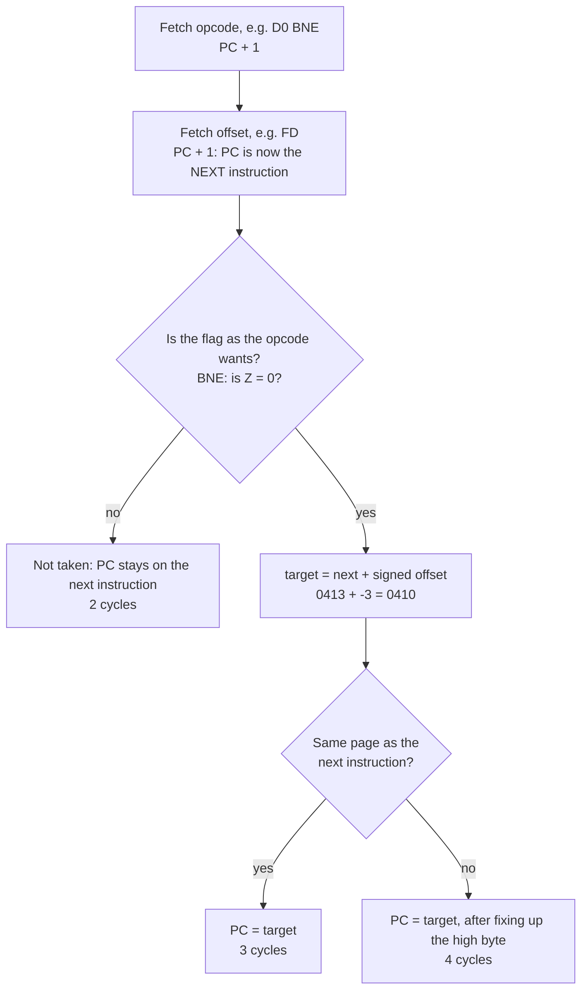
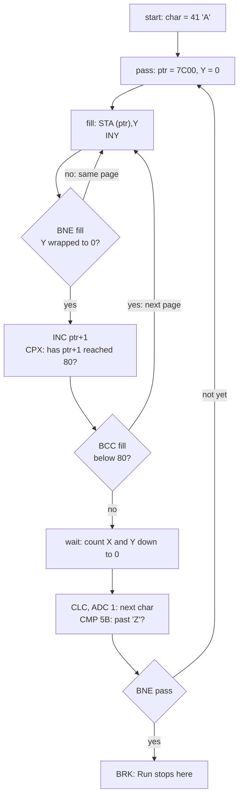
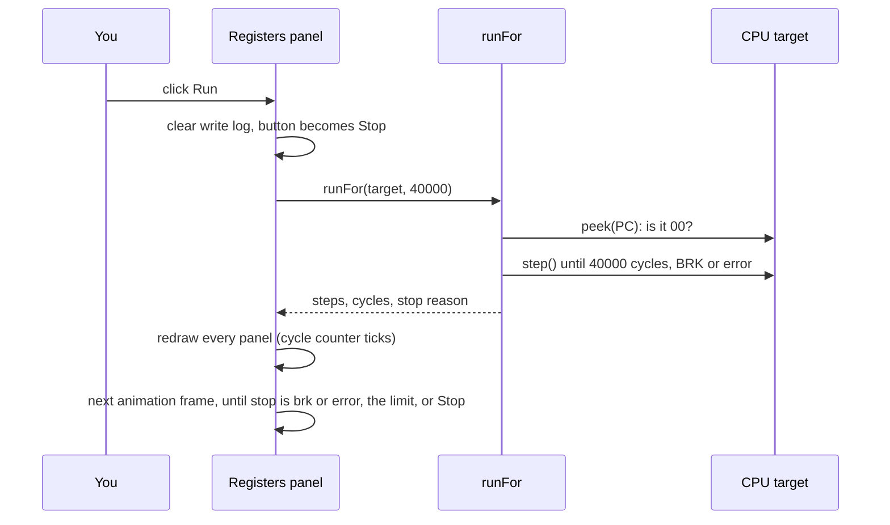

# Stage 14: Compare, branch & flag ops

> **Part:** 2 (The 6502 CPU) · **Branch:** `stage/14-compare-branch-flags` · **Needs:** 13
> **Status:** done

## Goal

Up to now every program has run straight down the page, one instruction after another, until it fell off the end. This stage gives the 6502 the power to **decide**:

- **`CMP`, `CPX`, `CPY`** (compare A, X or Y with memory). Each one does a subtraction, **throws the answer away**, and keeps only the flags.
- **The eight branches**: `BPL BMI BVC BVS BCC BCS BNE BEQ`. Each one looks at one flag and, if the flag is the way it wants, moves PC by a signed amount. Pointing PC *backwards* makes a **loop**.
- **The flag instructions**: `CLC SEC CLI SEI CLV` join `SED`/`CLD` (which came forward in Stage 11). These set or clear one flag directly.

That's 14 + 8 + 5 = 27 new opcodes. With them the playground gets its first real loops, so it also gets a **Run** button (run until `BRK`, or until a cycle limit) and a cycle counter that ticks while it runs.

It comes now because the branches test the flags, and Stages 06 to 13 have now built every instruction that sets them.

## What you can now see

### In the browser: Run, and watch the loop fill memory

```bash
npm run dev     # then open http://localhost:5173
```

The playground opens on the new **Stage 14: compare & branch (Run me)** example.

1. In the **Memory** panel, type `7C00` in the Go box and press **Go**. Every byte is `00`, because this is the empty Mode 7 screen memory.
2. In the **Registers** panel, press **Run**. The button becomes **Stop**, Step is disabled, and the cycle counter climbs about 40,000 cycles every animation frame. The Memory panel fills with `41` ("A"), then `42` ("B"), and so on. Each letter is followed by a pause of about 1/6 second: that's the count-down wait loop burning 328,705 cycles.

   

3. After about 4½ seconds it stops:

   ```
   Stopped at BRK (&0430) after 3,501,762 instructions, 8,841,075 cycles = 4.42 s at 2 MHz
   ```

   PC is on the `BRK` at `&0430`, and the Program panel's ▶ points at `done: BRK`. The whole of `&7C00`–`&7FFF` holds `5A` ("Z"). A is `&5B` and Z is lit: the `CMP #&5B` that ended the outer loop.

   

4. Press **Reset** and then **Step** 11 times to see a single branch. The 11th instruction is the first `BNE fill`, and the status line says `Ran 1 (3 cycles)`: taken, same page. Step on through `STA`, `INY`, `BNE` and watch Y count up.
5. Press **Run** and then **Stop** part-way. The status says `Stopped by you at &…`, and Step works again from exactly where it stopped.

The Cycles line in the panel is 7 cycles more than the Run total, because it also counts the reset sequence (Stage 04).

### Layout change (asked for at review)

The **Registers** and **Memory** panels now sit under the screen placeholder, and the Assembler, Program and Addressing-modes panels stay in the right-hand column. Every panel title has a **−** button that hides the panel's body (it becomes **+** to show it again). Your choice is remembered in this browser's `localStorage`. If storage is blocked, panels just start open.


(The two screenshots above were taken before this change, with the old layout.)

### In the terminal

```bash
npm run demo:fill
```

The demo prints three things:

1. `CMP #&30` against five values of A, with C, Z and N. It includes `&FF`, where N=1 even though A is bigger.
2. A table of `BNE` costs, measured on the CPU: 2 (not taken), 3 (taken, same page) and 4 (taken across a page). It includes the "BNE at `&04FE`" case, where the page check uses the *next* instruction.
3. The fill example's listing, then the example run frame by frame with exactly the Run button's code (`advanceRun`). It prints one line per new letter:

```
  frame   char at &7C00   char at &7FFF   cycles so far
  -----   -------------   -------------   -------------
      1             "A"             "A"          40,001
      9             "B"             "B"         360,010
     18             "C"             "C"         720,023
    ...
    213             "Z"             "Z"       8,520,272
    222             "Z"             "Z"       8,841,075

  Stopped at BRK (&0430) after 3,501,762 instructions, 8,841,075 cycles = 4.42 s at 2 MHz
  That's 222 frames: on a real Model B this loop would take about 4.4 seconds.
```

## The real hardware

### Compare is subtraction with the answer thrown away

The MCS6500 Programming Manual (§4.2, "Compare instructions") describes `CMP` as subtracting memory from A **without storing the result**. The ALU does exactly the subtraction `SBC` does, as `A + ~M + 1` (Stage 10), with **the carry in forced to 1**. So unlike `SBC`, you don't need `SEC` first. The 8-bit result then sets N and Z and is dropped. The carry out goes to C. A itself never changes.

| Flag | After `CMP` | Meaning |
|---|---|---|
| C | 1 if A ≥ M | "no borrow": as an **unsigned** number A is at least M |
| Z | 1 if A = M | the difference was `&00` |
| N | bit 7 of (A − M) & `&FF` | **not** "A < M" (see the Key concepts) |
| V | unchanged | compares never touch V |
| D | ignored | compares are always binary, even with D=1 |

`CPX` and `CPY` do the same with X or Y. A worked example, A = `&40` and `CMP #&30`:

```
  A           &40   %0100 0000
  ~M          &CF   %1100 1111       &30 with every bit flipped
  carry in      1
  sum        &110                    bit 8 is the carry out: C=1 (A ≥ M)
  result      &10   %0001 0000       not &00: Z=0.  bit 7 = 0: N=0
```

A is still `&40` afterwards. Only the flags show what happened.

### The 14 compare opcodes

`CMP` lives in the **cc = %01** group with `ORA AND EOR ADC LDA SBC` (Stage 12's table), at `aaa` = %110. So it gets the same eight modes, lengths and cycle counts as `LDA`, including **+1 on a page crossing**. `CPX` and `CPY` are in the cc = %00 group and only get three modes:

| Mode | `CMP` | `CPX` | `CPY` | Bytes | Cycles |
|---|---|---|---|---|---|
| `#&nn` | `&C9` | `&E0` | `&C0` | 2 | 2 |
| `&nn` | `&C5` | `&E4` | `&C4` | 2 | 3 |
| `&nn,X` | `&D5` | | | 2 | 4 |
| `&nnnn` | `&CD` | `&EC` | `&CC` | 3 | 4 |
| `&nnnn,X` | `&DD` | | | 3 | 4 (+1 page cross) |
| `&nnnn,Y` | `&D9` | | | 3 | 4 (+1 page cross) |
| `(&nn,X)` | `&C1` | | | 2 | 6 |
| `(&nn),Y` | `&D1` | | | 2 | 5 (+1 page cross) |

### The branches

Every branch is 2 bytes: the opcode and a **signed offset** (−128 to +127). The opcode bits say which flag to test and which value makes the branch happen (MCS6500 manual, Appendix B; the pattern is `xxy1 0000`):

```
  bit:  7 6   5   4 3 2 1 0
        x x   y   1 0 0 0 0
        │ │   └── branch if the flag equals y
        └─┴────── which flag: %00 N, %01 V, %10 C, %11 Z
```

| Opcode | `xx` `y` | Branch if… | Read it as |
|---|---|---|---|
| `&10` `BPL` | N, 0 | N = 0 | **PL**us |
| `&30` `BMI` | N, 1 | N = 1 | **MI**nus |
| `&50` `BVC` | V, 0 | V = 0 | o**V**erflow **C**lear |
| `&70` `BVS` | V, 1 | V = 1 | o**V**erflow **S**et |
| `&90` `BCC` | C, 0 | C = 0 | **C**arry **C**lear. After a compare: **less than** |
| `&B0` `BCS` | C, 1 | C = 1 | **C**arry **S**et. After a compare: **greater or equal** |
| `&D0` `BNE` | Z, 0 | Z = 0 | **N**ot **E**qual (to zero) |
| `&F0` `BEQ` | Z, 1 | Z = 1 | **EQ**ual |

The offset counts from **the address of the next instruction**. When the 6502 has fetched the offset byte, PC is already pointing past it, so that's what it adds to. So a branch to itself is offset `&FE` (−2), and offset `&00` goes to the next instruction whether or not the branch is taken.

**Cycle counts** (MCS6500 manual, Appendix A, note 2 on the branches):

| Case | Cycles | Why |
|---|---|---|
| Not taken | 2 | fetch the opcode, fetch the offset, done |
| Taken, target in the **same page** | 3 | +1: add the offset to PCL |
| Taken, target in a **different page** | 4 | +1 more: fix up PCH, as with `LDA &nnnn,X` |

"Same page" compares the target with **the next instruction's address**, not with the branch's own address. A `BNE` at `&04FE` has its next instruction at `&0500`. So a branch back to `&04F0` *does* cross a page, even though the `BNE` itself sits in page `&04`.

### The flag instructions

All seven are implied mode, 1 byte, 2 cycles, and change exactly one flag (MCS6500 manual, chapter 3):

| Opcode | Instruction | Flag | Typical use |
|---|---|---|---|
| `&18` | `CLC` | C = 0 | before the first `ADC` of an addition |
| `&38` | `SEC` | C = 1 | before the first `SBC` of a subtraction |
| `&58` | `CLI` | I = 0 | allow IRQs again (Stage 17) |
| `&78` | `SEI` | I = 1 | hold off IRQs around a critical section |
| `&B8` | `CLV` | V = 0 | clear overflow. There is **no SEV** |
| `&D8` | `CLD` | D = 0 | binary arithmetic (Stage 11) |
| `&F8` | `SED` | D = 1 | decimal arithmetic (Stage 11) |

They live in the "x8" column of the opcode map, in pairs: clear then set for C (`&18`/`&38`), I (`&58`/`&78`) and D (`&D8`/`&F8`). V gets only `CLV` at `&B8`. Its neighbours in the column are `TAY` (`&A8`) and `INY` (`&C8`), so there's no slot for a SEV. The only ways to set V are `ADC`, `SBC`, `BIT`, `PLP`/`RTI` (Stages 15 and 17), and the 6502's **SO** ("set overflow") pin. As far as I know, the Model B doesn't use the SO pin.

`CLI` and `SEI` change the I flag now, but I doesn't do anything until Stage 17 gives the CPU an IRQ input. On the real machine, the MOS does `SEI` early in its reset code and `CLI` once the VIAs are set up (AUG, chapter on interrupts).

## Key concepts

### 1. A compare is a question asked of the flags

The 6502 has no "if A < 10" instruction. It splits the job in two:

1. **Ask:** `CMP #10` does A − 10 and keeps the flags.
2. **Act:** a branch reads one flag and jumps, or doesn't.

Which flag answers which question, for **unsigned** numbers:

| You want to know | After `CMP M` | Branch |
|---|---|---|
| A = M | Z = 1 | `BEQ` |
| A ≠ M | Z = 0 | `BNE` |
| A < M | C = 0 (there was a borrow) | `BCC` |
| A ≥ M | C = 1 | `BCS` |
| A > M | C = 1 **and** Z = 0 | `BEQ` past, then `BCS` |
| A ≤ M | C = 0 **or** Z = 1 | `BCC` and `BEQ` |

Three worked examples, all with `CMP #&30`:

| A | A − M (8 bits) | C | Z | N | So |
|---|---|---|---|---|---|
| `&20` | `&F0` | 0 | 0 | 1 | less |
| `&30` | `&00` | 1 | 1 | 0 | equal |
| `&40` | `&10` | 1 | 0 | 0 | greater |

### 2. N is not "less than"

It's tempting to read N=1 as "A was smaller". It isn't. N is bit 7 of the 8-bit difference, and that wraps:

- A = `&FF` (255), `CMP #&01`: 255 − 1 = `&FE`. **N=1**, although 255 is bigger. C=1 tells the truth.
- A = `&01`, `CMP #&FF`: 1 − 255 wraps to `&02`. **N=0**, although 1 is smaller. C=0 tells the truth.

For unsigned numbers (addresses, counters, character codes), **always use C**. N after a compare only means "less than" when both numbers are within 128 of each other.

Signed comparison (−128…+127) needs V as well. `CMP` doesn't set V, so you'd use `SEC` and `SBC` and test N EOR V. We won't need that in this stage.

### 3. A relative branch is a signed offset

The operand is one byte, read as two's complement (Stage 01): `&00`–`&7F` go forward 0 to 127, and `&80`–`&FF` go back 128 to 1. Here's a loop at `&0410`:

```
  &0410  C8        loop: INY
  &0411  D0 FD           BNE loop
  &0413  ...             (next instruction)
```

The offset is `&FD` = −3. PC after the offset byte is `&0413`, and `&0413 − 3 = &0410`. A backward branch with a **negative** offset is how every loop on the 6502 is built.

The limit of −128…+127 matters. A loop body longer than about 125 bytes can't branch back to its start. Real code then branches *over* a `JMP` (Stage 15). Our assembler reports "branch out of range" when that happens.

### 4. Loops cost cycles, and the branch is most of the overhead

Take the inner loop of this stage's fill program:

```
  fill:  STA (ptr),Y     6 cycles
         INY             2
         BNE fill        3 when taken, 2 the last time
```

That's 11 cycles a byte, 256 times, minus 1 for the final not-taken branch: **2,815 cycles a page**, or about 1.4 ms at 2 MHz. Filling the 1K of Mode 7 screen memory (`&7C00`–`&7FFF`) takes four pages, about 11,300 cycles. That's 5.6 ms, roughly a third of one 50 Hz video frame.

The **+1 for a page cross** is why careful 6502 programmers keep tight loops from straddling a page boundary. On a game's inner loop, it's 10% for free.

### 5. Counting down is cheaper than counting up

`DEX` / `DEY` / `DEC` set Z when the counter reaches `&00`, so a count-down loop doesn't need a compare:

```
         LDX #10          LDX #0
  down:  ...        up:   ...
         DEX              INX
         BNE down         CPX #10      ← 2 more bytes, 2 more cycles every time round
                          BNE up
```

Both loops run 10 times. The count-down one is shorter and faster. That's why you'll see so much 6502 code counting down to zero.

## Diagrams

How a branch picks PC, and what it costs:



How the fill loop is built from a compare and branches:



## Our design

### Compare: one function, three registers

```ts
// compare.ts
export function compare(flags: StatusFlags, register: number, value: number): void
```

It works out `register − value` with plain integer arithmetic and sets C, Z and N. It doesn't call `subtractWithCarry`: that would write A, and it reads `regs.c` as the borrow in, while a compare always has a carry in of 1. The three ALU functions `cmp`, `cpx` and `cpy` just pass `regs.a`, `regs.x` or `regs.y`.

### One shared "read operand, run ALU" helper

Stage 12 parked a note: `arithmetic()` in `arithmetic.ts` and `readOperand()` in `logic.ts` are the same factory, and `CMP` would make a third copy. This stage moves it to `instructions/read-operand.ts` and all three files use it:

```ts
export function readOperand(mode: AddressedMode, alu: (regs: Registers, value: number) => void): (cpu: Cpu6502) => number
```

### Branches: built from (flag, value)

```ts
// branches.ts
type BranchFlag = 'n' | 'v' | 'c' | 'z';
function branch(flag: BranchFlag, when: boolean): (cpu: Cpu6502) => number
```

Each row is built once at module load, so `step()` allocates nothing. The execute function calls `addrRelative` (from Stage 05, which has been waiting for this), which fetches the offset, works out the target, and sets `cpu.pageCrossed`. If `regs[flag] !== when`, it returns 0 extra cycles. Otherwise it sets PC to the target and returns 1, or 2 on a page crossing. The base cycle count in the row is 2, as with every other instruction.

### Flag ops

Five more rows in `flag-ops.ts`, in the same style as `SED` and `CLD`.

### Run, and "stop at BRK"

`BRK` is Stage 17, so `&00` is still an unimplemented opcode. Every playground program ends at a `BRK`, either one it contains or the `&00` at `&0500` past the NOP slide. **Run** treats "the next opcode is `&00`" as a clean stop: it stops *before* the `BRK`, with PC on it. That's what a debugger's run-until-break does. Run also stops at an unimplemented opcode, or after `RUN_CYCLE_LIMIT` cycles in case a loop never ends.

The run logic is a pure, DOM-free function in the registers view-model:

```ts
export type RunStop = 'brk' | 'budget' | 'error';
export function runFor(target: CpuTarget, maxCycles: number): RunResult
```

The panel calls it once per browser animation frame, with a budget of **40,000 cycles**. That's one 50 Hz BBC video frame's worth of 2 MHz CPU time, so programs run at roughly the speed they would on a real Model B. The cycle counter and memory view redraw after every frame, which makes the counter "live". While it runs, the Run button becomes **Stop**. A proper run loop, tied to real time, is Stage 30's job.

Alternatives considered:

- **Run everything in one go, then redraw.** It's simpler, but a 4-second program would freeze the page and the counter would jump straight to the end.
- **Run in a Web Worker.** That's overkill for now, and the workbench needs synchronous access to the CPU.



## Code walkthrough

### The CPU

- [`src/cpu/instructions/compare.ts`](../../src/cpu/instructions/compare.ts) has `compare(flags, register, value)`, which is three lines of plain integer arithmetic. `difference >= 0` is the carry, `=== 0` is Z, and bit 7 of the difference is N. (A negative JS number still has bit 7 set correctly in two's complement, so `& 0x80` works on −16 = `…F0`.) Then `cmp`/`cpx`/`cpy` pick the register, and the `COMPARE` table has 14 rows.
- [`src/cpu/instructions/read-operand.ts`](../../src/cpu/instructions/read-operand.ts) is the shared "find the effective address, read it, run the ALU, +1 on a page crossing" factory. `arithmetic.ts`, `logic.ts` and `compare.ts` all use it now, which clears that item from the parking lot.
- [`src/cpu/instructions/branches.ts`](../../src/cpu/instructions/branches.ts): each of the 8 rows is `branch(flag, when)`:

  ```ts
  return (cpu) => {
    const target = addrRelative(cpu);          // always fetch the offset: PC moves past it
    if (cpu.regs[flag] !== when) return 0;     // not taken: 2 cycles
    cpu.regs.pc = target;
    return cpu.pageCrossed ? 2 : 1;            // taken: 3, or 4 across a page
  };
  ```

  `addrRelative` was written in Stage 05 and has waited until now to be used. It already compared the target with the *next* instruction's address.
- [`src/cpu/instructions/flag-ops.ts`](../../src/cpu/instructions/flag-ops.ts) gains `CLC SEC CLI SEI CLV`, so it now holds all seven.
- [`src/cpu/opcodes.ts`](../../src/cpu/opcodes.ts) adds `COMPARE` and `BRANCHES` to `GROUPS`. That makes 141 of the 151 documented opcodes. The remaining ten are `JMP` ×2, `PHA PLA PHP PLP` (Stage 15), `JSR RTS` (Stage 16), and `BRK RTI` (Stage 17).

### Run

- [`src/web/workbench/run-model.ts`](../../src/web/workbench/run-model.ts) is DOM-free:
  - `runFor(target, maxCycles)` is the inner loop. Before each instruction it peeks at the opcode and stops on `&00`.
  - `advanceRun(target, state)` runs one frame (`CYCLES_PER_FRAME` = 40,000), adds it to the totals, and decides whether the run has ended (`'brk'`, `'error'`, or `'limit'` at `RUN_CYCLE_LIMIT` = 20,000,000). It clears the write log first, so the Memory panel marks the bytes written *this frame*.
  - `stopRun` and `describeRunState` handle the Stop button and the status line.
- [`src/web/workbench/registers-panel.ts`](../../src/web/workbench/registers-panel.ts) has the Run/Stop button and a `requestAnimationFrame` loop: `tick()` → `advanceRun` → `onRun()` redraws every panel → the next frame. Reset, and Assemble & Run (through the new `stop()` the panel returns, wired in `main.ts`), stop a run first.
- [`src/web/workbench/panel.ts`](../../src/web/workbench/panel.ts) (review change): `Workbench.add(panel, host?)` can place a panel in another column (`#under-screen` in `index.html`). Each heading gets a `−`/`+` toggle with `aria-expanded`, and the collapsed titles are kept in `localStorage` (reads and writes are wrapped in try/catch).
- [`registers-view-model.ts`](../../src/web/workbench/registers-view-model.ts): `formatCycles` now switches to ms and seconds for long runs (`8,841,075 cycles = 4.42 s at 2 MHz`).

### The example and demo

- [`src/playground/examples.ts`](../../src/playground/examples.ts): `FILL_SOURCE` is the new default example. It ends with labels `next:` and `done:`, so the tests can find the `CLC` and the `BRK` without counting bytes.
- [`scripts/demo-fill.ts`](../../scripts/demo-fill.ts) is the CLI demo (`npm run demo:fill`). It drives the same `advanceRun` as the browser.

## Tests

| Test file | What it proves |
|---|---|
| `src/cpu/instructions/compare.test.ts` | `compare()` for less, equal and greater, and **all 65,536 pairs** against "C = reg ≥ M, Z = reg = M, N = bit 7 of the difference". N is not "less than" (`&FF` vs `&01`). The carry in is ignored, and V and D are untouched. The table layout (CMP's modes and cycles = LDA's; CPX/CPY have 3 modes). Each of the 15 mode cases (including `&nnnn,Y` with and without a page cross) for less, equal and greater, with cycles and PC advance, and with **no memory written**. CMP stays binary with D=1. |
| `src/cpu/instructions/branches.test.ts` | All 8 branches: the `xxy1 0000` bit pattern, not taken (2), taken forward (3), taken backward (3), taken across a page (4), and nothing but PC changes. The "next instruction" page rule (`&04FE` cases), offset `&FE` branching to itself, the +127/−128 limits, wrap-around at `&FFFF`, and a `DEX`/`BNE` loop counted to the cycle (26). |
| `src/cpu/instructions/flag-ops.test.ts` | All seven flag instructions: each changes only its own flag, takes 1 byte and 2 cycles, and sits in the `x8` column. There is no SEV. |
| `src/web/workbench/run-model.test.ts` | `runFor` stops *before* BRK (PC on it), at the cycle budget, and at an unimplemented opcode. `advanceRun` accumulates frames, ends at the limit (taking only what's left), at BRK and on error, and clears the write log each frame. `stopRun` and the status messages. |
| `src/web/workbench/registers-view-model.test.ts` | `formatCycles` switches between µs, ms and s. |
| `src/playground/examples.test.ts` | The fill example: the first pass fills exactly `&7C00`–`&7FFF` with "A" in 10 + 10 + 11,311 cycles, the wait loop takes 328,705, and the whole program reaches its BRK with all "Z" in **8,841,075** cycles. Every cycle figure in this doc is checked here. The labels example now runs into its data as a `BVC` (see Gotchas). |
| `src/cpu/cpu6502.test.ts` | The opcode count (141), and "unimplemented" now uses `&4C` (`JMP`, Stage 15). |
| `e2e/compare-branch.spec.ts` | Opens on the fill example. The first `BNE fill` takes 3 cycles. Run shows Stop and "Running…", then stops at `&0430` with exactly the expected totals and `5A` in memory. Stop halts part-way and re-enables Step. |

`e2e/shifts.spec.ts` now opens `?program=shifts`. `e2e/assembler.spec.ts` follows the labels example into its data, which is now a `BVC`.

## Gotchas & hardware quirks

- **Data is code if PC goes there.** The Stage 08 `labels` example ends by running into its own `.word row2`, whose first byte is `&50`. Until today that stopped the CPU with "unimplemented opcode &50". Now `&50` is `BVC`, V is 0, and `&50 &7C` means "branch forward 124 bytes": the CPU leaps into the NOP slide and slides on to the BRK at `&0500`. Every opcode you implement changes what stray data does. That's why real programs end with `RTS`, `JMP` or `BRK`, and why the new example ends with an explicit `BRK`.
- **The branch offset counts from the next instruction**, and so does the page-crossing check. Getting either one off by two is the classic emulator bug.
- **Taken branches cost +1, and +2 across a page.** The +1 is not "for a page cross" alone.
- **CMP doesn't use the carry in**, and it ignores D. Using `subtractWithCarry` for compares would get both wrong (and would overwrite A).
- **N after a compare is not "less than".** Use C for unsigned comparisons. The demo's `&FF` row shows why.
- **There is no SEV.** V is set only by ADC, SBC, BIT, PLP, RTI, or the SO pin.
- **CLI/SEI do nothing visible yet.** There's no IRQ until Stage 17.
- **Interrupt timing quirk (for Stage 17):** on the NMOS 6502, a taken branch that *doesn't* cross a page delays an interrupt by one instruction. That's documented from Visual 6502 traces. We don't model mid-instruction interrupt sampling, so note it then.
- **Run stops *before* BRK.** BRK isn't an instruction yet. Step on it still gives "unimplemented opcode &00".
- **Run speed is approximate.** It's 40,000 cycles per *browser* frame, which is 50 Hz worth of CPU per frame. On a 60 Hz display it runs about 1.2× fast, and on a 120 Hz display 2.4×. A real-time run loop locked to the clock is Stage 30.
- **The Cycles line includes reset.** It reads 7 more than the Run total, because the reset sequence counts too.
- **The Memory panel's "Wrote" line shows the last frame only** (up to 64 writes), because the log is cleared every frame.

## Playwright verification

- MCP: opened the playground, went to `&7C00` in Memory, and pressed Run. The mid-run screenshot ([`stage14-running.png`](../../.playwright-mcp/stage14-running.png)) shows the Stop button, disabled Step buttons, and a live `Running… 665,348 instructions` status. Waited for "Stopped at BRK". The full-page screenshot ([`stage14-done.png`](../../.playwright-mcp/stage14-done.png)) shows PC `&0430`, ▶ on `done: BRK`, and `&7C00`–`&7CFF` all `5A`.
- Durable: `e2e/compare-branch.spec.ts` (4 tests), plus 2 in `e2e/workbench.spec.ts` for the review changes: Registers and Memory are under the screen, and −/+ hides and shows a panel, remembered across a reload. The full e2e suite passes: 62 tests.
- MCP: [`layout-under-screen.png`](../../.playwright-mcp/layout-under-screen.png) shows the new layout with Addressing modes collapsed.

## Check your understanding

1. A = `&80` and you run `CMP #&7F`. What are C, Z and N, and does `BCC` branch?
2. A `BEQ` at `&10FD` has offset `&05`. Where does it go if taken, and how many cycles does it take?
3. Why does `CMP` not need a `SEC` in front of it when `SBC` does?
4. The fill loop is `STA (ptr),Y / INY / BNE fill`. Why does it need no `CPY #0`?
5. The labels example used to stop at `&041F` and now ends up at `&0500`. What changed, and what does it tell you about how the CPU sees memory?

<details>
<summary>Answers</summary>

1. `&80 − &7F = &01`. C=1 (`&80` ≥ `&7F` unsigned), Z=0, N=0. `BCC` does **not** branch: A isn't less than M. (As signed numbers `&80` is −128, which *is* less than +127. That's why signed comparison needs V too.)
2. The next instruction is at `&10FF`, and `&10FF + 5 = &1104`. That's page `&11`, a different page from `&10FF`, so it takes **4 cycles**.
3. A compare always feeds the adder a carry in of 1. It computes A + ~M + 1 = A − M exactly. `SBC` uses the real C as its borrow, so that it can chain across bytes, which means you have to set C yourself first.
4. `INY` already sets Z when Y wraps from `&FF` to `&00`. `BNE` reads that Z. Counting to a wrap (or down to zero) gets the compare for free.
5. Stage 14 implemented `&50` as `BVC`. The `.word` data `50 7C` is now a valid "branch if V clear, forward `&7C`", so the CPU branches into the NOP slide. The CPU can't tell code from data: whatever PC points at gets decoded as an instruction.

</details>

## Further reading

- MCS6500 Microcomputer Family Programming Manual: §4 (branches and compares, "Test, branch and jump instructions"), chapter 3 (flag instructions), Appendix A (cycle counts, including note 2 on branches).
- 6502.org, "Beyond 8-bit unsigned comparisons" by Bruce Clark: signed compares with N EOR V, and multi-byte compares.
- BBC Micro Advanced User Guide: the memory map (Mode 7 screen at `&7C00`) and the interrupt chapter (why the MOS uses `SEI`/`CLI`).
- Visual 6502 wiki, "6502 Timing of Interrupt Handling": the taken-branch interrupt delay, for Stage 17.
