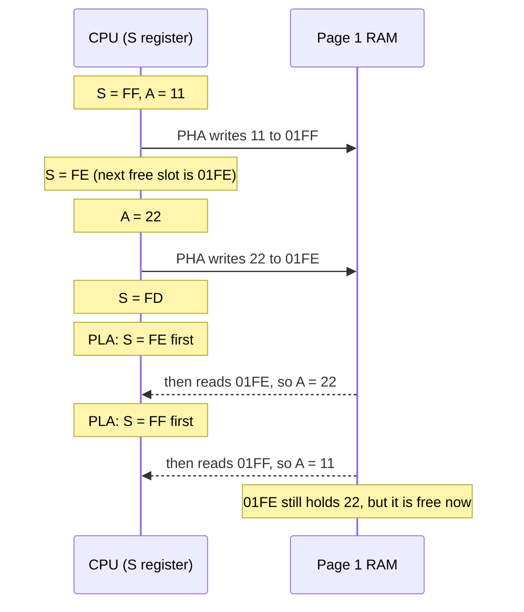
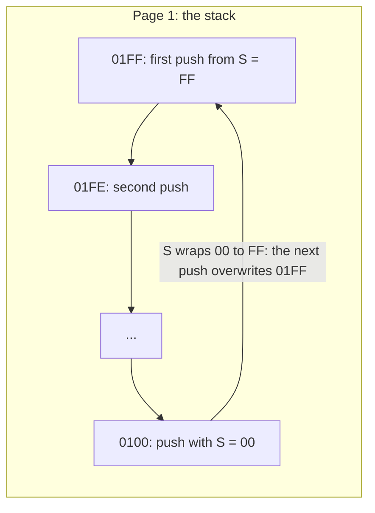
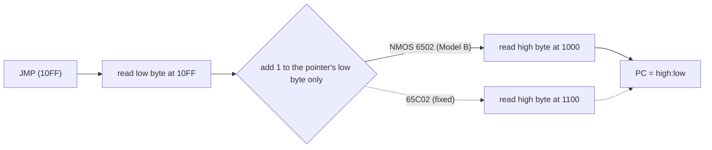

# Stage 15: Jumps & the stack

> **Part:** 2 (The 6502 CPU) · **Branch:** `stage/15-jumps-stack` · **Needs:** 14
> **Status:** done

## Goal

Stage 14's branches can only hop −128 to +127 bytes. This stage adds the two ways to go **anywhere**, and the place the 6502 keeps things it needs to get back:

- **`JMP &nnnn`** sets PC to any address. **`JMP (&nnnn)`** reads the address to go to from memory, which is how the BBC's MOS lets you redirect its routines through **vectors** in RAM. It has a famous NMOS bug at page ends.
- **The hardware stack** in page 1 (`&0100`–`&01FF`), with S as its pointer. **`PHA`/`PLA`** push and pull A. **`PHP`/`PLP`** push and pull the status register P, which is where the "flags" that don't really exist (B and bit 5) finally show up.

That's 6 new opcodes, 147 of 151. The stack comes now because Stage 16's `JSR`/`RTS` and Stage 17's interrupts both store return addresses on it, and it's much easier to learn with bytes you push yourself first.

The **Stack** panel shows page 1 with S marked, so you can watch every push and pull.

## What you can now see

### In the browser: the Stack panel

```bash
npm run dev     # then open http://localhost:5173
```

The playground opens on the new **Stage 15: jumps & the stack** example. The new **Stack** panel sits under the screen, between Registers and Memory.

1. Before you step, the Stack panel says `S = &FD · 2 bytes in use`. That's Stage 04's reset sequence: its three dummy "pushes" moved S from `&00` to `&FD` without writing anything. The two "used" bytes are just whatever was in `&01FE`/`&01FF`.
2. **Step** twice (`LDX #&FF`, `TXS`): `S = &FF · empty · next push → &01FF`.
3. **Step** six more times (three `LDA`/`PHA` pairs). The table shows `11 22 33` piling down from `&01FF`. `&01FD` has the blue "written" bar and says **next pull**, and `&01FC` is outlined with **← S (next push)**. Below it, the free slots are faded.

   

4. **Step** three more times (`PLA` ×3) and watch A go `&33`, `&22`, `&11` while the S outline climbs back to `&01FF`. The `33 22` bytes are still in the table, faded: pulling doesn't erase.
5. **Step** three more (`SEC`, `SED`, `PHP`): `&01FF` now holds `3D` = `%0011 1101`. Bits 5 and 4 are 1, even though the Registers panel's `-` and `B` lights are off.
6. **Step** on through `CLC`, `CLD`, `PLP`: C and D light up again. Then `LDA #&C0`, `PHA`, `PLP`: N and V light up and I goes out.
7. Press **Run**. It stops with:

   ```
   Stopped at BRK (&0487) after 33 instructions, 93 cycles = 46.5 µs at 2 MHz
   ```

   (The status line counts from where Run started, so if you've already stepped, the numbers are smaller.) `&0487` is in the `bug:` block at `&0480`, which you can only reach through the `JMP (&10FF)` bug. A 65C02 would have gone to `&0580` and stopped at the `&00` there instead. The Stack panel ends on `S = &FE · 1 byte in use`, with `&01FF` = `AA`: the wrap overwrote the `&11` pushed at the start. Type `0100` in the Memory panel's Go box to see the other `AA`.

   

### In the terminal

```bash
npm run demo:stack
```

The demo runs the same example and prints one line per instruction with A, P, S, the cycles, and the stack from `&01FF` down (`__` is the slot S points at):

```
  PC     instruction        A    P     S    cyc   stack (&01FF down)
  -----  -----------------  ---  ---  ---  ---   ------------------
  &0400  start: LDX #&FF    00   A4   FD   2    00 00 __
  &0402  TXS                00   A4   FF   2    __
  &0403  LDA #&11           11   24   FF   2    __
  &0405  PHA                11   24   FE   3    11 __
  ...
  &040B  PHA                33   24   FC   3    11 22 33 __
  &040C  PLA                33   24   FD   4    11 22 __
  ...
  &0411  PHP                11   2D   FE   3    3D __
  ...
  &0418  PLP                C0   E0   FF   4    __
  &0419  JMP over           C0   E0   FF   3    __
  ...
  &042C  JMP (&10FF)        05   60   FF   5    __
  &0480  bug: LDX #&00      05   62   FF   2    __
  &0482  TXS                05   62   00   2    C0 22 33 …249 more… 00 00 00 __
  &0483  LDA #&AA           AA   E0   00   2    C0 22 33 …249 more… 00 00 00 __
  &0485  PHA                AA   E0   FF   3    __
  &0486  PHA                AA   E0   FE   3    AA __
  &0487  BRK                stop: BRK is Stage 17

93 cycles. P is shown as an IRQ would push it (bit 5 = 1, B = 0).

JMP (&10FF) read &80 from &10FF and &04 from &1000, so it went to &0480.
A 65C02 would have read &05 from &1100 and gone to &0580.
After the wrap: &0100 = &AA, &01FF = &AA (it held &11).
```

Two things to notice. First, the `P` column shows `&2D` after `SED`, but `PHP` pushed `&3D`: the difference is B. Second, after `LDX #&00 : TXS` the stack is "255 bytes deep". The 6502 has no idea which bytes are real. It only knows S.

## The real hardware

### The stack is page 1, and S is only 8 bits

The 6502's stack pointer S is an 8-bit register, but the stack lives at `&0100 + S`. The chip hard-wires the high byte of every stack address to `&01` (MCS6500 Programming Manual, §8 "Stack processing"). So:

- The stack is **always** in page 1, `&0100`–`&01FF`. It can't be moved, and it can't be bigger than 256 bytes.
- S counts **down**. A push writes to `&0100 + S`, then S = S − 1. A pull does S = S + 1, then reads `&0100 + S`.
- S points at the **next free slot**, not at the last byte pushed. This is called an *empty descending* stack.

Both steps are 8-bit, so S wraps like everything else in the chip: a push with S = `&00` writes `&0100` and leaves S = `&FF`. The stack never leaves page 1. It just **overwrites its own bottom**. There's no "stack overflow" signal on a 6502: overflow is silent corruption.

On the Model B, the MOS sets S = `&FF` early in its reset code with `LDX #&FF : TXS` (the only way to load S is through X, Stage 07). We'll watch it happen in Stage 23. The Advanced User Guide's memory map lists page `&01` as the 6502 stack, shared by the MOS, the current language and your own code. My understanding is that the bottom of page 1 is also borrowed for copying error messages out of sideways ROMs, counting on the stack never getting that deep. I haven't confirmed that detail yet, so treat it as a note to check in Part 3.

### The four stack instructions

All four are implied mode and 1 byte (MCS6500 manual, Appendix A and B):

| Opcode | Instruction | What it does | Flags | Cycles |
|---|---|---|---|---|
| `&48` | `PHA` | write A to `&0100+S`, S − 1 | none | 3 |
| `&68` | `PLA` | S + 1, A = byte at `&0100+S` | N, Z from A | 4 |
| `&08` | `PHP` | write P (with B = 1, bit 5 = 1) to `&0100+S`, S − 1 | none | 3 |
| `&28` | `PLP` | S + 1, P = byte at `&0100+S` (bits 4 and 5 ignored) | all six | 4 |

Why does a pull take a cycle longer than a push? A push can write at the address S already holds. A pull has to **increment S first** and only then read, and the 6502 spends a cycle doing that increment. During that cycle it reads the stack at the old S and throws the byte away (a *dummy read*). Pushes have a dummy read too: in cycle 2 they read the byte after the opcode and ignore it. We don't model dummy reads, because reading RAM has no side effects (see the parking lot in `PROGRESS.md`).

The cycle-by-cycle breakdown (from the MCS6500 manual's Appendix A counts, and the per-cycle tables on 6502.org):

```
PHA (3)                         PLA (4)
1  fetch opcode &48, PC+1       1  fetch opcode &68, PC+1
2  read next byte (discarded)   2  read next byte (discarded)
3  write A to &0100+S, S-1      3  read &0100+S (discarded), S+1
                                4  read &0100+S into A
```

### PHP pushes two bits that don't exist

Stage 04 made P six booleans, because only N V D I Z C have flip-flops in the chip. When P is pushed, the chip has to put *something* on the data bus for bits 5 and 4:

```
  bit:   7   6   5   4   3   2   1   0
         N   V   1   B   D   I   Z   C
                 │   └── B: 1 if pushed by PHP or BRK, 0 if pushed by IRQ or NMI
                 └────── always 1
```

So `PHP` pushes bits 5 **and** 4 as 1. With N=0 V=0 D=1 I=1 Z=0 C=1, `PHP` pushes `%0011 1101` = `&3D`, not `&0D`. The B bit is the only way an interrupt handler can tell whether it was entered by a `BRK` instruction or a real IRQ, which is why it exists at all (Stage 17).

`PLP` goes the other way, and simply **drops** bits 5 and 4, because there's nowhere to put them. Pull `&FF` and you get N V D I Z C all set, but the Registers panel's B and `-` lights don't change. They never do: they're drawn as "not stored".

`PLP` is one of only four ways to **set V** (with `ADC`, `SBC` and `BIT`). It's also how code restores I after a critical section: `PHP : SEI : … : PLP` puts I back to whatever it was, rather than blindly doing `CLI`.

### JMP

| Opcode | Instruction | Bytes | Cycles | PC becomes |
|---|---|---|---|---|
| `&4C` | `JMP &nnnn` | 3 | 3 | `&nnnn` |
| `&6C` | `JMP (&nnnn)` | 3 | 5 | the word stored at `&nnnn` (low byte first) |

`JMP` changes no flags and doesn't touch the stack. It's just "load PC". `JMP &nnnn` is like `LDA &nnnn` with PC instead of A, except it loads the *address itself*, not the byte there. It's 3 cycles because there's nothing to do after the two operand bytes arrive.

`JMP (&nnnn)` is the 6502's only *indirect* (16-bit pointer) mode outside page zero. The two extra cycles are the two reads of the pointer.

### The JMP indirect page-boundary bug

To read the pointer's high byte, the NMOS 6502 adds 1 to the pointer's address. But it only adds to the **low byte**, and never carries into the high byte (Stage 05 built this into `jmpIndirectHigh`, and the explorer's "JMP trap" example showed it):

```
  JMP (&10FF)

  you'd expect:   low byte from &10FF, high byte from &1100
  NMOS 6502:      low byte from &10FF, high byte from &1000   ← &FF + 1 = &00, no carry
```

This is the same 8-bit add that makes zero page wrap (`&FF,X` with X = 1 is `&00`), happening in a place where it's a bug. MOS Technology documented it, and the 65C02 (used in the BBC Master) fixed it, at the cost of one extra cycle. The Model B's 6502 has it. Real programs avoid it by never putting a pointer at `&xxFF`, and the MOS's vectors at `&0200`–`&0235` are all at even addresses, so they never straddle a page.

### Vectors: why JMP (ind) matters on the BBC

Every MOS call (`OSWRCH`, `OSBYTE`, …) at `&FFxx` is a `JMP (vector)` through page 2. For example, `OSWRCH` at `&FFEE` does `JMP (&020E)`, and `&020E`/`&020F` (WRCHV) normally holds the address of the MOS's own character-output routine. A program can store a different address in WRCHV, and from then on every character printed goes through its code instead (Advanced User Guide, the section on vectors). That's the whole mechanism: two bytes of RAM and a 5-cycle `JMP`. We'll see the real ones in Stage 23.

## Key concepts

### 1. Last in, first out

A stack is a pile of plates: you put plates on top and take them off the top. Push `&11`, `&22`, `&33` and the pulls give them back as `&33`, `&22`, `&11`. That's exactly the order you need for **nesting**: if A calls B, and B calls C, C has to return first. Stage 16 puts return addresses there for that reason.

Here are the first eleven instructions of this stage's example, starting from an empty stack:

| Instruction | Writes | S after | Page 1 (top part) | A |
|---|---|---|---|---|
| `LDX #&FF : TXS` | | `&FF` | (empty) | |
| `LDA #&11 : PHA` | `&01FF` ← `&11` | `&FE` | `11` | `&11` |
| `LDA #&22 : PHA` | `&01FE` ← `&22` | `&FD` | `11 22` | `&22` |
| `LDA #&33 : PHA` | `&01FD` ← `&33` | `&FC` | `11 22 33` | `&33` |
| `PLA` | | `&FD` | `11 22` **(33 still there)** | `&33` |
| `PLA` | | `&FE` | `11` | `&22` |
| `PLA` | | `&FF` | (empty) | `&11` |

### 2. Pulling doesn't erase

`PLA` doesn't clear the byte it reads. After the three pulls above, `&01FD`–`&01FF` still hold `33 22 11`. Those bytes are now "free" only because S says so: the next push will overwrite them. The Stack panel shows the free bytes faded, so you can see the old values waiting to be overwritten. That's also why reading *below* S is meaningless: anything there is left over from earlier pushes, and an interrupt (Stage 17) can overwrite it at any moment.

### 3. S points at the next free slot

Two consequences people trip on:

- The **top** byte (the one `PLA` would return) is at `&0100 + S + 1`, not `&0100 + S`.
- The number of bytes in use is `&FF − S`. With S = `&FF` the stack is empty; with S = `&FC`, three bytes are in use.

Some other CPUs (the 68000, ARM's "full descending" convention) point at the last item instead. The 6502 chose "next free" so a push can write *before* changing S, which saves a cycle on every push.

### 4. Push P, and read it back as a byte

`PHP` followed by `PLA` is the only way to get the flags into A as a number:

```
  SEC             C=1
  SED             D=1           (I=1 from reset; N V Z = 0)
  PHP             push &3D      %0011 1101: bits 5 and 4 forced to 1
  PLA             A = &3D
```

And the reverse, `LDA #… : PHA : PLP`, sets every flag at once from a byte. Our example uses it to set V with no `SEV` instruction: pushing `&C0` and pulling it into P gives N=1 V=1, and D=I=Z=C=0. Note that **I goes to 0** too: `PLP` restores all six flags, so it can turn interrupts back on.

### 5. The JMP (ind) bug, with numbers

This stage's example builds the trap itself, then walks into it:

```
  &10FF = &80     the pointer's low byte
  &1000 = &04     where the NMOS 6502 reads the high byte
  &1100 = &05     where you'd expect it to

  JMP (&10FF)  →  PC = &0480     (a 65C02 would go to &0580)
```

## Diagrams

### A push and a pull



### Where the bytes go: S wraps, the address doesn't leave page 1



### JMP indirect: where the high byte comes from



## Our design

### `push` and `pull` on the CPU

Stage 16's `JSR`/`RTS` and Stage 17's interrupts will push and pull too, so the two stack moves live on `Cpu6502` rather than in one instruction file:

```ts
/** The stack's page: the 6502 hard-wires the high byte of every stack address to &01. */
export const STACK_PAGE = 0x0100;

push(value: number): void {          // write, then S − 1
  this.bus.write(STACK_PAGE | this.regs.s, value & 0xff);
  this.regs.s = (this.regs.s - 1) & 0xff;
}

pull(): number {                     // S + 1, then read
  this.regs.s = (this.regs.s + 1) & 0xff;
  return this.bus.read(STACK_PAGE | this.regs.s);
}
```

`STACK_PAGE | s` (rather than `+`) makes the "high byte is always `&01`" rule visible: S can only change the low byte. Both methods allocate nothing, so they're safe in the hot path.

### Two new instruction files

- `src/cpu/instructions/stack.ts`: `PHA`, `PLA`, `PHP`, `PLP`. `PHP` uses Stage 04's `packP(flags, true)` (B = 1), and `PLP` uses `unpackP`, which already ignores bits 4 and 5. Those two helpers were written in Stage 04 for exactly this moment.
- `src/cpu/instructions/jumps.ts`: `JMP &nnnn` and `JMP (&nnnn)`. Both just set PC to the effective address from Stage 05's `addrAbsolute` and `addrIndirect`. All the bug handling is already in `addrIndirect` (via `jmpIndirectHigh`), so `jumps.ts` doesn't mention it at all. The rule lives in one place.

`JMP &nnnn` is the first instruction where the effective address *is* the result: `LDA &1234` reads the byte at `&1234`, but `JMP &1234` never reads `&1234`, it just goes there.

### The Stack panel

A view-model (`stack-view-model.ts`, pure, Jest-tested) and a panel (`stack-panel.ts`, DOM only), the same split as the Memory and Registers panels.

- A summary line: S, how many bytes are in use (`&FF − S`), and where the next push and pull go.
- A table of page 1 from `&01FF` downwards (the bottom of the stack at the top of the table, the way the bytes pile up), ending three free slots below S. Bytes in use are solid, the **S** row is marked "← S (next push)", the top byte is marked "next pull", and free bytes are faded.
- Each row shows the byte in hex and binary (binary so you can read a pushed P bit by bit), with the "changed" and "written" marks the Memory panel uses.
- If the stack is deep, the middle is elided ("⋮ 200 more") so the table stays short, but `&01FF` and the area round S are always visible.

It goes under the screen, between Registers and Memory, so S in the Registers panel and the S row in the Stack panel sit together.

### Examples and tests

- A new default example, `stack`: the pushes and pulls in the table above, `PHP`/`PLP`, setting V through `PLP`, a `JMP` over a `BRK`, the `JMP (&10FF)` trap, and a stack wrap at the end.
- Tests that used `&4C` (`JMP`) as "an unimplemented opcode" need a new one. Rather than moving to `&20` (`JSR`, which Stage 16 would take away again), they'll use `&02`, an undocumented NMOS "JAM" opcode that will never be in the documented table.

## Code walkthrough

- [`src/cpu/cpu6502.ts`](../../src/cpu/cpu6502.ts): `STACK_PAGE` (`&0100`) plus `push(value)` and `pull()`. These are the only two places that know the stack's rules: the order (write then decrement, increment then read), the page-1 high byte, and the 8-bit wrap of S. Stage 16 (`JSR`/`RTS`) and Stage 17 (interrupts, `RTI`) will call them too.
- [`src/cpu/instructions/stack.ts`](../../src/cpu/instructions/stack.ts): four tiny functions. `pla` is `pull` + `setNZ`. `php` is `push(packP(regs, true))`, where `true` is the B bit. `plp` is `unpackP(regs, pull())`, which ignores bits 5 and 4 because Stage 04 made it so.
- [`src/cpu/instructions/jumps.ts`](../../src/cpu/instructions/jumps.ts): both `JMP`s are one line, `regs.pc = addr…(cpu)`. The page-boundary bug is entirely in Stage 05's `addrIndirect`/`jmpIndirectHigh` in [`addressing.ts`](../../src/cpu/addressing.ts).
- [`src/cpu/opcodes.ts`](../../src/cpu/opcodes.ts): `JUMPS` and `STACK` join `GROUPS`. That makes 147 of the 151 documented opcodes. Only `JSR`, `RTS`, `BRK` and `RTI` are left.
- [`src/web/workbench/stack-view-model.ts`](../../src/web/workbench/stack-view-model.ts): `buildStackView(target, { previous, written })`. It reads page 1 once through `peek`, then builds rows from `&01FF` down to `S − 3`. Each row's `slot` is `used`, `next-push` or `free`, and `isTop` marks the next pull. If that's more than 20 rows, it keeps the first 4, a `gap` row, and the 15 nearest S. The view keeps all 256 bytes in `page`, so the next build can mark changes.
- [`src/web/workbench/stack-panel.ts`](../../src/web/workbench/stack-panel.ts): turns the view into a table. The row's class is its slot (CSS fades `free` and outlines `next-push`). The hex cell gets `changed`/`written`, the same marks as the Memory panel.
- [`src/playground/examples.ts`](../../src/playground/examples.ts): `STACK_SOURCE`, the new default example. It uses two `*=` origins: the main program at `&0400`, and the `bug:` block at `&0480`, where the NOP slide in between never runs.
- [`scripts/demo-stack.ts`](../../scripts/demo-stack.ts): `npm run demo:stack`.

## Tests

| Test file | What it proves |
|---|---|
| `src/cpu/cpu6502.test.ts` | `push` writes at `&0100+S` then decrements S; `pull` increments then reads; LIFO order; pulled bytes stay in memory; S wraps `&00`→`&FF` on a push and `&FF`→`&00` on a pull, without leaving page 1; values are masked. The opcode count is now 147. The unimplemented-opcode tests use `&02`. |
| `src/cpu/instructions/stack.test.ts` | The 4 opcodes' bytes, modes and cycles (3 to push, 4 to pull). `PHA` touches no flags. `PLA` sets N and Z (three values) and nothing else, and wraps. `PHP` pushes `&3D` for D I C, `&30` with no flags, `&FF` with all, and each flag in its own bit. `PLP` loads all six, ignores bits 5 and 4, can set V and clear I. `PHP`/`PLP` round-trips exactly, and `PHP`/`PLA` reads P into A. |
| `src/cpu/instructions/jumps.test.ts` | `JMP &nnnn` sets PC in 3 cycles, can loop on itself, reads only its own 3 bytes and changes nothing else. `JMP (&nnnn)` follows the pointer in 5 cycles, has the `&10FF` → `&1000` bug, wraps `&FFFF` to `&FF00` (not `&0000`), and changes no flags. |
| `src/web/workbench/stack-view-model.test.ts` | Summary text (empty, 1 byte, n bytes). Rows run from `&01FF` to three below S, with the right slots and next-pull mark, hex and binary. They stop at `&0100` and elide the middle of a deep stack (`⋮ 176 more`). Changed and written marks. |
| `src/playground/examples.test.ts` | The stack example: three pushes and the reverse pulls, `PHP` pushes `&3D` and `PLP` brings C/D back, `&C0` via `PLP` sets N V and clears I, `JMP over` (3 cycles), `JMP (&10FF)` (5 cycles) lands on `&0480`, and the wrap writes `&0100` then `&01FF` before the `BRK`. The default example is now `stack`. |
| `src/web/workbench/run-model.test.ts`, `registers-view-model.test.ts` | Unchanged behaviour. They use `&02` instead of `&4C` as "unimplemented". |
| `e2e/stack.spec.ts` | Opens on `stack`; S after reset; the three pushes, `written` bar, next-pull and next-push marks; `PLA` leaves the byte; `PHP` shows `3D` / `%0011 1101`; Run stops at `&0487` (33 instructions, 93 cycles) with `&01FF` = `AA`. |
| `e2e/workbench.spec.ts`, `e2e/compare-branch.spec.ts` | Stack is the second panel under the screen. The fill spec now opens `?program=fill`. |

No tests need ROMs or fixtures.

## Gotchas & hardware quirks

- **S points at the next free slot.** The byte `PLA` will return is at `&0100 + S + 1`. Off-by-one bugs with the stack nearly always come from forgetting this.
- **Push: write, then decrement. Pull: increment, then read.** Do either the other way round and every test still "round-trips", but the bytes land one slot off from a real 6502's. That breaks any code that reads the stack directly with the common `TSX : LDA &0101,X` idiom (for example to look at a pushed P or return address in Stages 16 and 17). The `cpu6502.test.ts` tests pin the exact addresses for this reason.
- **The stack never leaves page 1.** `S = &00` then a push writes `&0100`, and S becomes `&FF`. Nothing warns you. Use `|` (or mask) when forming the address so the high byte can't be anything but `&01`.
- **B and bit 5 exist only on the stack.** `PHP` pushes them as 1, and `PLP` drops them. If you stored P as a byte you'd have to remember to mask them out on every `PLP` (and every `RTI` in Stage 17). Six booleans make that impossible to get wrong.
- **`PLP` changes I.** It can turn IRQs back on, like `CLI`. On the NMOS 6502 the new I takes effect one instruction late (the same "interrupt latency" quirk as a branch, noted for Stage 17). We don't model that yet, and it's in the parking lot.
- **JMP indirect never carries into the pointer's high byte.** `JMP (&10FF)` reads `&10FF` and `&1000`. Our example triggers it on purpose. Real code just never puts a vector at `&xxFF`.
- **Reset leaves S = `&FD` in our emulator** because the power-on S is `&00` (our choice: Stage 04). On real hardware the power-on S is random, so the MOS's first job is `LDX #&FF : TXS`.
- **The Stack panel shows `&01FF` down to S − 3**, so it doesn't show `&0100` after the wrap at the end of the example. Use the Memory panel for that.
- **Not modelled:** the dummy reads in `PHA`/`PHP` (cycle 2, the byte after the opcode) and `PLA`/`PLP` (cycle 3, the stack at the old S). They're harmless on RAM. They go with the other dummy reads in the parking lot.

## Playwright verification

- MCP, interactively: opened `http://localhost:5173/`, checked the Stack panel snapshot after reset (`S = &FD · 2 bytes in use`), stepped 8 times and took a screenshot (`.playwright-mcp/stage15-three-pushes.png`: `11 22 33`, written bar on `&01FD`, S outlined at `&01FC`, free rows faded). Then I pressed Run: `Stopped at BRK (&0487)` with `&01FF` = `AA` (`.playwright-mcp/stage15-after-run.png`). No console errors.
- Durable: new `e2e/stack.spec.ts` (5 tests). `e2e/workbench.spec.ts` now expects Registers, Stack and Memory under the screen. `e2e/compare-branch.spec.ts` opens `?program=fill`. Full suite: 72 passed.

## Check your understanding

1. S is `&F0`. Which address does the next `PHA` write, and which address would the next `PLA` read?
2. With N=1, V=0, D=0, I=1, Z=1 and C=0, what byte does `PHP` push? Then what does `PLP` do with bits 5 and 4 of whatever it pulls?
3. Why does `PLA` take 4 cycles when `PHA` takes 3?
4. A program stores `&00` at `&20FF`, `&30` at `&2000` and `&40` at `&2100`, then does `JMP (&20FF)`. Where does a Model B go, and where would a BBC Master (65C02) go?
5. After `LDX #&FF : TXS : PHA : PLA`, the byte at `&01FF` still holds A's old value. Why is it a mistake to treat it as still "on the stack"?

<details>
<summary>Answers</summary>

1. `PHA` writes `&01F0` (`&0100 + S`), then S = `&EF`. `PLA` would first make S = `&F1` and then read `&01F1`, the most recently pushed byte.
2. `%1011 0110` = `&B6`: N (`&80`) + bit 5 (`&20`) + B (`&10`) + I (`&04`) + Z (`&02`). `PLP` ignores bits 5 and 4, because the chip has no flip-flops to put them in.
3. A pull has to increment S *before* it can read, and that costs a cycle (spent on a discarded dummy read at the old S). A push writes at the current S and decrements afterwards, in the same cycle.
4. The Model B's NMOS 6502 reads the high byte from `&2000`, so it goes to `&3000`. The 65C02 carries into the pointer's high byte, reads `&2100`, and goes to `&4000`.
5. The stack is only the bytes above S. `&01FF` is now a free slot, so the next push (or an interrupt, which pushes three bytes on its own in Stage 17) will overwrite it without warning.

</details>

## Further reading

- MCS6500 Microcomputer Family Programming Manual, §8 (stack processing), §4 (JMP), Appendix A (cycle counts) and Appendix B (opcode map).
- 6502.org, "6502 Instruction Set" (Andrew Jacobs), for the PHA/PLA/PHP/PLP/JMP pages and the JMP indirect bug note.
- 6502.org, "The B flag" discussion, and the visual6502 wiki's "6502 BRK and B bit" page: why B exists only on the stack.
- BBC Micro Advanced User Guide: the memory map (page `&01`, the stack) and the chapter on vectors (page `&02`, `JMP (vector)` behind every `OSxxxx` call).
- BeebWiki, "Page 1" / "Stack" and the MOS vectors list.
