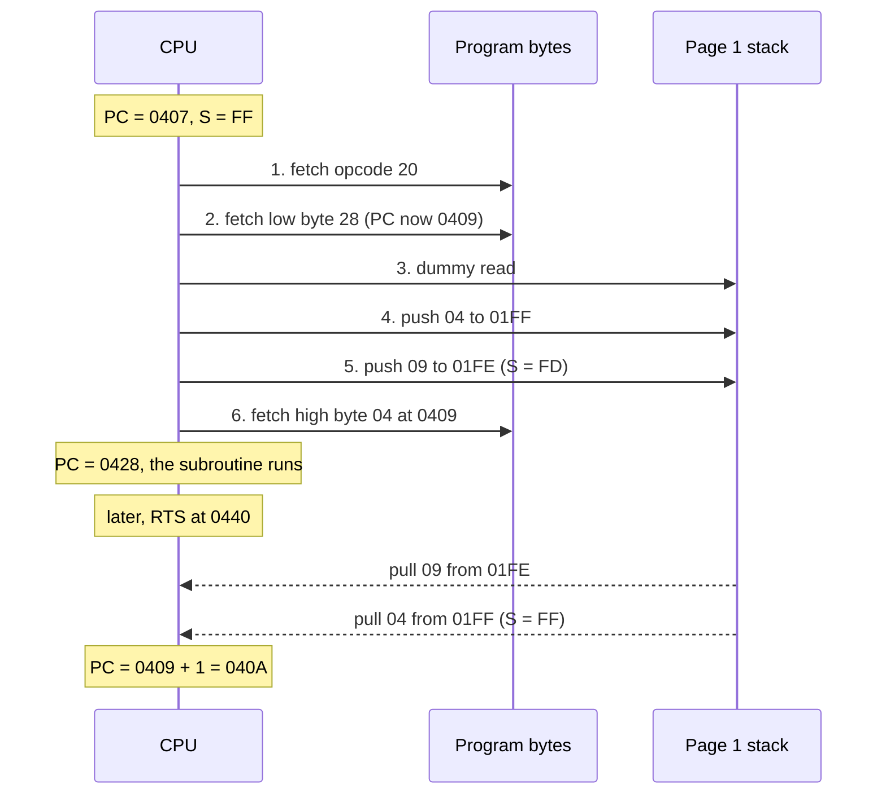
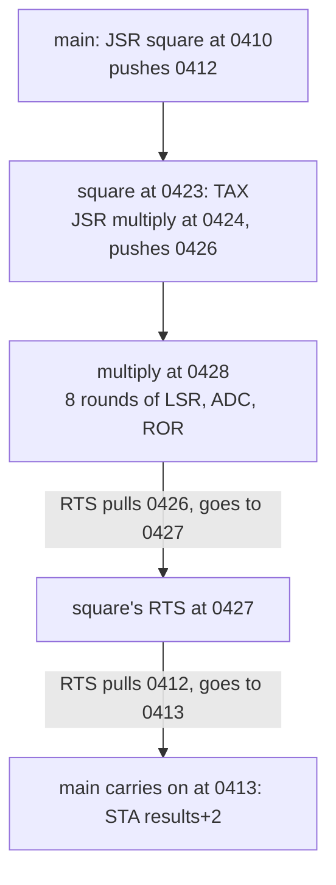
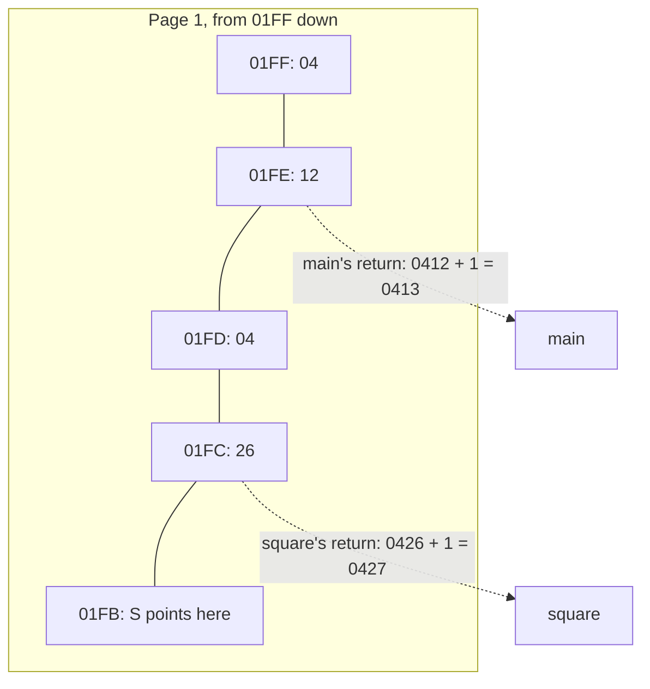

# Stage 16: Subroutines

> **Part:** 2 (The 6502 CPU) · **Branch:** `stage/16-subroutines` · **Needs:** 15
> **Status:** done

## Goal

Stage 15's `JMP` can go anywhere, but it can't come **back**: once you've jumped, the CPU has forgotten where it came from. This stage adds the two instructions that make reusable code possible:

- **`JSR &nnnn`** (Jump to SubRoutine) pushes a return address onto the stack, then jumps.
- **`RTS`** (ReTurn from Subroutine) pulls that address back off the stack and carries on from just after the `JSR`.

That's 2 new opcodes, 149 of 151. Only `BRK` and `RTI` (Stage 17) are left.

The quirk to learn is that **`JSR` pushes the address of its own last byte**, which is one less than the address of the next instruction, and `RTS` adds the 1 back. The stage also covers **calling conventions**: the agreements between a subroutine and its callers about which registers carry the inputs and outputs, and which ones get trashed.

The new example is a multiply subroutine called three times, once from inside another subroutine, so you can watch return addresses pile up in the Stack panel.

## What you can now see

### In the browser: return addresses in the Stack panel

```bash
npm run dev     # then open http://localhost:5173
```

The playground opens on the new **Stage 16: subroutines** example.

1. **Step** 5 times (`LDX #&FF`, `TXS`, `LDA #13`, `LDX #11`, `JSR multiply`). PC is now `&0428`, the start of `multiply`. The Stack panel shows `&01FF` = `04` and `&01FE` = `09`, both with the blue "written" bar, and the Memory panel's "Wrote:" line lists exactly those two pushes. Under the summary, a new line reads:

   ```
   RTS now → &040A (pulls 09 04, + 1)
   ```

   The `JSR` was at `&0407`, so it pushed `&0409` (its own last byte), and `RTS` will add the 1 back.
2. Press **Step ×16** four times and **Step** 8 more (72 instructions in all, counting from reset). You're at the start of `multiply` again, but this time `square` called it. The stack holds two return addresses:

   ```
   S = &FB · 4 bytes in use · next push → &01FB · next pull ← &01FC
   RTS now → &0427 (pulls 26 04, + 1)
   01FF  04      main's call to square, from &0410
   01FE  12
   01FD  04      square's call to multiply, from &0424
   01FC  26      next pull
   ```

   

3. Press **Run**. It stops with:

   ```
   Stopped at BRK (&0422) after 202 instructions, 640 cycles = 320 µs at 2 MHz
   ```

   Type `0000` in the Memory panel's Go box: `&90`–`&95` hold `8F 00 90 00 30 75`, which are 143, 144 and 30000, low byte first. The stack is empty again: every `JSR` was matched by an `RTS`.

### In the terminal

```bash
npm run demo:multiply
```

This prints the run as a call trace: a line for every `JSR` and `RTS`, indented by call depth, with the instructions in between counted rather than listed:

```
  … 4 instructions
  &0407  JSR multiply           pushes &0409   stack: 04 09
    … 60 instructions
  &0440  RTS                    → &040A       stack: (empty)
          A = &8F, X = &00: the answer is &008F = 143
  … 3 instructions
  &0410  JSR square             pushes &0412   stack: 04 12
    … 1 instruction
    &0424  JSR multiply         pushes &0426   stack: 04 12 04 26
      … 58 instructions
    &0440  RTS                  → &0427       stack: 04 12
            A = &90, X = &00: the answer is &0090 = 144
  &0427  RTS                    → &0413       stack: (empty)
          A = &90, X = &00: the answer is &0090 = 144
  … 4 instructions
  &041B  JSR multiply           pushes &041D   stack: 04 1D
    … 62 instructions
  &0440  RTS                    → &041E       stack: (empty)
          A = &30, X = &75: the answer is &7530 = 30000
  … 2 instructions
  &0422  BRK: stop (BRK is Stage 17)

202 instructions, 640 cycles.

results at &90-&95: 8F 00 90 00 30 75
  13 x 11 = 143   12 x 12 = 144   200 x 150 = 30000
```

Every "pushes" value is one less than the address its `RTS` goes to. The same `RTS` at `&0440` returns to three different places, because it only knows what's on the stack. The three `multiply` calls take 60, 58 and 62 instructions because the multiplier's 1 bits each add a `CLC` and an `ADC`: 11 = `%1011` has three, 12 = `%1100` has two, and 150 = `%1001 0110` has four.

## The real hardware

### The two instructions

| Opcode | Instruction | Bytes | Cycles | What it does | Flags |
|---|---|---|---|---|---|
| `&20` | `JSR &nnnn` | 3 | 6 | push (address of the `JSR` + 2), high byte first, then PC = `&nnnn` | none |
| `&60` | `RTS` | 1 | 6 | pull a word, low byte first, then PC = that word + 1 | none |

(MCS6500 Microcomputer Family Programming Manual, §8.1 "JSR" and §8.2 "RTS", and Appendix A for the cycle counts.)

`JSR` only has an absolute mode: there's no `JSR (&nnnn)`. To call through a pointer you `JSR` to a `JMP (&nnnn)`, which is exactly what the BBC's MOS entry points are (see "Calling the MOS" below).

### JSR, one cycle at a time

This is the order of bus cycles as documented in "64doc" (John West and Marko Mäkelä's cycle-by-cycle 6502 reference, hosted on 6502.org) and visible in Visual6502 traces. Take `JSR &0428` at `&0407`, with S = `&FF`:

```
cycle  address  R/W  what happens
  1    &0407    R    fetch opcode &20, PC = &0408
  2    &0408    R    fetch the target's low byte &28, PC = &0409
  3    &01FF    R    internal cycle (a dummy read of the stack; the byte is ignored)
  4    &01FF    W    push PC's high byte &04, S = &FE
  5    &01FE    W    push PC's low byte  &09, S = &FD
  6    &0409    R    fetch the target's high byte &04, then PC = &0428
```

Look at cycles 4 and 5. **The CPU pushes PC before it has fetched the last operand byte**, so at that moment PC still points *at* that byte, `&0409`. That's where "JSR pushes PC − 1" comes from: it isn't a deliberate design choice so much as a consequence of *when* the push happens. The return address on the stack is the address of the `JSR`'s third byte, not the next instruction (`&040A`).

Why fetch the high byte last? The usual explanation is that the 6502 has no spare internal register to park a second operand byte in while the bus is busy with the two pushes, so it leaves the high byte in memory until it needs it. That's my understanding rather than something the MCS6500 manual says. The ordering itself is certain, and it's what we model.

### RTS, one cycle at a time

`RTS` with S = `&FD` and `09 04` on the stack:

```
cycle  address  R/W  what happens
  1    &0440    R    fetch opcode &60, PC = &0441
  2    &0441    R    read the next byte and throw it away
  3    &01FD    R    dummy read at the old S, then S = &FE
  4    &01FE    R    pull the low byte  &09, S = &FF
  5    &01FF    R    pull the high byte &04
  6    &0409    R    dummy read at the pulled address, then PC = &0409 + 1 = &040A
```

The last cycle is the price of the `JSR` shortcut: `RTS` has to spend a cycle adding 1. So `RTS` costs 6 cycles even though it only reads 2 useful bytes.

Notice the order: `JSR` pushes **high then low**, so the low byte ends up at the lower address, and `RTS` pulls **low then high**. On the stack the return address reads like any other 6502 word, low byte first: `&01FE` = `&09`, `&01FF` = `&04`.

### Neither instruction touches the flags

`JSR` and `RTS` change PC and S, and nothing else. In particular **they don't save P**. If a caller needs its flags to survive a call, it has to `PHP` before and `PLP` after (or the subroutine has to). Interrupts (Stage 17) are different: they push P automatically, because the interrupted code didn't choose to be interrupted.

### Calling the MOS

On a BBC Micro you call the operating system with `JSR`. The MOS entry points are fixed addresses at the top of memory, for example (Advanced User Guide, the chapter on operating system calls):

| Call | Address | In | Out |
|---|---|---|---|
| `OSWRCH` | `&FFEE` | A = character to print | A, X, Y preserved |
| `OSASCI` | `&FFE3` | A = character (CR becomes CR + LF) | A, X, Y preserved |
| `OSBYTE` | `&FFF4` | A = function, X and Y = parameters | X and Y = results |
| `OSWORD` | `&FFF1` | A = function, X/Y = address of a parameter block | in the block |

`JSR &FFEE` lands on a `JMP (&020E)` (Stage 15's vectors), which goes to the MOS's character routine, which eventually does `RTS`. That `RTS` uses the address *your* `JSR` pushed, so it returns straight to your program. The vector's `JMP` doesn't touch the stack, so it's invisible to the return. We'll see these entry points for real in Stage 23.

## Key concepts

### 1. A subroutine is code that remembers where to go back to

Without `JSR`, the only way to reuse a piece of code from two places would be to store "where to go back to" somewhere yourself, and end the routine with a `JMP (that)`. `JSR`/`RTS` do exactly that, using the stack as the "somewhere". Because it's a stack, calls can **nest**: if `main` calls `square` and `square` calls `multiply`, the stack holds two return addresses, and the two `RTS`s pull them in the right order (last in, first out, Stage 15).

### 2. The return address is one short, on purpose

Here's the first call in this stage's example:

```
  &0407  20 28 04   JSR multiply      the JSR's last byte is at &0409
  &040A  85 90      STA results       the instruction we want to come back to
```

`JSR` pushes `&0409`, and `RTS` pulls `&0409` and adds 1 to get `&040A`. Get either half wrong (push `&040A`, or forget the + 1) and every return lands one byte off, in the middle of an instruction. The tests pin both halves separately for that reason.

### 3. Reading the stack in the Stack panel

After `LDX #&FF : TXS`, the first `JSR` leaves:

```
  &01FF  04   ← return address high byte (pushed first)
  &01FE  09   ← return address low byte  (pushed second): the word &0409
  &01FD  ..   ← S (next push)
```

So to read a return address on the stack, take the **lower** address's byte as the low byte, and add 1 to find where `RTS` will go: `09 04` → `&0409` → returns to `&040A`. The Stack panel now does that for you: it shows "RTS now → &040A" under its summary whenever there are at least two bytes on the stack. The panel can't know whether those two bytes really *are* a return address (the 6502 doesn't know either), so read it as "if an `RTS` ran right now".

### 4. Nesting: two return addresses at once

`main` calls `square` from `&0410`, and `square` calls `multiply` from `&0424`. While `multiply` runs, the stack is:

```
  &01FF  04  ┐ main's call:   &0412 → RTS goes to &0413 (back in main)
  &01FE  12  ┘
  &01FD  04  ┐ square's call: &0426 → RTS goes to &0427 (back in square)
  &01FC  26  ┘
  &01FB  ..  ← S
```

`multiply`'s `RTS` pulls `26 04` and goes to `&0427`, which is `square`'s own `RTS`. That pulls `12 04` and goes to `&0413`, back in `main`. Each `JSR` costs 2 bytes of stack, so the 256-byte page 1 runs out after 128 nested calls (fewer once interrupts and `PHA`s share it). There's no warning when that happens: S just wraps (Stage 15).

### 5. Calling conventions

The CPU doesn't care how a subroutine gets its inputs or returns its answers. That's an agreement between programmers, written in a comment above the routine. Our `multiply`'s is:

```
; multiply: A x X, 8 bits x 8 bits = 16 bits.
; In: A, X.  Out: A = low byte, X = high byte.  Uses &80-&82 and Y.
```

Three common styles on the 6502, all used by the BBC's MOS:

- **In registers.** Fast, but there are only three of them. `OSWRCH` takes its character in A.
- **In a parameter block in memory**, with its address passed in registers. `OSWORD` takes X (low byte) and Y (high byte) as the address of a block.
- **In zero page.** Cheap to reach, but every routine has to agree on who owns which bytes.

The other half of a convention is **what gets clobbered**. `multiply` trashes Y and `&80`–`&82`. A caller that needs Y afterwards has to save it first (`TYA : PHA … PLA : TAY`). The MOS's `OSWRCH` promises to preserve A, X and Y, which is why you can loop through a string with `LDA msg,X : JSR OSWRCH : INX` without saving X.

### 6. Multiplying by shifting and adding

The 6502 has no multiply instruction. `multiply` does long multiplication in binary, the same way you'd do it on paper, but in base 2 so each "digit" of the multiplier is 0 (add nothing) or 1 (add the multiplicand). For 13 × 11:

```
  multiplier 11 = %0000 1011, read from bit 0 upwards
  bit 0 = 1:  add 13 ×   1 =  13
  bit 1 = 1:  add 13 ×   2 =  26
  bit 2 = 0:
  bit 3 = 1:  add 13 ×   8 = 104
                            ----
                             143 = &008F
```

Rather than shifting the multiplicand left (which would need 16 bits), the routine adds into the **high byte** of a 16-bit product and shifts the whole product **right** after each bit. After 8 rounds every addition has been shifted into its proper place. It uses Stage 13's `LSR` and `ROR`, Stage 10's `ADC`, and Stage 14's `BCC`/`BNE`.

### 7. Tail calls: `JSR x : RTS` is a slow `JMP x`

`square` is `TAX : JSR multiply : RTS`. Its `RTS` only returns to `main`, so it could just as well have been `TAX : JMP multiply`: `multiply`'s own `RTS` would then return straight to `main`, using the address `main`'s `JSR` pushed. That saves 9 cycles (6 + 6 − 3) and 2 bytes of stack. Real 6502 code does this all the time. Our example keeps the `JSR` so you can see two return addresses at once.

### 8. The RTS trick

Because `RTS` simply pulls a word and adds 1, you can use it as a **computed jump**: push (target − 1), high byte first, then `RTS`. It's a common way to dispatch through a table of addresses, which is why you'll see tables of "address − 1" in 6502 ROMs. One of the tests does exactly this.

## Diagrams

### JSR and RTS, cycle by cycle



### Nested calls in the example



### What the stack holds while multiply runs inside square



## Our design

### JSR follows the real bus order

`JSR` goes in a new `instructions/subroutines.ts`, and does the cycles in the hardware's order, using Stage 15's `cpu.push`:

```ts
function jsr(cpu: Cpu6502): number {
  const r = cpu.regs;
  const low = cpu.fetchByte();          // cycle 2: PC now points at the high byte
  cpu.push(hi(r.pc));                   // cycle 4
  cpu.push(lo(r.pc));                   // cycle 5: so the pushed word is "PC - 1"
  r.pc = word(low, cpu.bus.read(r.pc)); // cycle 6: the high byte comes last
  return 0;
}
```

There's no `- 1` anywhere. The off-by-one comes out of doing things in the right order, which is the point. The simpler alternative, "read the whole address with `addrAbsolute`, then push `pc - 1`", gives the same answer for code in ordinary RAM. The difference only shows if the `JSR` sits in page 1 where its own pushes overwrite its operand (see Gotchas), but following the hardware costs nothing and makes the reason for the − 1 visible in the code.

`RTS` is the mirror image:

```ts
function rts(cpu: Cpu6502): number {
  const low = cpu.pull();
  const high = cpu.pull();
  cpu.regs.pc = (word(low, high) + 1) & 0xffff;
  return 0;
}
```

The `& 0xffff` matters for the RTS trick: pushing `&FFFF` and doing `RTS` goes to `&0000`.

Neither function allocates, so they're fine in the hot path. The dummy reads in cycle 3 of `JSR` and cycles 2, 3 and 6 of `RTS` aren't modelled, like Stage 15's (reading RAM has no side effects; they're in the parking lot).

### The Stack panel: "RTS now →"

The Stack view-model gains one field, `rts`: when two or more bytes are in use, it reads the next two pulls as a word, adds 1, and says where an `RTS` would go, e.g. `RTS now → &040A (pulls 09 04, + 1)`. It's a hint, not knowledge: after `PHA : PHA` it will happily "decode" two data bytes. The panel shows it in a second line under the summary.

### A new default example

`subroutines`: `multiply` (8 × 8 → 16 bits by shift-and-add), `square` (which calls `multiply`), and a main program that calls them three times and stores the answers at `&90`–`&95`. It ends on `BRK`, so **Run** works.

### Tests

- `subroutines.test.ts`: both opcodes' rows (bytes, cycles), the exact bytes `JSR` pushes and where, the + 1 in `RTS`, the round trip, nesting, no flags changed, S wrapping, the `&FFFF` → `&0000` wrap, the RTS trick, and the bus order (`JSR` reads its high byte *after* both pushes).
- The opcode-count test goes to 149.
- The example tests check the three answers, the four bytes on the stack inside the nested call, and the cycle count.

## Code walkthrough

- [`src/cpu/instructions/subroutines.ts`](../../src/cpu/instructions/subroutines.ts): `jsr` does the hardware's cycles in order: `fetchByte()` for the low byte, `push(hi(pc))`, `push(lo(pc))`, then a plain `bus.read(pc)` for the high byte. There's no `- 1` in it: PC is still on the high byte when it's pushed. `rts` is `pull`, `pull`, `word(low, high) + 1`, masked to 16 bits. Both use Stage 15's `cpu.push`/`cpu.pull`, so S wrapping and the page-1 address come for free.
- [`src/cpu/opcodes.ts`](../../src/cpu/opcodes.ts): `SUBROUTINES` joins `GROUPS`. 149 of 151 opcodes, with `BRK` and `RTI` left for Stage 17.
- [`src/web/workbench/stack-view-model.ts`](../../src/web/workbench/stack-view-model.ts): the new `rts` field, built by `rtsHint(page, s, depth)`. It reads the two bytes above S (each offset masked with `& 0xff`, so it stays in page 1 like a real pull), adds 1, and returns `undefined` with fewer than two bytes in use. [`stack-panel.ts`](../../src/web/workbench/stack-panel.ts) shows it in a muted line under the summary, hidden when absent.
- [`src/playground/examples.ts`](../../src/playground/examples.ts): `SUBROUTINES_SOURCE`, the new default. Each routine has its calling convention as a comment above it, the way real 6502 code documents them.
- [`scripts/demo-multiply.ts`](../../scripts/demo-multiply.ts): `npm run demo:multiply`. It watches the opcode before each step: after a `JSR` it reads the pushed word back off the stack, and it keeps a depth counter for the indentation.

## Tests

| Test file | What it proves |
|---|---|
| `src/cpu/instructions/subroutines.test.ts` | Both rows (`&20` absolute 3 bytes, `&60` implied 1 byte, 6 cycles each). `JSR` jumps; pushes `&0409` for a `JSR` at `&0407` (high to `&01FF`, low to `&01FE`); writes high then low; reads its high operand byte **after** both pushes (the exact bus log `R 407, R 408, W 1FF, W 1FE, R 409`); wraps S from `&00`; changes no flags or A/X/Y. `RTS` pulls low then high and adds 1; wraps `&FFFF` to `&0000`; wraps S from `&FF`; changes no flags. The RTS trick (push target − 1, `RTS`). Round trip (S back to `&FF`, 7 + 6 + 6 cycles), and two-deep nesting with both return addresses on the stack and the `RTS`s in reverse order. |
| `src/cpu/cpu6502.test.ts` | The opcode table now has 149 entries, including `JSR` and `RTS`. |
| `src/playground/examples.test.ts` | The subroutines example: label addresses; the first `JSR` pushes `&0409` and returns to `&040A` with 143; inside the nested call the stack is `04 12 04 26`, and the two `RTS`s go to `&0427` then `&0413`; a full run is 202 instructions and 640 cycles with the answers at `&90`–`&95`; `multiply` is right for 0 × 0, 1 × 1, 255 × 255, 16 × 16 and 200 × 150. The default example is now `subroutines`. |
| `src/web/workbench/stack-view-model.test.ts` | The RTS hint: `&040A` from `09 04`, the nearest pair when nested, `&FFFF` + 1 wraps to `&0000`, absent with 0 or 1 bytes in use. |
| `e2e/subroutines.spec.ts` | Opens on `subroutines`; no hint after `TXS`; after the first `JSR`, PC = `&0428`, `04 09` on the stack and the `&040A` hint; after 72 steps, four bytes and the `&0427` hint; Run stops at `&0422` (202 instructions, 640 cycles) with `8F 00 90 00 30 75` at `&90`. |
| `e2e/stack.spec.ts` | Now opens `?program=stack`. |

No tests need ROMs or fixtures.

## Gotchas & hardware quirks

- **The pushed address is one short.** `JSR` at `&0407` pushes `&0409`, not `&040A`. If you push the "proper" return address *and* add 1 in `RTS`, or push PC − 1 and forget the + 1, every return lands a byte out. Both halves are tested separately.
- **High byte first on the way in, low byte first on the way out.** That puts the word in memory low byte first, like every other 6502 word. Code that inspects its own return address uses `TSX : LDA &0101,X` (low) and `LDA &0102,X` (high), because S points at the next free slot (Stage 15).
- **The high operand byte is fetched after the pushes.** It only matters in one strange case: a `JSR` whose third byte is in the stack page, at the address its own pushes overwrite. A real 6502 then jumps to an address built from the byte it just pushed. We follow the same order, so we'd do the same, but no normal program does this.
- **`JSR`/`RTS` don't save flags or registers.** A subroutine's comment has to say what it changes. `multiply` changes Y and `&80`–`&82`, and leaves the flags in whatever state its last instruction left them.
- **A mismatched `RTS` goes somewhere strange.** An `RTS` with something other than a return address on top (say after a forgotten `PLA`) pulls the wrong two bytes, adds 1 and jumps there. The CPU can't tell: the Stack panel's "RTS now →" line is a guess for the same reason.
- **`RTS` adds 1 with a 16-bit wrap**, so a pulled `&FFFF` goes to `&0000`.
- **Not modelled:** `JSR`'s cycle-3 dummy stack read, and `RTS`'s dummy reads in cycles 2, 3 and 6. They're reads of RAM here, and go with the other dummy reads in the parking lot.

## Playwright verification

- MCP, interactively: opened `http://localhost:5173/`, stepped 72 instructions, and checked the Stack summary (`S = &FB · 4 bytes in use …`) and hint (`RTS now → &0427 (pulls 26 04, + 1)`). Screenshot of the panels under the screen: `.playwright-mcp/stage16-nested-call.png` (it also shows the Memory panel's `Wrote: &01FD ← &04, &01FC ← &26`, the `JSR`'s two pushes). Then Reset and Run: `Stopped at BRK (&0422) after 202 instructions, 640 cycles = 320 µs at 2 MHz`. No console errors.
- Durable: new `e2e/subroutines.spec.ts` (4 tests). `e2e/stack.spec.ts` now opens `?program=stack`. Full suite: 76 passed.

## Check your understanding

1. A `JSR &2000` sits at `&1234`. What two bytes does it push, and to which addresses if S was `&F0`?
2. Why does `JSR` push the address of its last byte rather than the address of the next instruction?
3. You want to jump to `&8000` using only `LDA`, `PHA` and `RTS`. What do you push, and in what order?
4. `square` is `TAX : JSR multiply : RTS`. Rewrite it as a tail call. How many cycles and how many bytes of stack does that save per call?
5. A subroutine starts with `PHA` and ends with `RTS`, with no `PLA`. Where does the `RTS` go?

<details>
<summary>Answers</summary>

1. It pushes `&1236` (the address of its last byte): `&12` to `&01F0`, then `&36` to `&01EF`, leaving S = `&EE`. `RTS` will go to `&1237`.
2. Because of the order of its bus cycles: it pushes PC in cycles 4 and 5 but only fetches the target's high byte in cycle 6, so while pushing, PC still points at that last byte. `RTS` pays for it with an extra cycle to add 1.
3. Push `&7FFF`, high byte first: `LDA #&7F : PHA : LDA #&FF : PHA : RTS`. `RTS` pulls `&FF` then `&7F` and adds 1.
4. `square: TAX : JMP multiply`. `multiply`'s `RTS` then returns straight to `main`. That saves `JSR` (6) + `RTS` (6) − `JMP` (3) = 9 cycles and 2 bytes of stack.
5. It pulls the byte that `PHA` pushed as the low byte, and the low byte of the real return address as the high byte, adds 1, and goes there: almost certainly somewhere random. The real return address's high byte stays on the stack.

</details>

## Further reading

- MCS6500 Microcomputer Family Programming Manual, §8.1–8.2 (JSR and RTS, with the stack diagrams), Appendix A (cycle counts).
- "64doc" by John West and Marko Mäkelä (on 6502.org): the cycle-by-cycle tables for `JSR` and `RTS`, including the dummy reads.
- 6502.org, "6502 Instruction Set" (Andrew Jacobs), the `JSR` and `RTS` pages.
- 6502.org source code repository: 8-bit multiplication routines (several variants of the shift-and-add method).
- BBC Micro Advanced User Guide, the chapter on operating system calls: the `OSWRCH`/`OSBYTE`/`OSWORD` entry points and what each preserves.
