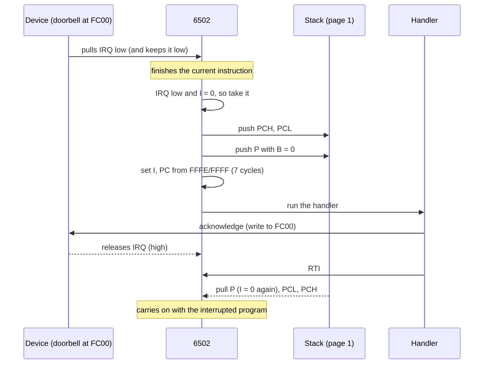
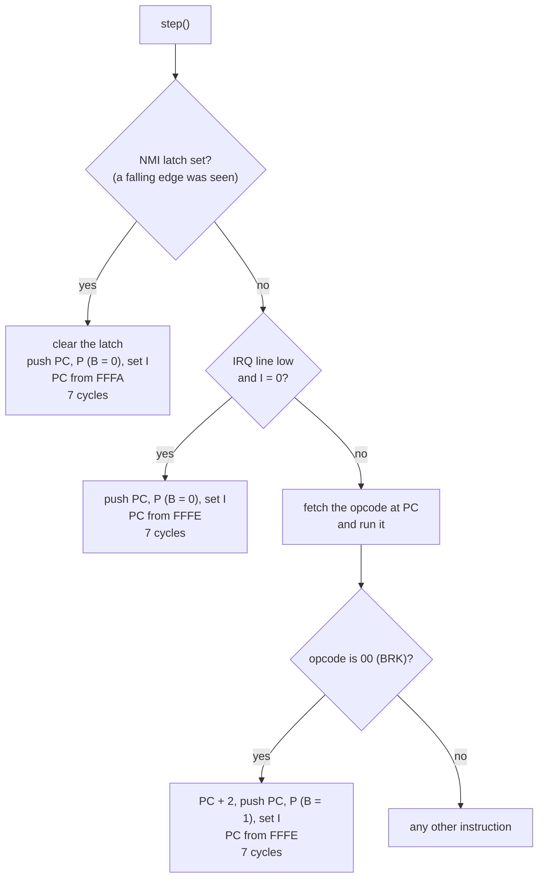
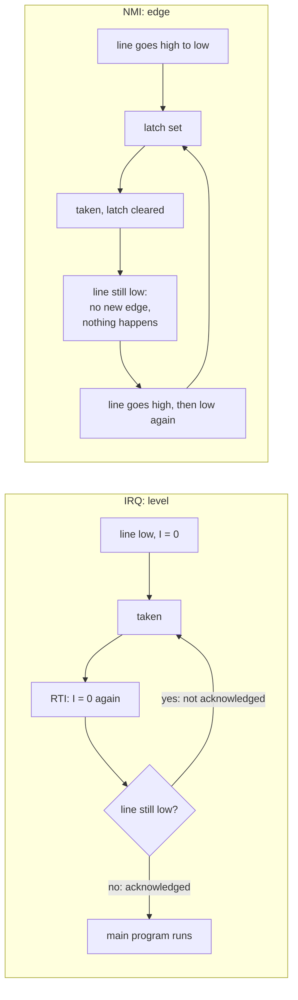

# Stage 17: Interrupts

> **Part:** 2 (The 6502 CPU) · **Branch:** `stage/17-interrupts` · **Needs:** 16
> **Status:** done

## Goal

So far the CPU only does what the program tells it, in order. Real machines also have to react to the **outside world**. On the BBC, 50 times a second the screen hardware says "vertical sync", the keyboard says "a key went down", and the disc controller says "here's the next byte". The 6502 can't afford to keep asking each device "anything for me?", so the devices **interrupt** it: they pull a wire, and the CPU drops what it's doing, runs a handler, and then carries on exactly where it left off.

This stage adds:

- the CPU's two interrupt **input lines**, `IRQ` and `NMI`, and the hardware sequence that answers them;
- **`BRK`**, the instruction that runs that same sequence on purpose (a "software interrupt");
- **`RTI`**, the instruction that returns from any of them.

That's the last 2 opcodes: **151 of 151**. The documented 6502 instruction set is complete.

The quirks to learn are that the **B flag doesn't exist** (it's only ever a bit in a pushed copy of P), that **IRQ is level-triggered and NMI is edge-triggered** (and why that matters), and that a handler has to **tell the device it's been heard**, or the device keeps on interrupting.

## What you can now see

### In the browser: the IRQ and NMI buttons

```bash
npm run dev     # then open http://localhost:5173
```

The playground opens on the new **Stage 17: interrupts** example. A new **Interrupts** panel sits under Registers. It has **IRQ** and **NMI** buttons, the state of the three inputs in words, a "next step" verdict, and the three vectors (`&FFFA` NMI → `&0428`, `&FFFC` RESET → `&0400`, `&FFFE` IRQ/BRK → `&040F`).

**1. Watch an IRQ wait for I.** Press **IRQ** straight away. The panel says:

```
IRQ line   held by the doorbell at &FC00
I flag     1: IRQs held off
IRQ waiting: I = 1 holds it off until CLI or RTI clears I.
```

Reset left I set, so the request waits. Nothing is lost: the doorbell keeps holding the line. **Step** 3 times (`LDX #&FF`, `TXS`, `CLI`). Now I = 0 and the Registers panel's Next line reads:

```
Next: IRQ → &040F (vector &FFFE), before &0404: &00 BRK
```


**Step** once more. That whole step was the 7-cycle interrupt sequence: PC = `&040F`, and the Stack panel shows `04 04 A0` at `&01FF`–`&01FD`: the address of the BRK (exactly, no −1), then P = `&A0` = `%1010 0000` (N from `LDX #&FF`, bit 5, and **B = 0**). Keep stepping through the handler: it looks at that `&A0`, sees bit 4 clear, writes to `&FC00` (the IRQ line drops to "released" right then), counts at `&80`, and `RTI` puts you back on the BRK.

**2. BRK.** Reload, and **Step** 4 times. This time the BRK runs: the stack holds `04 06 B0`. That's `&0406` (BRK at `&0404` + 2, so the padding byte `&42` is skipped) and `&B0` (**B = 1**). The same handler goes the other way and counts at `&82`.

Stepping from `&0404` to `&040F` isn't skipping the program: you're in the BRK handler, and the main loop comes after it. From a fresh reset, exactly **Step ×16** lands on `&0406`, the start of the loop:

| Steps | PC after | Instruction | What happens |
|---|---|---|---|
| 1–3 | `&0402`, `&0403`, `&0404` | `LDX #&FF`, `TXS`, `CLI` | set-up |
| 4 | `&040F` | `BRK` | through `&FFFE` |
| 5–8 | … `&0413` | `PHA`, `TXA`, `PHA`, `TSX` | save A and X; X = S |
| 9 | `&0416` | `LDA &0103,X` | A = the pushed P, `&B0` |
| 10 | `&0418` | `AND #&10` | B = 1, so A = `&10` |
| 11 | `&0422` | `BNE isbrk` | taken: a BRK, so no doorbell and no IRQ count |
| 12 | `&0424` | `INC brks` | `&82` = 1 |
| 13–15 | … `&0427` | `PLA`, `TAX`, `PLA` | X and A back |
| 16 | `&0406` | `RTI` | the main loop. Not `&0405`: BRK skipped its padding byte |

If you pressed **IRQ** first, step 4 also lands on `&040F`, but it's the IRQ, not the BRK. Once `CLI` clears I, the waiting IRQ is taken *before* the BRK can run. Both share the vector. The stack tells them apart: `04 04 A0` (the BRK's own address, B = 0). That `RTI` returns to `&0404`, and then the BRK runs.

**3. Run, and press the buttons.** Reload and press **Run**. It stops at the BRK, the way it always has:

```
Stopped at BRK (&0404) after 3 instructions, 6 cycles = 3 µs at 2 MHz
```

Press **Run** again: a Run that starts on a BRK goes through it (like a debugger continuing from a breakpoint), and the main loop counts for ever. Type `0080` in the Memory panel's Go box. `&84`/`&85` race upwards (the main loop), and `&82` = `01` (the BRK). Press **IRQ**: `&80` goes up by one. Press **NMI** twice: `&81` goes up by two. Each press interrupts the loop, runs the handler and comes back, and the main loop never notices.

**4. Break it.** In the Assembler, delete the line `STA doorbell`, **Assemble & Run**, then **Run**, **Run** again, and press **IRQ** once. `&80` now spins round and round, and `&84`/`&85` **freeze**: the handler never lets go of the doorbell, so every `RTI` (which clears I) is followed straight away by another IRQ. That's level-triggering.

### In the terminal

```bash
npm run demo:interrupts
```

This runs the example, presses the buttons at fixed cycles, and prints every way into and out of a handler:

```
     7  reset → &0400   I = 1, so no IRQ until the CLI
    20  BRK at &0404 → &040F            pushed 04 06 B0   P = %1011 0000, B = 1: BRK
    60    RTI → &0406   I = 0   IRQs 0  NMIs 0  BRKs 1  main loop 0
   300  ── press IRQ (the doorbell rings, IRQ held)
   307  IRQ taken before &0406 → &040F   pushed 04 06 20   P = %0010 0000, B = 0: hardware
   329    STA &FC00: the doorbell is answered, and lets go of IRQ
   353    RTI → &0406   I = 0   IRQs 1  NMIs 0  BRKs 1  main loop 30
   601  ── press NMI (one pulse: one edge)
   608  NMI taken before &0406 → &0428   pushed 04 06 20   P = %0010 0000, B = 0: hardware
   619    RTI → &0406   I = 0   IRQs 1  NMIs 1  BRKs 1  main loop 61
   904  ── press IRQ (the doorbell rings, IRQ held) and NMI (one pulse: one edge)
   911  NMI taken before &0408 → &0428   pushed 04 08 20   P = %0010 0000, B = 0: hardware
   922    RTI → &0408   I = 0   IRQs 1  NMIs 2  BRKs 1  main loop 97
   929  IRQ taken before &0408 → &040F   pushed 04 08 20   P = %0010 0000, B = 0: hardware
   951    STA &FC00: the doorbell is answered, and lets go of IRQ
   975    RTI → &0408   I = 0   IRQs 2  NMIs 2  BRKs 1  main loop 97

After 1303 cycles: IRQs 2  NMIs 2  BRKs 1  main loop 138
The NMI at the third press went first (NMI wins), and the IRQ, still held, came straight after its RTI.

── Now without the handler's STA doorbell: one IRQ press, never answered.
  20,000 cycles later (10 ms): IRQs 152 (the byte wraps at 256), main loop 30, the same as before the press (30).
  IRQ is a level: RTI clears I, the line is still held, so the CPU goes straight back in.
```

Things to notice:

- Every interrupt takes exactly 7 cycles to get in (300 → 307, 601 → 608). A button press is only seen **between** instructions, so the press at 300 waits for the `INC` it lands in to finish.
- At cycle 904 both lines were asking. The NMI went first. When its `RTI` cleared I, the IRQ (still held by the doorbell) came in straight away, before the main loop ran a single instruction: "main loop 97" doesn't change between 922 and 975.
- The unanswered IRQ goes round once every 49 cycles (7 in, 36 of handler, 6 for `RTI`). 20,000 / 49 ≈ 408 interrupts, and 408 − 256 = 152.

## The real hardware

### Three pins and an instruction

The 6502 has three inputs that can take the CPU away from its program, plus one instruction that does the same thing on purpose. All four end up running the **same 7-cycle sequence** inside the chip, and differ only in a few details:

| Cause | Pin / opcode | Triggered by | Masked by I? | Vector | Pushes | B in pushed P |
|---|---|---|---|---|---|---|
| **RESET** | `/RES` pin | the line going high again after being held low | no | `&FFFC`/`&FFFD` | nothing (3 dummy stack reads) | — |
| **NMI** | `/NMI` pin | a **falling edge** (high → low) | **no** | `&FFFA`/`&FFFB` | PC, P | 0 |
| **IRQ** | `/IRQ` pin | the line being **low** (a level) | **yes** | `&FFFE`/`&FFFF` | PC, P | 0 |
| **BRK** | opcode `&00` | executing it | no | `&FFFE`/`&FFFF` (shared with IRQ) | PC + 2, P | **1** |

(MCS6500 Microcomputer Family Programming Manual, Chapter 9 "Reset and Interrupt Considerations", and Appendix A for `BRK` and `RTI`. The pins are active-low, which is what the `/` means: "asserted" is 0 V.)

The six vector bytes live at the very top of memory, `&FFFA`–`&FFFF`. On a BBC that's the end of the MOS ROM, so the MOS decides where every interrupt goes. Our Stage 02 test already reads MOS 1.20's: the IRQ/BRK vector at `&FFFE` holds `1C DC`, so IRQs and BRKs go to `&DC1C`.

### The interrupt sequence, one cycle at a time

Here is an IRQ arriving while the CPU is running `INC &84` at `&0405` (a 5-cycle instruction). Say S = `&FF` and P = `&20` (I clear). The CPU first **finishes the instruction it's in the middle of**: interrupts are only taken *between* instructions. Then, instead of fetching the next opcode at `&0407`, it does this (64doc's "BRK" table; Visual6502 traces):

```
cycle  address  R/W  what happens
  1    &0407    R    fetch the "opcode", but force it to &00 (BRK) inside the chip
  2    &0407    R    read the next byte and throw it away; PC is NOT advanced
  3    &01FF    W    push PCH  &04, S = &FE
  4    &01FE    W    push PCL  &07, S = &FD
  5    &01FD    W    push P with B = 0: &20 → %0010 0000 = &20, S = &FC
  6    &FFFE    R    read the vector's low byte, and set I
  7    &FFFF    R    read the vector's high byte; PC = the handler
```

That's why every interrupt costs **7 cycles** before the handler's first instruction even starts. It's literally `BRK`'s microcode, with three differences wired in for a hardware interrupt:

1. The opcode fetch is **ignored** and replaced by `&00`. That's how a CPU with no spare microcode space handles interrupts: it pretends it just read a `BRK`.
2. PC is **not incremented** past the "opcode" or the padding byte, so the pushed address is exactly the instruction that *would* have run next (`&0407`). After `RTI`, that instruction runs as if nothing happened.
3. The B bit in the pushed P is **0**.

For an NMI the vector is `&FFFA` instead. For `BRK` itself, the opcode really is `&00`, PC **is** incremented twice (past the opcode and a padding byte), and B is pushed as **1**.

**I is set on the way in**, so the handler can't be interrupted by another IRQ until it chooses (`CLI`) or until `RTI` restores the old P. On the NMOS 6502 the **D flag is left alone**, so a handler that does arithmetic must `CLD` first if it can't be sure. (The 65C02 clears D on interrupt. We're emulating the NMOS part.)

### What's on the stack

After the IRQ above, page 1 looks like this, and the handler starts with S = `&FC`:

```
&01FF  04   PCH   ┐ the return address: the instruction that was interrupted
&01FE  07   PCL   ┘ (exactly that one, not "minus 1" like JSR)
&01FD  20   P     the flags at the moment of the interrupt, B = 0
&01FC  ..         ← S: next free slot
```

Compare `JSR` (Stage 16): it pushes only 2 bytes, and the address is one *less* than where to come back to. An interrupt pushes 3, and the address is exactly where to come back to.

### RTI, one cycle at a time

`RTI` (`&40`, 1 byte, 6 cycles) undoes it, in reverse:

```
cycle  address  R/W  what happens
  1    &0450    R    fetch opcode &40
  2    &0451    R    read the next byte and throw it away
  3    &01FC    R    dummy read at the old S, then S = &FD
  4    &01FD    R    pull P   (&20: I is clear again; bits 5 and 4 are dropped)
  5    &01FE    R    pull PCL (&07)
  6    &01FF    R    pull PCH (&04); PC = &0407
```

**No `+ 1`** (that's `RTS`'s job), because the interrupt pushed the exact address. And because P comes back off the stack, **every flag is restored**, including I. A handler can trample N, Z, C and V freely and the interrupted code never notices. It must still save and restore any **registers** it uses (A, X, Y), because the hardware doesn't.

### The B "flag" doesn't exist

Look at the table: B is only ever a bit **in the pushed byte**. Inside the chip there's no flip-flop for it (Stage 04's `flags.ts` stores six booleans for exactly this reason). So "is B set?" only makes sense as "was this P pushed by `BRK`/`PHP` or by a hardware interrupt?"

That matters because **`BRK` and `IRQ` share a vector**. The handler at `&FFFE` can't tell which one brought it there except by looking at the copy of P on the stack. MOS 1.20's handler starts like this (from memory of the MOS disassembly; we'll see it for real in Stage 23):

```
&DC1C  STA &FC        ; save A in zero page (no stack needed)
       PLA            ; A = the pushed P
       PHA            ; put it back: the stack must be left as it was
       AND #&10       ; bit 4 = B
       BNE brk        ; 1: a BRK instruction, an error
       JMP (&0204)    ; 0: a real IRQ, through IRQ1V
```

### BRK: an instruction that skips a byte

`BRK` is 1 byte long, but it pushes **its own address + 2**, so `RTI` comes back one byte further on than you'd think. The byte after `BRK` is a **padding** (or "signature") byte that the CPU skips. MOS Technology's idea was patching: replace any instruction's opcode with `&00` and the program stops in a monitor. The BBC uses the gap differently: in BBC BASIC and the MOS, `BRK` is followed by an **error number and a message**, and the BRK handler reads them using the pushed address (Advanced User Guide, "BRK vector"). For example, BASIC's "Mistake" is:

```
00          BRK
04          error number 4
4D 69 73 74 61 6B 65    "Mistake"
00          terminator
```

So on the BBC, `BRK` is how **errors** are raised, and it never returns with `RTI` at all.

### Level-triggered IRQ: "I'm still waiting"

`/IRQ` is a **level** input. Before each instruction the CPU looks at the wire. If it's low and I is clear, it takes the interrupt. Nothing is remembered: if the device lets go of the wire before the CPU looks, the request is simply gone.

And if the device **doesn't** let go, the CPU takes the interrupt **again** as soon as the handler's `RTI` restores I = 0. And again. Forever. The main program never gets another instruction in. So every IRQ handler has to do something that makes the device **release the line**: on the BBC it's usually writing to the 6522 VIA's interrupt flag register at `&FE4D` (Stages 24–26). The device keeps its request up until it's acknowledged. This is a feature: no request can ever be lost.

Level-triggering is also what lets many devices **share one wire**. On the BBC, `/IRQ` is an open-collector line with a pull-up resistor, so any device can pull it low and it stays low until *all* of them let go (a "wired-OR"). The Model B's IRQ sources include the System VIA (vertical sync, keyboard, timers), the User VIA, and the 6850 serial chip. The handler has to poll each in turn to find out who rang. (Advanced User Guide, the "Interrupts" chapter.)

### Edge-triggered NMI: "something just happened"

`/NMI` works the other way. The chip has a little **edge detector**: when the wire goes from high to low, a latch inside the CPU is set, and the NMI is taken at the next instruction boundary, **whatever I says**. ("Non-maskable".) The latch is cleared when the NMI is taken.

Holding the wire low does **nothing more**: no new edge, no new NMI. To get another one, the device has to let go (high) and pull again (low). So an NMI handler doesn't need to acknowledge anything to avoid being re-entered, but a device that **never releases** the line can't send a second NMI.

NMI is for things that **can't wait**. On the BBC that's the **8271 disc controller** (and Econet): during a disc read, a byte arrives every 64 µs (128 cycles), and if the CPU is slow to collect it, it's overwritten by the next one. The MOS points `&FFFA` at `&0D00` in RAM, so the DFS can put its own super-short NMI routine there (Stage 50).

### When exactly does the CPU look?

The 6502 samples its interrupt inputs during the **last cycle or two of each instruction**, and decides there whether the next "fetch" will be a real opcode or a forced `BRK`. Two NMOS consequences that an instruction-stepped emulator like ours **doesn't** reproduce (see Gotchas):

- `CLI`, `SEI` and `PLP` change I **after** that decision, so their effect on IRQs is one instruction late. `CLI` with an IRQ waiting runs one more instruction before the IRQ is taken. `RTI` restores I early enough to take effect immediately.
- A taken branch that doesn't cross a page skips the check, delaying an interrupt by one instruction.

### Priority

If an NMI and an IRQ are both waiting at the same instruction boundary, **NMI wins**. Its sequence sets I, so the IRQ has to wait until the NMI handler's `RTI` (unless the NMI handler clears I itself).

## Key concepts

### Interrupts are just an unplanned JSR that also saves P

That's really the whole idea. Compare:

| | JSR (Stage 16) | IRQ / NMI | BRK |
|---|---|---|---|
| Who decides | the program | a device | the program |
| Pushes | PC − 1 (2 bytes) | PC (2 bytes) + P (1 byte) | PC + 2 (2 bytes) + P (1 byte) |
| Where to | the operand | the vector | the vector at `&FFFE` |
| Sets I | no | yes | yes |
| Return with | RTS (pull 2, + 1) | RTI (pull 3) | RTI, or never |
| Cycles | 6 | 7 | 7 |

An interrupt pushes P because **the interrupted code didn't choose to be interrupted**. It might be halfway through `CMP` and `BNE`, and if the handler changed Z without putting it back, that `BNE` would go the wrong way. Saving P automatically makes the interruption invisible.

### Worked example: BRK

`BRK` at `&0403`, with S = `&FF` and P = `&20` (only bit 5; I clear), and the vector at `&FFFE` = `1E 04` (`&041E`):

1. PC moves past the opcode and the padding byte: `&0403` → `&0405`.
2. Push `&04` to `&01FF`, then `&05` to `&01FE`.
3. Push P with B = 1: `%0011 0000` = `&30`, to `&01FD`. S = `&FC`.
4. Set I. P is now `&24` (the in-chip P has no B, so the registers panel shows `&24`, not `&34`).
5. PC = `&041E`. 7 cycles.

At the handler, `RTI` pulls `&30` (the six real flags come back: only bit 5 and B were set, so everything is clear, I included), then `&05 &04`. PC = `&0405`: the instruction **after** the padding byte.

### Worked example: an IRQ that's never acknowledged

A handler that forgets to acknowledge:

```
irq:    INC &80     ; count it
        RTI
```

With the device holding `/IRQ` low:

1. IRQ taken (7 cycles): I = 1. The handler runs `INC &80` (5 cycles). `RTI` (6 cycles) restores I = 0.
2. Before the next main-program instruction, the CPU looks: `/IRQ` still low, I = 0. Taken again.
3. Every 18 cycles, `&80` goes up by 1, and the main program is frozen.

You'll be able to try this in the workbench: delete one line of the example and press **IRQ**.

## Diagrams

### An IRQ from request to return



### What step() decides before each instruction



### Level versus edge



## Our design

### The CPU's inputs

Two new pieces of state on `Cpu6502`, modelled differently because the pins behave differently:

```ts
/** The /IRQ input, level-sensitive. true = asserted (pulled low). Whoever owns the CPU sets it. */
irq = false;
/** The edge detector's latch: set by a false → true change in setNmi(), cleared when the NMI is taken. */
nmiPending = false;
private nmiLine = false;

setNmi(asserted: boolean): void {
  if (asserted && !this.nmiLine) this.nmiPending = true;   // the falling edge
  this.nmiLine = asserted;
}
```

`irq` is just a field you can write: a level has no memory, so there's nothing to compute. NMI needs a method because the edge detector has to compare the new level with the old one. Both use "true = asserted", so code never has to think about active-low voltages. (From Part 5 the machine will do `cpu.irq = systemVia.irq || userVia.irq || …` after ticking the devices, which is the wired-OR in one line, as in `BUILD-PLAN.md` §3.)

### One shared sequence

```ts
/** The 7-cycle sequence shared by BRK, IRQ and NMI: push PC and P, set I, load PC from the vector. */
enterInterrupt(vector: number, b: boolean): void
```

`step()` checks the inputs **before** fetching. If an interrupt is due, that whole step *is* the interrupt: it pushes, vectors, and returns 7. So pressing **Step** with an IRQ waiting shows you the entry into the handler as one step, and the next Step runs the handler's first instruction. NMI is checked first, so it wins.

`BRK` (in the new `instructions/interrupts.ts`) moves PC past the padding byte and calls `enterInterrupt(IRQ_VECTOR, true)`. `RTI` pulls P with `unpackP` (Stage 15's, which already drops bits 5 and 4), then PC. Nothing in the hot path allocates.

Alternatives considered: a separate `cpu.serviceInterrupts()` that the machine calls between steps. That works, but then every caller has to remember to call it and add its 7 cycles. Folding it into `step()` keeps the §3 contract ("step() returns the cycles that passed") true for interrupts too.

### Reset

`reset()` now also clears the NMI latch, so a press of NMI before **Assemble & Run** doesn't fire into the new program. I'm not sure what the real chip does with a latched NMI across a reset, so this is our choice, not a hardware claim. `irq` is left alone: it belongs to the devices, not to the CPU.

### A device to interrupt us: the doorbell

To show level-triggering honestly, the playground needs a device that **holds** `/IRQ` until it's acknowledged, the way a VIA does. The real VIA is Stages 24–26, so this stage adds the smallest possible stand-in, `src/playground/doorbell.ts`:

- It sits at `&FC00`. On a real Model B, page `&FC` is **FRED**, the part of the memory map set aside for add-on hardware on the 1 MHz bus (Advanced User Guide, memory map), so it's a believable place for an extra device. In our flat playground nothing else lives there.
- **Pressing IRQ rings it.** While it's ringing, it asserts IRQ.
- **Reading `&FC00`** gives `&80` while ringing, `&00` otherwise (bit 7, like the VIA's "any interrupt" bit).
- **Writing anything to `&FC00`** answers it: it stops ringing and releases IRQ.

It's a `Bus` wrapper, like Stage 07's `WriteRecorder`:

```
Cpu6502 ──▶ WriteRecorder ──▶ Doorbell ──▶ TestBus ◀── peek / poke
                              &FC00 is
                              the doorbell
```

The playground target's `step()` does what the Part 5 machine will do: copy the device's line to the CPU (`cpu.irq = doorbell.ringing`), then step.

**Pressing NMI** pulses the line: `setNmi(true)` then `setNmi(false)`. That's one edge, so one NMI.

### The Interrupts panel

A new panel under the screen, next to Registers, with **IRQ** and **NMI** buttons and a DOM-free view-model (`interrupts-view-model.ts`) that explains the state in words: whether the IRQ line is held and by whom, whether I is masking it, whether the NMI latch is set, what will happen on the next step, and where the three vectors point. The Registers panel's "Next:" line also says when the next step will be an interrupt rather than an instruction.

### Run and BRK

Since Stage 14, Run stops *before* a `BRK`, as a breakpoint. That stays. But now that `BRK` can run, **Run started on a BRK runs it**, like a debugger continuing from a breakpoint. So you can Run up to a BRK, look around, and Run again to go through it. Run also no longer stops at a `BRK` when an interrupt is due first, because then the BRK isn't what happens next.

## Code walkthrough

- [`src/cpu/cpu6502.ts`](../../src/cpu/cpu6502.ts)
  - `NMI_VECTOR`, `IRQ_VECTOR`, `INTERRUPT_CYCLES` sit beside `RESET_VECTOR`.
  - `irq` is a plain field: a level has no memory. `setNmi()` is a method because the edge detector compares the new level with `nmiLine`, and only `false → true` sets `nmiPending`.
  - `step()` starts with two checks: the NMI latch first, then `irq && !i`. Either one makes the step the interrupt sequence (`interrupt()` → `enterInterrupt(vector, false)`, plus 7 cycles), and no opcode is fetched.
  - `enterInterrupt(vector, b)` is the shared sequence: `push(hi(pc))`, `push(lo(pc))`, `push(packP(regs, b))`, set I, and read the vector. It reuses Stage 15's `push` and `packP`, so the stack wraps and bits 5/4 come out right without any new code.
  - `pendingInterrupt` answers "what will the next step do?" for the panels and the Run loop. It's the same test `step()` makes.
  - `reset()` clears the NMI latch (our choice, see Our design).
- [`src/cpu/instructions/interrupts.ts`](../../src/cpu/instructions/interrupts.ts): `brk` is two lines (skip the padding byte, then `enterInterrupt(IRQ_VECTOR, true)`), and `rti` is `unpackP(pull())` and then PC low/high with no `+ 1`. With these in [`opcodes.ts`](../../src/cpu/opcodes.ts)'s `GROUPS`, the table holds all 151 documented opcodes.
- [`src/playground/doorbell.ts`](../../src/playground/doorbell.ts): the stand-in device. It's a `Bus` wrapper that answers `&FC00` itself (`&80` / `&00` on read, "answered" on any write) and passes every other address through.
- [`src/web/workbench/debug-target.ts`](../../src/web/workbench/debug-target.ts): `playgroundTarget` now builds `Cpu6502 → WriteRecorder → Doorbell → TestBus`. Its `step()` runs the CPU, then copies `doorbell.ringing` to `cpu.irq`. That's the "devices report their line, machine sets the CPU input" half of BUILD-PLAN §3, in miniature. `ringIrq()` and `pulseNmi()` are the buttons. The new `InterruptTarget` interface is what the panel needs. `CpuTarget` gained `pendingInterrupt`.
- [`src/web/workbench/run-model.ts`](../../src/web/workbench/run-model.ts): `runFor(target, maxCycles, fromBreak)`. The stop test is now "PC is on a BRK **and** no interrupt is due", and it's skipped for the first instruction when `fromBreak` is true (`advanceRun` passes `state.steps === 0`).
- [`src/web/workbench/interrupts-view-model.ts`](../../src/web/workbench/interrupts-view-model.ts) / [`interrupts-panel.ts`](../../src/web/workbench/interrupts-panel.ts): the panel. All the wording is decided in the view-model, which is DOM-free and tested.
- [`src/web/workbench/registers-view-model.ts`](../../src/web/workbench/registers-view-model.ts): the Next line says `IRQ → &040F (vector &FFFE), before …` when an interrupt is due. An empty opcode slot now reads "(undocumented: not implemented)", because every documented one is filled.
- [`src/playground/examples.ts`](../../src/playground/examples.ts): `INTERRUPTS_SOURCE`, the new default. The handler's B test is worth reading: after `PHA`, `TXA`, `PHA`, `TSX`, the pushed P is at `&0103,X`. That's the same trick as MOS 1.20's `PLA`/`PHA`/`AND #&10`, done without disturbing the stack.
- [`scripts/demo-interrupts.ts`](../../scripts/demo-interrupts.ts): the timeline demo.

## Tests

| Test file | What it proves |
|---|---|
| `src/cpu/interrupts.test.ts` | IRQ: taken before the next instruction with the exact PC, P with B = 0, I set, `&FFFE`, 7 cycles; bus order PCH, PCL, P, vector low, high; masked by I; taken as soon as `CLI` runs; forgotten if released before the CPU looks; re-taken after `RTI` if never released; D untouched; S wraps. NMI: an edge latches it, through `&FFFA`, even with I set; a pulse still counts; holding low fires once; high then low fires again; wins over IRQ. `pendingInterrupt`. Reset clears the NMI latch but not `irq`. |
| `src/cpu/instructions/interrupts.test.ts` | BRK/RTI table rows; 151 opcodes in all. BRK: 7 cycles via `&FFFE`, pushes own address + 2, P with B = 1 (`&30`), sets I and nothing else, runs with I set, PC + 2 wraps. RTI: pulls P then PC with no + 1 in 6 cycles, restores all six flags, S wraps. BRK → RTI round trip. |
| `src/playground/doorbell.test.ts` | `&FC00` reads `&80`/`&00`; a write answers it; other addresses pass through; reset quiets it. |
| `src/web/workbench/debug-target.test.ts` | IRQ button → line held → next step enters the handler; the line drops right after the step that writes `&FC00`; a debugger poke doesn't answer it; NMI is one pulse; reset quiets everything. |
| `src/web/workbench/interrupts-view-model.test.ts` | Vectors table; the wording for nothing asking, an IRQ masked by I, an IRQ due, and an NMI winning. |
| `src/web/workbench/run-model.test.ts` | New: Run continues through a BRK it starts on; it doesn't stop at a BRK when an interrupt is due first. |
| `src/web/workbench/registers-view-model.test.ts` | New: the Next line names a due IRQ/NMI with its vector and handler. |
| `src/playground/examples.test.ts` | The interrupts example: vector layout; BRK pushes `04 06 B0` and counts at `&82`; an IRQ is told apart by B = 0, answered, counted at `&80`, and the main loop carries on; NMI counted at `&81` even with I set; without `STA doorbell` the handler runs for ever and the main loop stops. The labels example now runs off its page through the BRK to `&0000`. |
| `e2e/interrupts.spec.ts` | In the browser: the vectors; IRQ waiting for `CLI` and then taken; BRK's B = 1; Run, Run again, IRQ and NMI presses counted. |

`e2e/cpu.spec.ts` (stepping off the page now runs the BRK at `&0500`), `e2e/subroutines.spec.ts` (now opens `?program=subroutines`) and `e2e/workbench.spec.ts` (4 panels under the screen) were updated.

## Gotchas & hardware quirks

- **The B flag isn't a flag.** The Registers panel still draws B as "not stored", and after `BRK` P reads `&24`, not `&34`. Only the copy on the stack has B = 1. Anything that wants to know whether it was a BRK has to look on the stack.
- **The interrupt pushes PC exactly; JSR pushes PC − 1; BRK pushes PC + 1** (its own address + 2). Three different conventions for "the return address", and `RTI`/`RTS` each match their own one.
- **BRK has a padding byte.** Write `BRK` with nothing after it and `RTI` comes back one byte too far. Our example puts `.byte &42` there.
- **IRQ must be acknowledged at the device**, not at the CPU. Clearing I, or doing anything else inside the CPU, doesn't stop the device asking.
- **NMI can be lost if the line never goes high again.** On the BBC this is why the 8271 must release `/NMI` between bytes.
- **D isn't cleared on entry** (NMOS). A handler that does `ADC` should `CLD` first. MOS 1.20's handlers avoid decimal arithmetic.
- **Not modelled (instruction-stepped model):**
  - The one-instruction delay of `CLI`, `SEI` and `PLP` on IRQ recognition. Ours takes an IRQ straight after `CLI`; the chip would run one more instruction first. The outcome is the same (the IRQ is serviced, and the flags come back right). Only the timing and the pushed I differ.
  - A taken, non-page-crossing branch delaying an interrupt by one instruction.
  - **Interrupt hijacking**: an NMI arriving during the first cycles of a BRK (or of an IRQ's sequence) takes over the sequence, so the CPU goes through `&FFFA` with B = 1 pushed, and the BRK is lost. Our interrupts only land between whole instructions, so it can't happen.
  - The dummy reads of the sequence (cycles 1 and 2), and of `RTI` (cycles 2 and 3).
  
  All four are noted in the parking lot for the cycle-exact extras in Part 12. Stage 19's per-opcode tests don't cover interrupts, so they won't catch these.
- **Reset clears our NMI latch.** That's a choice made for the playground. I couldn't confirm what the real 6502 does with a latched NMI across a reset.
- **The doorbell is a playground stand-in**, not part of the BBC. Stage 21's memory map won't have it. The System VIA (Stages 24–26) is the real thing: its IFR at `&FE4D` is what a BBC handler writes to in order to acknowledge.
- **A debugger poke to `&FC00` doesn't answer the doorbell.** `poke` goes straight to the TestBus, past the device, on purpose (Stage 03's rule that the debugger must not cause side effects).
- **Stepping a BRK in an older example** goes through `&FFFE`/`&FFFF` = `&0000`, where `&7C` (an undocumented opcode) stops the CPU. Run still stops *before* a BRK, so you only see this if you Step into it.

## Playwright verification

- MCP, by hand: opened the playground and checked the Interrupts panel (vectors `&0428`/`&0400`/`&040F`). With IRQ pressed before `CLI`, the panel said "IRQ waiting", and after 3 Steps the Next line said `IRQ → &040F (vector &FFFE), before &0404: &00 BRK` (the screenshot above). Run stopped at `&0404` after 3 instructions. Run again kept running. One IRQ press set `&80` = 1, two NMI presses set `&81` = 2, and `&84`/`&85` kept counting.
- Durable: `e2e/interrupts.spec.ts` (4 tests). The full suite is 80/80.

## Check your understanding

1. An IRQ arrives while the CPU is running a `JSR` at `&0410`, which jumps to `&2000`. Which address gets pushed by the IRQ, and which by the `JSR`? What will be on the stack at the moment the IRQ handler starts (S was `&FF`)?
2. The IRQ handler at `&FFFE` finds `&35` at the top of the frame the CPU pushed. Was it entered by an IRQ or a BRK? Which flags were set in the interrupted code?
3. Why can't an IRQ handler just `SEI` and `RTI` to stop a device interrupting forever? What does it have to do instead, and what's the BBC's usual way?
4. A device pulls `/NMI` low and keeps it low for a whole second. How many NMIs does the CPU take? And if the same device used `/IRQ` instead, with I clear and a handler that never acknowledges it?
5. Why does an interrupt push P, when `JSR` doesn't? Give an example of interrupted code that would go wrong if it didn't.

<details>
<summary>Answers</summary>

1. Interrupts are only taken between instructions, so the `JSR` finishes first: it pushes `&0412` (its own last byte) at `&01FF`/`&01FE` and jumps to `&2000`. Then the IRQ pushes `&2000` (exactly the next instruction) and P. From `&01FF` down: `04 12 20 00 P`, with S = `&FA`. The handler's `RTI` returns to `&2000`, and the subroutine's `RTS` later returns to `&0413`.
2. `&35` = `%0011 0101`: bit 4 (B) is 1, so it was a **BRK**. The real flags were I (bit 2) and C (bit 0); bit 5 is always 1. (Note that I was set and the BRK still ran: an instruction can't be masked.)
3. `RTI` reloads P from the stack, so the `SEI` is undone, and I goes back to what the interrupted code had (normally 0). The device is still holding `/IRQ` low, so the IRQ is taken straight away again. The handler has to make the **device** release the line, usually by reading or writing one of its registers. On the BBC that's normally writing the right bit to a 6522 VIA's interrupt flag register (`&FE4D` for the System VIA).
4. One NMI: there's only one falling edge, and a held line doesn't make another. With `/IRQ`, it would never stop: about one interrupt per (7 + handler + 6) cycles, and the main program would freeze, as in the demo's last section.
5. Because the interrupted code didn't choose to be interrupted, so it can't have saved its flags. For example, with `CMP #&0D` followed by `BEQ done`, if an IRQ lands between them and the handler's `INC &80` changes Z, the `BEQ` would follow the handler's result and not the compare's, unless P is restored on the way back.

</details>

## Further reading

- MCS6500 Microcomputer Family Programming Manual, Chapter 9 "Reset and Interrupt Considerations", and Appendix A (`BRK`, `RTI`).
- "64doc" by John West and Marko Mäkelä (6502.org): the cycle tables for `BRK`, `RTI` and the hardware interrupts, and the note on NMI hijacking BRK.
- 6502.org, "Investigating Interrupts" (Garth Wilson's 6502 interrupts primer): IRQ vs NMI, wired-OR lines, and writing handlers.
- Visual6502 wiki, "6502 Timing of Interrupt Handling": the polling point, and the CLI/SEI and branch quirks we don't model.
- BBC Microcomputer Advanced User Guide: the "Interrupts" chapter (IRQ1V/IRQ2V, the BRK vector at `&0202`, NMIs and `&0D00`), and the memory map (FRED at `&FC00`).
- BeebWiki: "BRK" (the BBC's error convention).
