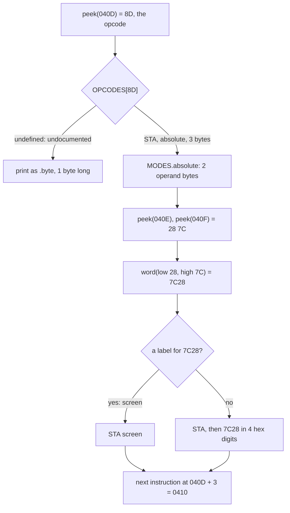
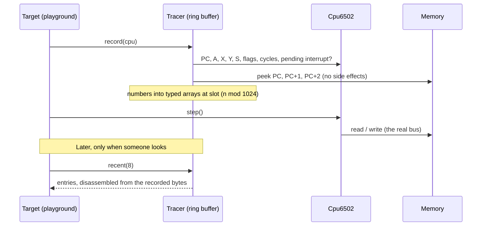
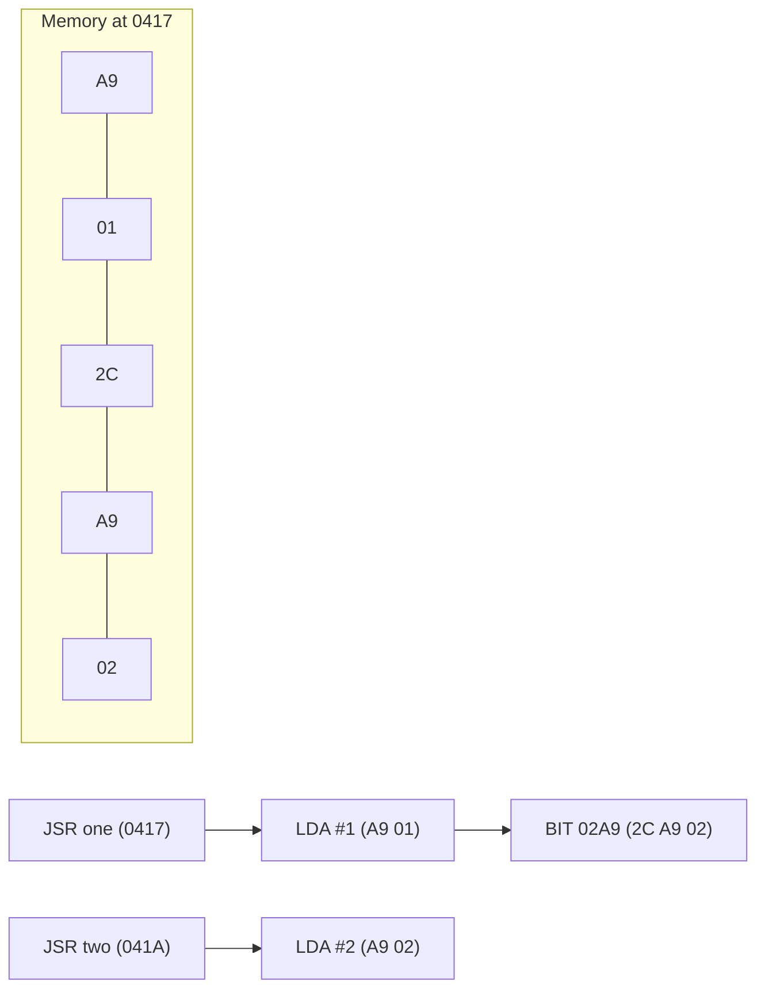

# Stage 18: Disassembler & trace

> **Part:** 2 (The 6502 CPU) · **Branch:** `stage/18-disassembler-trace` · **Needs:** 17
> **Status:** done

## Goal

The CPU runs all 151 documented opcodes, but so far we've only seen what it does through the bytes it reads and writes. This stage builds the two tools every emulator author uses more than any other:

- a **disassembler**: bytes in memory → `LDA (&70),Y`. It's the CPU's decoder run in reverse: instead of *executing* the opcode table entry, it *prints* it.
- a **trace logger**: one line per instruction **as it runs**, with the address, the bytes, the instruction, and the registers and flags at that moment.

These two can disagree, and the disagreements teach the most. A disassembly shows what is in memory *now*, which is what *might* run. A trace shows what *did* run, using the bytes that were there at the time. This stage's example program makes them disagree twice: once with two instructions that share bytes, and once with code that rewrites itself.

It comes now because Stages 19 and 20 test the CPU against real-hardware captures and against a test program that runs for millions of instructions. When those fail, the trace shows where the CPU went wrong.

## What you can now see

### In the browser: the Disassembly panel

```bash
npm run dev     # then open http://localhost:5173
```

The playground opens on the new **Stage 18: disassembler & trace** example. A new **Disassembly** panel sits in the workbench column, under Program. It has two halves:

- **Just ran: from the trace**: the last 6 steps, with the bytes each one ran with and the cycle it started on. It's empty after a reset.
- **Coming up: disassembled from memory, following PC**: 12 instructions decoded forwards from PC, with ▶ on the next one and the labels from your source.

**1. Two entry points.** Press **Step** 3 times (`LDX`, `TXS`, `JSR one`). Now ▶ is on `&0417 LDA #&01`, and the next line is `&0419 2C A9 02 BIT &02A9`. Look at the **Program** panel. It lists `two: LDA #2` at `&041A`, but in the disassembly there's no line at `&041A`: those bytes are the BIT's operand. Step on through `RTS` and `JSR two`, and now `&041A LDA #&02` *is* a line, because PC got there directly.

**2. Self-modifying code.** Keep stepping, to 19 steps in all (or reload and run `for (let i = 0; i < 19; i++) workbench.step()` in DevTools). "Just ran" now holds two `STA`s at `&040D`, with **different bytes**:


```
store  &040D  8D 28 7C  STA screen   cycle 53
       &0410  EE 0E 04  INC &040E    cycle 57
       …
store  &040D  8D 29 7C  STA &7C29    cycle 68
```

Their bytes are struck through because memory no longer holds them (the `INC` has changed them again since). The Program panel marks the line `(edited)`, but still shows what you typed.

**3. Decode from the wrong place.** Type `0418` in the panel's box and press **Go**. **Follow PC** switches off, and the decode starts inside `LDA #&01`:

```
       &0418  01 2C     ORA (&2C,X)    ← the LDA's operand, read as an opcode
two    &041A  A9 02     LDA #&02       ← back in step
```

Tick **Follow PC** to go back to following.

**In DevTools**, `workbench.trace(20)` prints the last 20 trace lines, in the same format as the CLI demo.

### In the terminal

```bash
npm run demo:trace                  # the Stage 18 example, then the bug hunt
npm run demo:trace -- subroutines   # trace any example by its id
```

Part 1 is the whole run, one line per step:

```
  cycle  PC     bytes     instruction       A  X  Y  S  NV--DIZC
      7  &0400  A2 FF     LDX #&FF          00 00 00 FD nv--dIzc
      9  &0402  9A        TXS               00 FF 00 FD Nv--dIzc
     11  &0403  20 17 04  JSR one           00 FF 00 FF Nv--dIzc
     17  &0417  A9 01     LDA #&01          00 FF 00 FD Nv--dIzc
     19  &0419  2C A9 02  BIT &02A9         01 FF 00 FD nv--dIzc
     23  &041C  85 80     STA result        01 FF 00 FD nv--dIZc
     26  &041E  60        RTS               01 FF 00 FD nv--dIZc
     32  &0406  20 1A 04  JSR two           01 FF 00 FF nv--dIZc
     38  &041A  A9 02     LDA #&02          01 FF 00 FD nv--dIZc
     …
     53  &040D  8D 28 7C  STA screen        2A FF 04 FF nv--dIzc
     57  &0410  EE 0E 04  INC &040E         2A FF 04 FF nv--dIzc
     …
     68  &040D  8D 29 7C  STA &7C29         2A FF 03 FF nv--dIzc
     …
    110  &0414  D0 F7     BNE store         2A FF 00 FF nv--dIZc
        &0416  00        BRK               ← stop: Run stops before a BRK

29 steps, 105 cycles after the 7-cycle reset.

Three views of the bytes at &040D:
  the source listing says  8D 28 7C  store: STA screen   (what you typed)
  memory now decodes as    8D 2C 7C  STA &7C2C   (the disassembly: what would run next time)
  the trace says it ran    STA &7C28, STA &7C29, STA &7C2A, STA &7C2B   (what did run, each time)
```

Read the registers as **before** each step. `JSR one`'s line shows S = `&FF`, and the next line (`LDA #&01`, the first instruction of `one`) shows S = `&FD`: the JSR pushed 2 bytes. `BIT &02A9`'s line shows Z = 0. It read `&00` from `&02A9`, and `&01 AND &00 = 0`, so the *next* line has Z = 1 (`nv--dIZc`).

Part 2 is the reason traces exist:

```
── Part 2: finding a bug with a trace ──
  correct CPU:  13 x 11, 12 x 12, 200 x 150 = 143, 144, 30000
  buggy CPU:    13 x 11, 12 x 12, 200 x 150 = 143, 144, 28976

  202 steps each. They agree for 160 steps, then:

    cycle  PC     bytes     instruction       A  X  Y  S  NV--DIZC
      506  &0434  18        CLC               64 96 06 FD nv--dIzC
      508  &0435  65 80     ADC mcand         64 96 06 FD nv--dIzc
      511  &0437  6A        ROR A             2C 96 06 FD nv--dIzC
-     513  &0438  66 82     ROR lowbyte       96 96 06 FD Nv--dIzc   ← correct
+     513  &0438  66 82     ROR lowbyte       16 96 06 FD nv--dIzc   ← buggy
```

The planted bug makes `ROR A` forget the carry. That leaves a final answer that's off by 1,024, and nothing in the answer says why. The diff points at one instruction out of 202: the `ROR A` at `&0437`, with C = 1 going in, giving `&16` where it should give `&96`.

## The real hardware

### The 6502 decodes forwards, one byte at a time

Inside the 6502 there's no "instruction length" register and no table of where instructions start. The CPU just knows that the byte it fetches when it's ready for a new instruction is an **opcode**. The opcode's decode (the PLA, Stage 04) says how many operand bytes follow. After those, the next byte is the next opcode. So the chip only ever knows where instructions start by starting at the reset vector and **counting forwards**.

The chip even announces this on a pin. **SYNC (pin 7 on the 40-pin NMOS 6502)** goes high during every opcode fetch cycle and is low on every other cycle (MCS6500 Hardware Manual, pin descriptions). Hardware debuggers and logic analysers of the time watched SYNC to make a **real-hardware trace**: "at this cycle the CPU fetched an opcode from this address". Without SYNC, a logic analyser sees only a stream of bus reads, and can't tell `A9 02` the instruction from `02` the operand. Our trace logger is a software SYNC: it records exactly the moments the CPU is about to fetch an opcode.

The BBC Micro itself has no disassembler. BASIC II has a built-in **assembler** (`[` … `]`), but the MOS and BASIC have nothing that turns bytes back into mnemonics. Disassemblers were separate programs or ROMs. In an emulator, though, we can build one into the debugger, with the CPU's own opcode table, so it can never disagree with the CPU.

### What a disassembler needs: the opcode table again

Every opcode byte maps to a mnemonic and an addressing mode (MCS6500 Programming Manual, Appendix B), and the mode fixes the length:

| Mode | Length | Written as | Example bytes | Disassembles to |
|---|---|---|---|---|
| Implied | 1 | | `E8` | `INX` |
| Accumulator | 1 | `A` | `0A` | `ASL A` |
| Immediate | 2 | `#&nn` | `A9 41` | `LDA #&41` |
| Zero page | 2 | `&nn` | `A5 70` | `LDA &70` |
| Zero page,X | 2 | `&nn,X` | `B5 70` | `LDA &70,X` |
| Zero page,Y | 2 | `&nn,Y` | `B6 70` | `LDX &70,Y` |
| Absolute | 3 | `&nnnn` | `AD 00 7C` | `LDA &7C00` |
| Absolute,X | 3 | `&nnnn,X` | `BD 00 7C` | `LDA &7C00,X` |
| Absolute,Y | 3 | `&nnnn,Y` | `B9 00 7C` | `LDA &7C00,Y` |
| Indirect | 3 | `(&nnnn)` | `6C FF 30` | `JMP (&30FF)` |
| (Indirect,X) | 2 | `(&nn,X)` | `A1 70` | `LDA (&70,X)` |
| (Indirect),Y | 2 | `(&nn),Y` | `B1 70` | `LDA (&70),Y` |
| Relative | 2 | target | `D0 F7` at `&0414` | `BNE &040D` |

Two details matter:

- **Words are stored low byte first.** `AD 00 7C` is `&7C00`, not `&007C`. The disassembler swaps them back.
- **A branch's operand isn't an address.** It's a signed offset counted from the *next* instruction (Stage 14). `D0 F7` at `&0414` (the example's loop): the next instruction is at `&0416`, `&F7` = −9, and `&0416 − 9` = `&040D`. A disassembler prints the target, because that's what a person (and our assembler) would write.

## Key concepts

### 1. Disassembly is decoding without executing

`Cpu6502.step()` does `OPCODES[opcode]` and runs `entry.execute(cpu)`. The disassembler does the same lookup and reads `entry.mnemonic`, `entry.mode` and `entry.bytes` instead. That's why the build plan says "reusing the opcode table". If the disassembler had its own table, the two could disagree about some opcode, and we'd have a debugger that lies about the CPU. With one table, they can't.

### 2. You can only decode forwards

Instructions are 1, 2 or 3 bytes long, and nothing in a byte says "I'm an opcode". So the same bytes decode differently depending on where you start. Take these five bytes at `&0417`, from this stage's example:

```
&0417: A9 01 2C A9 02
```

Start at `&0417`:

```
&0417  A9 01      LDA #&01
&0419  2C A9 02   BIT &02A9
```

Start at `&041A`, one of the bytes *inside* the BIT:

```
&041A  A9 02      LDA #&02
```

Both are correct disassemblies. Which one is "the program" depends entirely on where the CPU arrives. This is a real 6502 trick (it saves bytes), and this stage's example uses it. A routine has two entry points: `one` at `&0417` and `two` at `&041A`. Calling `one` runs `LDA #&01` and then a `BIT &02A9`. The BIT only reads `&02A9` and sets some flags, but it "swallows" the `LDA #&02` as its operand, so that never runs. Calling `two` runs `LDA #&02`.

This means you can't decode **backwards**. Given PC = `&041A`, what was the instruction *before* it? It could be a 1-byte instruction at `&0419`, a 2-byte one at `&0418`, or a 3-byte one at `&0417`, and any of the three might be what the program meant. That's why our Disassembly panel never guesses backwards. Above PC it shows what **actually ran** (from the trace). Below PC it shows what memory decodes to, starting from PC, which is a known instruction start.

Start in the wrong place and you get nonsense, but usually only for a few instructions. The decode tends to **resynchronise**: when a wrong decode ends exactly on a real instruction boundary, it's back in step from there on. Our example shows this from `&0418` (inside the `LDA #&01`):

```
&0418  01 2C      ORA (&2C,X)    ← nonsense: the 01 was LDA's operand
&041A  A9 02      LDA #&02       ← back in step, by luck
```

### 3. Code and data look the same

A byte is code only if the CPU executes it. `&2C` above is data to the assembler (we typed `.byte &2C`) and an opcode to the CPU. The vectors at `&FFFA`–`&FFFF` are data, but a disassembler pointed at them will cheerfully print instructions. Deciding statically which bytes are code is impossible in general (it would mean predicting every path the program could take). A **trace** never has this problem: it only ever lists bytes the CPU really fetched as opcodes.

Not every byte is a documented opcode, either. 105 of the 256 byte values are undocumented on the NMOS 6502 (many do something, some lock the chip up: Stage 19 and Part 12). Our CPU doesn't run them. The disassembler prints them as data, `.byte &02`, 1 byte long, which also reassembles to the same byte.

### 4. Static vs dynamic: disassembly vs trace

| | Disassembly (static) | Trace (dynamic) |
|---|---|---|
| Reads | memory now | the bytes at PC at the moment they ran |
| Shows | what *might* run | what *did* run, in order |
| Registers | no | yes: A, X, Y, S, flags, cycles at each step |
| Code vs data | can't tell | only real opcode fetches |
| Self-modifying code | shows the current version | shows each version, when it ran |

**Self-modifying code** is a program that writes into its own instructions. It was common on 8-bit machines because it's fast and small. Our example has a loop like this:

```
store:  STA &7C28        ; 8D 28 7C
        INC store+1      ; changes the 28 to 29, then 2A, …
```

The `INC` adds 1 to the low byte of the `STA`'s operand, so each time round the `STA` stores one byte further along. The assembler's listing still says `STA &7C28`, because that's what you typed. The disassembly says whatever memory holds right now (`STA &7C2C` once the loop is done). Only the trace has the full story:

```
&040D  8D 28 7C  STA &7C28
&040D  8D 29 7C  STA &7C29
&040D  8D 2A 7C  STA &7C2A
&040D  8D 2B 7C  STA &7C2B
```

This is why the tracer **copies the bytes when the instruction runs**. If it only kept the address and disassembled later, all four lines would say `STA &7C2C`: true of memory afterwards, and wrong about what happened.

### 5. A disassembler must `peek`, never `read`

Stage 03 introduced `peek` (look without side effects) beside the bus's `read`. On the real Model B, reading some SHEILA addresses *changes* things. For example, reading the System VIA's `&FE44` (T1 counter low) clears the timer interrupt flag (6522 datasheet, IFR bit 6). Imagine single-stepping a program and having the debugger read `&FE44` just to draw the disassembly: you'd clear an interrupt that the program was about to handle, and the bug you were chasing would change or go away. So both the disassembler and the tracer take a `peek` function, never the bus. In the Part 2 playground all memory is RAM, so `peek` and `read` give the same bytes. From Stage 21 they won't.

### 6. Why a trace is the emulator author's best tool

An emulator bug rarely shows up where it happens. A wrong carry flag in one `ADC` might not matter until a branch 5,000 instructions later goes the wrong way. Then the program writes into the wrong place, and a million cycles after that the screen shows garbage. Looking at the garbage tells you almost nothing.

A trace turns "it's broken" into "line 5,012 is where it first went wrong":

1. Run the program in our emulator and in something trusted (a real-hardware capture or another emulator), with both writing traces in the same format.
2. **Diff** the traces. The first line that differs is the first instruction whose result was wrong, or the one just before it.
3. Look at that one instruction: its bytes, its inputs (the registers on its line) and its outputs (the registers on the next line).

Two of our rules exist so that this works:

- **Determinism** (`CLAUDE.md`): the same program gives the same trace, every time, to the cycle. Otherwise two runs couldn't be compared.
- **Register state *before* each instruction.** Each line shows the state the instruction *started* with, so you read an instruction's result on the *next* line. This is the most common convention (the widely shared "nestest" log of the NES's 6502 core works this way), and it means a line describes exactly the inputs to the instruction on it.

### 7. Tracing without slowing the CPU

At 2 MHz the 6502 runs roughly 500,000 instructions a second. If the tracer built a string like `"&040D  8D 28 7C  STA &7C28  A=2A …"` for every one, that would be half a million strings a second, most of them never looked at. It would also break our rule that the hot path allocates nothing.

So the tracer splits the job in two:

- **`record()`** runs before every step. It copies **numbers** into preallocated typed arrays: the PC, 3 bytes, A, X, Y, S, P and the cycle count. That's about a dozen array writes, with no objects and no strings.
- **Formatting** happens only when someone looks: the panel shows the last few entries, and `demo:trace` prints them all. That's when the bytes get disassembled and turned into text.

The arrays form a **ring buffer**. With room for 1,024 entries, entry 1,025 overwrites entry 1, so the tracer always holds the most recent 1,024 instructions in a fixed amount of memory, however long the program runs. A crash usually needs only the last few hundred lines.

## Diagrams

### Decoding one instruction

The bytes `8D 28 7C` at `&040D`, step by step. (Mermaid can't show a bare ampersand, so the diagram writes plain hex.)



### Where the trace taps in



### Two decodings of the same bytes



## Our design

### The disassembler: `src/cpu/disassembler.ts`

```ts
/** Reads a byte with no side effects. A DebugTarget's peek, or a TestBus's read. */
export type Peek = (address: number) => number;

export interface DisassembledInstruction {
  readonly address: number;
  /** 1–3 bytes, opcode first. */
  readonly bytes: readonly number[];
  /** "LDA", or ".byte" for an opcode the CPU doesn't run. */
  readonly mnemonic: string;
  /** Undefined for .byte. */
  readonly mode: AddressingMode | undefined;
  /** "#&41", "(&70),Y", "&040D", "" … */
  readonly operand: string;
  /** mnemonic + operand: "LDA (&70),Y". */
  readonly text: string;
  /** The address the operand names (not for immediate), e.g. a branch's target. */
  readonly target: number | undefined;
  /** Where the next instruction starts: address + length, wrapped to 16 bits. */
  readonly next: number;
}

export function disassemble(peek: Peek, address: number, labels?: Labels): DisassembledInstruction;
export function disassembleRange(peek: Peek, start: number, count: number, labels?: Labels): DisassembledInstruction[];
```

- It uses the CPU's `OPCODES` for mnemonic, mode and length, and `MODES` (Stage 05) for the operand layout. No second table.
- The output is **valid input for our assembler**, so assemble → disassemble → assemble gives the same bytes. The tests check this for every opcode. (There's one exception, covered in the gotchas.)
- **Labels** (optional) are an address → name map, for example from the assembler's symbols. With them, `20 17 04` prints as `JSR one` rather than `JSR &0417`. This is the same idea as a debugger loading a symbol file.
- The disassembler isn't on the hot path, so it can allocate freely.

### The tracer: `src/cpu/trace.ts`

```ts
export type TraceKind = 'instruction' | 'irq' | 'nmi';

export class Tracer {
  constructor(peek: Peek, capacity?: number);   // capacity: a power of two, default 1024
  /** Call just before cpu.step(). Hot path: typed-array writes only. */
  record(cpu: Cpu6502): void;
  /** The last `count` entries, oldest first. Builds objects: for display only. */
  recent(count: number): TraceEntry[];
  /** How many steps have been recorded since the last clear (can exceed capacity). */
  readonly recorded: number;
  clear(): void;
}

export function formatTraceLine(entry: TraceEntry, labels?: Labels): string;
```

- `record` looks at `cpu.pendingInterrupt` first. If an IRQ or NMI is due, this step will be the 7-cycle interrupt sequence rather than the instruction at PC (Stage 17), so the entry is an `irq`/`nmi` line, not an instruction.
- The tracer **doesn't call `step()` itself**. Whoever owns the CPU calls `record` then `step`. In the playground that's `playgroundTarget`, so the browser's Step, Step ×16 and Run are all traced. From Part 5 it will be the machine's run loop. The CPU itself knows nothing about tracing, so with no tracer there's no cost at all.
- A line looks like this. The column headings come from `TRACE_HEADER`:

  ```
   cycle  PC     bytes     instruction       A  X  Y  S  NV--DIZC
       7  &0400  A2 FF     LDX #&FF          00 00 00 FD nv--dIzc
  ```

  The flags column follows P's bit layout, capital = 1. Bits 5 and 4 are `-` because the chip doesn't store them (Stage 17: B only exists in a pushed copy of P).

### In the browser: the Disassembly panel

A new view-model, `src/web/workbench/disassembly-view-model.ts` (DOM-free, tested), plus `disassembly-panel.ts`:

- **Just ran**: the last 6 trace entries, decoded from their recorded bytes.
- **▶ PC and onwards**: 12 instructions disassembled from memory, starting at PC (or at an address you type, when **Follow PC** is off).
- Labels from the last assembly in their own column, and a note when the next step will be an IRQ or NMI rather than the ▶ line.

The playground target gains a `trace` (its `Tracer`), which is cleared on reset.

### Alternatives considered

- **Trace inside `Cpu6502.step()`** behind an `if (this.tracer)`. It's simpler to wire up, but it adds a branch and a dependency to the hottest function in the emulator, for a debugging feature. Keeping it outside means the CPU stays exactly as it was.
- **Store strings in the trace.** That's easy to read, but it allocates on every instruction (see concept 7).
- **Guess backwards from PC** in the panel (try PC−3, PC−2, PC−1 and pick the one that decodes "nicely"). Some debuggers do this. It's a heuristic that is sometimes wrong, and concept 2 is the lesson that it can't be done reliably. The trace gives the true history instead.

## Code walkthrough

- [`src/cpu/disassembler.ts`](../../src/cpu/disassembler.ts): `disassemble(peek, address, labels?)` looks the opcode up in the CPU's own `OPCODES`. An empty slot becomes `.byte &nn`. Otherwise it peeks `MODES[mode].operandBytes` more bytes, joins two of them with `word(low, high)`, turns a branch offset into its target with Stage 05's `relativeTarget`, and drops the value into the mode's `syntax` string (`(&nn),Y` → `(&70),Y`). `formatOperand` is where immediate operands are kept from ever becoming labels. `disassembleRange` just chains `next`.
- [`src/cpu/trace.ts`](../../src/cpu/trace.ts): the `Tracer` class. `record(cpu)` is the hot-path part: it picks a slot with `count & mask` (which is why capacity must be a power of two), asks `cpu.pendingInterrupt` whether this step will be an IRQ/NMI, and writes eleven numbers into typed arrays. `recent(n)` and the private `entry(slot)` build `TraceEntry` objects for display, trimming the 3 stored bytes to the opcode's real length. `formatTraceLine` disassembles **the recorded bytes** through a tiny peek over the entry's `bytes` array, not over memory. `formatFlags` writes P in bit order, with `-` for bits 5 and 4.
- [`src/web/workbench/debug-target.ts`](../../src/web/workbench/debug-target.ts): a new `TracedTarget` interface. `playgroundTarget` builds a `Tracer` over its own `peek`, calls `trace.record(cpu)` just before `cpu.step()`, and clears it in `reset()`. Step, Step ×16 and Run all go through `target.step()`, so they are all traced, and the CPU itself is unchanged.
- [`src/web/workbench/disassembly-view-model.ts`](../../src/web/workbench/disassembly-view-model.ts): `buildDisassemblyView` joins the two sources. `ran` comes from `target.trace.recent(6)`, decoded from recorded bytes, with `changedSince` set when today's memory differs. `next` comes from `disassembleRange(peek, start ?? pc, 12)`. `labelsFromSymbols` flips the assembler's name → value map.
- [`src/web/workbench/disassembly-panel.ts`](../../src/web/workbench/disassembly-panel.ts): DOM only. It has the Follow PC checkbox, the Go form (reusing the Memory panel's `parseHexAddress`) and the two tables.
- [`src/main.ts`](../../src/main.ts): keeps `labels` from the last assembly beside `listing`, adds the panel after Program, and adds `workbench.trace(n)` to the console handle.
- [`src/playground/examples.ts`](../../src/playground/examples.ts): `TRACE_SOURCE`, the new default example.
- [`scripts/demo-trace.ts`](../../scripts/demo-trace.ts): `run(source, bug?)` assembles, installs and runs traced to the BRK. The optional `bug` callback is how Part 2 plants its faulty `ROR A`, from outside the CPU, so the real CPU code is never touched.

## Tests

| Test file | What it proves |
|---|---|
| `src/cpu/disassembler.test.ts` | Each of the 13 modes prints in assembler syntax (low byte first, 2 vs 4 hex digits); branch targets count from the next instruction and wrap round 64K; an instruction at `&FFFF` reads its operand from `&0000`; all 105 undocumented bytes are 1-byte `.byte`; **all 151 opcodes** decode to the mnemonic and mode that the assembler's independent `ENCODINGS` table maps back to that byte, have the right length, and **round-trip** through the assembler; the `AD 70 00` exception; a whole program round-trips; the same bytes decode three ways from three starts; labels replace addresses but never immediates. |
| `src/cpu/trace.test.ts` | `record` stores the state *before* the step; it keeps only the instruction's own bytes; self-modified code shows each version; IRQ and NMI steps are recorded as interrupts; it reads only through `peek`, never `bus.read`; the ring buffer rejects non-power-of-two sizes, keeps the newest entries in order after wrapping, and clears; line format and flags. |
| `src/web/workbench/debug-target.test.ts` | The playground target traces every step (including interrupts), and reset starts a fresh trace. |
| `src/web/workbench/disassembly-view-model.test.ts` | "Coming up" follows PC with ▶ and labels, or starts at a chosen address (▶ only if a line lands on PC); the heading says which; "Just ran" lists the last 6 steps with cycles, recorded bytes and `changedSince`, and shows interrupts; the note when an interrupt is due. |
| `src/playground/examples.test.ts` | The Stage 18 example's layout (`store` `&040D`, `one` `&0417`, `two` `&041A`), 29 steps and 105 cycles to the BRK, the BIT-skip path, and four `STA` versions in the trace against one in memory. The default example is now `trace`. |
| `e2e/disassembly.spec.ts` | In the browser: opens on the example following PC; steps into `one` and sees the BIT; after 19 steps two struck-through `STA` versions; Go `0418` decodes nonsense, then `two`; Follow PC comes back. |

`e2e/interrupts.spec.ts` now opens `?program=interrupts`, since that's no longer the default.

## Gotchas & hardware quirks

- **Not every encoding round-trips.** `AD 70 00` (LDA absolute) disassembles as `LDA &0070`. Our assembler, like BBC BASIC's, picks the shorter zero-page form for any value below `&100`, so it reassembles as `A5 70`. Both run the same, but one takes 3 bytes and 4 cycles and the other 2 bytes and 3 cycles. Real programs sometimes use the long form on purpose (for timing, or because the address gets patched later). A test pins this. A "force absolute" syntax for the assembler is in the parking lot.
- **Labels are exact matches only.** `INC store+1` disassembles as `INC &040E`, not `INC store+1`. The disassembler only knows that `&040D` is called `store`. Working out "label + offset" is possible, but it's a guess (is `&040E` "store+1" or something else?), so we don't.
- **Names can collide.** Constants and labels share one map. If `result = &80` and some label were also `&80`, the first name in the source wins.
- **Undocumented opcodes are shown as 1 byte.** On the real NMOS chip some of them take 2 or 3 bytes (`&04` is a 2-byte NOP), so decoding past one can go out of step. Stage 19 and Part 12 deal with these.
- **The last instruction's result isn't in the trace.** Each line is the state *before* its step, so the effect of the most recent step is only in the live Registers panel (or on the next line, once there is one).
- **A step that fails is still traced.** `record` runs before `step()`, so if the CPU throws `UnimplementedOpcodeError`, the trace's last line is that opcode as `.byte &nn`. That's exactly the line you want to see.
- **An interrupt line has no bytes.** Its PC is where the interrupt struck: the instruction there runs *after* the handler returns.
- **The tracer always peeks 3 bytes**, even for a 1-byte instruction. That's harmless with `peek`, but it's one more reason it must never be `read` once SHEILA is mapped (Stage 21).
- **1,024 entries** in the browser (about 2 ms of 2 MHz time, at roughly 3–4 cycles per instruction). The demo uses 4,096. For the long runs in Stage 20 we'll want to trace only near a failure.
- We haven't measured what tracing costs during **Run**. It's a dozen typed-array writes per instruction, against the much bigger cost of the instruction itself. Stage 20's benchmark will say for sure.

## Playwright verification

- MCP: opened `http://localhost:5173`. The Disassembly panel followed PC at `&0400` with labels (`start`, `JSR one`, `store`, `BNE store`). After 19 steps (via `workbench.step()`), "Just ran" showed `8D 28 7C STA screen` and `8D 29 7C STA &7C29`, both struck through. Typing `0418` and pressing Enter turned off Follow PC and decoded `ORA (&2C,X)` then `two LDA #&02`. `workbench.trace(5)` printed trace lines in the console. Screenshot: `.playwright-mcp/stage18-disassembly.png`.
- Durable: `e2e/disassembly.spec.ts` (4 tests). The whole e2e suite passes (84 tests).

## Check your understanding

1. The panel shows what's *below* PC by disassembling memory, but what's *above* PC comes from the trace. Why not just disassemble a few bytes before PC too? Use the bytes at `&0417`–`&041B` in your answer.
2. In the trace, the `BIT &02A9` line shows `nv--dIzc` and the line after shows `nv--dIZc`. Which instruction set Z, and why is it shown on the line after?
3. The tracer copies the bytes at PC when it records, rather than keeping just the address and disassembling later. What would the four `STA` lines at `&040D` say if it didn't, and why?
4. Why do both the disassembler and the tracer take a `peek` function instead of the CPU's bus? Give a Model B address where it would matter.
5. In the bug hunt, the first line that differs is `ROR lowbyte` at `&0438`, but the bug is in `ROR A`. Why does the culprit show up one line *before* the first difference?

<details>
<summary>Answers</summary>

1. Instructions are 1–3 bytes, and no byte says "I'm an opcode", so there are several valid decodings ending at PC. With PC = `&041A`, the previous instruction could start at `&0419` (1 byte), `&0418` (2 bytes) or `&0417` (3 bytes). Here `&0418` gives `ORA (&2C,X)` and `&0419` gives `BIT &02A9`, which would *include* `&041A`. Which one ran depends on how the CPU got there (`JSR one` or `JSR two`), and memory can't tell you that. The trace recorded where the CPU actually was.
2. `BIT &02A9` set it. It reads `&02A9` (`&00`) and sets Z = 1 because `A AND &00 = 0`. A trace line shows the state *before* its instruction, so an instruction's results appear on the next line. `BIT`'s own line shows its inputs (A = `&01`).
3. All four would say `STA &7C2C`, because that's what memory holds after the loop. The `INC store+1` changed the operand after each store. The trace would describe memory afterwards rather than what ran: the stores really went to `&7C28`, `&7C29`, `&7C2A` and `&7C2B`.
4. On the real machine, a read can change device state. Reading `&FE44` (System VIA T1 counter low) clears IFR bit 6, the timer interrupt flag (6522 datasheet). A debugger that used `read` just to draw its panel would clear an interrupt the program was about to handle. `peek` promises no side effects.
5. Each line shows the registers *before* its instruction. The `ROR A` line's inputs (A = `&2C`, C = 1) are the same in both runs. Its *output* is wrong, and outputs first appear on the following line. So the first differing line is the instruction after the bug, and the culprit is the one above it.

</details>

## Further reading

- MCS6500 Microcomputer Family Programming Manual, Appendix B: the opcode table and instruction lengths by addressing mode.
- MCS6500 Microcomputer Family Hardware Manual: pin descriptions, including **SYNC** (pin 7), the hardware's "this cycle is an opcode fetch" signal.
- 6502.org, "6502 Instruction Set" tables: opcode → mnemonic/mode/bytes/cycles, handy for checking a disassembly by hand.
- Visual6502 (visual6502.org): a transistor-level simulation that prints a per-cycle trace, including SYNC. It's the most detailed 6502 trace there is.
- The "nestest" log (for the NES's 6502 core): a widely used reference trace in the same "state before each instruction" style. Emulator authors diff against it the way Part 2 of `demo:trace` does.
- 6522 VIA datasheet, IFR: the read side effects that make `peek` necessary (we meet them properly in Stages 24–26).
