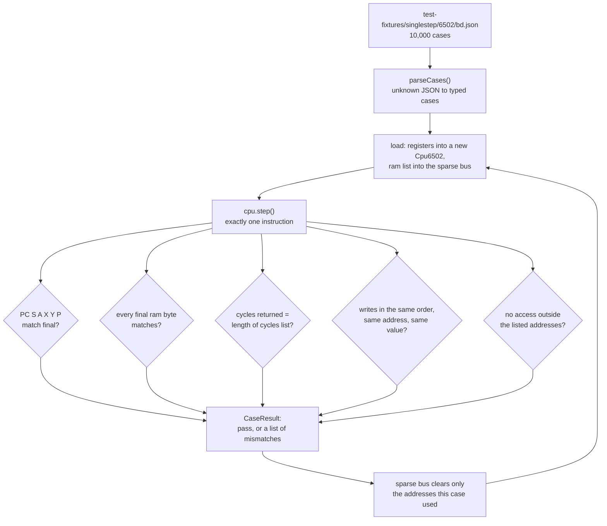
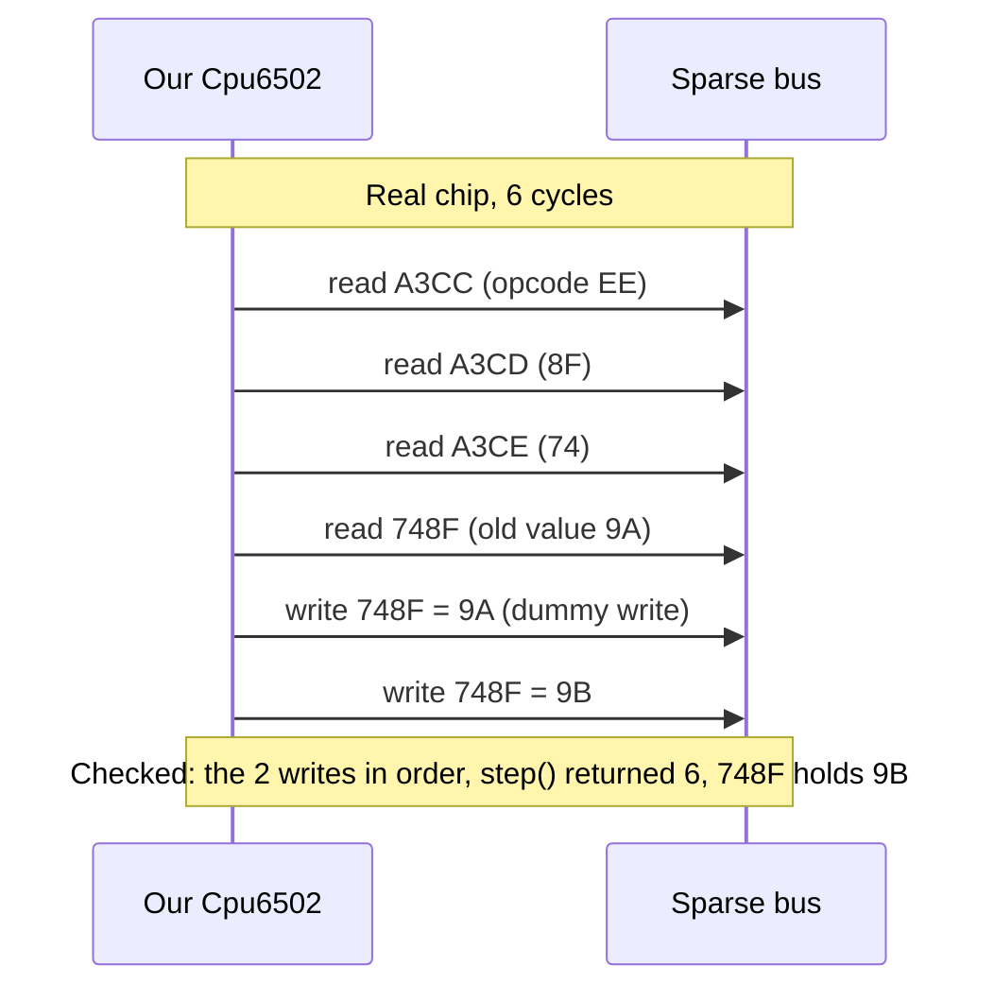

# Stage 19: Per-opcode validation

> **Part:** 2 (The 6502 CPU) · **Branch:** `stage/19-singlestep-validation` · **Needs:** 18
> **Status:** done

## Goal

Every test so far was written by us, from our own reading of the datasheets. If we misread the manual, the code and its test agree with each other and are both wrong. This stage checks the CPU against **somebody else's** answers: Tom Harte's *SingleStepTests*, which has 10,000 randomly generated cases for each opcode, each giving the complete state before and after **one** instruction. That's 1,510,000 cases for our 151 documented opcodes.

It comes now, at the end of the CPU, because it is the gate. From Part 3 on, the CPU runs the real MOS, and a wrong flag in an obscure case would then show up as "BASIC prints the wrong number" five stages later. Here it shows up as one opcode, one case, one field.

## What you can now see

**The short version: 151 of 151 opcodes, and 1,510,000 of 1,510,000 cases, pass on the first run.** None of the CPU code written in Stages 04–18 needed changing. The only bug this stage found was in the new test runner itself (see *Gotchas*).

### 1. Download the cases (once)

```bash
npm run fetch-fixtures        # same as: scripts/fetch-test-fixtures.sh
```

This takes about 2 minutes and fetches 151 files (≈590 MB) into `test-fixtures/singlestep/6502/`, which is gitignored. Re-running it skips files that are already there. To fetch a few opcodes only, run `scripts/fetch-test-fixtures.sh a9 69`.

### 2. Run the demo

```bash
npm run demo:singlestep             # all 151 opcodes, about 9 s
npm run demo:singlestep -- 69 e9    # just ADC # and SBC #, the decimal-mode ones
```

**Part 1** takes the first case of `INC &nnnn` apart:

```
── Part 1: one test case, taken apart ──
  "ee 8f 74" is the bytes at PC: INC &748F

  initial  PC=&A3CC A=&8A X=&E9 Y=&DA S=&A1 P=&6B nV--DiZC
           RAM &A3CC=&EE  &A3CD=&8F  &A3CE=&74  &748F=&9A  &A3CF=&44
  final    PC=&A3CF A=&8A X=&E9 Y=&DA S=&A1 P=&E9 NV--DizC
           RAM changes: &748F=&9B
  cycles   (what the real chip put on the bus, one line per clock)
           1 &A3CC &EE read
           2 &A3CD &8F read
           3 &A3CE &74 read
           4 &748F &9A read
           5 &748F &9A write
           6 &748F &9B write

  ✓ registers and P   ✓ 5 RAM bytes   ✓ 6 cycles   ✓ 2 writes in order   ✓ no stray access
    reads: we did 4, the chip did 4
```

**Part 2** is the table, with one line per opcode (abridged here):

```
── Part 2: 151 opcodes, 10,000 cases each ──
  op  instruction      passed        cycles  reads per case: ours / real (dummy reads skipped)
  00  BRK              ✓ 10000/10000       7  3.00 / 4.00  (1.00)
  06  ASL &nn          ✓ 10000/10000       5  3.00 / 3.00
  10  BPL &nnnn        ✓ 10000/10000     2-4  2.00 / 2.63  (0.63)
  …
  60  RTS              ✓ 10000/10000       6  3.00 / 6.00  (3.00)
  69  ADC #&nn         ✓ 10000/10000       2  2.00 / 2.00
  6C  JMP (&nnnn)      ✓ 10000/10000       5  5.00 / 5.00
  …
  BD  LDA &nnnn,X      ✓ 10000/10000     4-5  4.00 / 4.50  (0.50)
  …
  FE  INC &nnnn,X      ✓ 10000/10000       7  4.00 / 5.00  (1.00)

  151/151 opcodes, 1,510,000/1,510,000 cases passed in 8.8s.
  The real chip did 5,374,858 reads; we did 4,510,000. The other 864,858 are dummy reads we don't model.
```

Read the last column as the **parking-lot list of dummy reads, measured**. `RTS` skips 3 reads per instruction, `PLA`/`PLP`/`RTI` skip 2, and every implied-mode instruction (`CLC`, `TAX`, `NOP`) skips 1: its discarded read of the next byte. `ASL &nn` skips none: an RMW instruction's extra cycle is the dummy **write**, which we do model. A branch skips 0.63 per case on average, because only taken branches have dummy reads. Altogether that's 16% of the real chip's reads. Part 12's cycle-exact work would add them back.

If any case failed, its diff would be printed after the summary.

**Part 3** plants three bugs, one at a time, and shows the first failure of each:

```
  Bug: forget the page-crossing cycle  →  LDA &nnnn,X fails 4,955 of 10,000 cases
  ✗ bd a0 01   LDA &01A0,X   from PC=&3AFB A=&CE X=&A2 Y=&3F S=&7C P=&AC Nv--DIzc
      cycles        expected 5                got 4
    …

  Bug: "fix" the JMP (&xxFF) bug  →  JMP (&nnnn) fails 49 of 10,000 cases
  ✗ 6c ff 70   JMP (&70FF)   from PC=&2887 A=&23 X=&66 Y=&B2 S=&47 P=&24 nv--dIzc
      PC            expected &989D            got &009D
      stray access  expected none             got 1, first at &7100
    real bus:
      …
      4 &70FF &9D read
      5 &7000 &98 read

  Bug: decimal ADC sets Z from the decimal result (the 65C02 way)  →  ADC #&nn fails 34 of 10,000 cases
  ✗ 69 38 17   ADC #&38   from PC=&19FE A=&61 X=&0E Y=&9C S=&08 P=&A9 Nv--DizC
      P             expected &E9 NV--DizC     got &EB NV--DiZC
```

Each one fails a different part of the check:

- **The cycle count.** About half the cases cross a page, so about half fail.
- **PC, plus a stray.** The real chip read the high byte from `&7000` (the pointer's high byte wraps within its page, Stage 05). The "fixed" CPU read `&7100`, which no case lists, so it got `&00` and a stray. Only 49 cases out of 10,000 have a pointer ending in `&FF`.
- **One flag.** `&61 + &38 + C` is `&9A` in binary but `&00` in decimal (carry 1). The NMOS chip takes Z from the binary sum, so it reports Z = 0 with A = `&00`. Only 34 cases hit "decimal result is zero but binary isn't".

### 3. In Jest

```bash
npm test
```

`src/cpu/singlestep.test.ts` runs one Jest test per opcode, 151 in all, with all 10,000 cases each. It takes about 10 seconds, and the full suite about 13. Without the fixtures, the 151 tests show as **skipped**, with one line saying where the files should be and how to fetch them:

```
SingleStepTests: skipping 151 of 151 opcodes, test-fixtures/singlestep/6502/00.json and others not found. Run scripts/fetch-test-fixtures.sh to download them.
Tests:       151 skipped, 17 passed, 168 total
```

### What it settles

- **Stage 11's open question:** "Invalid-BCD results follow Clark's tutorial. Cross-check them against the real-hardware data in Stage 19." Settled. `ADC #` and `SBC #` include 4,173 and 4,180 cases with D = 1 and non-BCD inputs, and all of them match, flags included.
- **The JMP indirect bug, the RMW dummy write, JSR's push order, BRK's skipped padding byte, B and bit 5 in pushed P, and every page-crossing and branch cycle** all agree with an independent implementation.

## The real hardware

### What "testing against the hardware" can mean

There are three ways to know what a real 6502 does:

1. **The documentation.** The MCS6500 Programming and Hardware Manuals, the datasheet, and 6502.org's notes on what they don't say (decimal-mode flags, the `JMP (&xxFF)` bug, dummy cycles). That's what Stages 04–18 used.
2. **A logic analyser on a real chip**, clipped to the address bus, data bus and R/W pin, recording every cycle. This is the ground truth, but it's slow to set up and you only get the cases you thought to run.
3. **A reference implementation**, which is someone else's emulator that has itself been checked against 1 and 2, used to **generate** cases in bulk.

SingleStepTests are type 3. The repository's README says the generator "conforms to all available documentation, official and third-party; passes all other published test sets; and has been verified by usage in an emulated machine". So the data is not a recording from silicon. It is a **second opinion**, written independently of ours, which has been checked against real machines (and the Visual6502 transistor-level simulation, through those other test sets) far more than ours has. The plan for this stage calls them "real-hardware captures". That's loose wording, and it's corrected here.

If our CPU and the tests disagree, one of us is wrong, and the stage doc should say which and why. (As it turns out, they don't disagree at all. See *What you can now see*.)

### Which chip

The files we use are `6502/v1/`: the **NMOS 6502**, the chip in the Model B. The same repository has 65C02 sets (which differ on decimal flags, `JMP (&xxFF)`, BRK clearing D, and the undocumented opcodes) and the `nes6502` set (the NES's Ricoh 2A03, which has **no decimal mode**: `ADC` ignores D). Picking the wrong set is the first way to get a page of false failures.

### What the tests can see, and what they can't

Each case records three things:

| Section | What it is | Can our instruction-stepped CPU match it? |
|---|---|---|
| `initial` | PC, S, A, X, Y, P and every RAM byte the instruction touches | We load it |
| `final` | The same, after one instruction | **Yes**: compare every field |
| `cycles` | One entry per clock cycle: `[address, value, "read" or "write"]` | **Partly** |

The `cycles` list is a logic-analyser view of the bus. The 6502 does exactly one bus access per cycle, so its **length is the cycle count**, and we can check `step()`'s return value against it. The **writes** in it are in order, and we can check those exactly. Our CPU does every write the real chip does, including the read-modify-write *dummy write* (Stage 09) and the order of JSR's pushes (Stage 16). The **reads** we can't match one for one, because a real 6502 does reads it throws away, and we don't (the parking-lot items from Stages 02, 07, 09, 15 and 16). The runner counts them, so the table shows how many dummy reads we skip.

## Key concepts

### One instruction, from a known state, with nothing else going on

A "single-step" test is the smallest possible CPU test:

1. Set every register and every relevant byte of memory to known values.
2. Run **exactly one** instruction.
3. Compare every register and every byte of memory with the expected values.

Nothing else is running. There's no reset, no interrupt and no program around it. So when a case fails, there is only one instruction to blame, and only one starting state. Compare that with Stage 20's whole-program test, where a failure means "something, somewhere in 30 million cycles".

Here is a real case from `ee.json` (`INC &nnnn`), with the decimal numbers in the JSON turned into hex:

```
name     "ee 8f 74"              the three bytes at PC
initial  PC=&A3CC  S=&A1  A=&8A  X=&E9  Y=&DA  P=&6B (nV--DiZC)
         RAM: &A3CC=&EE  &A3CD=&8F  &A3CE=&74     INC &748F
              &748F=&9A                           the byte it increments
              &A3CF=&44                           (listed, never touched)
final    PC=&A3CF  P=&E9 (NV--DizC: N set, Z clear)  …the rest unchanged
         RAM: &748F=&9B
cycles   1  &A3CC  &EE  read    opcode
         2  &A3CD  &8F  read    address low
         3  &A3CE  &74  read    address high
         4  &748F  &9A  read    the old value
         5  &748F  &9A  write   ← the dummy write: the OLD value goes back first
         6  &748F  &9B  write   the new value
```

Six cycles, two writes, and N = 1 because `&9B` has bit 7 set. Every one of those facts is something we already decided in an earlier stage. This case checks all of them at once.

### Random testing: lots of cases, and some edges hit by luck

The 10,000 cases per opcode are **random**: random registers, random flags, random addresses, and random operand bytes. That gives wide coverage cheaply, but a rare edge is only hit as often as chance allows. For example:

- `69.json` (`ADC #`) has D = 1 in 4,962 cases, and 4,173 of those have an operand or A that **isn't valid BCD**, such as `&7F + &0C`. That's the territory where Stage 11 had to trust Clark's algorithm because the manuals say nothing. This is the cross-check the Stage 11 parking-lot item asked for.
- `bd.json` (`LDA &nnnn,X`) crosses a page in 4,955 cases, about half, because a random X is as likely as not to carry.
- `6c.json` (`JMP (&nnnn)`) has the pointer's low byte at `&FF`, the case with the famous bug (Stage 05), in only **49** of its 10,000 cases (10,000 ÷ 256 ≈ 39 expected). If that bug were rarer still, random testing could miss it. Hand-written edge-case tests (ours) and random bulk tests (these) **complement** each other. Neither replaces the other.

### A sparse bus: 64K that you clear in microseconds

Every case needs "the entire 64K is RAM" (the README). The naive approach makes a fresh `TestBus` per case. That's 1.5 million 64K arrays, about 100 GB of zeroing, and it's what made a first throwaway probe of this stage take 42 seconds.

But a case only touches about 3 to 10 addresses. So the **sparse bus** keeps one 64K array for the whole run, and remembers which addresses each case wrote into it. Clearing for the next case means zeroing just those. The same bookkeeping gives us a free extra check. The README says any address **not** in a case's `ram` list "must not be accessed". The sparse bus marks the listed addresses, and counts any access outside them as a **stray**. A stray means we read or wrote somewhere the real chip didn't (for example, a pointer read that forgot to wrap in zero page).

### Reading a failure

A failing case is printed as a **diff**: only the fields that differ, as expected versus actual, under the instruction and its starting state. For example, here is a CPU that forgot `LDA &nnnn,X`'s page-crossing cycle:

```
✗ bd a0 01   LDA &01A0,X   from PC=&3AFB A=&CE X=&A2 Y=&3F S=&7C P=&AC Nv--DIzc
    cycles        expected 5                got 4
  real bus:
    1 &3AFB &BD read
    2 &3AFC &A0 read
    3 &3AFD &01 read
    4 &0142 &43 read
    5 &0242 &10 read
```

To read it:

1. **Find the instruction and the inputs.** `&01A0 + X (&A2) = &0242`, which is in a different page from `&01A0`.
2. **Look at the field that differs.** One cycle is missing, and everything else is right: A got `&10`.
3. **Look at the bus.** Cycle 4 read `&0142`, which is the right low byte with the **old** high byte. The chip added X to the low byte, saw the carry, and spent cycle 5 fixing the high byte and reading again. That's the page-crossing penalty, and the dummy read we don't model.

## Diagrams

How one case is run and judged:



What one cycle list tells us, for `INC &748F` (the case above), and which parts our CPU produces:



## Our design

### Where it lives

```
scripts/fetch-test-fixtures.sh      downloads the 151 files (≈590 MB) into test-fixtures/ (gitignored)
src/cpu/singlestep.ts               DOM-free: case types, parseCases, SparseBus, SingleStepRunner, formatting
src/cpu/singlestep-files.ts         Node-only: where the files are, and reading one (fs)
src/cpu/singlestep.test.ts          the runner's own tests, then the 151-opcode suite (skips if absent)
scripts/demo-singlestep.ts          npm run demo:singlestep
```

### The types

```ts
/** [address, value]: one byte of a case's memory. */
export type RamEntry = readonly [address: number, value: number];
export type BusCycle = readonly [address: number, value: number, kind: 'read' | 'write'];

export interface CpuState {
  readonly pc: number; readonly s: number; readonly a: number;
  readonly x: number; readonly y: number; readonly p: number;
  readonly ram: readonly RamEntry[];
}

export interface SingleStepCase {
  readonly name: string;
  readonly initial: CpuState;
  readonly final: CpuState;
  readonly cycles: readonly BusCycle[];
}
```

`parseCases(json: unknown)` is the I/O boundary. It checks the shape of every case and throws on anything unexpected, with the case's index, so a corrupt download fails loudly rather than as 10,000 baffling mismatches. There's no `as` cast: the JSON is narrowed field by field.

### The runner

```ts
const runner = new SingleStepRunner();
const result = runner.run(testCase);   // CaseResult
result.mismatches;                     // [] when it passed
```

`SingleStepRunner` owns one `SparseBus` and makes a **new `Cpu6502` for every case**. A `Cpu6502` is a few fields, so it's cheap to make, and a fresh one can't carry anything over from the last case: a latched NMI, the IRQ line, `pageCrossed`, or the cycle total. The bus is the expensive part, so it's the part we reuse.

Loading P uses `unpackP` (bits 4 and 5 are ignored, as on the chip). Checking P uses `packP(regs, false)`. In the files, `p` always has bit 5 set and B clear. That's exactly what `packP(…, false)` makes, so all 8 bits can be compared with no masking.

A mismatch is `{ field, expected, actual }` with text values (`"&9B"`, `"6"`, `"&748F = &9B"`), so the diff printer doesn't need to know what kind of field it is. On a pass, `mismatches` is a shared empty array and nothing is allocated.

The runner can take a `step` function in place of `cpu.step()`. The tests and the demo use it to **plant a bug**, so you can see what a failure looks like. The CPU itself is unchanged.

### Alternatives considered

- **Comparing every read too.** That would need the dummy reads modelled first, which would mean a cycle-by-cycle CPU (Part 12). Comparing writes and the read *count* gets most of the value now.
- **Committing a sample of the cases** so the suite always runs. The cases are generated, not copyrighted like the ROMs, but 590 MB doesn't belong in git, and a 1% sample would mostly lose the rare edges. Our own hand-written tests already run everywhere. This suite is the extra check you run once the fixtures are downloaded.
- **One Jest test per case** (1.5 million tests). Jest's per-test overhead would dominate, and a failure would print thousands of lines. Instead it's one Jest test per opcode, which reports how many cases failed and diffs the first 3.

## Code walkthrough

**[`scripts/fetch-test-fixtures.sh`](../../scripts/fetch-test-fixtures.sh)** is pinned to commit `b7ed828` of `SingleStepTests/65x02`, so everyone tests against the same bytes. It writes each file to `xx.json.part` and renames it only when the download is complete. Without that, an interrupted run would leave a truncated file that looks present, and `parseCases` would then fail on it. The 151-opcode list is written out in the script, and [a test](../../src/cpu/singlestep.test.ts) checks it against `OPCODES`, so it can't drift.

**[`src/cpu/singlestep.ts`](../../src/cpu/singlestep.ts)** has four parts:

- **Parsing** ([`parseCases`](../../src/cpu/singlestep.ts#L123)). `unknown` goes in and typed cases come out, with no `as`. [`isInteger`](../../src/cpu/singlestep.ts#L73) is `typeof value === 'number' && (value & mask) === value`, which accepts exactly 0–`&FF` or 0–`&FFFF`. The error text (`case 12.final.ram[3]`) is built only when a check fails. The comments say why: see *Gotchas*.
- **[`SparseBus`](../../src/cpu/singlestep.ts#L151).** It holds `memory` and `listed` (two 64K `Uint8Array`s), a `touched` list of what to clear, and a write log in typed arrays. [`load(initial.ram, final.ram)`](../../src/cpu/singlestep.ts#L175) clears the last case and marks **both** lists as allowed. `read()` and `write()` count, and flag strays.
- **[`SingleStepRunner.run`](../../src/cpu/singlestep.ts#L298).** It makes a fresh `Cpu6502`, sets the registers, uses `unpackP(initial.p)`, runs one `step()` (or the planted-bug `StepFunction`), and compares. P is compared as [`packP(r, false)`](../../src/cpu/singlestep.ts#L336) against the file's byte, with all 8 bits and no mask. The mismatch list is created on the first difference, so a pass allocates nothing for mismatches. If `step()` throws (an unimplemented opcode), that's a failed case with field `step`, not a crash.
- **Summaries and diffs.** [`summariseOpcode`](../../src/cpu/singlestep.ts#L381) runs a file and keeps the first few failures. [`formatCaseDiff`](../../src/cpu/singlestep.ts#L422) prints the instruction (decoded with Stage 18's disassembler from the case's own RAM), the starting state, the mismatches and the real bus cycles.

**[`src/cpu/singlestep-files.ts`](../../src/cpu/singlestep-files.ts)** is the only file that touches `fs`: the paths, `existsSync`, and `loadSingleStepCases`. Keeping it separate keeps `singlestep.ts` loadable anywhere, browser included.

**[`scripts/demo-singlestep.ts`](../../scripts/demo-singlestep.ts)** has three parts. The [planted bugs](../../scripts/demo-singlestep.ts#L152) wrap `cpu.step()`: they peek at the opcode first (with `bus.peek`, which isn't counted as an access), then adjust the result afterwards. The CPU's own code is never touched.

## Tests

| Test file | What it proves |
|---|---|
| `src/cpu/singlestep.test.ts` · parseCases | A well-formed case parses to exactly the typed value. A non-array file, an out-of-range `final.a`, and a cycle of kind `"fetch"` are rejected, with the case number and field named. |
| · SparseBus | It's 64K of masked RAM that counts reads and writes and logs writes in order. Any access outside the listed addresses is a stray, and the first one is remembered. `load()` clears the last case's bytes, including stray writes, plus the counters. |
| · SingleStepRunner | The real `INC &748F` case passes: registers, memory, 6 cycles, both writes, and 4 of 4 reads. Each kind of difference is reported as expected vs actual: a register, P (expecting B set fails), a memory byte, the cycle count, a **missing dummy write** (memory right, bus wrong), and a stray access. A latched NMI doesn't leak into the next case. An unimplemented opcode is a failed case, not a crash. |
| · summariseOpcode / formatCaseDiff | Counting, keeping only the first N failures, and the cycle range. The diff names the instruction, the starting state, the field, and the real bus cycles. |
| · fetch script | Its opcode list is exactly the CPU's 151 implemented opcodes. |
| · SingleStepTests (NMOS 6502, v1) | **151 tests, one per opcode: all 10,000 cases match** registers, P, memory, cycle count, writes, and no strays. Each **skips** when its file is missing, with one console line naming the path and the fetch script. |

Gate: `npm test` (47 suites, 1,714 tests, about 13 s with the fixtures), `npm run typecheck`, and `npm run lint`, all green.

## Gotchas & hardware quirks

- **Write-only addresses are only in the `final` list.** The first full run reported 17 failures, all `STA &nnnn,X` and similar, all "stray access". A store's target has no starting value worth giving, so the generator lists it only in `final.ram`. The README's "addresses not included in a test's ram lists" means *either* list. That was a bug in our runner, not the CPU, and it's the most common way a test harness lies to you. When a whole class of cases fails in the same way, suspect the harness first.
- **Under Jest, globals are slow.** The first Jest run took 49 s, against about 9 s for the same work under `tsx`. A CPU profile (`node --cpu-prof node_modules/.bin/jest -i …`) put the time in `isInteger` and `Array.isArray`. Jest runs each test file in its own sandbox, and reaching `Number`, `Array` or `Math` from there goes through the sandbox's global object, which costs something every time. With about 300,000 numbers per file, that added up. The fix was to look `Array.isArray` up once at module level and replace `Number.isInteger` with `(value & mask) === value`. Building `"&748F"` labels only for wrong bytes helped too. The suite went from 49 s to 10 s. The CPU's own hot path doesn't touch globals, which is why the runs themselves were already fast. Stage 20's benchmark is the place to measure the CPU properly.
- **P has no B.** Every P in the files (all 3,020,000 of them) has bit 5 = 1 and B = 0, which is what you'd see if you pushed it from an interrupt. Comparing `packP(regs, false)` against it checks all 8 bits honestly. A runner that compared `packP(regs, true)`, or masked nothing on the input side, would invent failures.
- **Pick the right chip's set.** `6502/v1` is the NMOS 6502. `65c02` differs on decimal flags and `JMP (&xxFF)`, and `nes6502` has no decimal mode. Running the wrong set gives thousands of "failures" that are correct behaviour for our chip.
- **Random tests hit rare edges rarely.** `JMP (&xxFF)` is exercised by only 49 cases, and "decimal result zero, binary not" by only 34. If the edge were rarer still, 10,000 random cases might miss it entirely. Our hand-written edge tests from Stages 05 and 11 still matter.
- **What isn't checked.** The reads aren't compared one for one, because we don't model dummy reads (864,858 of them, which is 16%), and the cycles are only counted, not checked in order. The interrupt *sequence* isn't covered either: the tests are single instructions with no IRQ or NMI, so only `BRK` exercises `enterInterrupt`. Stage 17's own tests remain the check for IRQ/NMI.
- **The data is a reference model, not silicon.** See *The real hardware*. "All pass" means we agree with the best-checked independent 6502 model available, not that we've been tested against a logic analyser.

## Playwright verification

n/a. This is a CLI and Jest stage, with no browser surface.

## Check your understanding

1. A case for `STA &1234` lists `&1234` in `final.ram` but not in `initial.ram`. Why, and what would go wrong if the sparse bus only allowed the initial addresses?
2. Our CPU does 4.51 million reads where the real chip did 5.37 million, yet every case passes. Why don't the missing reads make any case fail, and when in this project *will* a missing dummy read matter?
3. `JMP (&nnnn)` fails only 49 of 10,000 cases when its bug is "fixed". Why that number? What does it tell you about relying on random tests alone?
4. Why does the runner make a new `Cpu6502` for every case, but reuse one bus? What could leak between cases if it reused the CPU?
5. In the `ADC #&38` planted-bug case, A = `&61`, C = 1 and D = 1. Work out the result by hand: A, and why the NMOS chip leaves Z = 0.

<details>
<summary>Answers</summary>

1. A store only writes its target, so the target's starting value doesn't matter, and the generator lists it only where it's meaningful: in the final state. A bus that allowed only the initial addresses flags the store's own write as a stray, so every store case fails. That's exactly the 17 false failures in the first run.
2. A dummy read on RAM has no side effect: the value is discarded and the memory unchanged, so registers, memory, cycle count and writes all still match. It matters once a read *does* something: the I/O registers in SHEILA (Stage 21 on). For example, an indexed store whose dummy read lands on a VIA register, and so clears an interrupt flag or a latch the program never meant to touch (Stages 24–26). That's the Stage 07 parking-lot item.
3. The bug only shows when the pointer's low byte is `&FF`. The operand bytes are random, so that happens in about 1 case in 256: 10,000 ÷ 256 ≈ 39, and this file happens to have 49. An edge case's coverage is only as good as its probability. A rarer edge (needing two specific bytes, say: about 1 in 65,536) would probably not appear in 10,000 cases at all. Hand-written edge cases and random bulk tests do different jobs.
4. The bus is a 64K buffer, so allocating it 1.5 million times would be the slow part (about 100 GB of zeroing), and the sparse clear makes reuse safe. The CPU is a handful of fields and costs almost nothing to make. A reused CPU could carry over `nmiPending`, the `irq` line, the NMI edge detector's last level, `pageCrossed`, and the running `cycles` total. Any of those could make the next case behave differently from its stated starting state.
5. Low nibble: 1 + 8 + 1 = 10, which is over 9, so it becomes 0 with a carry into the high nibble. High nibble: 6 + 3 + 1 = 10, which becomes 0 with C = 1. So A = `&00` and C = 1. The NMOS 6502 computes Z from the **binary** sum, `&61 + &38 + 1 = &9A`, which isn't zero, so Z = 0, even though A ends up as `&00` (Stage 11). The 65C02 fixed this, and the planted bug imitates it.

</details>

## Further reading

- SingleStepTests 65x02: [repository](https://github.com/SingleStepTests/65x02), with the [6502 README](https://github.com/SingleStepTests/65x02/blob/main/6502/README.md) for the JSON format and the methodology statement.
- Visual6502 ([visual6502.org](http://www.visual6502.org/)): the transistor-level simulation that much of the "real chip" knowledge comes from, including the dummy cycles.
- *64doc* (John West and Marko Mäkelä): a cycle-by-cycle table of every 6502 addressing mode, which is where the dummy reads in the `cycles` lists come from. It's on 6502.org.
- Bruce Clark, "Decimal Mode" (6502.org tutorials): the NMOS flag behaviour now confirmed by `69.json` and `e9.json`.
- Next: Stage 20 runs Klaus Dormann's functional test, a whole program that checks itself, and measures how fast the CPU really is.
