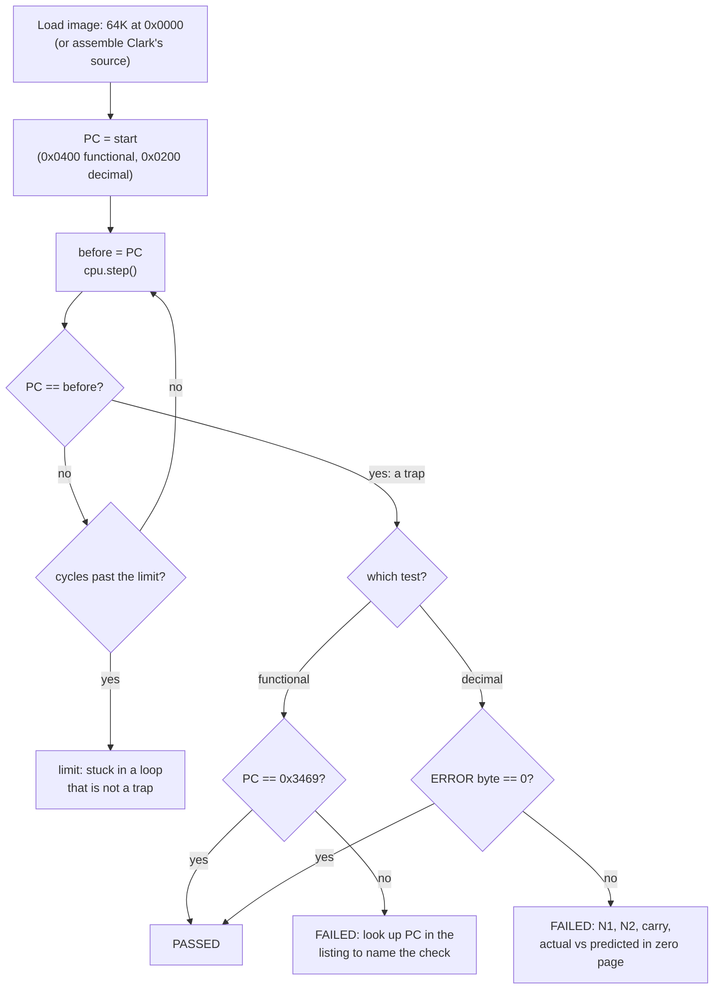
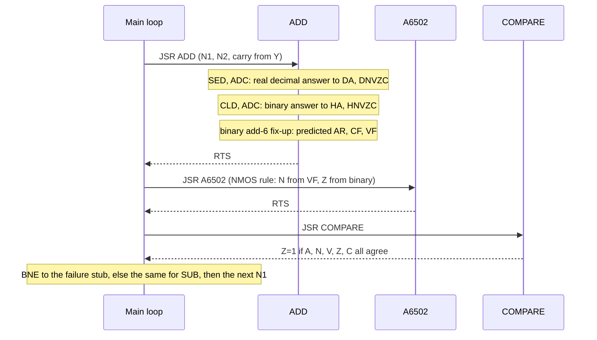

# Stage 20: Whole-CPU validation & speed

> **Part:** 2 (The 6502 CPU) · **Branch:** `stage/20-functional-validation` · **Needs:** 19
> **Status:** done

## Goal

Stage 19 checked the CPU **one instruction at a time**: set up a state, run one opcode, then compare. This stage checks it **as a whole**. It runs two complete 6502 programs that test the CPU *from the inside*. Each program does millions of instructions and checks its own answers. If anything is wrong, it stops in a loop at the place where it noticed.

- **Klaus Dormann's functional test** is 13 KB of 6502 code that works through every documented opcode and addressing mode, the flags, the stack, BRK and RTI, and decimal mode.
- **Bruce Clark's decimal test** adds and subtracts every pair of bytes in decimal mode, both carries, invalid BCD included. It predicts each answer with *binary* arithmetic and compares.

The second half of the stage is **speed**. Once the CPU is known to be right, we measure how fast it runs ("effective MHz") and compare that with the real machine's 2 MHz. Then we look at what in the hot path makes it fast or slow.

It comes here, at the very end of Part 2, because it's the last gate before the CPU starts running the real MOS (Part 3). After this stage the CPU code should not need to change again until the optional cycle-exact extras.

## What you can now see

**The short version: both whole-CPU tests pass on the first run, with no CPU changes.** Dormann's functional test reaches its success trap after 96,241,367 cycles. Clark's decimal test passes with all four flags checked. The CPU runs at about **80 MHz, 40× a real Model B**.

### 1. Download the functional test (once)

```bash
npm run fetch-fixtures        # now also fetches test-fixtures/dormann/ (0.8 MB)
```

If you already have the SingleStepTests files, this only downloads the two new Dormann files. The decimal test needs no download: it's assembled from source.

### 2. Run the demo

```bash
npm run demo:functional       # about 30 s, most of it Part 4's slowest variant
```

**Parts 1 and 2** are the plan's "See it" lines:

```
── Part 1: Klaus Dormann's 6502 functional test ──
  64 KB image, PC = &0400, run until PC stops moving...
  PASSED: success trap at &3469
  functional test PASSED in 96,241,367 cycles (30,646,177 instructions)
  1.11 s here; 48.1 s on a real 2 MHz Model B
  running at 86.4 MHz (43.2× real speed)

── Part 2: Bruce Clark's decimal test (assembled from source by our Stage 08 assembler) ──
  checking A C N V Z  PASSED: 53,953,828 cycles, 17,609,916 instructions  (80.4 MHz (40.2× real speed))
  checking A C        PASSED: 46,089,508 cycles, 14,464,188 instructions  (84.7 MHz (42.3× real speed))
```

**Part 3** plants two bugs so you can see what a failure looks like:

```
  Bug 1: BIT forgets to copy bit 6 of memory into V.
  functional test: FAILED: trapped at &1B94 in test &19
  after 96,358 cycles. The listing's source leading up to that address:
                                    set_a $ff,0
    1b75 : 2416                     bit zp1+3   ;00 - should set Z / clear  NV
                                    tst_a $ff,fz
                                    set_a 1,0
    1b89 : 2415                     bit zp1+2   ;41 - should set V (M6) / clear NZ
                                    tst_a 1,fv
    1b94 : d0fe            >        bne *           ;failed not equal (non zero)

  Bug 2: decimal ADC sets Z from the decimal result, as a 65C02 does (not an NMOS 6502).
  checking A C N V Z  FAILED: ERROR = 1 (ADC was wrong), trapped at &024B
    the case:   &99 + &00 with C=1, in decimal mode
    actual:     A=&00  NVZC NvZC
    predicted:  A=&00  NVZC NvzC
  checking A C        PASSED: 46,089,508 cycles, 14,464,188 instructions
```

Read bug 1 from the bottom up. The trap at `&1B94` is in the checking code expanded from `tst_a 1,fv` ("A should be 1, the flags should be V"). The line above it says what was tested: `BIT zp1+2` on the byte `&41`, which "should set V (M6)". The trap address leads you straight to the broken instruction, after only 96,358 cycles.

Bug 2 is the reason we check every flag. `&99 + &00 + 1` in decimal is `&00` carry 1. The NMOS 6502 takes Z from the *binary* sum `&9A`, so Z = 0. The 65C02 (and the bug) say Z = 1. With Dormann's default "A and C only" switches, the bug **passes**.

**Part 4** is the speed table (explained in Key concepts §4 and §5):

```
  cpu.step() alone                            1203 ms   80.0 MHz (40.0× real speed)  1.00× the time
    → one 20 ms frame's 40,000 cycles take 0.50 ms: 2.5% of the frame, the rest is left for video, sound and the browser
  + Tracer.record (typed arrays)              2045 ms   47.1 MHz (23.5× real speed)  1.70× the time
  + the same record, as an object per step    2323 ms   41.4 MHz (20.7× real speed)  1.93× the time
  + a small object per step, thrown away      1273 ms   75.6 MHz (37.8× real speed)  1.06× the time
  + a closure per step                       13287 ms   7.2 MHz (3.6× real speed)    11.05× the time
```

Your numbers will differ. The ratios are the point.

### 3. In the test suite

`npm test` runs both whole programs every time: about 1.5 s for the functional test and 0.5 s per decimal run under Jest. The functional test skips with a message if `test-fixtures/dormann/` is missing. The decimal test never skips.

## The real hardware

There's no new hardware in this stage. The "hardware" is the 6502 itself, seen from a test program's point of view, and one number from the BBC Micro's design:

- **The Model B's 6502 runs at 2 MHz**, 2,000,000 clock cycles a second (the CPU clock is divided down from the board's 16 MHz master crystal). Most 6502 machines of the time (Apple II, C64, Atari) ran at about 1 MHz. The BBC could run at 2 MHz because its RAM was fast enough for the CPU and the video system to take turns on alternate half-cycles.
- **One PAL frame lasts 20 ms** (50 Hz), so the real CPU does **40,000 cycles per frame**. That's the budget the emulator has to beat. In each 20 ms of real time we must run 40,000 emulated cycles *plus* everything else: video, sound and the browser.
- Some slow peripherals (the 1 MHz bus at FRED/JIM/SHEILA) stretch an access to 1 MHz. That's Stage 27's problem, not this one. Here every cycle is a 2 MHz cycle.

## Key concepts

### 1. Unit tests vs. a self-checking program

Stage 19's cases are **unit tests**. Each one is an exact before and after for one instruction, so a failure points at one opcode and one field. But each case is *isolated*. Every case starts from a freshly made state, so nothing tests what happens when instructions **interact**:

- A flag set by one instruction and consumed by another (a `CMP` followed by a `BCS`).
- The stack across a `JSR`/`PHA`/`PLA`/`RTS` sequence, or a `BRK` whose handler does an `RTI`.
- Self-modifying code, where `STA` writes into the next instruction's operand.
- Long-running state such as the cycle counter, or S wrapping.

A **self-checking program** is the opposite. It's an ordinary 6502 program that knows the right answers. It does something, then checks the result with *other* instructions. Here is the start of the functional test's compare section, straight from Dormann's listing (address, bytes, source):

```
058D  C0 01      CPY #1          ; Y is 1 here, so Z=0...
058F  D0 03      BNE test_bne    ; ...and BNE must branch over the trap
0591  4C 91 05   JMP &0591       ; trap: "failed anyway"
0594  A9 00      test_bne: LDA #0
0596  C9 00      CMP #0          ; 0 - 0: expect Z=1 and C=1
0598  D0 FE      BNE &0598       ; trap if Z=0
059A  90 FE      BCC &059A       ; trap if C=0
```

There's nothing outside the CPU checking its work. The *CPU checks itself*. The weakness is obvious: the checking instructions (`CMP`, `BNE`) might be broken too. Dormann's test deals with this by **bootstrapping**. The first sections test the branches and compares using as little else as possible, and every later section builds only on instructions that have already been proved.

### 2. Traps: how a 6502 program "fails"

A 6502 program has no `exit(1)` and no console. So how does it report a result? Dormann's answer is the **trap**: an instruction that jumps to itself.

```
&3469  4C 69 34   JMP &3469     ; "success": a JMP to its own address
&0598  D0 FE      BNE &0598     ; a failure trap: branch offset &FE = -2, back onto itself
```

Look at `BNE &0598`, which is `D0 FE`. After the 2 fetches, PC is `&059A`, and adding the offset `&FE` (−2) gives `&0598` again. If Z = 0 the CPU branches back to the same `BNE`, again and again, forever. A real 6502 running this would sit there with PC frozen, which is just what you'd see on a logic analyser.

So the runner's whole job is:

1. Load the image, set PC to the start (`&0400`).
2. Step, step, step. After each step, **did PC stay where it was?** If so, we're in a trap.
3. If the trap is at the **success** address (`&3469`), the test passed. Anywhere else, it failed, and *the address tells you which check failed*. Dormann ships an assembler **listing** (`.lst`) with the source line for every address, so `&0598` turns straight into "`bne * ;failed not equal`, just after `CMP #0`". The test also keeps a **test number** in `&0200` (`test_case`), bumped at the start of each section, so a failure report can say "in test &02" as well.

"PC didn't change" is the right signal because no correct instruction leaves PC where it was. Every instruction moves PC past its own bytes, *except* a jump or branch to itself.

### 3. Why decimal mode gets its own test

Dormann's functional test checks decimal mode only for **valid BCD** and only for the **documented** flags (A and C). That makes sense for a test meant to run on the 65C02 as well. But the NMOS 6502 that the BBC uses has a precise behaviour for invalid BCD (`&0F + &01`) and for N, V and Z in decimal mode, and software can depend on it. Stage 11 built that behaviour from Clark's tutorial, and Stage 19 confirmed it, one instruction at a time.

**Bruce Clark's decimal test** (6502.org, *Decimal Mode*, Appendix B) is a 6502 program that runs all 2 × 256 × 256 = **131,072** `ADC`s and the same number of `SBC`s. For each one it:

1. Does the real decimal `ADC`/`SBC` (with `SED`) and saves A and P.
2. Works out what the answer *should* be, using only **binary** instructions (`CLD`, then `AND #&0F`, `CMP #&0A`, `ADC #5`, …). It's Stage 11's add-6 algorithm, written in 6502 code instead of TypeScript.
3. Compares the two, and stops at the first difference with the numbers left in zero page.

The program is public domain. Dormann's copy has switches to check only some flags, and **by default it checks only A and C**, the documented ones. We run it with **all four flags checked** (N, V, Z and C), as Clark wrote it, because the BBC's CPU is an NMOS 6502 and we've implemented the NMOS flag behaviour. Later, one of the demo's planted bugs shows why that matters: a bug that only affects Z is invisible in "A and C only" mode.

We write it in **our own assembler's syntax** (Stage 08) and assemble it at run time. So it needs no download and *always* runs, and it exercises the assembler on a real 6502 program written by someone else.

### 4. Speed: what "fast enough" means

The emulator's speed is easy to state: **effective MHz** = emulated cycles ÷ real seconds ÷ 1,000,000. On this machine (a MacBook Pro), Dormann's 96,241,367 cycles take about 1.1–1.2 s, which is about **80–86 MHz, or 40–43× real speed**. The real Model B would take 48 s to run the same test.

Why measure it now, while the CPU is all there is? Because **every later stage adds work to every cycle**. The CPU will soon tick a VIA, a CRTC, a ULA and a sound chip, and draw pixels. The 20 ms budget is per frame:

| per 50 Hz frame | real Model B | our CPU at ~80 MHz |
|---|---|---|
| CPU cycles to run | 40,000 | 40,000 |
| time they take | 20 ms (all of it) | ≈ 0.5 ms |
| time left for video, sound, browser | – | ≈ 19.5 ms |

So the CPU alone uses about **2.5% of the frame**. That headroom is what we spend later. If the CPU only managed 4 MHz, half of every frame would go on the CPU alone.

### 5. Hot-path hygiene, measured

`cpu.step()` runs **30 million times** in the functional test. Anything done once per instruction is multiplied by 30 million. `CLAUDE.md` says "the hot path has no per-instruction allocation". This stage *measures* that rule, and the result is more interesting than the rule.

Part 4 of the demo runs the same functional test five ways, adding one thing before every `cpu.step()`:

| added before each step | time | |
|---|---|---|
| nothing | 1.20 s | 1.00× |
| Stage 18's `Tracer.record` (typed arrays) | 2.05 s | 1.70× |
| the same record as a **new object** per step, kept in a ring | 2.32 s | 1.93× |
| a small object per step, **thrown away** | 1.27 s | 1.06× |
| a **closure** (a little arrow function) made per step | 13.3 s | **11×** |

What it shows:

- **An object that never leaves the function costs almost nothing.** V8 (the JavaScript engine in Node and Chrome) does *escape analysis*. If it can prove an object never escapes, it keeps the fields in registers and never allocates it.
- **An object that's kept does cost something, but less than you might fear.** Recording the trace as objects is about 13% slower than Stage 18's typed arrays (2.32 s vs 2.05 s). V8's young-generation garbage collector is very good at short-lived objects. So typed arrays are a real win, but a modest one.
- **Most of what tracing costs is the work itself.** `Tracer.record` peeks 3 bytes through the bus, calls `packP`, asks `pendingInterrupt` and writes 7 arrays. That's comparable to running a simple instruction, so the time goes up by 70%. This answers Stage 18's parking-lot question: tracing during Run costs about 1.7× here, which is affordable at 40× real speed. Only trace on demand if we need the speed later.
- **The surprise is the closure: 11×.** Writing `const peek = (o) => cpu.bus.read(...)` inside the step function creates a new function object every step. It also makes V8 store the captured variable (`cpu`) in a heap "context" instead of a register, and here that clearly stopped V8 from optimising the function well. We measured *that* it's slow. We haven't proved *why* in V8's internals, so treat the explanation as likely rather than certain. The rule to take away: **don't create functions inside the hot path**. Make them once, outside, as `Tracer` does with its `peek`.

Two more habits the core already follows, which this stage didn't measure separately:
- **Same-shaped objects at a call site.** Every opcode-table entry has the same fields, and every `execute` has the same signature. V8 optimises a call site best when it always sees one shape ("monomorphic").
- **Small integers, masked.** `& 0xff` and `& 0xffff` keep values as 31-bit integers, which V8 stores unboxed ("Smis").

**A caveat about benchmarks:** they're noisy in a JIT-compiled language. The first run includes compiling, and the garbage collector runs when it decides to. So the demo runs each variant twice and keeps the best time. The *ratios* are reliable, but the absolute MHz varies by a few percent from run to run and a lot from machine to machine. It runs under `tsx`, not Jest, because (Stage 19's parking lot) Jest's sandbox slows some things down several times.

## Diagrams

How the runner finds the end of a self-checking program:



Clark's decimal test, one pass of its inner loop:



## Our design

New, all under `src/cpu/`, and all DOM-free:

- **`run-to-trap.ts`**: `runToTrap(cpu, maxCycles, step?)` steps until PC stops moving, or until a cycle limit. It returns `{ kind: 'trap' | 'limit', pc, cycles, instructions }`. The loop allocates nothing. The result object is made once, at the end. The optional `step` is Stage 19's `StepFunction`, so the demo can plant bugs the same way.
- **`dormann.ts`**: constants read from Dormann's listing (`FUNCTIONAL_TEST_START = 0x0400`, `FUNCTIONAL_TEST_SUCCESS = 0x3469`, `FUNCTIONAL_TEST_CASE = 0x0200`), `runFunctionalTest(image, step?)`, and small parsers for the `.lst`: `listingSuccessAddress(lst)` (so a test can check our constant against the file), `listingContext(lst, address)` (the raw lines before a trap) and `listingSource(lst, address)` (the same without macro expansions, which is what a person wants to read).
- **`dormann-files.ts`**: the Node-only loader (`fs`) for `test-fixtures/dormann/`, kept apart as Stage 19 did with `singlestep-files.ts`.
- **`decimal-test.ts`**: `decimalTestSource(checks)` returns Clark's program in our assembler syntax. `checks` picks which flags to compare, as Dormann's switches do. `runDecimalTest(checks, step?)` assembles it with Stage 08's `assemble()`, loads it into a `TestBus`, runs it to its trap, and reads the result from zero page. One change from Clark: a failure stores `1` in `ERROR` if `ADC` was wrong and `2` if `SBC` was, so the report can say which.
- **`speed.ts`**: `effectiveMhz(cycles, ms)`, `realSpeedMultiple`, `frameShare` and `formatSpeed(...)`, pure maths for the report. Timing itself (`performance.now()`) happens only in the demo, so the core stays deterministic.

`scripts/fetch-test-fixtures.sh` gains Dormann's `6502_functional_test.bin` and `.lst`, pinned to commit `7954e2d`. The `.bin` is a complete 64 KB memory image: code at `&0400`, data at `&0200`, and its own vectors at `&FFFA`–`&FFFF` (the IRQ/BRK vector points into the test so it can check `BRK`). So it runs on Stage 02's flat `TestBus`, with no BBC memory map.

**A deviation from the plan:** the plan says both tests skip without fixtures. Only the functional test can, because the decimal test is built from our own source and is always there.

**Alternatives considered:**
- *Fetch Dormann's `.a65` source for the decimal test and assemble it.* It's written for the `as65` assembler, with `if`/`endif`, macros and segments, which our assembler doesn't have. Porting 100 lines of public-domain code by hand is clearer than building a second assembler front end.
- *Detect traps by watching for `JMP *`/`B.. *` opcodes.* "PC didn't move" is simpler and catches every kind of trap, including ones we haven't thought of.

## Code walkthrough

**[`src/cpu/run-to-trap.ts`](../../src/cpu/run-to-trap.ts).** This is the whole idea of the stage in ten lines:

```ts
while (cycles < maxCycles) {
  const before = r.pc;
  cycles += step(cpu);
  instructions++;
  if (r.pc === before) return { kind: 'trap', pc: before, cycles, instructions };
}
```

Remember PC, step, compare. The cycle limit protects against a "loop that isn't a trap" (two instructions jumping to each other, say) hanging the test suite. `step` defaults to `cpu.step()`. Tests and the demo pass a wrapper with a planted bug, using Stage 19's `StepFunction` type.

**[`src/cpu/dormann.ts`](../../src/cpu/dormann.ts).** `runFunctionalTest` copies the 64 KB image into a `TestBus`, sets `PC = &0400` and runs to the trap. There's no `reset()`. The image's own RESET vector points at `res_trap` (`&37A3`), a trap that catches an unexpected reset. The code at `&0400` sets itself up (`CLD`, `LDX #&FF`, `TXS`). The listing helpers match lines of the form `0598 : d0fe   >   bne *`, where an address, a colon and *at least one* byte mean the line is code.

**[`src/cpu/decimal-test.ts`](../../src/cpu/decimal-test.ts).** `decimalTestSource(checks)` is a template string. Clark's labels, comments and instruction order are kept, so you can read it next to his tutorial. The zero-page layout lives in one `as const` object, `DECIMAL_TEST_ZP`, that both the source (as `N1 = &00` lines) and the result reader use. `runDecimalTest` assembles the source, runs it, and reads N1, N2, DA, AR, DNVZC and the predicted-flag bytes back out of zero page. Y holds the carry-in at the moment of failure, because the outer loop counts Y from 1 down to 0.

**[`src/cpu/speed.ts`](../../src/cpu/speed.ts).** This is the arithmetic only. `CYCLES_PER_FRAME = 2,000,000 × 20 / 1000 = 40,000`.

**[`scripts/demo-functional.ts`](../../scripts/demo-functional.ts).** The only place that reads the clock (`performance.now()`). The benchmark variants are ordinary `StepFunction`s. Note how `withTracer` builds its `Tracer` (and the `peek` arrow function) **once**, on the first step, while `withClosures` builds a new arrow function **every** step. That one difference is the 11×.

**[`scripts/fetch-test-fixtures.sh`](../../scripts/fetch-test-fixtures.sh).** It gains a `fetch` function shared by both suites. Because it's called as an `if` condition, where bash ignores `set -e`, it exits the script itself if `curl` fails.

## Tests

| Test file | What it proves |
|---|---|
| `src/cpu/run-to-trap.test.ts` | `JMP *` and a taken `BEQ *` (`F0 FE`) trap; an untaken branch doesn't; a 2-instruction loop runs to the cycle limit; counts are per call; a planted step function changes the outcome. |
| `src/cpu/dormann.test.ts` | Listing parsing on real lines: the success address is the *expanded* `jmp *`, not the macro definition; label-only and `=` lines aren't code; `listingSource` drops macro expansions. Stand-in 64K images give PASSED and FAILED, and test_case is read from `&0200`. **With the fixture:** our `&3469` matches the listing, and the real test passes in exactly 30,646,177 instructions and 96,241,367 cycles. *Skips if `test-fixtures/dormann/` is missing.* |
| `src/cpu/decimal-test.test.ts` | The source assembles (`LDY #1` at `&0200`, `ADC N2H,X` as zero page,X `&75`); flag checks switch on and off. Our CPU passes with all flags. The instruction and cycle *difference* between the two configurations equals the hand-worked 12 instructions and 30 cycles × 262,144 compares. A 65C02-style Z bug fails at `&99 + &00 + C` with all flags checked and passes with A and C only. A decimal SBC with no fix-up fails as error 2. |
| `src/cpu/speed.test.ts` | 40,000 cycles per frame; 2 MHz is 1× real speed; formatting; zero time is an error. |

1,741 tests in total, all green, along with typecheck and lint.

## Gotchas & hardware quirks

- **Two bugs found, both in the new listing parser, none in the CPU.** First, a label-only line (`0594 :                  test_bne`) matched as code because the bytes column was allowed to be empty, so the trap's context pointed at a label instead of the `LDA #0` after it. Second, the text `jmp * ;test passed` appears *twice* in the listing: in the `success` macro's definition (no address) and in its expansion at `&3469`. The first version found the definition and returned undefined. Both are now tests.
- **My first guess at the benchmark lesson was wrong.** I expected "allocating an object per step" to be the big cost and wrote it in the doc first. The measurements said otherwise: a thrown-away object is nearly free, a kept one is modest, and the 11× came from a closure. The doc now says what was measured.
- **The exact instruction and cycle counts are measured, not independent.** They're there to catch a future change that alters timing anywhere. The *difference* between the two decimal configurations is the independent check, worked out by hand.
- **Don't RESET into the functional test.** Its RESET vector points at a trap on purpose. Set PC to `&0400` instead.
- **"PC didn't move" isn't perfect.** A correct program could, in principle, contain a deliberate `JMP *` wait-for-interrupt loop. Dormann's test doesn't (it's run with interrupts off), and an interrupt would move PC anyway.
- **What the functional test doesn't cover:** IRQ and NMI (those need Dormann's separate `6502_interrupt_test` and a "feedback register" device that raises them on request), the undocumented opcodes, dummy reads, and cycle-by-cycle bus timing. They're in the parking lot or Part 12.
- **The decimal test's prediction relies on binary ADC/SBC, CMP, branches and PHP/PLA being right.** If binary `ADC` were broken, the prediction could be wrong in the same way as the answer. That's why it runs *after* Stage 19 and Dormann's test have proved those instructions.

## Playwright verification

n/a: this is a CLI-only stage, and no workbench changes were made.

## Check your understanding

1. A test program traps at `&0598` with bytes `D0 FE`. What instruction is that, why does it loop, and what does the runner conclude?
2. Why does Dormann's functional test start with `PC = &0400` instead of a RESET?
3. Our CPU passes the decimal test with "A and C only" even with the 65C02-style Z bug planted. Why, and why does that matter for a BBC Micro emulator?
4. The demo says the CPU uses 2.5% of each 20 ms frame. Where do 40,000 and 2.5% come from?
5. In Part 4, why is "a small object per step, thrown away" almost free, while "a closure per step" costs 11×? What rule does that give us for the hot path?

<details>
<summary>Answers</summary>

1. `BNE &0598`, a branch with offset `&FE` (−2). After fetching 2 bytes, PC is `&059A`, and −2 takes it back to `&0598`. If Z = 0 it branches to itself forever. The runner sees PC unchanged after a step, so it's a trap. It isn't `&3469`, so the test FAILED, and the listing at `&0598` says which check failed (`CMP #0` didn't set Z).
2. Its RESET vector (`&FFFC`) deliberately points at `res_trap`, which catches an unexpected reset. The test is entered at `code_segment` (`&0400`), where it sets up D and S itself (`CLD`, `LDX #&FF`, `TXS`).
3. The bug only changes Z, and Z in decimal mode isn't checked in that configuration. That's fine for a test meant for 65C02s too, but the BBC's CPU is an NMOS 6502, and software can (rarely) rely on its decimal-mode N/V/Z. So we check all four flags, as Clark wrote the test.
4. 2,000,000 cycles/s × 0.020 s = 40,000 cycles per frame. At about 80 MHz, 40,000 cycles take 40,000 ÷ 80,000,000 = 0.5 ms, and 0.5 ÷ 20 = 2.5%.
5. V8 can prove the thrown-away object never escapes the function (escape analysis), so it never allocates it. A new closure is a new function object, and it also forces the captured variable into a heap context. In this measurement it badly hurt how well V8 optimised the step function. The rule: create functions (and anything kept) once, outside the per-instruction path.

</details>

## Further reading

- Klaus Dormann, *6502 functional tests*: [github.com/Klaus2m5/6502_65C02_functional_tests](https://github.com/Klaus2m5/6502_65C02_functional_tests). Read the header of `6502_functional_test.a65` for the configuration switches, and the `.lst` for addresses. We pin commit `7954e2d`.
- Bruce Clark, *Decimal Mode*, 6502.org tutorials, Appendix B (the test program) and the sections on NMOS N/V/Z: [6502.org/tutorials/decimal_mode.html](http://www.6502.org/tutorials/decimal_mode.html).
- V8 blog, *Escape analysis* and *Fast properties in V8* (hidden classes and inline caches): [v8.dev/blog](https://v8.dev/blog).
- Stage 11 (decimal mode), Stage 18 (the Tracer measured here) and Stage 19 (the per-opcode half of the validation).
