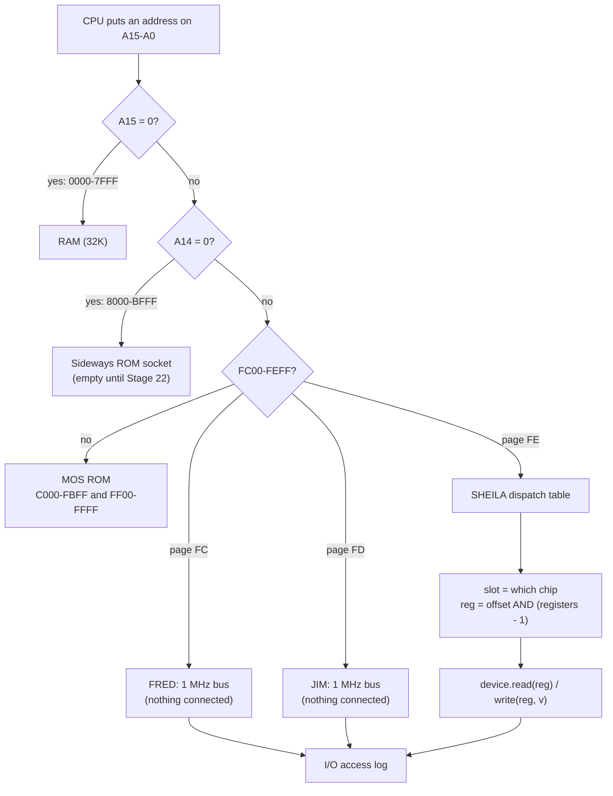
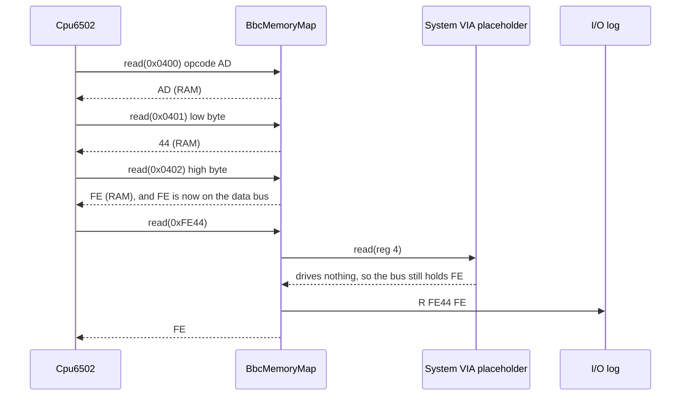
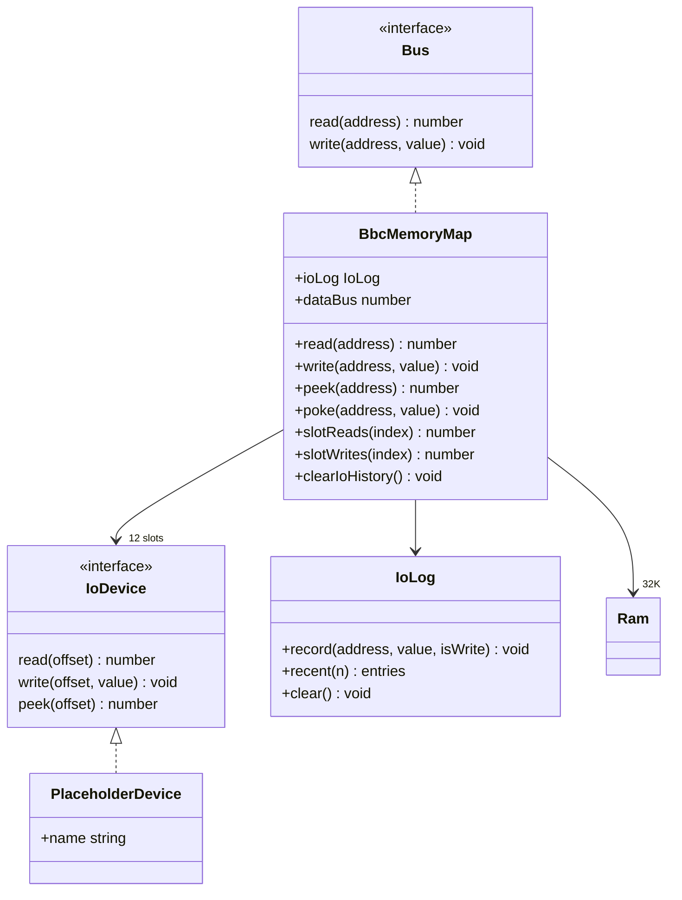

# Stage 21: Memory map & I/O dispatch

> **Part:** 3 (BBC memory map & ROMs) · **Branch:** `stage/21-memory-map` · **Needs:** 20
> **Status:** done

## Goal

Until now the CPU has lived on a `TestBus`, where all 65,536 addresses are plain RAM. A real Model B isn't like that. Half the addresses are RAM, a quarter are a paged ROM, most of the last quarter is the MOS ROM, and three pages near the top aren't memory at all: they're the registers of the machine's chips. Which one answers depends only on the **address**.

This stage builds that decoding: `BbcMemoryMap`, the `Bus` the CPU will use from now on. It adds:

- **region routing**: RAM, sideways ROM, MOS ROM, and the three I/O pages FRED, JIM and SHEILA;
- **read-only ROM**: the CPU's writes to ROM go nowhere;
- **a SHEILA dispatch table**: each slot of page `&FE` goes to a device, with the device's registers mirrored across its slot. For now every device is a named **placeholder**;
- **an I/O access log**: every CPU access to `&FC00`–`&FEFF`, named, e.g. "System VIA reg 4 (T1C-L)";
- **a side-effect-free `peek`**, so the debugger can look at I/O without disturbing it (a parking-lot item since Stage 02).

It comes first in Part 3 because everything after it plugs into it. Stage 22 fills the sideways and MOS ROMs, Part 4 replaces the System VIA placeholder with a real 6522, and so on.

## What you can now see

### 1. The Memory map panel

```bash
npm run dev        # http://localhost:5173, then press Run in the Registers panel
```

The playground now opens on the Stage 21 example, `memory-map`, and its CPU runs on a `BbcMemoryMap`. The new **Memory map** panel sits in the workbench column, after Disassembly:

- **A coloured bar and a region table** of the 64K. The region holding PC is outlined and marked "← PC". Each region's **Go** button opens it in the Memory panel.
- **The SHEILA slot table**: chip, "registers × mirrors", placeholder (and the stage that replaces it) or emulated, and the CPU's reads and writes of each slot. Slots the CPU used are highlighted.
- **The I/O log**: the latest accesses to `&FC00`–`&FEFF`, with **Clear**.

After **Run** (it stops at the BRK at `&043C`):

```
I/O log: the CPU at &FC00-&FEFF        7 accesses, oldest first.
1  W  &FE4E  &7F  System VIA reg 14 (IER)
2  W  &FE5E  &7F  System VIA reg 14 (IER), mirror of &FE4E
3  R  &FE44  &FE  System VIA reg 4 (T1C-L)
4  R  &FD00  &FD  JIM (1 MHz bus: nothing connected)
5  W  &FE30  &0C  ROMSEL (paged ROM select)
6  W  &FE00  &0D  CRTC reg 0 (address register)
7  W  &FE01  &00  CRTC reg 1 (register data)
```

The SHEILA table shows CRTC 0 reads and 2 writes, ROMSEL 0 and 1, and the System VIA 1 and 2. In the Memory panel, Go to `&0080` and you'll see the results: `48 00 FE FD 80`.


(The screenshot is in the gitignored `.playwright-mcp/` folder, so it's only on this machine.)

### 2. The same, in the terminal

```bash
npm run demo:memmap
```

Part 1 prints the map and the SHEILA table. Part 2 runs the example and prints the log above, plus:

```
  &0080 = &48   RAM kept the write
  &0081 = &00   MOS ROM: the write was lost
  &0082 = &FE   System VIA placeholder: floating bus
  &0083 = &FD   JIM: floating bus
  &0084 = &80   empty sideways socket: floating bus
```

Part 3 prints the start of the 768 hidden MOS bytes from `roms/os12.rom` (`(C) 1981 Acorn Computers Ltd.Thanks are due to…`), or says it skipped them if the file is missing.

### 3. Try it yourself

- Change `STA &FE5E` to `STA &FE7E`. The log now says **User VIA** reg 14: a different chip, same register number.
- Add `INC &FE4E`. It makes **three** log lines (a read, then the NMOS dummy write of the old value, then the new value). On a real VIA, both writes would act.
- In the DevTools console: `workbench.map.ioLog.recent()`, or `workbench.map.peek(0xfe44)`. Peeking leaves the log alone.

## The real hardware

### Who answers an address

The 6502 puts an address on its 16 address lines and either reads or writes. It has no idea what's out there. On the main board, a few logic chips look at the **top address lines** and switch on exactly one thing. That's **address decoding**. The Model B's map, from the *Advanced User Guide*'s memory map and its list of SHEILA addresses:

| Addresses | Size | What answers | Notes |
|---|---|---|---|
| `&0000`–`&7FFF` | 32K | **RAM** | Zero page, stack, the MOS's workspace, your program, and the screen at the top (`&7C00` in Mode 7). |
| `&8000`–`&BFFF` | 16K | **Sideways ROM** | One of up to 16 "paged" ROMs (BASIC, DFS, …), chosen by the ROMSEL latch at `&FE30`. Stage 22. |
| `&C000`–`&FBFF` | 15K | **MOS ROM** | The operating system (MOS 1.20). |
| `&FC00`–`&FCFF` | 256 | **FRED** | The 1 MHz bus: add-on hardware in a box plugged into the socket under the machine. |
| `&FD00`–`&FDFF` | 256 | **JIM** | The 1 MHz bus again: a window of paged expansion memory. |
| `&FE00`–`&FEFF` | 256 | **SHEILA** | The Model B's own I/O chips: video, VIAs, disc, … |
| `&FF00`–`&FFFF` | 256 | **MOS ROM** | The last page of the same ROM: OS entry points and the CPU's three vectors. |

The names FRED, JIM and SHEILA are Acorn's own. The *Advanced User Guide* uses them throughout, and they're why BBC programmers call an address like `&FE40` "SHEILA &40".

The decode is cheap because the boundaries line up with address bits:

```
&7C00 = 0111 1100 0000 0000    A15 = 0               → RAM
&8000 = 1000 0000 0000 0000    A15 = 1, A14 = 0      → sideways ROM
&C000 = 1100 0000 0000 0000    A15 = 1, A14 = 1      → MOS ROM ...
&FE44 = 1111 1110 0100 0100      ... unless A15-A10 are all 1 (&FC00-&FFFF)
                                 and A9-A8 aren't both 1 (not &FF00): I/O
```

So the RAM chip is selected by one wire, A15. The ROM sockets need two, and the I/O pages need eight. The MOS ROM is a 16K chip (`&C000`–`&FFFF`), but for 768 of its addresses the decoder switches on I/O instead, and the ROM never sees them.

### The 768 bytes nobody can read

Those 768 hidden ROM bytes aren't empty. Look at offset `&3C00` of your own `roms/os12.rom` (the chip's 16K starts at `&C000`, so offset `&3C00` is `&FC00`):

```
$ xxd -s 0x3c00 -l 0x40 roms/os12.rom
00003c00: 2843 2920 3139 3831 2041 636f 726e 2043  (C) 1981 Acorn C
00003c10: 6f6d 7075 7465 7273 204c 7464 2e54 6861  omputers Ltd.Tha
00003c20: 6e6b 7320 6172 6520 6475 6520 746f 2074  nks are due to t
00003c30: 6865 2066 6f6c 6c6f 7769 6e67 2063 6f6e  he following con
```

It's a list of credits ("Thanks are due to the following contributors to the development of the BBC Computer…") that runs to `&FEEF`. The 6502 can never read it, because I/O always wins the decode for those addresses. You can only see it by reading the chip in an EPROM reader, which is why it's a famous easter egg. (Checked in your ROM file. Stage 22 loads it.)

### SHEILA, slot by slot

Page `&FE` is cut into slots, and each slot switches on one chip. Most chips have only a few registers. A 6522 VIA has 16, so only four address lines, A0–A3, go to its register-select pins (RS0–RS3). A 32-byte slot needs five (A0–A4). Nothing looks at A4, so the 16 registers appear **twice**: `&FE4E` and `&FE5E` are both System VIA register 14. That's **incomplete decoding**. It's the same thing we met with RAM in Stage 02 (a 32K chip only has 15 address lines, so it mirrors), now at the scale of a chip with 16 registers.

| Slot | Chip | Registers | Mirrors in its slot | Emulated in |
|---|---|---|---|---|
| `&FE00`–`&FE07` | 6845 CRTC (video timing) | 2: address register, register data | ×4 | Stage 37 |
| `&FE08`–`&FE0F` | 6850 ACIA (serial and cassette) | 2: status/control, data | ×4 | out of scope |
| `&FE10`–`&FE17` | Serial ULA | 1: control | ×8 | out of scope |
| `&FE18`–`&FE1F` | Econet station ID (reading it is also INTOFF) | 1 | ×8 | out of scope |
| `&FE20`–`&FE2F` | Video ULA | 2: video control, palette | ×8 | Stage 40 |
| `&FE30`–`&FE3F` | Paged ROM select latch (ROMSEL) | 1 | ×16 | Stage 22 |
| `&FE40`–`&FE5F` | 6522 **System VIA** (keyboard, sound, interrupts…) | 16 | ×2 | Stages 24–28 |
| `&FE60`–`&FE7F` | 6522 User VIA (user port, printer) | 16 | ×2 | Stage 24 (as a 6522) |
| `&FE80`–`&FE9F` | 8271 floppy disc controller | 8: 4 registers, plus the data register at +4 | ×4 | Stages 49–50 |
| `&FEA0`–`&FEBF` | 68B54 ADLC (Econet) | 4 | ×8 | out of scope |
| `&FEC0`–`&FEDF` | µPD7002 ADC (joysticks) | 4 | ×8 | not planned |
| `&FEE0`–`&FEFF` | Tube ULA (second processor) | 8 | ×4 | out of scope |

Two things here are my best understanding rather than something I've checked bit by bit against the circuit diagram, so treat them as unconfirmed:

- **The exact mirroring inside each slot** (which address lines each chip sees). The register counts come from the chips' datasheets. The mirror counts assume the board decodes each slot and passes only the chip's own register-select lines. That's the usual design, and it matches the VIA case, which BBC programs rely on.
- **The `&FE18` slot.** The AUG lists it as the Econet station number, and reading it also turns off Econet interrupts ("INTOFF"). Without an Econet module it doesn't matter to us.

### Writing to ROM

A ROM chip has no write-enable pin. When the CPU does `STA &C000`, the bus cycle happens as normal: the address goes out, the data goes out, R/W goes low. But nothing is listening, so nothing changes. **The write is silently lost.** That's not an error on a real machine, and it mustn't be one in the emulator either. Some software writes to ROM addresses on purpose, for example to probe for sideways RAM, which on some machines *does* sit there.

### Reading nothing: the floating bus

What does `LDA &FD00` return when nothing is plugged into the 1 MHz bus? No chip drives the data lines during that read cycle. On an NMOS 6502 system the lines are tiny capacitors, and they briefly keep **the last value that was on them**. That's called a *floating* or *open* bus. For `LDA &FD00` (bytes `AD 00 FD`) the cycle just before the read fetched the operand's high byte, `&FD`. So the read returns **`&FD`**, the high byte of its own address.

We model that by remembering the last byte that crossed the bus. I'm confident about the NMOS-6502 principle. I haven't confirmed that a Model B behaves exactly this way for every empty address, so it goes in the parking lot. Two things limit the model:

- Our CPU doesn't do the dummy reads yet (Stage 19 measured them), so after an indexed mode the "last byte" can differ from the real chip's.
- Real software shouldn't depend on it, and the MOS doesn't.

### Reads that change things

On a real chip, reading a register can be an **action**. Reading the System VIA's T1 counter low byte at `&FE44` clears its timer interrupt flag (IFR bit 6, 6522 datasheet). Reading the 8271's result register clears its interrupt. So:

- the CPU's `read()` must reach the device, every time, in order;
- a debugger must **never** use `read()` just to draw page `&FE`, or it changes the machine it's watching. It needs `peek()`, a read that promises no side effects. Every device has to say what its side-effect-free view is.

### The 1 MHz bus (not modelled yet)

FRED, JIM and the slower SHEILA chips (the VIAs, ACIA, ADC, …) run at 1 MHz, while the CPU runs at 2 MHz. When the CPU touches one of them, the Model B stretches that cycle, slowing the CPU down to meet the 1 MHz clock. So `LDA &FE44` really takes a cycle or two longer than `LDA &7C00`. Our instruction-stepped model ignores this (BUILD-PLAN §3). The Part 12 cycle-exact extras can add it.

## Key concepts

### 1. Address decoding is a priority list

Think of the decoder as a list of questions, asked in order, about the address:

1. Is A15 = 0? Then it's **RAM**. (32K: `&0000`–`&7FFF`.)
2. Is A14 = 0? Then it's the **sideways ROM** socket. (`&8000`–`&BFFF`.)
3. Is it in `&FC00`–`&FEFF`? Then it's **I/O**, and the page picks FRED, JIM or SHEILA.
4. Otherwise it's the **MOS ROM**.

In code that's four comparisons, and the commonest case (RAM) comes first. It runs on every bus cycle, so it has to be fast.

### 2. A device sees an offset, not an address

The System VIA doesn't know it lives at `&FE40`. It has four register-select pins, so it sees a number from 0 to 15. The map works out the offset (`&FE5E` → slot `&FE40`–`&FE5F` → `(&5E − &40) & 15` = 14) and calls `device.read(14)`. The 6522 chip could be wired anywhere, and the User VIA *is* the same chip at `&FE60`. That's why `IoDevice` takes an offset.

```
LDA &FE44 → SHEILA offset &44 → System VIA slot (&40-&5F) → reg (&44 - &40) & 15 = 4 → T1C-L
STA &FE5E → SHEILA offset &5E → System VIA slot           → reg (&5E - &40) & 15 = 14 → IER
STA &FE21 → SHEILA offset &21 → Video ULA slot (&20-&2F)  → reg (&21 - &20) & 1 = 1  → palette
STA &FE2D → SHEILA offset &2D → Video ULA slot            → reg (&2D - &20) & 1 = 1  → palette too
```

### 3. Placeholders: devices that are there but not yet built

We won't have a working VIA until Stage 24, or a CRTC until Stage 37. But the address decoding has to be right now, and the log has to say *which* chip was touched. So every slot gets a **placeholder device** with the chip's name and register names. A placeholder ignores writes, and on a read it doesn't drive the bus, so the CPU gets the floating value. When a real device arrives, it takes over its slot, and nothing else in the map changes.

### 4. Two kinds of write: the CPU's and the loader's

The CPU's `write()` to ROM is lost, as on the real machine. But *something* has to put bytes into the ROM image. In Stage 22 that's the ROM loader. Today it's the playground's program loader, which puts the reset and IRQ vectors at `&FFFA`–`&FFFF`, which are now ROM. So the map has `poke()`, the debugger's and loader's write. It writes straight into the ROM image, like burning an EPROM. `peek()` and `poke()` are for tools, and `read()` and `write()` are what the CPU does.

| | RAM | MOS ROM | Empty sideways socket | I/O (FRED, JIM, SHEILA) |
|---|---|---|---|---|
| `read()` (CPU) | the byte | the byte | floating bus | `device.read(reg)`, logged |
| `write()` (CPU) | stored | **ignored** | ignored | `device.write(reg, v)`, logged |
| `peek()` (tools) | the byte | the byte | floating bus | `device.peek(reg)`: no side effects, not logged |
| `poke()` (tools) | stored | written into the ROM image | ignored | `device.write(reg, v)`, not logged |

### 5. Logging I/O without slowing the machine

The I/O log is the debugger's best window into what the MOS is doing with the hardware, and Stage 23 needs it to work out why the MOS stalls. It records each I/O access as address, value and read/write, into fixed typed arrays, like Stage 18's tracer. It doesn't store a description. The words ("System VIA reg 4 (T1C-L)") are worked out only when the panel draws. RAM and ROM accesses never reach the logging code, so the hot path pays nothing for it.

## Diagrams

How one address is decoded:



One instruction, `LDA &FE44`, through the map:



The pieces in TypeScript:



## Our design

### New files

| File | What it holds |
|---|---|
| `src/memory/io-device.ts` | The `IoDevice` interface. |
| `src/memory/memory-regions.ts` | The region table (start, end, name, what's there) and `regionOf(address)`. |
| `src/memory/sheila.ts` | The SHEILA slot table (chip name, register names, the stage that builds it) and `describeIoAddress(address)` ("System VIA reg 14 (IER), mirror of &FE4E"). |
| `src/memory/placeholder-device.ts` | `PlaceholderDevice`: named, ignores writes, reads float. |
| `src/memory/io-log.ts` | `IoLog`: a ring buffer of I/O accesses in typed arrays. |
| `src/memory/bbc-memory-map.ts` | `BbcMemoryMap`, the `Bus` itself. |
| `src/web/workbench/memory-map-view-model.ts` + `memory-map-panel.ts` | The **Memory map** panel. |

### The device interface

```ts
export interface IoDevice {
  /** The CPU reads register `offset`. May have side effects (clearing a flag). */
  read(offset: number): number;
  /** The CPU writes register `offset`. */
  write(offset: number, value: number): void;
  /** What read(offset) would return now, with no side effects. For debuggers. */
  peek(offset: number): number;
}
```

`BUILD-PLAN.md` §2 sketches `IoDevice` with an optional `tick(cycles)`. It isn't needed until the VIA timers (Stage 25), so it isn't here yet. `peek` is new. It's how the "debug views need a side-effect-free peek" parking-lot item gets solved: every device must say what its harmless view is.

A device that sees an offset can't tell which mirror was used, and it doesn't need to. `read(4)` is `read(4)`, whether the CPU used `&FE44` or `&FE54`.

### The map

```ts
const map = new BbcMemoryMap();                         // every SHEILA slot a placeholder
const map = new BbcMemoryMap({ devices: { systemVia } }); // Stage 24+: a real chip takes its slot
```

- RAM is a Stage 02 `Ram(0x8000)`.
- The MOS ROM is a 16K `Uint8Array` image, starting as `&FF` everywhere (an erased EPROM reads `&FF`). Stage 22 loads `os12.rom` into it.
- The sideways socket is **empty** in this stage, so reads float. Stage 22 adds the 16 banks and ROMSEL.
- SHEILA is three 256-entry lookup tables built once, in the constructor: device, register number and slot number for each offset. A SHEILA access is then three array lookups, with no searching and no string work.
- `dataBus` is the last byte that crossed the bus, for floating reads. It's updated on every `read()` and `write()`, but never by `peek()`/`poke()`.
- Each slot counts its reads and writes (in a `Uint32Array`), for the panel.

### Alternatives considered

- **A 64K array of "which device" for every address**, instead of the four comparisons. It's simple, but it costs a lookup on every RAM access and 64K of table. The comparisons are cheaper for the common case.
- **Logging inside a wrapper bus** (like `WriteRecorder`). A wrapper would have to decode the address *again* to know it was I/O. The map already knows, so the map logs.
- **Placeholders that read `&00` or `&FF`.** That's simpler, but it hides a real effect (the floating bus) that's easy to show and explain. If a later stage finds the MOS needs something else from an empty slot, that's a one-line change.

### The playground moves onto the map

The workbench's playground CPU now runs on a `BbcMemoryMap` instead of a `TestBus`. So the panels show what a Model B would really do, including the effects you can see in the example program: lost ROM writes, mirrors, floating reads. That changes some things:

- Program vectors (`*= &FFFA`) are now in ROM. The program loader uses `poke`, which writes the ROM image.
- The loader no longer clears `&FC00`–`&FEFF`, because those aren't memory.
- The Stage 17 doorbell still sits *in front of* the map as a wrapper, so `&FC00` reaches it before the map (and the doorbell's accesses aren't in the I/O log). The doorbell disappears with the playground in Part 5, so it isn't worth making it a FRED device.
- The CPU tests, the Dormann runner and the older demos keep using `TestBus`, because they want a flat 64K.

## Code walkthrough

- [`src/memory/bbc-memory-map.ts`](../../src/memory/bbc-memory-map.ts): the map. Read `read()` first. It's four comparisons with RAM first, then `lastByte = value` so a later empty read can float. `readIo()`/`writeIo()` are the only paths that touch devices, counts and the log. The constructor builds the three 256-entry SHEILA tables from `SHEILA_SLOTS`. It spells out all 12 slot ids, so the type checker can prove every slot has a device, with no cast.
- [`src/memory/sheila.ts`](../../src/memory/sheila.ts): the slot table is plain data. `sheilaRegister()` is the one line of mirroring: `((offset & 0xff) - slot.start) & (registers - 1)`. `describeIoAddress()` turns an address into words and is never called on the hot path.
- [`src/memory/memory-regions.ts`](../../src/memory/memory-regions.ts): the region constants and table. `regionOf()` makes the same tests in the same order as `read()`.
- [`src/memory/placeholder-device.ts`](../../src/memory/placeholder-device.ts): ten lines. It reads `bus.dataBus` and ignores writes.
- [`src/memory/io-log.ts`](../../src/memory/io-log.ts): the ring buffer, in the same style as Stage 18's `Tracer`.
- [`src/memory/io-device.ts`](../../src/memory/io-device.ts): `read`/`write`/`peek` by register offset.
- [`src/web/workbench/debug-target.ts`](../../src/web/workbench/debug-target.ts): `playgroundTarget` now takes any `PlaygroundMemory` (a `Bus` plus `peek`/`poke`). `TestBus` gained trivial `peek`/`poke`, so the existing tests are unchanged.
- [`src/playground/setup.ts`](../../src/playground/setup.ts): `installProgram` skips `&FC00`–`&FEFF`, and `pokeWriter(map)` lets it load through `poke`, so vectors reach the ROM image.
- [`src/web/workbench/memory-map-view-model.ts`](../../src/web/workbench/memory-map-view-model.ts) and [`memory-map-panel.ts`](../../src/web/workbench/memory-map-panel.ts): the panel. Region colours are CSS variables (`--region-ram`, …) in `index.html`, with light and dark values.
- [`src/playground/examples.ts`](../../src/playground/examples.ts): `MEMORY_MAP_SOURCE`, the new default example.
- [`scripts/demo-memory-map.ts`](../../scripts/demo-memory-map.ts): `npm run demo:memmap`.

## Tests

| Test file | What it proves |
|---|---|
| `src/memory/bbc-memory-map.test.ts` | 32K of distinct RAM. Masking. CPU writes to the MOS ROM (both parts) are ignored, and `poke` writes the image. The MOS is one 16K chip. Writes to the empty sideways socket are lost. Empty reads float, so `LDA &8000` and `LDA &FE44` return the address high byte on a real CPU. Each SHEILA slot's offsets reach the right register of the right device (21 cases), and all 256 offsets reach exactly one device. `peek` uses `device.peek`. `poke` to I/O writes the device but isn't logged. `peek`/`poke` don't move the floating bus. Device reads are masked. The log is in order, with RAM and ROM not logged. `INC &FE4E` is read, dummy write, write. Per-slot counts and `clearIoHistory`. Two maps are independent. |
| `src/memory/sheila.test.ts` | The slots cover `&FE00`–`&FEFF` with no gaps, register counts are powers of two, the VIAs are where the AUG puts them, and `describeIoAddress` names 15 addresses (mirrors included) and rejects non-I/O. |
| `src/memory/memory-regions.test.ts` | The regions cover 64K in order, both ends of every region, and `regionOf` agrees with the table everywhere. |
| `src/memory/io-log.test.ts` | Order, `recent(n)`, ring overwrite with `count` still counting, `clear`, and capacity validation. |
| `src/memory/placeholder-device.test.ts` | Reads float, writes are ignored. |
| `src/playground/setup.test.ts` | `installProgram` through `pokeWriter` puts the reset vector in the ROM image, and never writes a device register. |
| `src/playground/examples.test.ts` | The memory-map example leaves `48 00 FE FD 80` at `&80`–`&84`, and logs exactly its 7 accesses, named. The default example is now `memory-map`. |
| `src/web/workbench/memory-map-view-model.test.ts` | Region rows, sizes and shares, the PC mark, slot rows (placeholder vs emulated, counts), and log rows and notes. |
| `e2e/memory-map.spec.ts` | In the browser: 7 regions with PC in RAM, an empty log, then after Run the 7 named log lines, the VIA counts and the result bytes. Clear empties it, and Go opens `&FE00`. |

Nothing in this stage needs a ROM. The demo's Part 3 skips with a message if `roms/os12.rom` is missing.

## Gotchas & hardware quirks

- **Writes to ROM must be silent.** Throwing, or even warning, would be wrong. Software probes ROM space on purpose.
- **Loading ROM needs a different door.** A program loader that uses the CPU's `write()` would lose every vector. That's why the playground's loader now uses `pokeWriter(map)`.
- **Never clear I/O by writing to it.** `installProgram` used to zero all 64K. On real chips that would be 768 register writes (enabling things, acknowledging things), so the I/O pages are now skipped.
- **`read()` on I/O is an action.** That's why the panels use `peek`, and why `poke` and `peek` aren't logged. The log is the CPU's story only.
- **The floating bus is a model, and an unconfirmed one** for the Model B. It also depends on the last byte the CPU *actually* put on the bus, and our CPU doesn't do the dummy reads (Stage 19 measured 16% of reads missing). So after `LDA &FE44,X` with a page crossing, the real "last byte" could differ. The MOS doesn't rely on it.
- **RMW instructions hit a register twice.** `INC &FE4E` writes the old value back, then the new one (NMOS, modelled since Stage 09). On a VIA's IFR or IER both writes act. The log shows it.
- **Indexed stores' dummy read isn't modelled.** `STA &FE3F,X` with X = 5 does a real read of `&FE44` first on the 6502, which would clear a VIA flag. It's in the parking lot from Stage 07, and it matters more now that SHEILA reads are real.
- **The 1 MHz cycle stretching isn't modelled.** I/O accesses take the same time as RAM accesses here (Part 12).
- **The doorbell is invisible to the map.** The Stage 17 doorbell wraps the map and answers `&FC00` first, so those accesses don't appear in the I/O log, and peeking `&FC00` shows the floating bus, not the doorbell. It goes away with the playground in Part 5.
- **Playwright gotcha:** `getByRole('region', { name: 'Memory' })` also matches "Memory map" (names match by substring). The existing specs now pass `exact: true`.

## Playwright verification

- **MCP:** opened `http://localhost:5173/`. The example picker shows "Stage 21: the BBC memory map (Run me)", and the Memory map panel shows "No I/O yet". Pressed **Run**, then took the screenshot above: 7 named log lines, and the CRTC, ROMSEL and System VIA slots highlighted with counts 0/2, 0/1 and 1/2.
- **Durable:** `e2e/memory-map.spec.ts` (3 tests). `e2e/disassembly.spec.ts` now opens `?program=trace`. Every spec's `name: 'Memory'` lookup is now exact. All 87 e2e tests pass.

## Check your understanding

1. The CPU executes `LDA &FE54`. Which chip answers, which register does it see, and why is it the same register as `&FE44`?
2. Why does `STA &C000` followed by `LDA &C000` not give back the stored value, and why must the emulator *not* report an error?
3. With nothing connected to JIM, `LDA &FD00` returns `&FD` in our emulator. Where does the `&FD` come from? What would `LDA (&70),Y` with `&70/&71` = `00 FD` and Y = 0 return instead?
4. Why does the workbench need `peek()` as well as `read()`, and why isn't `peek()` allowed to update the floating-bus value?
5. The MOS ROM is 16K, but the CPU can only read 15.25K of it. Which addresses are hidden, and what's in them in OS 1.20?

<details>
<summary>Answers</summary>

1. The **System VIA**. `&FE54` is in its slot (`&FE40`–`&FE5F`), and the 6522 has only four register-select lines (A0–A3), so it sees `(&54 − &40) & 15` = **4**, T1C-L. Nothing connects A4 to the VIA, so `&FE44` and `&FE54` look identical to it: incomplete decoding makes a mirror.
2. A ROM has no write-enable input, so the write cycle happens but nothing stores it. The read returns the ROM's own byte. Software sometimes writes to ROM space on purpose (probing for sideways RAM, say), and on the real machine that's harmless, so the emulator must be silent too.
3. It's the last byte that was on the data bus. Fetching `AD 00 FD` ends with the high byte `&FD`. `LDA (&70),Y` reads `B1 70`, then the pointer from zero page (`&00`, then `&FD`), then the target. The last byte before the target is again the pointer's high byte, **`&FD`**. Either way the floating value comes from the CPU's own previous bus cycle, so the model is only as good as our CPU's bus activity (and the dummy reads aren't modelled).
4. On real chips a read can be an action (reading T1C-L clears IFR bit 6). A debugger drawing page `&FE` with `read()` would change the program it's watching. `peek()` is the promise of no side effects, and that includes the floating bus: if looking at memory changed what the next empty read returned, the debugger would still be changing the machine.
5. `&FC00`–`&FEFF` (768 bytes), because the decoder switches on FRED, JIM and SHEILA for them instead. In OS 1.20 they hold "(C) 1981 Acorn Computers Ltd.Thanks are due to the following contributors…", a list of credits.

</details>

## Further reading

- *BBC Microcomputer Advanced User Guide* (Bray, Dickens, Holmes): the memory map, and the list of SHEILA addresses and their devices.
- BeebWiki, "Memory map" and "SHEILA" pages: the same tables, with notes on each device.
- Rockwell/Synertek R6522 datasheet: the register-select table (RS3–RS0) that gives `VIA_REGISTERS`.
- 6502.org, on NMOS bus behaviour: what a read returns when no device drives the data bus.
- Stage 02's doc ([02-memory-bus.md](./02-memory-bus.md)): RAM mirroring, the same idea as register mirroring.
