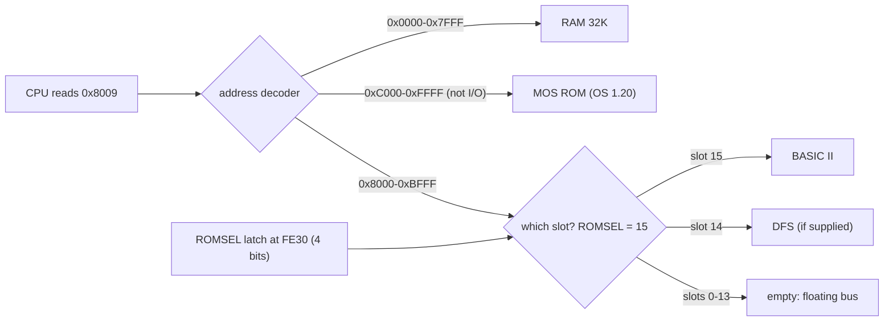
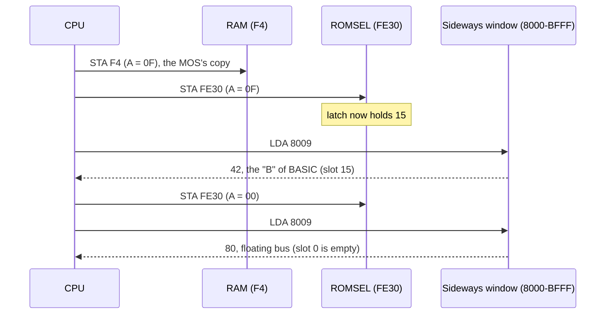
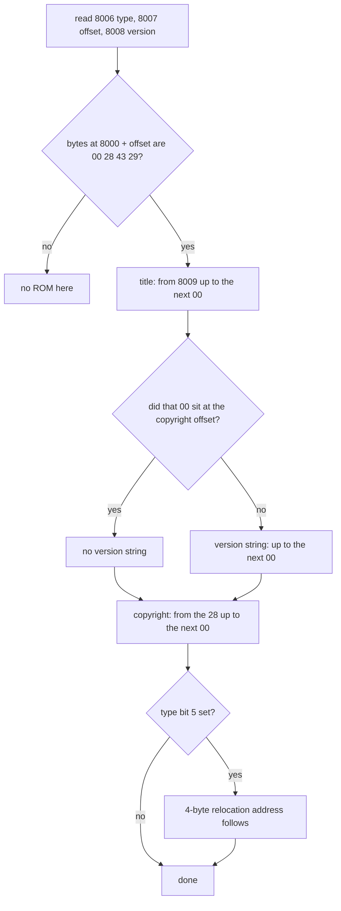

# Stage 22: ROMs & sideways paging

> **Part:** 3 (BBC memory map & ROMs) · **Branch:** `stage/22-roms-sideways` · **Needs:** 21
> **Status:** done

## Goal

Stage 21 left two holes in the memory map: a blank MOS ROM image, and an empty sideways socket at `&8000`–`&BFFF`. This stage fills them. It adds:

- **ROM images**: loading the 16K files from `roms/` (Node `fs` for tests and demos, `fetch` for the browser), checking their size, and mirroring an 8K ROM to fill its 16K socket;
- **ROMSEL**, the paged ROM select latch at `&FE30`, which picks which of **16 sideways slots** the CPU sees at `&8000`;
- **a sideways ROM header parser**: the type byte, copyright offset, version, title and copyright string that every paged ROM starts with, and the check the MOS uses to decide a ROM is really there;
- **a test helper that skips** (with a message) when a ROM file is missing.

It comes now because Stage 23 runs the real MOS from its reset vector, and the first thing that firmware does with paged ROMs is exactly what this stage's demo does: page each slot in, and read its header.

## What you can now see

```bash
npm run demo:roms
```

It loads what's in `roms/`, adds a made-up ROM so there's always something to page in, then looks at all 16 slots three ways. With `os12.rom` and `basic2.rom` (and no `dfs.rom`) the output is:

```

── Part 1: loading the ROMs ──
  loaded   roms/os12.rom    MOS 1.20   → &C000-&FFFF
  loaded   roms/basic2.rom  BASIC II   → sideways slot 15
  missing  roms/dfs.rom     Acorn DFS    (Acorn copyright, so you supply it; the slot stays empty)
  built    a made-up ROM, "DEMO", by buildRomImage → sideways slot 0

── Part 2: each slot, paged in through ROMSEL (&FE30), header parsed ──
  slot  title       version  bin  type                                          copyright
    15  BASIC       -        &01  &60 language, relocation address; 6502 BASIC  (C)1982 Acorn<&0A><&0D>
    14  (empty: reads float, no "(C)" where the header says)
    13  (empty: reads float, no "(C)" where the header says)
    12  (empty: reads float, no "(C)" where the header says)
    11  (empty: reads float, no "(C)" where the header says)
    10  (empty: reads float, no "(C)" where the header says)
     9  (empty: reads float, no "(C)" where the header says)
     8  (empty: reads float, no "(C)" where the header says)
     7  (empty: reads float, no "(C)" where the header says)
     6  (empty: reads float, no "(C)" where the header says)
     5  (empty: reads float, no "(C)" where the header says)
     4  (empty: reads float, no "(C)" where the header says)
     3  (empty: reads float, no "(C)" where the header says)
     2  (empty: reads float, no "(C)" where the header says)
     1  (empty: reads float, no "(C)" where the header says)
     0  DEMO        0.01     &01  &82 service; 6502 code                        (C)2026 Stage 22

── Part 3: the same scan in 6502 code, as the MOS does it at reset ──
  165 instructions, 521 cycles, 16 writes to ROMSEL. Type bytes found at &70-&7F:
   0:82  1:--  2:--  3:--  4:--  5:--  6:--  7:--  8:--  9:-- 10:-- 11:-- 12:-- 13:-- 14:-- 15:60
  &F4 = &00, the last slot paged. (The MOS keeps a table like this at &02A1.)
  An empty slot fails at the first test: LDY &8007 reads the floating bus, &80 (the high
  byte of the operand just fetched), so Y = &80, and &8080 floats to &80 too, not &00.

── Part 4: the MOS at &C000, and BASIC's entry points ──
  The CPU vectors, from the last page of os12.rom (file offset &3FFA = &FFFA):
    NMI   &FFFA → &0D00   (RAM: filing systems put NMI code there)
    RESET &FFFC → &D9CD   (Stage 23 starts here)
    IRQ   &FFFE → &DC1C
  The first instructions of the reset code:
    &D9CD  LDA #&40
    &D9CF  STA &0D00
    &D9D2  SEI
    &D9D3  CLD
    &D9D4  LDX #&FF
    &D9D6  TXS

  BASIC paged in (slot 15). Its language entry at &8000 is code, not a JMP:
    &8000  CMP #&01
    &8002  BEQ &8023
    &8004  RTS
    &8005  NOP
  The MOS enters a language with A = 1, so BASIC checks for that first, and returns if not.
  That code runs straight through &8003-&8005, the service entry's bytes: BASIC has no
  service entry (type &60, bit 7 clear), so the MOS never calls &8003, and the space is free.
  (The type byte &60 at &8006 happens to be an RTS opcode too, but nothing runs it.)
```

What to look for:

- **Part 2** pages each slot in with a real write to `&FE30`, then parses the header through `map.peek`. BASIC II is `&60`; our made-up ROM is `&82`, the type of a typical filing system. Put a `dfs.rom` in `roms/` and it appears in slot 14.
- **Part 3** is the same scan done by the 6502, which is roughly what the MOS does at reset (Stage 23). 16 writes to ROMSEL, and the empty slots fail the copyright check because they float.
- **Part 4** shows the MOS in place at `&C000` (its reset vector is `&D9CD`), and why BASIC's "service entry" bytes are really the middle of its language entry code.

Missing files are reported, never fatal: delete `roms/basic2.rom` (or rename it) and slot 15 shows as empty, and Part 4's BASIC section says it skipped.

### In the browser

There's no new panel (the playground still runs with empty slots, so its examples behave as before). Two small changes are visible:

- **Memory map** panel, SHEILA table: ROMSEL at `&FE30`–`&FE3F` now says **emulated** instead of placeholder.
- The browser loader works against the dev server. In the DevTools console at `http://localhost:5173`:

```js
const { fetchStandardRoms } = await import('/src/web/rom-fetch.ts');
const { BbcMemoryMap } = await import('/src/memory/bbc-memory-map.ts');
const map = new BbcMemoryMap();
await fetchStandardRoms(map);   // { loaded: [MOS, BASIC], missing: [DFS] }
map.write(0xfe30, 15);
map.peek(0x8009).toString(16);  // '42', the "B" of BASIC
```

## The real hardware

### Two kinds of ROM

A Model B has two kinds of ROM socket (Advanced User Guide, memory map):

| Where | What | How many |
|---|---|---|
| `&C000`–`&FFFF` | the **MOS** ROM (OS 1.20): always there, never paged | one 16K chip |
| `&8000`–`&BFFF` | a **paged** ("sideways") ROM: BASIC, DFS, word processors… | up to 16, but only one visible at a time |

The MOS is always visible because it holds the CPU's vectors (`&FFFA`–`&FFFF`) and the code that does the paging. If it could be paged out, the CPU would lose its way. With OS 1.20 loaded, the vectors at the top of `os12.rom` read:

| Vector | Bytes in the file (offset `&3FFA`) | Points to |
|---|---|---|
| NMI | `00 0D` | `&0D00` (in RAM: the disc system puts its NMI code there) |
| RESET | `CD D9` | `&D9CD` (the MOS reset code: Stage 23) |
| IRQ/BRK | `1C DC` | `&DC1C` |

### ROMSEL at `&FE30`

The 6502 has 16 address lines, so it can see only 64K. Sixteen 16K ROMs would be 256K, far too much. The answer is **bank switching**: all the paged ROMs share the one 16K window at `&8000`, and a small latch decides which one is switched on. That latch is ROMSEL, in SHEILA at `&FE30`–`&FE3F` (Advanced User Guide, SHEILA address list: "paged ROM select register, write only").

- A write to `&FE30` stores the low 4 bits of the data bus: `&00`–`&0F`, the **ROM number**. The upper bits aren't stored on the Model B (the B+ and Master use bit 7 for extra RAM, which is out of scope).
- It's **write only**. Reading `&FE30` doesn't enable the latch's outputs onto the data bus, so the CPU sees the floating bus. That's why the MOS keeps its own copy of the current ROM number in zero page at `&F4` (Advanced User Guide, zero page allocation), and why any code that pages a ROM must update `&F4` too.
- The latch's four outputs drive the chip-select decoding for the sideways sockets. Once a number is latched, every read of `&8000`–`&BFFF` goes to that socket until the next write. The change is immediate: the very next bus cycle sees the new ROM.

### How many sockets, really?

A stock Model B has **four** paged ROM sockets on the board. As we understand it (BeebWiki's paged ROM pages; not checked against the circuit diagram), the board decodes only bits 0 and 1 of ROMSEL, so the four sockets answer to ROM numbers 12–15, and *also* to 0–3, 4–7 and 8–11: each ROM appears four times. MOS 1.20 knows this: when it builds its ROM table at reset, it ignores a ROM that's an exact copy of a higher-numbered one.

Plenty of Model Bs had a **sideways ROM board** fitted, giving 16 real slots, and that's what we model: 16 independent slots, with BASIC in slot 15 (the highest, so the MOS picks it as the language at reset) and DFS, when you supply it, in slot 14. If we ever need the stock four-socket mirroring, it's a change to how ROMSEL picks a slot, not to the ROMs.

### An empty socket

A socket with no chip in it drives nothing, so a read of `&8000`–`&BFFF` with ROMSEL pointing at an empty slot gets the floating bus, exactly like Stage 21's empty socket. The MOS has to cope with this when it looks for ROMs, which is why the header has a check pattern (below).

### 8K ROMs in a 16K socket

The sockets are wired for 16K EPROMs (27128). An 8K chip (2764) leaves its top address pin unconnected, so it ignores A13: its 8K appear at `&8000`–`&9FFF` **and again** at `&A000`–`&BFFF`. We model that by repeating an 8K file twice to make a 16K image. Older ROMs, including some DFS versions, were 8K.

## Key concepts

### The sideways ROM header

Every paged ROM starts with the same layout, so the MOS can find out what it is without knowing anything else about it (Advanced User Guide, the paged ROMs chapter: "ROM format"). Here is the real start of `basic2.rom`:

```
&8000  C9 01 F0 1F 60 EA 60 0E 01 42 41 53 49 43 00 28  ....`.`..BASIC.(
&8010  43 29 31 39 38 32 20 41 63 6F 72 6E 0A 0D 00 00  C)1982 Acorn....
&8020  80 00 00 ...
```

| Address | Bytes | Field | BASIC II |
|---|---|---|---|
| `&8000` | 3 | **language entry**: the MOS jumps here to start the ROM as the current language | `C9 01 F0 1F 60 EA` = `CMP #&01 : BEQ &8023 : RTS : NOP`, running on into the next field |
| `&8003` | 3 | **service entry**: the MOS calls here with a service call number in A | none: BASIC's own code uses these bytes (see below) |
| `&8006` | 1 | **ROM type** | `&60` |
| `&8007` | 1 | **copyright offset**: where the copyright string's leading `&00` is, from `&8000` | `&0E` → `&800E` |
| `&8008` | 1 | **binary version number** | `&01` (BASIC I is `&00`) |
| `&8009` | … | **title**, ending in `&00` | `BASIC` `&00` |
| | … | **version string**, ending in `&00` (optional) | none: the copyright byte comes straight after the title |
| copyright offset | … | `&00` `(C)`…, ending in `&00` | `&00` `(C)1982 Acorn` `&0A &0D` `&00` |
| | 4 | **relocation address** (only if type bit 5 is set) | `00 80 00 00` = `&00008000` |

Two things to notice:

1. **The entries are code, not addresses.** The MOS doesn't read an address out of `&8000`, it *jumps to* `&8000`. Most ROMs put a `JMP` there, but BASIC starts its code right there: the MOS enters a language with A = 1, so BASIC checks for that and returns if not. Its six bytes of code run straight through `&8003`–`&8005`. That's allowed because BASIC has **no service entry** (type bit 7 is clear), so the MOS never calls `&8003`, and the space is free. Disassembling `&8003` on its own gives nonsense: it's the `&1F` offset of the `BEQ`. The header only says *whether* an entry exists (the type byte), never where it goes.
2. **The version string is optional, and there's no flag for it.** You find it by comparing: if the title's `&00` is the copyright byte, there's no version string. Otherwise the text between them is the version, e.g. DFS's `"1.20"`.

### The type byte, bit by bit

`&8006` is a set of flags plus a 4-bit number (Advanced User Guide, ROM type byte; BeebWiki "Paged ROM"):

| Bit | Meaning |
|---|---|
| 7 | has a **service entry**. The MOS only makes service calls to ROMs with this bit set. |
| 6 | has a **language entry**. |
| 5 | has a **second processor relocation address** after the copyright string. |
| 4 | has Electron firmware key expansions (Electron only; ignored on a BBC) |
| 3–0 | **what the code is for**: `0` = 6502 BASIC, `2` = 6502 code (not BASIC), `3` = 68000, `8` = Z80, `9` = 32016. Other values are other second processors. |

So BASIC II's `&60` = `%0110 0000`: a language, with a relocation address, 6502 BASIC, and *no service entry*. That's why its code can run over `&8003`. A typical filing system ROM like DFS has `&82` = `%1000 0010`: a service ROM of 6502 code, with no language entry.

### "Is there a ROM here?" The copyright check

The MOS can't tell an empty socket from a ROM by reading one byte, because the floating bus can return anything. So it checks a pattern: read the copyright offset at `&8007`, then look at `&8000 + offset`. A real ROM has `&00 ( C )` there: `&00 &28 &43 &29`. Four specific bytes are very unlikely to float into place by accident. Our parser makes the same check, and reports "no ROM" when it fails.

Worked example for an empty slot: an `LDA &8007` reads the floating bus, which holds the high byte of the operand just fetched, `&80`. So the "offset" is `&80`, and `&8080` reads `&80` again, not `&00`. The check fails, correctly.

### Why bank switching has a cost

Only one paged ROM is visible at a time, so code in one paged ROM can't simply `JSR` into another. If the DFS paged BASIC in, the DFS would vanish from under its own program counter. Everything that crosses between ROMs has to go through code that is always visible: the MOS (at `&C000`+) or RAM. That's why the MOS has the service call mechanism (it pages each ROM in, calls `&8003`, and pages back), and the *extended vectors* that let a ROM handle `OSFILE` and friends. We'll meet those when the MOS runs (Stage 23 onwards).

## Diagrams

How a read of `&8009` finds its byte. ROMSEL's value picks a slot, and the slot's chip (or nothing) drives the data bus:



What paging looks like on the bus, over time. Note that the MOS writes the number to both the latch and its RAM copy at `&F4`, because it can't read the latch back:



The header, as a parser walks it:



## Our design

### Where the sideways ROMs live

`BbcMemoryMap` now owns 16 sideways slots, each a 16K `Uint8Array` or `undefined` (empty), plus a reference to the **currently paged image**. The hot path stays one comparison and an array index:

```ts
else if (a < MOS_START) value = this.paged === undefined ? this.lastByte : this.paged[a - SIDEWAYS_START] ?? this.lastByte;
```

ROMSEL is a real `IoDevice`, `RomSelect`, in the `romsel` SHEILA slot. A write latches `value & 0x0f` and tells the map, which swaps `paged` to that slot's image. We swap a reference on the (rare) ROMSEL write, rather than looking up `slots[romsel]` on every one of the (very common) reads of `&8000`–`&BFFF`.

Because the map and its latch work as a pair, `romsel` can no longer be swapped for another device through the constructor's `devices` option: it's typed `Exclude<SheilaSlotId, 'romsel'>`.

```ts
map.loadMos(image);               // 16K, into &C000-&FFFF
map.loadSidewaysRom(15, basic);   // 16K, or 8K (mirrored)
map.removeSidewaysRom(14);
map.sidewaysRom(15);              // the image, or undefined
map.pagedRom;                     // ROMSEL's value, 0-15
```

`poke` into `&8000`–`&BFFF` writes into the paged image, like `poke` into the MOS: it's a tool's write, not the CPU's. `peek` sees the paged slot.

### Loading

The bytes come from different places in Node and in the browser, but checking them doesn't depend on where they came from, so the work splits three ways:

| File | Runs in | Job |
|---|---|---|
| `src/memory/rom-image.ts` | anywhere | `toRomImage(bytes, name)`: 16K as is, 8K repeated twice, anything else a `RangeError` naming the file |
| `src/memory/rom-files.ts` | Node only | `ROM_FILES` (the paths in `roms/`), `romFileExists`, `loadRomFile`, and `loadStandardRoms(map)` which loads whatever is there and reports what's missing |
| `src/web/rom-fetch.ts` | browser | `fetchRom(url)`: a `fetch`, then `toRomImage`. Returns a result, not an exception, because a missing ROM is normal |

### The header parser

`src/memory/rom-header.ts`:

```ts
export function parseRomHeader(peek: (address: number) => number): RomHeaderResult;
// { ok: true, header: RomHeader } | { ok: false, reason: string }
```

It reads through a `peek` function rather than taking a `Uint8Array`, so the same code reads a file's bytes in a test (`(a) => image[a - 0x8000]`) and the live machine through the paging (`(a) => map.peek(a)`). That's the same idea as the disassembler's `Peek` from Stage 18. `RomHeader` holds the raw bytes (type, offset, binary version) and the decoded parts (flags, CPU type name, title, version string, copyright, relocation address).

`buildRomImage(spec)` goes the other way: it makes a valid 16K image from a title, version and so on. Tests use it for fake ROMs, and the demo uses it so there's always something to page in, even with no ROM files.

### Skipping without ROMs

`src/memory/with-roms.ts` exports `withRoms(...paths)`, which returns Jest's `test` if every file exists, and otherwise a `test.skip` that logs the test's name and the missing files. The same pattern Stage 20 used for Dormann's test, but in one place, because Stage 23 onwards will need it constantly. It's its own file (imported only by tests) because it uses Jest's globals, and the demos import `rom-files.ts` too.

```ts
withRoms('roms/os12.rom')('os12.rom maps to &C000-&FFFF: the reset vector at &FFFC is &D9CD', () => { ... });
// without the file:  skipping "os12.rom maps to ...": roms/os12.rom missing (Acorn copyright, so you supply it)
```

### Not built yet

- The stock four-socket mirroring (see above).
- Sideways RAM, and the B+/Master's use of ROMSEL bit 7.
- Using the browser loader in the workbench. The playground still runs with empty slots, so its examples behave exactly as before. A machine with real ROMs arrives with the run loop (Stage 30).

## Code walkthrough

- [`src/memory/rom-select.ts`](../../src/memory/rom-select.ts): the latch. `write` keeps `value & 0x0f` and calls the `onSelect` callback; `read` and `peek` return the floating bus, because the real latch never drives the data bus. The `slot` getter is for tools only.
- [`src/memory/bbc-memory-map.ts`](../../src/memory/bbc-memory-map.ts): the map builds its `RomSelect` with a callback that sets `this.paged = this.sideways[slot]`. The read path for `&8000`–`&BFFF` is now `this.paged?.[a - SIDEWAYS_START] ?? this.lastByte`: a paged ROM's byte, or the floating bus for an empty slot, with no allocation. `loadSidewaysRom` also updates `paged` if you load into the slot that's already selected, so the CPU sees it at once. `loadMos`, `removeSidewaysRom`, `sidewaysRom` and `pagedRom` complete the API. `poke` now writes into the paged image.
- [`src/memory/rom-header.ts`](../../src/memory/rom-header.ts): `parseRomHeader` does the MOS's `&00 ( C )` check first and only then trusts anything else. `readString` stops at `&00`, at a limit, or at the end of the 16K window, so a corrupt ROM can't make it loop forever. The relocation address is built with `*` rather than `<<`, because `0xF0 << 24` is negative in JavaScript. `buildRomImage` is the inverse, and a test proves it lays out BASIC II's header byte for byte.
- [`src/memory/rom-image.ts`](../../src/memory/rom-image.ts): `toRomImage`, the one place that knows the 8K mirroring rule.
- [`src/memory/standard-roms.ts`](../../src/memory/standard-roms.ts): the table of files and slots, and `installRom`. [`rom-files.ts`](../../src/memory/rom-files.ts) (Node) and [`src/web/rom-fetch.ts`](../../src/web/rom-fetch.ts) (browser) both loop over it; only how they get bytes differs.
- [`src/memory/with-roms.ts`](../../src/memory/with-roms.ts): the skip helper.
- [`scripts/demo-roms.ts`](../../scripts/demo-roms.ts): the demo. Part 3's scan is assembled by Stage 08's assembler and run on the Stage 04–17 CPU against the new map.

## Tests

| Test file | What it proves |
|---|---|
| `src/memory/rom-select.test.ts` | the latch starts at 0, keeps only bits 0–3 (`&4E` → 14), tells the map on every write, and is write only (reads float, and don't change it) |
| `src/memory/bbc-memory-map.test.ts` (new "ROMs and sideways paging" block) | `loadMos` puts file offset `&3FFC` at `&FFFC`; writing `&FE30` (or any mirror up to `&FE3F`) pages that slot in; empty slots float; reading `&FE30` floats; the CPU can't write a ROM, but `poke` can; loading into the selected slot takes effect at once; bad slot numbers and sizes throw; `STA &FE30` then `LDA &8000` on the CPU sees the new ROM on the very next instruction; the paging write is in the I/O log. The SHEILA dispatch tests no longer swap a spy into the ROMSEL slot. |
| `src/memory/rom-header.test.ts` | BASIC II's real first 35 bytes parse to type `&60`, offset `&0E`, version `&01`, "BASIC", no version string, `(C)1982 Acorn` LF CR, relocation `&8000`; the floating bus, a blank EPROM, a near-miss `(C]` and an offset into the fixed header are all rejected; version strings, empty titles, a relocation address above `&7FFFFFFF` and a string with no `&00` are handled; `buildRomImage` round-trips; type bytes are named. |
| `src/memory/rom-image.test.ts` | 16K files are copied as is, 8K files are mirrored at `&A000`, other sizes throw a `RangeError` naming the file |
| `src/memory/standard-roms.test.ts` | the slot table (BASIC 15, DFS 14), `installRom`, `loadStandardRoms` reporting. **With the real files** (each test skips with a message if its file is missing): the MOS's reset vector is `&D9CD`, `os12.rom` has no paged ROM header, `basic2.rom` paged into slot 15 parses correctly, `dfs.rom` has a service entry and no language entry. |
| `src/web/rom-fetch.test.ts` | with a fake `fetch`: 16K and 8K replies load; a 404, a network error and a wrong size come back as results, not exceptions; **the dev server's `index.html` fallback (200, `text/html`) is rejected**; `fetchStandardRoms` loads what exists and lists the rest |

On this machine: 1,912 passed and 1 skipped (the `dfs.rom` test, since that file isn't in `roms/`).

## Gotchas & hardware quirks

- **BASIC's entry code overlaps the service entry.** I first wrote that BASIC's `&8003` holds `60 EA 60`, a dummy service entry. The demo's disassembly showed otherwise: `F0 1F` at `&8002` is a 2-byte `BEQ`, so `&8003` is its offset. A ROM with type bit 7 clear can use those bytes for anything, and BASIC does.
- **ROMSEL can't be read back.** A debugger that "reads `&FE30`" through the CPU's path gets the floating bus. That's why the map has a separate `pagedRom` getter, and why the MOS mirrors the value at `&F4`. If code pages a ROM without updating `&F4`, the MOS will later page back the wrong one: a classic bug in hand-written sideways ROM code.
- **A 200 isn't a file.** Vite's dev server answers a missing `/roms/dfs.rom` with `200 OK` and `index.html` (checked with `curl -I` during this stage). Without the `text/html` check the loader would have tried to treat 17K of HTML as a ROM. The size check would still have caught it, but with a confusing message.
- **The stock board's four sockets mirror** (probably: see "How many sockets, really?"). We model 16 independent slots instead. If a program ever relies on the mirroring, it'll behave differently here.
- **Power-on contents of ROMSEL** are unknown on real hardware. We start at 0. It doesn't matter in practice, because the MOS writes ROMSEL before it reads any paged ROM.
- **Not modelled:** sideways RAM, the B+/Master's ROMSEL bit 7, and the indexed-store dummy read (`STA &FE30,X` would also *read* a SHEILA address first; still in the parking lot).

## Playwright verification

- With `npm run dev` running, `curl -I` showed `/roms/os12.rom` → 200, 16384 bytes, and the missing `/roms/dfs.rom` → 200 `text/html` (the fallback the loader guards against).
- Via the Playwright MCP (`browser_evaluate` on `http://localhost:5173`): importing `src/web/rom-fetch.ts` and calling `fetchStandardRoms` on a fresh map returned loaded `os12.rom`, `basic2.rom`, missing `dfs.rom`; the reset vector read `&D9CD`; after `map.write(0xfe30, 15)` the header parsed as "BASIC", type `&60`, `(C)1982 Acorn`.
- The Memory map panel's SHEILA row for `&FE30`–`&FE3F` now reads "ROMSEL: paged ROM select latch … emulated".
- No new `e2e/` spec: the stage's milestone is the CLI demo, and the browser has no new UI. The full e2e suite still passes (87/87).

## Check your understanding

1. The CPU executes `LDA #&4E : STA &FE30 : LDA &8009`. Which slot is paged in, and why?
2. Why can't the MOS find out which ROM is paged in by reading `&FE30`? What does it do instead?
3. A slot is empty. Walk through what `LDY &8007 : LDA &8000,Y` returns, and why the copyright check is a reliable way to say "no ROM here".
4. BASIC II's type byte is `&60`. What does each set bit mean, and what does the clear bit 7 allow BASIC to do with `&8003`–`&8005`?
5. An 8K DFS ROM is plugged in. What does the CPU read at `&A000`, and why?

<details>
<summary>Answers</summary>

1. Slot 14. The Model B latch only stores bits 0–3, so `&4E` = `%0100 1110` keeps `%1110` = 14. The very next read of `&8009` comes from slot 14.
2. ROMSEL is write only: on a read nothing drives the data bus, so the CPU gets whatever floated there (the last byte the bus carried). The MOS keeps its own copy of the number in RAM at `&F4`, and updates it every time it writes `&FE30`.
3. `LDY &8007` reads the floating bus, which holds `&80`, the high byte of the operand just fetched. So Y = `&80`, and `LDA &8000,Y` reads `&8080`, which floats to `&80` too, not `&00`. Even if one byte happened to float to the right value, four specific bytes (`&00 &28 &43 &29`) in the right place are very unlikely by chance.
4. `&60` = `%0110 0000`: bit 6, there's a language entry at `&8000`; bit 5, there's a 4-byte second processor relocation address after the copyright string; bits 3–0 = 0, 6502 BASIC. Bit 7 clear means no service entry, so the MOS never calls `&8003`, and BASIC's language entry code (`CMP #1 : BEQ : RTS : NOP`) can run straight across those bytes.
5. The same as at `&8000`. An 8K EPROM has no A13 input, so it can't tell `&8000` from `&A000`: its 8K appear twice. `toRomImage` models that by repeating the file.

</details>

## Further reading

- *The Advanced User Guide for the BBC Microcomputer* (Bray, Dickens, Holmes): the paged ROMs chapter (ROM format, type byte, service calls, language entry), the SHEILA address list (`&FE30`), and the zero page allocation (`&F4`).
- BeebWiki: "Paged ROM" (header layout and type byte values) and "Sideways ROM" pages.
- *The BBC Micro ROM Book* (Bruce Smith): sideways ROM headers with worked examples.
- Stage 23 (next): the MOS's reset code, which builds its ROM table at `&02A1` with a loop much like Part 3 of this stage's demo.
