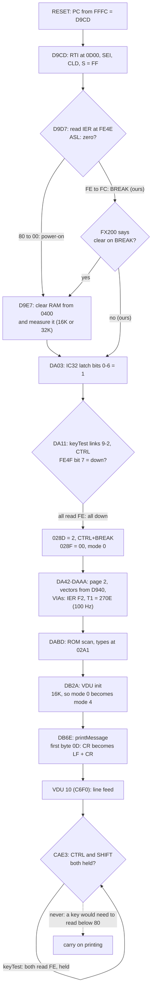
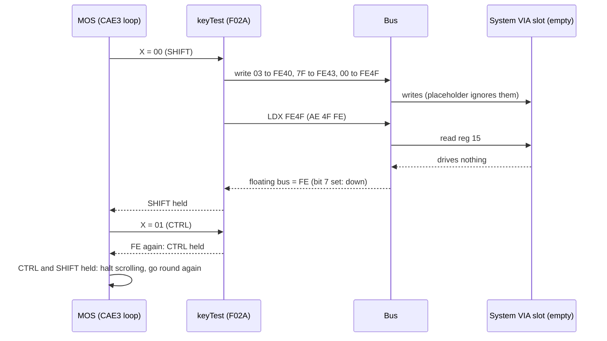
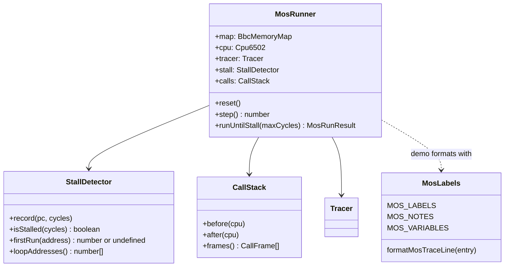

# Stage 23: First steps into the MOS

> **Part:** 3 (BBC memory map & ROMs) · **Branch:** `stage/23-mos-first-steps` · **Needs:** 22
> **Status:** done

## Goal

For the first time, we run **real Acorn firmware**: MOS 1.20, from its reset vector, on our CPU and memory map, with no screen, keyboard or timers. It gets surprisingly far (about 16,500 instructions) and then **stalls**: it goes round the same loop for ever, waiting for hardware that isn't there.

This stage is about learning to *read* that run:

- **what the MOS does after RESET**, step by step;
- **how to read a trace of firmware you didn't write**, with labels and comments for the parts we've worked out;
- **how to tell a stall from a busy machine** automatically;
- **why it stalls where it does**: the answer is one byte read from a chip that doesn't exist yet.

It comes now because the CPU (Part 2), the memory map and the ROMs (Part 3) are done, and nothing else is. Everything the MOS does from here on depends on the devices in Parts 4–11, and this run shows which one it needs first.

## What you can now see

```bash
npm run demo:mos
```

It needs `roms/os12.rom`, and `roms/basic2.rom` for the BASIC parts. Without the MOS it prints a "skipped" line and exits cleanly. It runs in about a second and has five parts:

1. **Power on.** RESET loads PC from `&FFFC` = `&D9CD`.
2. **The first 46 instructions, annotated.** Routine headings, our names in operands, and a comment wherever we know why a line is there:
   ```
     cycle  PC     bytes     instruction       A  X  Y  S  NV--DIZC
   reset:
         7  &D9CD  A9 40     LDA #&40          00 00 00 FD nv--dIzc  ; &40 = RTI opcode ...
         9  &D9CF  8D 00 0D  STA &0D00         40 00 00 FD nv--dIzc  ; ... at &0D00, where NMI goes: a stray NMI returns at once
   ...
        21  &D9D7  AD 4E FE  LDA &FE4E         40 FF 00 FF Nv--dIzc  ; IER: power-on cleared it (reads &80); BREAK left &F2
        25  &D9DA  0A        ASL A             FE FF 00 FF Nv--dIzc  ; &80 → &00 means power-on; anything else, BREAK
   ```
   A on the `ASL` line is `&FE`: the floating bus.
3. **Run until it stalls.**
   ```
   Stalled.  580027 instructions, 2072100 cycles (1036.0 ms of BBC time).
   The last new address ran at cycle 72228 (36.1 ms); after that, a whole
   emulated second of nothing new.
   ```
   This is followed by the **milestones**, the first time each named routine ran: `reset` at step 1, `romScan` at 2871, `vduInit` at 3128, `printMessage` at 16444, … `scrollHalted` at 16567.
4. **The stall, taken apart.**
   - The **shadow call stack**: `printMessage` → `OSASCI` → `OSWRCH` → `vdu` → `&CCF5` → `ctrlShiftWait` → `readCtrlShift` → `&F068` (`JMP (KEYV)`).
   - **One lap** of the 71-instruction loop, annotated.
   - The **last 10 I/O accesses**, ending in `&FE4F read &FE` twice (SHIFT, then CTRL).
   - **What the MOS believes**: `&028D` = `&02` (CTRL+BREAK), `&028E` = `&00` (16K), `&0355` = `&04` (mode 4), and `&02B0` = `&60` (BASIC in slot 15).
5. **What if the System VIA read `&00`?** The run reaches **power-on**, 32K, mode 7, and BASIC, and then stalls in OSRDCH. The call chain is `BASIC &8B08 → OSWORD → OSRDCH → &E577 → REMV`. Mode 7 screen memory holds:
   ```
   BBC Computer 32K

   BASIC

   >
   ```


## The real hardware

When you switch a BBC Micro on, or press BREAK, the 6502's **/RES** pin is pulled low and then released. The CPU then runs its 7-cycle reset sequence (Stage 17): I is set, S drops by 3, and PC is loaded from the **reset vector** at `&FFFC`/`&FFFD`. In MOS 1.20 those bytes are `CD D9`, so the first instruction is at **`&D9CD`**.

There's one difference between the two kinds of reset, and the MOS depends on it:

- **Power-on** resets *everything*, including the two 6522 VIAs. A VIA's reset clears its interrupt enable register (IER) to all zeros (6522 datasheet, "Reset").
- **BREAK** pulls only the **CPU's** reset line. The VIAs keep their registers, including the IER bits the MOS set the last time it booted. (BeebWiki and the Advanced User Guide describe BREAK this way. We haven't checked it against the circuit diagram.)

So the MOS can ask "was that a power-on or a BREAK?" by reading the System VIA's IER at `&FE4E`. On a 6522, IER bit 7 always *reads* as 1 (datasheet: "when IER is read, bit 7 will be read as a logic 1"). The values are:

| Situation | IER reads | after `ASL A` | MOS decides |
|---|---|---|---|
| power-on (IER cleared) | `&80` | `&00` (Z = 1) | power-on: clear memory, full set-up |
| BREAK (IER = `&F2` from last boot) | `&F2` | `&E4` (Z = 0) | BREAK: keep memory |
| **our emulator, no VIA yet** | **`&FE`** (floating) | **`&FC`** (Z = 0) | **BREAK** |

The last row is the first thing the missing hardware changes. Stage 21's floating bus returns the last byte that crossed the data bus. For `LDA &FE4E` (bytes `AD 4E FE`) that's `&FE`, the high byte of the operand, fetched one cycle earlier.

### The keyboard, as the MOS reads it

The MOS doesn't read the keyboard as a stream of characters. It asks the hardware about **one key at a time** (Advanced User Guide, keyboard chapter; System VIA port A):

1. It writes a **key number** to System VIA port A, bits 0–6. Bits 0–3 pick a column and bits 4–6 a row of the key matrix.
2. It reads port A back. **Bit 7 is 1 if that key is down.**

Before that, it turns off the keyboard's free-running scan. That scan is controlled by bit 3 of **IC32**, an 8-bit addressable latch driven by System VIA port B (Stage 28 builds it). The MOS routine that does all this is only 7 instructions long, at `&F02A`:

```
F02A  A0 03     LDY #&03      ; IC32 bit 3 ← 0: keyboard autoscan off
F02C  8C 40 FE  STY &FE40     ;   (port B: bits 0-2 = latch bit, bit 3 = value)
F02F  A0 7F     LDY #&7F
F031  8C 43 FE  STY &FE43     ; DDRA = &7F: PA0-6 out (key number), PA7 in
F034  8E 4F FE  STX &FE4F     ; put key number X on port A
F037  AE 4F FE  LDX &FE4F     ; read it back: bit 7 = "key X is down"
F03A  60        RTS
```

Some "keys" aren't keys. Internal key `&00` is SHIFT, `&01` is CTRL, and `&02`–`&09` are the eight **keyboard links**, the start-up option switches on the board (AUG, OSBYTE &FF). They pick the screen mode and the boot option. The MOS reads them through the same matrix.

Now apply the floating bus. `LDX &FE4F` is `AE 4F FE`, so it reads `&FE`. Bit 7 is set, so **every key the MOS asks about appears to be held down**.

## Key concepts

### 1. Reading a trace of firmware you didn't write

The trace (Stage 18) shows *what ran*, but on its own an address like `&F02A` means nothing. To read firmware you build up **knowledge** about it, a bit at a time:

- **Documented entry points.** The Advanced User Guide publishes the OS call addresses (`&FFEE` OSWRCH, `&FFF4` OSBYTE, …) and the **vectors** in page 2 (`&020E` WRCHV, `&0228` KEYV, …). These are facts, and code everywhere relies on them.
- **Documented workspace.** The AUG also lists what many MOS variables mean: `&028D` is the last BREAK type, `&0355` the screen mode, `&02A1`–`&02B0` the ROM type table.
- **Routines you've worked out yourself.** Acorn's own label names aren't published, so everything else is reverse engineering. You read the disassembly, see what it touches, and give it a name. `&F02A` writes a key number to port A and reads bit 7 back, so we call it `keyTest`. **These names are ours**, and the doc and the code say so.

The trace annotator combines all three. Routine names replace addresses in operands (`JSR keyTest`), a heading marks each labelled entry point, and a comment explains a line where we know why it's there, or names the I/O register it touches.

### 2. What the MOS does after RESET

Here is MOS 1.20's reset code in outline. We read it from the disassembly, and the trace confirms each step:

| Address | What it does | Why |
|---|---|---|
| `&D9CD` | `LDA #&40 : STA &0D00` | `&40` is the RTI opcode, and the NMI vector points at `&0D00`. A stray NMI now returns at once instead of crashing. |
| `&D9D2` | `SEI : CLD : LDX #&FF : TXS` | No IRQs during set-up. D cleared (the NMOS reset doesn't clear it). Stack empty at `&01FF`. |
| `&D9D7` | `LDA &FE4E : ASL A : PHA` | **Power-on or BREAK?** (the table above). The answer is saved on the stack for later. |
| `&D9DE` | `LDA &0258` … | BREAK only: *FX200 says whether BREAK should clear memory too. |
| `&D9E7` | memory-clearing loop | Power-on only: zero `&0400` upwards. It also **measures the RAM**: on a 16K machine, writing `&4000` lands on `&0000`, so the loop sees its own pointer change. The result goes in `&028E` (`&40` = 16K, `&80` = 32K). |
| `&DA03` | DDRB = `&0F`, then 7 writes to port B | Set IC32 latch bits 0–6 to 1 (sound off, keyboard autoscan on, and so on). |
| `&DA11` | `keyTest` for keys 9 down to 1 | Read the **8 links** into `&FC`, and **CTRL** into the carry. |
| `&DA1D`–`&DA36` | `&028D` = 0, 1 or 2 | Last BREAK type: **0 soft BREAK, 1 power-on, 2 CTRL+BREAK** (hard). |
| `&DA39` | `&028F` = links EOR `&FF` | The start-up options byte (OSBYTE &FF). |
| `&DA42` | clear page 2 from `&0290` or `&029C` | Keep more of the settings on a soft BREAK. |
| `&DA5B` | copy `&D940…` to `&0200…` | The **default vectors** and the MOS variables' initial values. |
| `&DA6B` | `&7F` to IFR and IER of both VIAs | Every VIA interrupt flag cleared, every source disabled. |
| `&DA80`–`&DAA7` | IER = `&F2`, PCR = `&04`, ACR = `&60`, T1 = `&270E` | System VIA set-up. T1 free-runs at 9998 + 2 = **10,000 µs = 100 Hz**, the MOS's clock tick (Stages 25–26). |
| `&DABD` | ROM scan | Page in each slot, check its `(C)`, and record the type byte in `&02A1+X` (Stage 22's scan, for real). |
| `&DB27` | `LDA &028F : JSR &C300` | **VDU initialise** with the start-up mode. |
| `&DB38` | `&81` → `&FEE0` and read back | Is there a Tube (second processor)? |
| `&DB6E` | `printMessage` | Print the strings at `&C303`: CR, `BBC Computer `, then `16K` or `32K` followed by `&07` (BEL: the start-up beep). The language's title comes later, when it's entered. |

### 3. Why it stalls where it does

Follow the floating bus through that table:

1. `LDA &FE4E` reads `&FE`, so the MOS thinks it's a **BREAK**. RAM isn't cleared or measured, and `&028E` stays `&00`.
2. Every `keyTest` returns `&FE`, so all 8 links read as "fitted" and **CTRL reads as held down**. That makes it a **CTRL+BREAK**, and `&028D` = **2**.
3. The links give start-up mode 0. But `&028E` = 0 means "16K", and modes 0–3 need 16K or 20K of screen memory, which a 16K machine can't spare, so the VDU code turns it into **mode 4** (`&CB33 BIT &028E : BMI : ORA #&04`).
4. `printMessage` starts with a `&0D` (carriage return). OSASCI turns that into LF + CR, and the **line feed** goes through VDU 10 (`&C6F0`).
5. On a line feed the VDU code honours a real BBC feature: **holding CTRL and SHIFT together halts scrolling**. It calls `readCtrlShift` (`&E9D9`), which uses `keyTest` on SHIFT and CTRL. Both read `&FE`, so both appear held, and the code loops until they're released. **They never will be.**

So the MOS stalls **before printing a single visible character**, in a 60-instruction loop that spans four routines between `&CAE0` and `&F134`.

### 4. Detecting a stall

A trap (Stage 20) is easy to spot: PC stops moving. A stall isn't. The MOS loop above is ~60 instructions long and visits code 10K apart, so "PC stuck in a small range" doesn't describe it. What *does* describe it is:

> **No instruction address runs for the first time.**

A booting machine keeps reaching new code. A stalled one only revisits code it has already run. So the detector keeps one number per address (65,536 of them), the step at which it last ran (0 = never), and remembers **when the last new address appeared**. If that was more than a set time ago, it's a stall.

What time limit? The power-on memory-clear loop runs about 0.2 seconds of BBC time without reaching new code, so the limit has to be longer than that. We use **2,000,000 cycles: one emulated second**. A real BBC prints its banner well within a second of switching on, so if nothing new has run for a whole second, it's waiting for something.

Once it has stalled, the **loop body** is whatever is *still* running: the addresses that ran in the second half of the stall period. The few instructions that led into the loop ran only near its start, so they drop out.

### 5. How did we get here? A shadow call stack

The loop alone doesn't say *why* the MOS is in it. That needs the chain of calls: `printMessage` → OSASCI → OSWRCH → `defaultWRCH` → `vdu` → `vdu10` → `ctrlShiftWait`. The 6502's own stack holds those return addresses, but it's mixed in with `PHA`'d data, so you can't reliably pick them out afterwards.

A **shadow call stack** records them as they happen, outside the emulated machine. Each `JSR` (and each IRQ, NMI or BRK) pushes a frame: where it was called from, where it went, and the value of S just after the push. A frame is popped as soon as S rises **above** that saved value. That one rule handles an ordinary `RTS` and `RTI`, `PLA PLA` (throwing a return address away), and `TXS` (resetting the stack). We never have to know which trick the code used.

### 6. What if the chip said something else?

The stall comes entirely from what the missing chip *appears* to say. Here's an experiment that tests this. Plug in a stand-in "System VIA" that reads **`&00`** for every register (it's in the demo only, not a real device), and run again:

- IER reads `&00`, so `ASL` gives `&00` and the MOS takes the **power-on** path: it clears and measures memory (32K), and `&028D` = 1.
- No key is down, so the links give mode **7**, and CTRL+SHIFT isn't held.
- It prints **`BBC Computer 32K`**, **`BASIC`** and the **`>`** prompt into mode 7 screen memory at `&7C00`, which BASIC then waits on.
- It then stalls somewhere new: in **OSRDCH**, waiting for a character to appear in the keyboard buffer. On a real machine that character is put there by the **keyboard interrupt**, and we have no interrupts yet.

So the CPU, the memory map and the ROMs are working well enough to reach BASIC. What's missing is the hardware, starting with the 6522 VIA (Part 4).

## Diagrams

The reset path, as MOS 1.20 runs it on our machine. The floating bus decides every branch marked "?".



One lap of the stall loop, as bus traffic. This is why it can never leave:



How the new pieces fit around the CPU:



## Our design

### `StallDetector` (`src/cpu/stall-detector.ts`)

Generic: it knows nothing about the MOS.

```ts
class StallDetector {
  record(pc: number, cycles: number): void;          // before each step: hot path
  isStalled(cycles: number): boolean;                // no new address for stallCycles?
  firstRun(address: number): number | undefined;     // step number it first ran at
  loopAddresses(): number[];                         // still running in the 2nd half of the stall
}
```

It uses two `Float64Array(65536)`s, the step at which each address first and last ran, plus two numbers: the step and the cycle count when a new address last appeared. `record` is a few typed-array reads and writes, with no allocation. `firstRun` gives us **milestones** for free: when did the run first reach `printMessage`?

*Alternative considered:* the plan's "PC stuck in a small range". It fails on this very loop, which is spread over `&CAE0`–`&F134`. Coverage ("nothing new") doesn't care where the code is.

### `CallStack` (`src/cpu/call-stack.ts`)

```ts
type CallKind = 'jsr' | 'brk' | 'irq' | 'nmi';
interface CallFrame { kind: CallKind; from: number; to: number; s: number }
class CallStack {
  before(cpu: Cpu6502): void;   // note PC, opcode and pending interrupt
  after(cpu: Cpu6502): void;    // pop frames S has risen past; push if JSR/BRK/IRQ/NMI
  frames(): CallFrame[];        // oldest first, built only when asked
}
```

Like the tracer, it never calls `step()`: the owner calls `before`, `step`, `after`. It stores up to 128 frames in typed arrays (128 return addresses fill the whole stack page).

### `MosRunner` (`src/mos/mos-runner.ts`)

It owns a `Cpu6502` on a `BbcMemoryMap` and calls the tracer, the stall detector and the call stack around each `step()`. `runUntilStall(maxCycles)` returns `{ kind: 'stall' | 'limit', instructions, cycles, pc, loop }`. Deliberately, it's **not a machine**: there are no devices and no interrupts, and no time is passed to anything. Stage 27's `BbcModelB` is the real thing. This is a test rig for running firmware headless.

### MOS knowledge (`src/mos/mos-labels.ts`)

There are three tables, kept apart because they're different kinds of knowledge:

- `MOS_LABELS` (`Labels`, for the disassembler): the **AUG's OS calls and vectors**, plus **our names** for the routines this stage worked out. The names are substituted for addresses in operands.
- `MOS_NOTES`: a comment for particular instruction addresses ("IER: power-on clears it…").
- `MOS_VARIABLES`: what the documented workspace addresses hold (`&028D` last BREAK type, …). They're shown as comments, so the hex address stays visible.

`formatMosTraceLine(entry)` adds a comment to Stage 18's trace line. It uses the note for that address if there is one, otherwise a description of the I/O register (from Stage 21's `describeIoAddress`) or variable the instruction touches.

*Why not label the I/O registers and variables too?* Then the trace would say `STX sysViaDDRB` and hide `&FE42`. This project shows real addresses in `&` hex. A comment gives you both.

The default-handler labels (`defaultWRCH` = `&E0A4`, …) come from the vector table the MOS copies from `&D940`. A test reads that table from `os12.rom` to check them.

## Code walkthrough

- [`src/cpu/stall-detector.ts`](../../src/cpu/stall-detector.ts): `record()` is three typed-array touches per step. The only test that matters is `first[a] === 0`, "has this address ever run?". `isStalled()` is one subtraction. `loopAddresses()` uses the "second half of the stall" rule. `lastLap()` picks the instruction that ran fewest times (but at least twice) as the lap boundary, with ties going to the lowest address, which is usually the top of the loop.
- [`src/cpu/call-stack.ts`](../../src/cpu/call-stack.ts): `before()` decides whether this step is a call: `pendingInterrupt` first (as the CPU does), then the opcode (`&20` JSR, `&00` BRK). `after()` is the one rule, pop while `S > frame.s`, followed by the push.
- [`src/mos/mos-labels.ts`](../../src/mos/mos-labels.ts): the three tables. `ROUTINES` has one comment per name saying how we know what it does. `dataAddress()` works out where an operand points (adding X or Y for indexed modes, so `STA &FE4D,X` with X = 1 is described as the IER). `comment()` uses the note first, then I/O, then the variable.
- [`src/mos/mos-runner.ts`](../../src/mos/mos-runner.ts): `step()` is tracer → stall → call stack → `cpu.step()` → call stack. `runUntilStall()` checks for a stall *before* each step, so a result's counts include only the steps this call ran.
- [`scripts/demo-mos.ts`](../../scripts/demo-mos.ts): the five parts. Part 5's `readsZero` device is the only "hardware" in this stage, and it lives in the demo and the tests, not in `src/`.

## Tests

| Test file | What it proves |
|---|---|
| `src/cpu/stall-detector.test.ts` | A loop over two subroutines a page apart is a stall after `stallCycles`, and its body excludes the lead-in. Code that keeps reaching new addresses never stalls. A long but finite loop shorter than the limit isn't one. `firstRun` step numbers. `clear()`. `lastLap` boundaries and tie-break. |
| `src/cpu/call-stack.test.ts` | JSR frames (from, to, S). RTS pops. `PLA PLA` + `JMP` pops. `TXS` pops all. IRQ frames (S drops by 3) popped by RTI. BRK frames. A stack overflow wraps and loses the frames. |
| `src/mos/mos-labels.test.ts` | AUG OS call and vector names. `JMP (WRCHV)`, `JSR keyTest` and headings. I/O comments at the effective address. Variable comments keep the hex. Notes win. **The default-handler names match `os12.rom`'s vector table at `&D940`** (skips without the ROM). |
| `src/mos/mos-runner.test.ts` | On a made-up MOS (no ROM needed): reset obeys `&FFFC`, a floating "key down" loop is reported as a stall with its loop, and the limit is honoured. On MOS 1.20 (skips without ROMs): reset at `&D9CD`; **the first 30 instructions match the disassembly**; the stall is in the CTRL+SHIFT loop, reached from `printMessage`, with `&028D` = 2, `&028E` = 0 and mode 4; and with a "reads `&00`" System VIA, the banner, `BASIC` and `>` reach `&7C00`, and it stalls in OSRDCH. |

The real-ROM tests skip, with a message, if `roms/os12.rom` or `roms/basic2.rom` is missing.

## Gotchas & hardware quirks

- **The floating bus picks the stall point.** Our `&FE` is a model (Stage 21), and real empty addresses may read differently. Here it doesn't matter, because the VIA arrives next, but it's why the stall is "wait for CTRL+SHIFT" and not something else.
- **BREAK isn't power-on.** Only power-on resets the VIAs, and the MOS relies on that to tell the two apart. When Stage 27's machine has a real VIA, our `reset()` will have to decide which kind of reset it's doing. Pressing BREAK must *not* reset the VIA.
- **Memory size is measured, not configured.** The MOS finds 16K vs 32K by writing until RAM wraps onto itself. This only happens on power-on, so after our "BREAK" `&028E` is 0, and that's why we ended up in mode 4.
- **"PC in a small range" isn't enough** to detect a stall, because the stall loop spans `&CAE0`–`&F134`. We use "no new address", which is a deviation from the plan's wording, explained in Key concept 4.
- **The stall threshold must be longer than any honest wait.** Power-on clears ~31K of RAM without reaching new code. One emulated second is safely longer.
- **Routine names are ours.** Only the OS calls, vectors and workspace come from the AUG. `keyTest`, `ctrlShiftWait` and the rest are reverse-engineered labels.
- **Reading the stack page isn't a call stack.** That's why we keep a shadow stack. It loses frames on stack overflow, and code that pushes a fake return address and `RTS`es to it (a "computed jump") shows up as a pop with no matching push. Neither happens here.
- **No other emulator was consulted.** Everything here came from the disassembly of `os12.rom`, the 6522 datasheet and the AUG.

## Playwright verification

n/a: this is a CLI-only stage (`npm run demo:mos`).

## Check your understanding

1. Why does `LDA &FE4E` return `&FE` in our emulator, and why does that make the MOS think BREAK was pressed?
2. How would the MOS behave differently if pressing BREAK also reset the System VIA?
3. Why did our run end up in mode 4 when the links asked for mode 0?
4. The stall loop runs from `&CAE0` to `&F134`. Why would "PC stuck in a small range" not detect it, and what does the detector look for instead?
5. The shadow call stack pops a frame when S rises above the frame's saved S. Why does that one rule handle RTS, RTI, `PLA PLA` and `TXS`?

<details>
<summary>Answers</summary>

1. Nothing drives the data bus for the empty System VIA slot, so the read gets the last byte on the bus: the operand's high byte `&FE` (from `AD 4E FE`). On a real VIA, IER reads `&80` after power-on, which `ASL` turns into `&00`. `&FE` becomes `&FC`, which isn't zero, so the MOS takes the BREAK path.
2. It couldn't tell BREAK from power-on any more. IER would read `&80` after every BREAK, so every BREAK would clear and re-measure memory, and you'd lose your BASIC program each time.
3. The memory measurement only happens on power-on, so `&028E` stayed 0, which means "16K". The VDU code (`&CB33`) ORs 4 into the mode on a 16K machine, because modes 0–3 need more screen memory than 16K can spare. Mode 0 OR 4 = mode 4.
4. The loop calls four routines spread across 10K of ROM, so PC moves all over the place. The detector instead looks for the absence of **new** addresses: a booting machine keeps running code for the first time, and a stalled one only repeats code it has run. Once nothing new has run for 2,000,000 cycles (one emulated second), it's stalled.
5. Every one of them raises S past the bytes that were pushed with the frame: RTS by 2, RTI by 3, `PLA PLA` by 2, and `TXS` to `&FF` all the way. Once those bytes have been released, the call they belonged to can't be returned to, so the frame is gone, whichever instruction did it.

</details>

## Further reading

- *Advanced User Guide for the BBC Microcomputer* (Bray, Dickens, Holmes): "Operating system calls", "Vectors", "Memory usage" (pages 2 and 3 workspace), the keyboard chapter, and the reset/BREAK description.
- MOS Technology / Rockwell **R6522 VIA datasheet**: "Interrupt enable register" (bit 7 reads as 1) and "Reset".
- BeebWiki: *Keyboard* (internal key numbers, links), *Addressable latch* (IC32), *OSBYTE &FD/&FE/&FF* (BREAK type, RAM size, start-up options).
