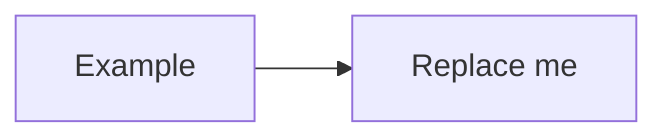

# Stage NN: Title

> **Part:** N (name) · **Branch:** `stage/NN-slug` · **Needs:** stages …
> **Status:** in progress / in review / done

## Goal

One or two sentences: what this stage adds, and why it comes at this point in the build.

## What you can now see

The observable outcome, and **exactly how to reproduce it**:

```bash
npm run demo:xyz        # or: npm run dev, then open the Workbench → X panel
```

Include the expected output, or a description or screenshot of what appears.

## The real hardware

What the real chip or circuit does, in plain language:
- Which pins, registers or addresses are involved.
- Where it sits in the Model B (for example "System VIA at &FE40–&FE4F").
- Cite datasheet or Advanced User Guide sections.

## Key concepts

The ideas this stage teaches. Explain the *why*, not just the *what*. Use small worked examples with real byte values, using `&` hex notation.

## Diagrams

At least one mermaid diagram. Pick whichever kind makes the logic clearest:
- **flowchart** for data paths and decisions.
- **stateDiagram-v2** for device state machines.
- **sequenceDiagram** for CPU ↔ device interactions over time.
- **classDiagram** for how the TypeScript pieces relate.



## Our design

- The TypeScript interfaces and types introduced or changed, with short snippets.
- How data flows through them.
- The decisions made and the alternatives considered, briefly.

## Code walkthrough

A guided tour of the important code, with file links (`src/…/file.ts`). Focus on the parts that carry the idea, not the boilerplate.

## Tests

| Test file | What it proves |
|---|---|
| `src/…/x.test.ts` | … |

Note any tests that skip without ROMs or fixtures.

## Gotchas & hardware quirks

The things that are easy to get wrong, the undocumented behaviour, and anything we deliberately simplified (with a note of which later stage, if any, refines it).

## Playwright verification

What was checked in the browser (MCP snapshot or screenshot), and which durable checks (if any) were added to `e2e/`. Write "n/a" for CLI-only stages.

## Check your understanding

3–5 questions to test the key ideas. Put the answers in a collapsed block:

<details>
<summary>Answers</summary>

1. …

</details>

## Further reading

- Datasheet or book section.
- BeebWiki or 6502.org page.
